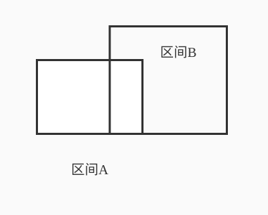

# The Skyline Problem

### 问题

给一串building数组，包含各个楼的左右两个横坐标以及高度，building已经按照左边的横坐标排好序，要求给出符合题意的点来描绘出天际线。

**Example:**


```
Input: buildings = [[2,9,10],[3,7,15],[5,12,12],[15,20,10],[19,24,8]]
Output: [[2,10],[3,15],[7,12],[12,0],[15,10],[20,8],[24,0]]
Explanation:
Figure A shows the buildings of the input.
Figure B shows the skyline formed by those buildings. The red points in figure B represent the key points in the output list.
```

### 解决方案：线段树，时间复杂度$O(nlogn)$

高楼遮挡矮楼，因此各个区间只需要维护最高的值。

是否需要维护各个区间精确的值？比如：



区间A的部分被遮住了，是否需要将区间A的lazy向下push？

答案是不需要的。

因为我们并不需要对区间查询。

我们只需要对点查询，即查询区间的所有端点对应的横坐标的最大高度，判断这次的高度是否与上次的一致，如果不一致那就加入结果集，如果一致就不加入结果集。

因为查询点，必定会深入到leaf节点，因此区间的lazy状态没有push到子节点也没关系，在向上的过程中只需要取最大值即可。

一个问题，就是压缩横坐标。将所有的横坐标映射到连续的点上：0、1、2、......

还有一个问题，就是在图上我发现如果两栋楼有交集，那么右边的楼的左端点将会有两个高度，这在更新线段树是不允许的。因此更新区间的时候，如果一栋楼的左右横坐标为x1, x2，那我们将更新[x1, x2-1]。

```java
class Solution {
    
    class SegmentTree{
        int[] t;
        SegmentTree(int size){
            t=new int[size];
        }
        void update(int v, int tl, int tr, int l, int r, int x){
            if(l>r) return;
            if(tl==l&&tr==r){
                t[v]=Math.max(t[v], x);
                return;
            }
            int mid=(tl+tr)>>1;
            update(v<<1, tl, mid, l, Math.min(mid, r), x);
            update((v<<1)+1, mid+1, tr, Math.max(mid+1, l), r, x);
        }
        int query(int v, int tl, int tr, int index){
            if(tl==tr) return t[v];
            int mid=(tl+tr)>>1;
            int tmp=0;
            if(index<=mid) tmp=query(v<<1, tl, mid, index);
            else tmp=query((v<<1)+1, mid+1, tr, index);
            return Math.max(tmp, t[v]);
        }
    }
    
    public List<List<Integer>> getSkyline(int[][] buildings) {
        Set<Integer> ts=new TreeSet<>();
        for(int i=0; i<buildings.length; i++){
            ts.add(buildings[i][0]);
            ts.add(buildings[i][1]);
        }
        Map<Integer, Integer> x2i=new HashMap<>();
        Map<Integer, Integer> i2x=new HashMap<>();
        int k=0;
        for(Integer x:ts){
            x2i.put(x, k);
            i2x.put(k, x);
            k++;
        }
        k--;
        SegmentTree st=new SegmentTree((k+1)<<2);
        for(int i=0; i<buildings.length; i++){
            st.update(1, 0, k, 
                      x2i.get(buildings[i][0]), x2i.get(buildings[i][1])-1,
                      buildings[i][2]);
        }
        int preH=-1;
        List<List<Integer>> ans=new ArrayList<>();
        for(int i=0; i<=k; i++){
            int h=st.query(1, 0, k, i);
            if(preH==h) continue;
            List<Integer> list=new ArrayList<>();
            list.add(i2x.get(i));
            list.add(h);
            ans.add(list);
            preH=h;
        }
        return ans;
    }
}
```


