# Git tag

[TOC]

首先配置示例版本库：


## 显示tag

### git tag

不带任何参数执行git tag命令，即可显示当前版本库的tag列表。


tag创建的时候可能包含一个说明。在显示tag的时候同时显示说明，使用-n<num>参数，显示最多<num>行tag的说明。


### git log

在查看日志时使用参数--decorate可以看到提交对应的tag以及其他引用。


### git describe

git describe将提交显示为一个易记得名称。这个易记的名称来自于建立在该提交的tag，若该提交没有tag则使用该提交历史版本上的tag并加上可理解的寻址信息。

+ 如果该提交恰好被打上了一个tag，则显示该tag的名字。

  

+ 如果提交没有对应的tag，但是在其祖先版本上建有tag，则使用类似<tag>-<num>-g<commit>的格式显示。

  其中<tag>是最接近的祖先提交的tag名字，<num>是该tag和提交之间的距离，<commit>是该提交的精简提交ID。

  

+ 如果工作区对文件有修改，还可以通过后缀-dirty表示出来。

  

+ 如果提交本身没有包含tag，可以通过传递--always参数显示精简提交ID，否则出错。

  

### git name-rev

git name-rev和git describe类似，会显示提交ID及其对应的一个引用。默认优先使用分支名，除非用--tags参数。

+ 默认优先显示分支名。

  

+ 使用--tags优先使用tag。

  之所以对应的tag引用名称上加上后缀**^0**，是因为该引用指向的是一个tag对象而非提交。用^0后缀指向对应的提交。

  

+ 如果提交上没有对应的引用名称，则会使用新提交上的引用名称并加上后缀~<num>。后缀的含义是第<num>个祖先提交。

  

## 创建tag

```bash
用法1：git tag				<tagname> [<commit>]
用法2：git tag -a			<tagname> [<commit>]
用法3：git tag -m <msg>	<tagname> [<commit>]
用法4：git tag -s			<tagname> [<commit>]
用法5：git tag -u <key-id>	<tagname> [<commit>]
```

其中：

+ 用法1是创建轻量级tag。
+ 用法2和用法3相同，都是创建带说明的tag。其中用法3直接通过-m参数提供创建说明。
+ 用法4和用法5相同，都是创建带GPG签名的tag。其中用法5用-u参数选择指定的私钥进行签名。
+ 创建tag需要输入tag的名字<tagname>和一个可选的提交ID<commit>。如果没有提供提交ID，则基于头指针HEAD创建tag。

### 轻量级tag

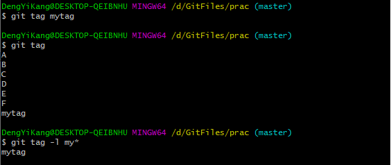

当创建了tag后，会在版本库的.git/refs/tags目录下创建一个文件。

+ 查看这个引用文件的内容，发现是一个哈希值：

  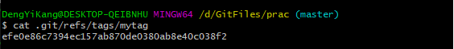

+ 用cat-file命令检查轻量级tag指向的对象。tag实际上指向的是一个提交。

  

+ 查看该提交内容：

  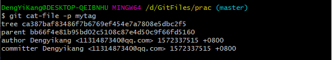

#### 轻量级tag的缺点

轻量级tag的引用的哈希值与对应的commit一致，这与其他tag不一样。

无法知道是谁创建的，是何时创建的。

git describe命令默认不使用轻量级tag生成版本描述字符串。

+ 使用git describe，发现生成的版本描述字符串，使用的是上上个版本上的tag名称:

  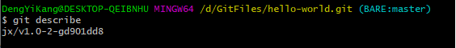

+ 使用--tags参数，也可以将轻量级tag用作版本描述符

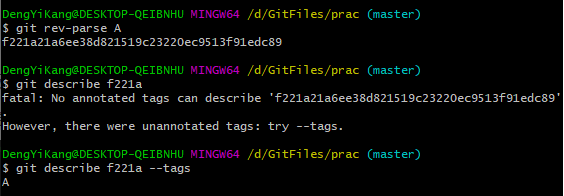

### 带说明的tag

使用参数-a或-m<msg>调用git tag命令，创建带说明的tag：

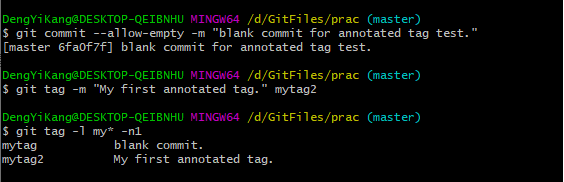

创建了带说明的tag后，会在版本库的.git/refs/tags目录下创建一个新的引用文件。

+ 查看引用文件内容：

  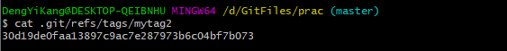

+ 查看指向对象，**发现指向的不再是一个提交，而是一个tag对象**。

  

+ 查看提交的内容，也不一样，包含了创建说明等信息。

  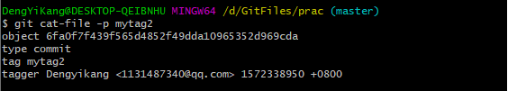

虽然mytag2本身是一个tag对象，但是在很多Git命令中，可以将其视为一个提交，如git log显示mytag2指向的提交日志：


==但要注意：==

+ 直接用git rev-parse命令查看mytag2得到的是tag对象的ID，并非提交对象的ID。

+ 使用下面几种不同的表示法，可以得到mytag2对象所指向的提交对象的ID。

  ```bash
  git rev-parse mytag2^{commit}
  git rev-parse mytag2^{}
  git rev-parse mytag2^0
  git rev-parse mytag2~0
  ```

## 删除tag

```bash
git tag -d <tag_name>
```

tag没有类似reflog的变更记录机制，一旦删除不易恢复。在删除命令的输出中，会显示该tag所对应的的提交ID，一旦发现删除错误，可以进行补救：

```bash
git tag <tag_name> <commit>
```

注意没有重命名tag的命令。

## 不要随意更改tag

tag建立后，如果需要修改，可以使用同样的tag名称重新建立，不过需要加上-f或-force参数强制覆盖已有的tag。

## 共享tag

现在上游工作区的log如下：

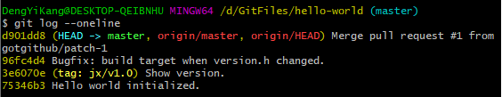

user1：

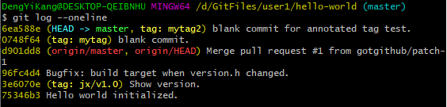

user1相比上游有新的提交：

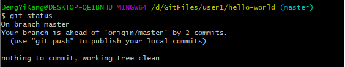

+ 向上游推送：

  （注意，因为上游不是裸库，因此上游需要检出其他分支，否则无法推送，详情见“一些问题以及处理措施”）

  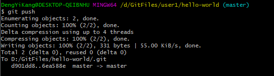

+ git ls-remote可以查看上游版本库的引用，会发现user1建立的tag并没有推送到上游：

  

### 推送

推送tag需要在push命令中明确地表示出来：


如果需要将本地建立的所有tag全部推送到远程库，可以使用通配符：


或使用--tags参数：

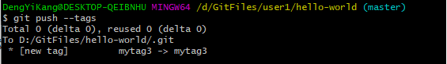

### 拉回

fetch、pull操作都能同步new tag。

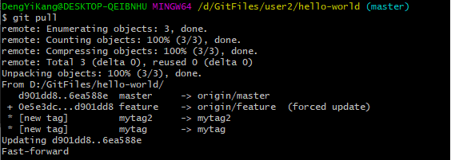

==**注意对于old tag是不会改变的。**==

### 自动同步？

tag可以被强制更新。当tag被改变后，已经获取到tag的版本库再次使用获取或拉回操作，能自动更新tag吗？不能。

+ user2强制更新mytag2：

  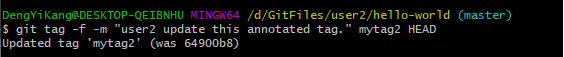

+ mytag2更新前后不是同一个对象：

  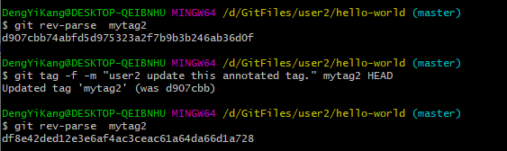

+ 更改远程的tag：

  新版本的Git(2.23.0.windows)是不允许推送更新后的同名tag的。

  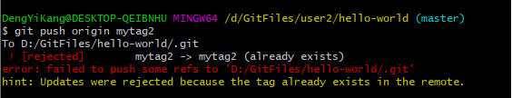

  因此有以下选择：

  + 强制推送

  + 删除远程tag，后推送

    ```bash
    #删除远程tags：push with :remoteref
    git push origin :refs/tags/<tag_name>
    ```

    详情见[stackoverflow]( https://stackoverflow.com/questions/19298600/tag-already-exists-in-the-remote-error-after-recreating-the-git-tag )。

### 删除远程库的tag

```bash
git push <remote_url> :<tagname>
```

