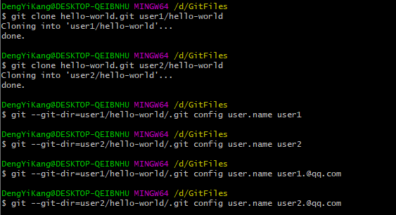
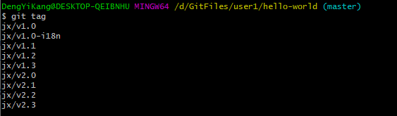
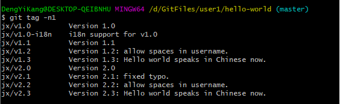
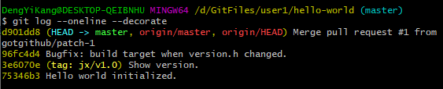
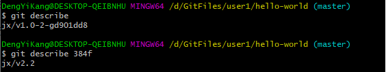
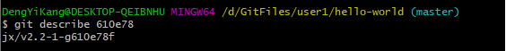
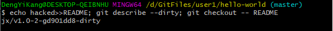
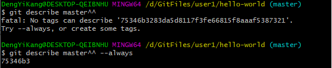
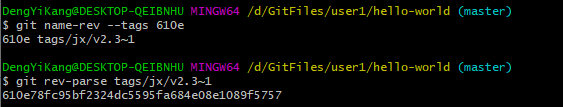

# Git tag

首先配置示例版本库：

## 显示tag

### git tag

不带任何参数执行git tag命令，即可显示当前版本库的tag列表。

tag创建的时候可能包含一个说明。在显示tag的时候同时显示说明，使用-n<num>参数，显示最多<num>行tag的说明。

### git log

在查看日志时使用参数--decorate可以看到提交对应的tag以及其他引用。

### git describe

git describe将提交显示为一个易记得名称。这个易记的名称来自于建立在该提交的tag，若该提交没有tag则使用该提交历史版本上的tag并加上可理解的寻址信息。

+ 如果该提交恰好被打上了一个tag，则显示该tag的名字。

  

+ 如果提交没有对应的tag，但是在其祖先版本上建有tag，则使用类似<tag>-<num>-g<commit>的格式显示。

  其中<tag>是最接近的祖先提交的tag名字，<num>是该tag和提交之间的距离，<commit>是该提交的精简提交ID。

  

+ 如果工作区对文件有修改，还可以通过后缀-dirty表示出来。

  

+ 如果提交本身没有包含tag，可以通过传递--always参数显示精简提交ID，否则出错。

  

### git name-rev

git name-rev和git describe类似，会显示提交ID及其对应的一个引用。默认优先使用分支名，除非用--tags参数。

+ 默认优先显示分支名。

  

+ 使用--tags优先使用tag。

  之所以对应的tag引用名称上加上后缀**^0**，是因为该引用指向的是一个tag对象而非提交。用^0后缀指向对应的提交。

  

+ 如果提交上没有对应的引用名称，则会使用新提交上的引用名称并加上后缀~<num>。后缀的含义是第<num>个祖先提交。

  

+ git name-rev可以对标准输入中的提交ID进行改写，使用管道符号对前一个命令的输出进行改写，会显示神奇的效果。

  