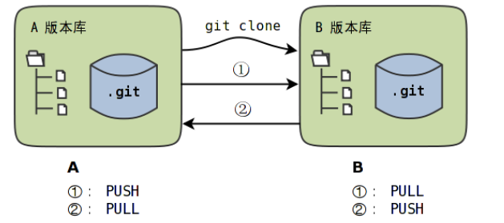
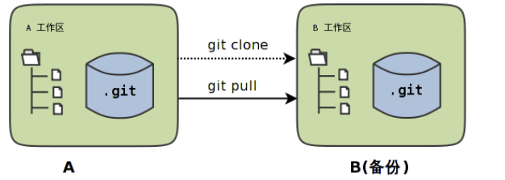
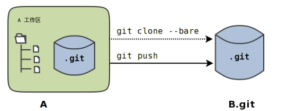

# Git 克隆



```bash
git clone <rep> <dir>				#1
git clone --bare <rep> <dir.git>	#2
git clone --mirror <rep> <dir.git>	#3
```

三种用法区别如下：

+ 用法1将<rep>指向的版本库创建一个克隆岛<dir>目录。目录<dir>相当于克隆版本库的工作区，文件都会检出，版本库位于工作区下的<.git>目录。
+ 用法2和用法3创建的克隆版本都不含工作区，直接就是版本库的内容，这样的版本库称为裸版本库。裸版本库的目录名一般以".git"为后缀。
+ 用法3区别于用法2之处在于用法3克隆出来的裸版本对上游版本库进行了注册，这样可以再裸版本库中使用缺省同步命令。

### 对等工作区

不使用--bare或--mirror创建出来的克隆包含工作区，两个版本库是对等的。



对于这种对等工作区模式，版本库的同步只有一种可行的操作模式，就是在B执行pit pull命令从A拉回新提交实现同步，==而不能从A向B执行**git push**的推送操作（因为将导致B的工作区、暂存区与版本库不一致）==。

```bash
#查看对上游版本库的注册信息，注册信息在.git/config中
git remote -v
```

### 裸版本库

在对等工作区模式下，工作区之间执行推送，可能会引发大段的错误输出，如果采用裸版本库则没有相应的问题。因为裸版本库没有工作区。



