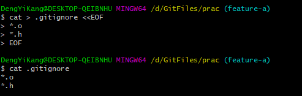

# Git 基本操作

## 删除

rm <file>只能删除工作区的文件，若要影响暂存区，则可用git rm <file>

相关命令：

```bash
git ls-files					#查看暂存区文件
git ls-files --with-tree=HEAD^	#查看历史版本的文件列表
git cat-file -p HEAD^:<file>	#查看历史版本的某文件内容
```

## 恢复删除文件

```bash
git cat-file -p HEAD~1:<file> > <file>	#恢复文件
git add -A
git commit -m "message"
```

## 重命名

```bash
git mv <file_name> <new_name>
```

## 选择性添加

```bash
git add -i
```

## 文件忽略

当某个目录或者文件设置了忽略之后，再执行git status查看状态时，被忽略的文件即使存在也不会显示为未跟踪状态。

执行以下命令可以创建并提交一个名为<.gitignore> 文件，把这些要忽略的文件写在其中，文件名可以使用通配符:

```bash
cat > .gitignore <<EOF
>...
>...
>EOF
git add .gitignore
git commit -m "message"
```




### .gitignore文件作用范围

.gitignore的作用范围是其所处的目录及其子目录。

### 查看忽略的文件并提交

```bash
git status --ignored		##状态显示中显示被忽略的文件
```

注意，若要添加被忽略文件，git add -A 和git add .都失效。

只有在添加操作的命令行中明确的写入文件名，并且提供-f参数才能真正添加。

```bash
git add -f <file>
```

### 忽略只对未跟踪文件有效，对于已加入版本库的文件无效

<file>添加到版本库后，就不再受到<.gitinore>设置的文件忽略影响了，对<file>的修改会被跟踪到。Git文件的忽略只是对未入库的文件起作用。

### 本地独享式忽略

<.gitignore>设置的文件忽略是共享式的。因为<.gitignore>被添加到版本库后成为了版本库的一部分，当版本库共享给他人（clone）或者版本库推送（push）给服务器时，这个忽略文件就会出现在他人的工作区。

可以把<.gitignore>自身忽略，这只解决了push问题，然而无法解决pull的问题。

与“共享式”对应的是“独享式”。独享式忽略就是不会因为版本库共享或者版本库之间的推送传递给他人的文件忽略。独享式忽略有两种方式：

+ 针对具体版本库的“独享式”忽略。即在版本库.git目录下的一个文件：.git/info/exclude来设置文件忽略
+ 全局的“独享式”忽略。即通过Git的配置变量core.excludesfile指定的一个忽略文件，其设置的忽略对所有文件均有效

第一种方式，并不是exclude文件完全替代本地.gitignore，而是共同起作用。

第二种方式同上。

对于第二种，本地可以设置一个全局的独享的文件忽略列表（文件名任意）：

```bash
git config --global core.excludesfile <path>
```

## 文件归档

如果使用压缩工具（tar、7zip、winzip、rar等）将工作区文件归档，一不小心会把版本库（.git）包含其中，甚至将工作区中的忽略文件、临时文件也包含其中。Git提供了一个归档命令，可以对任意提交对应的目录树建立归档，例如。

```bash
git archive -o <name>.zip HEAD					#基于最新的提交归档 
git archive -o <name>.zip HEAD <file1> <file2>	#对指定文件归档
git archive --format=tar --prefix=1.0/ v1.0 | gzip > foo-1.0.tar.gz
#基于tag v1.0建立归档，并且为归档中文件添加目录前缀1.0
```

