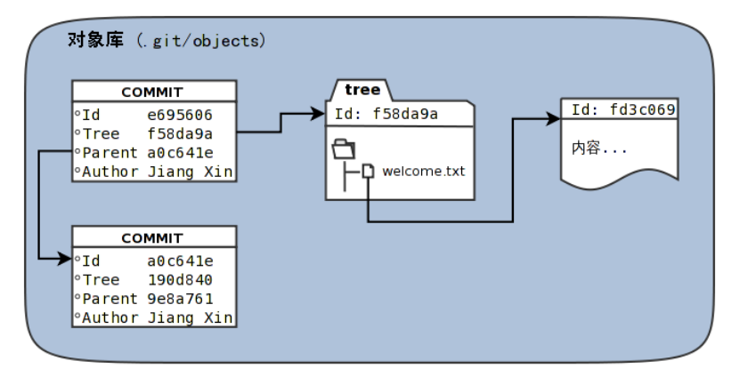
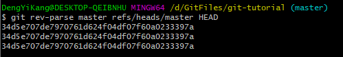

# Git 对象

[TOC]



### 访问Git库对象

+ 使用**git rev-parse**可以用于显示引用对应的提交ID：



+ 采用部分的**SHA1**哈希值。

+ 使用**master**代表分支**master**中最新的提交，使用**refs/heads/master**亦可

+ 使用**HEAD**代表版本库中最近一次提交

+ 符号**^**可以用以指代父提交，如：

  + **HEAD^**表示最近一次提交的父提交
  + **HEAD^^** 表示**HEAD^**的父提交

+ 对于一个提交有多个父提交，可以在符号^后用数字表示是第几个父提交，如：

  + **HEAD^1** 相当于**HEAD^**
  + **HEAD^^2**表示**HEAD**父提交的多个父提交中的第二个

+ 符号**~< n >**也可以用于指代祖先提交，以下效果等同：

  ```bash
  a573106~5
  a573106^^^^^
  ```

+ 提交所对应的的树对象：

  ```bash
  a573106^{tree}
  ```

+ 某一次提交对应的文件对象：

  ```bash
  a573106:path/to/file
  ```

+ 暂存区中的文件对象：

  ```bash
  :path/to/file
  ```

+ 显示**SHA1**哈希值指代的数据类型

  ```bash
  git cat-file -t <ID>
  ```

+ 显示内容

  ```bash
  git cat-file -p [ID|path]
  ```

  