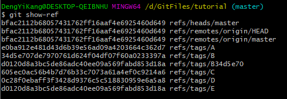
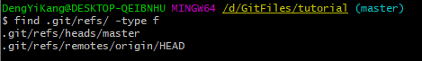
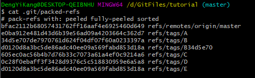
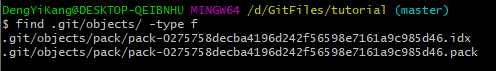
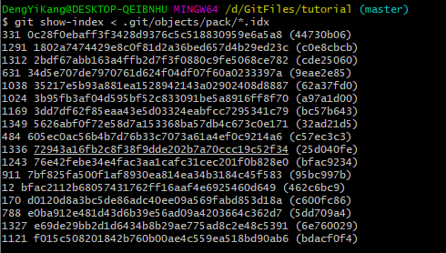

# Git库管理

一些有趣的问题：

+ 从网上克隆来的版本库，为什么在对象库中找不到对象文件？而且引用目录里也看不到所有的引用文件？
+ 不小心添加了一个大文件到Git库中，用重置命令丢弃了包含大文件的提交，可是版本库不见小，大文件仍在对象库中。
+ 本地版本库的对象库里文件越来越多，这可能导致Git性能的降低。

## 对象与引用的去向

进入一个克隆的版本库，可用git show-ref显示所含的引用：



其中refs/heads/开头的是分支；以refs/remotes/开头的是远程版本库分支在本地的映射；以refs/tags/开头的是tag。

寻找对应文件，发现只有HEAD和master：



其实这些引用文件都被打包放在.git/packed-refs中。



而对于Git对象（commit、blob、tree、tag）在对象库中的存储：



所有的对象文件都被打包到这两个文件中了。其中以<.pack>结尾的文件是打包文件，以<.idx>结尾的是索引文件。Git对于以SHA1哈希值作为目录名和文件名保存的对象有一个术语，称为松散对象。松散对象打包后会提高访问效率，而且不同的对象可以通过增量存储节省磁盘空间。

可以用git show-index查看：



克隆之后的版本库在日常提交中，产生的新对象仍旧以松散对象存在，而不是以打包形式。松散对象只是进行了压缩，而没有（打包文件才有的）增量存储的功能，会浪费空间，也会降低访问效率。

## 暂存区操作引入的临时对象

暂存区操作有可能在对象库中产生临时对象，例如文件反复的修改和反复的向暂存区添加，或者添加到暂存区后不提交甚至直接撤销，就会产生垃圾数据占用磁盘空间。

```bash
#查看空间占用
du -sh
du -sh .git/
#标识为dangling的对象是没有被任何引用直接或者间接关联到的对象。
git fsck
#清理
git prune
```

## 重置操作引入的对象

用git prune命令清除暂存区操作时引入的临时对象，但是如果是用重置命令抛弃的提交和文件不会被清除。

实际上，撤销的操作需要记录在reflog中，Git认为撤销的提交和大文件都还可以被追踪到，还在使用着，所以无法使用git prune删除。

如果确认要丢弃不想要的对象，需要对版本库的reflog做过期处理，相当于将.git/logs/下的文件清空。

## Git管家：git gc

前面介绍的是比较极端的情况，实际操作中很少用到git prune命令，而是会使用一个更为常用的命令git gc。git gc会对版本库进行一系列的优化动作。

+ 对分散在.git/refs下的文件进行打包，打包到.git/packed-refs中。

  如果没有将配置gc.packrefs关闭，就会执行命令：git packrefs --all --prune实现对以引用的打包。

+ 丢弃90天前的reflog记录。

  会运行使reflog过期命令：git reflog expire --all。因为采用了缺省参数调用，因此只会清空reflog中90天前的记录。

+ 对松散的对象进行打包。

  运行git repack命令，凡是有引用关联的对象都被打在包里，未被关联的对象依旧以松散对象形式保存。

+ 清除未被关联的对象。缺省值清除2周以前的未被关联的对象。

  可以向git gc提供--prune=<date>参数，其中的时间参数传递给git prune --expire<date>，实现对指定日期之前的未被关联的松散对象进行清理。（立即过期：--prune=now）

+ 其他清理。

  如运行git rerere gc对合并冲突的历史记录进行过期操作。

+ git gc虽然不会清楚尚未过期（未到2周）的大文件，但是会将未被关联的对象从打包文件移出，成为松散文件，空间占用增大，可使用git gc --prune=now直接对未关联的对象进行清理。

## git gc的自动执行

目前有如下Git命令会自动执行git gc --auto命令，实现对版本库的按需整理。

+ git merge。git pull会触发git merge。

+ git receive-pack，即版本库接受其他版本库推送（push）的提交后，版本库会做按需整理操作。

  当版本库接受到其他版本库的推送（push）请求时，会调用git receive-pack命令以接受请求。

+ git rebase -i。

+ git am对mbox邮箱中通过邮件提交的补丁在版本库中进行应用的操作后，会进行整理。

对于提供共享式“写操作”的Git版本库，可以免维护。所谓的共享式写操作，就是版本库作为一个裸版本库放在服务器上，团队成员可以通过推送（push）操作将提交推送到共享的裸版本库中，每一次推送操作都会触发git gc --auto。

对于非独立工作的本地工作区，也可以免维护。因为和他人协同工作的本地工作区会经常执行git pull从他人版本库或共享版本库拉回新提交，执行pull会触发git merge操作，进而触发git gc。

因为版本库整理操作对于大的项目可能会非常费时，因此实际的整理并不会经常被触发，即有着非常苛刻的触发条件。

主要的触发条件：松散对象超过一定数量。

可以通过配置gc.auto的值，调整git gc自动运行时触发版本库整理操作的频率，但注意不要将其设置为0。