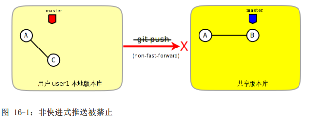
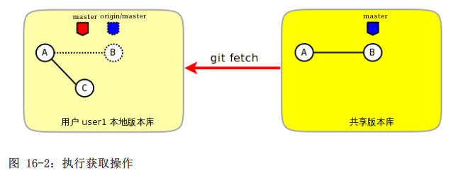
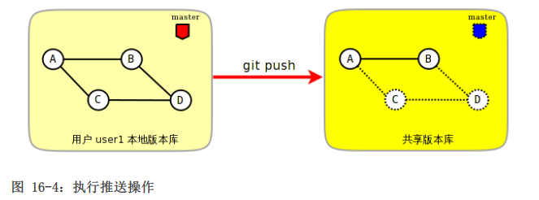
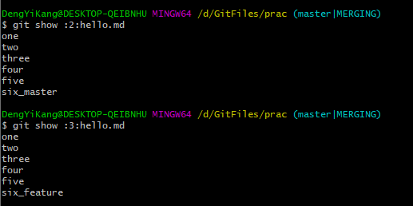
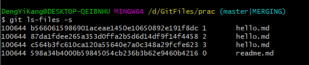
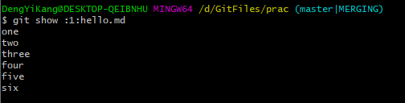
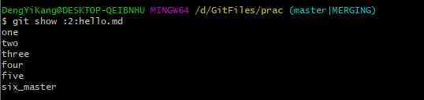
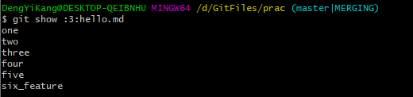
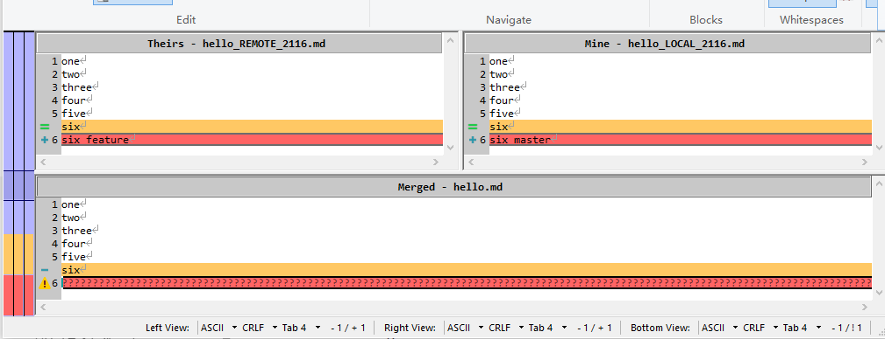
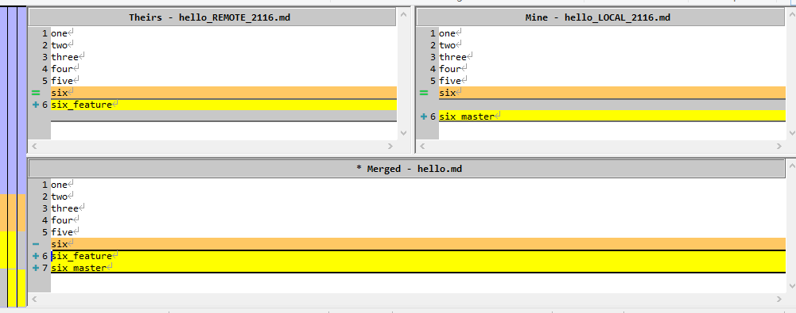

# 工作协同

## 快进式提交

假设user1和user2的工作区相同，如果两人各自在本地版本库中进行独立的提交，然后再分别向共享版本库推送，推送会失败。

因为一般情况下，推送只允许“快进式”推送。所谓快进式推送，就是要推送的本地版本库的提交是建立在远程版本库相应分支的现有提交基础上的，即远程版本库相应分支最新提交时本地版本库最新提交的祖先提交。

可以使用git push -f进行强制提交，进行覆盖，但不建议。

一般建议进行pull合并后修改再次提交。

## 禁用非快进式推送

Git提供了至少两种方式对非快进式推送进行限制。一个是通过版本库的配置，另一个是通过版本库的钩子脚本。

将版本库得到参数receive.denyNonFastForwards设置为true可以禁止任何用户进行非快进式推送。

## 冲突解决

### 拉回操作中的合并

+ 用户user1向共享版本库推送时，推送失败：

  

+ 用户user1执行pull操作的第一阶段，将共享版本库master分支的最新提交拉回到本地，并更新到本地版本库特定的引用refs/remotes/origin/master：

  

+ 用户user1执行pull操作的第二阶段，将Beninmaster和共享版本库本地跟踪分支origin、master进行合并操作：

  

+ 用户user1执行push操作，将本地提交推送到共享版本库中：

  

实际上：

```bash
git pull=git fetch + git merge
#即可以拆分成以下步骤
git fetch			#获取到的提交更新到本地跟踪共享版本库master分支的本地引用origin/master中
git merge origin/master
```

对于merge命令，默认情况下，合并后的结果会自动提交，但是如果提过--no-commit选项，则合并的结果会放入暂存区，用户可以对合并结果进行检查、更改，然后手动提交。

### 合并一：自动合并

#### 修改不同的文件

#### 修改相同文件的不同区域

#### 同时更改文件名和文件内容

### 合并二：逻辑冲突

在某些特殊情况下，合并后的结果虽然在Git看来是完美的合并，实际上却存在着逻辑冲突。

一个典型的逻辑冲突是一个用户修改了一个文件的文件名，而另外的用户在其他文件中引用了旧的文件名，这样的合并虽然能够成功但是包含着逻辑冲突，如：

+ 一个c语言项目中存在头文件hello.h，该头文件定义了一些函数声明。
+ user1将hello.h改名为api.h。
+ user2写了一个新的源码文件foo.c并在该文件中包含了hello.h文件。
+ 两个用户提交合并后，会因为源码文件foo.c找不到包含的hello.h文件而导致项目编译失败。

再举一个逻辑冲突的例子。如一个用户修改了函数返回值而另外的用户使用旧的函数返回值，虽然合并成功但存在逻辑冲突：

+ 函数compare(obj1, obj2)用于比较两个对象obj1和obj2。返回1表示比较的两个对象相同，返回0表示两个对象不同。
+ user1修改了该函数返回值，返回0代表相同，返回1代表不同。
+ user2仍以该函数原返回值判断对象的异同。

### 合并三：冲突解决

如果两个用户修改了同一文件的同一区域，则在合并的时候会遇到冲突导致终端，Git把决定权交给用户。

Git记录合并合并过程及冲突：

+ .git/MERGE_HEAD记录所合并的提交ID。
+ .git/MERGE_MSG记录合并失败的信息。
+ .git/MERGE_MODE标识合并状态。

现有两个不同版本库的同一文件的内容：



合并冲突，版本库暂存区中则会记录文件的多个不同版本：



+ 编号为1的暂存区用于保存冲突文件修改之前的副本，即冲突双方共同的祖先版本。可以用1:<filename>访问。

  

+ 编号为2的暂存区用于保存当前冲突文件在当前分支中修改的副本。可以用2:<filename>访问。

  

+ 编号为3的暂存区用于保存当前冲突文件在合并版本（分支）中修改的副本。可以用:3:<filename>访问。

  

接下来使用合并工具，缺省为已安装的工具。

```bash
git mergetool --tool-help			#查看已安装工具
git mergetool [--tool=<tool_name>]
```






保存后commit即可。

### 合并四：树冲突

如果一个用户将某个文件改名，另外一个用户将同样的文件改为另外的名字，当这两个用户的提交进行合并操作时，Git显然无法做出裁决。这种因为文件名修改造成的冲突，称为树冲突。