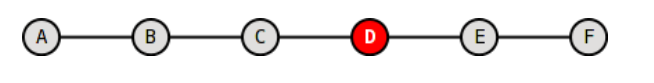
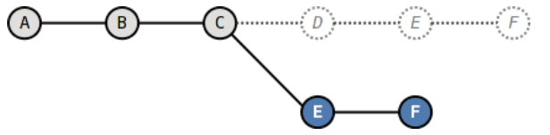
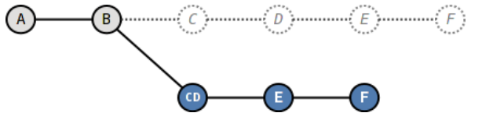
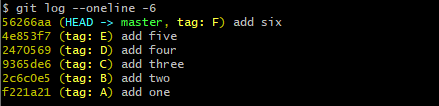

# 改变历史

## 悔棋

```bash
#修补提交
git commit --amend -m "fix message"
```

```bash
#恢复某个文件并且修改提交
git checkout HEAD^ -- <file>
git commit --amend -m "fix messsage"
```

## 多步悔棋

想要把最近的两个提交压缩为一个，并把提交说明改为“fix message”。

```bash
git reset --soft HEAD^^
git commit -m "fix message"
```

## 回到未来

给出初始状态：

+ 

变换至其一：

+ 
+ 

初始状态标记**tag**：



### 路线一

```bash
#暂时将HEAD头指针切换到C
git checkout C
#执行拣选操作将E提交在当前HEAD上重做
git cherry-pick master^
#执行拣选操作将F提交在当前HEAD上重做
git cherry-pick master
#将master分支指向新的提交ID
#HEAD@{1}相当于切换回master分支前的HEAD指向
#也可以git log -1 查看ID
git checkout master
git reset --hard HEAD@{1}
```

注意：执行**cherry-pick**进行重做后的提交的**CommitDate**会发生改变，因此新提交的哈希值与旧提交不同。

