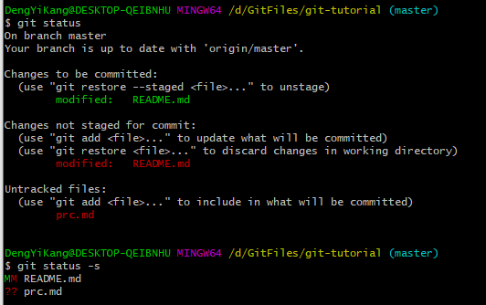

# 显示以及配置

[TOC]


## 显示位置

```bash
git rev-parse --git-dir				#显示版本库的位置
git rev-parse --show-toplevel		#显示工作区根目录
git rev-parse --show-prefix			#显示相对于工作区根目录的相对目录
git rev-parse --show-cdup			#显示从当前目录(cd)后退(up)到工作区的根的深度
```

## git config

```bash
git config [|--global|--system] alias.<value> <cmd>			#使用别名
eg:
git config --system alias.br branch
git config --system alias.ci "commit -s"
```

```bash
git config [|--global|--system] <section>.<key>				#默认显示版本库级别的配置内容
git config [|--global|--system] <section>.<key> <value>		#默认设置版本库级别的配置内容
git commit --amend --allow-empty --reset-author
#--allow-empty是因为进行修补的提交是一个空白提交，Git默认不允许空白提交
#--reset-author将ID重置，这条命令修改最新的提交
```

```bash
git config -e				#编辑版本库级配置文件
git config -e --global		#编辑全局配置文件
git config -e --system		#编辑系统级配置文件
#版本库级别配置文件优先级最高，系统级配置文件优先级最低
#what's more, git config可以操作任意INI文件
eg:
#向test.ini中添加配置
GIT_CONFIG=test.ini git config a.b.c.d "hello, world"
#从test.ini中读取配置
GIT_CONFIG=test.ini git config a.b.c.d
```

## git log

```bash
git log -<x>				#显示前x条
git log --pretty=fuller		#显示最新提交的作者和信息
git log --oneline			#显示更短小的提交ID
```

## git status

```bash
git status
git status -s				#精简输出
```



### 暂存区目录树的浏览

```bash
git ls-tree -l HEAD				#查看HEAD指向的目录树，-l：显示文件大小
```

### 显示应用对应的ID

```bash
git rev-parse <path>
```

## 显示版本号

```bash
git describe
```

## 显示引用

```bash
git show-ref			#显示所有引用
```

