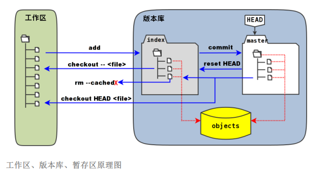
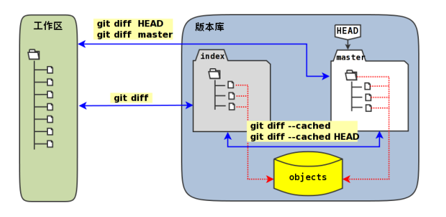

# 暂存区（stage）

**git status** 扫描工作区改动时，先依据**.git/index**中记录的（工作区跟踪文件的）时间戳、长度等信息判断工作区文件是否改变。若改变，则比较原始文件，判断文件内容是否更改。若未更改，则更新记录在**.git/index**时间戳。使用时间戳、文件长度等信息是**Git**高效的因素之一。

**.git/index**实际上是一个包含文件索引的目录树，记录了文件名、文件的状态信息。文件的内容并不存在里面，而是保存在**Git**对象库**.git/objects**目录中，文件索引建立了文件和对象库中对象实体间的联系。



+ 在版本库中标记为**index**的区域为暂存区**（stage/index）**，标记为**master**的是**master**分支所代表的的目录树
+ **HEAD**实际上是指向**master**分支的一个“游标”。所以一些命令中出现**HEAD**的地方可以用**master**来替换
+ **objects**表示的区域为**Git**对象库，实际位于**.git/objects**目录下
+ 对工作区修改或新增的文件执行**git add**命令时，暂存区的目录树被更新，同时工作区修改或新增的内容被写入到对象库中的一个新的对象中，而该对象的ID被记录在暂存区的文件索引中
+ 当执行**commit**命令时，暂存区的目录树写到版本库（对象库）中，**master**分支会做相应的更新

## git diff



```bash
git diff			#工作区和暂存区比较
git diff --cached	#暂存区和HEAD比较
git diff HEAD		#工作区和HEAD比较
```