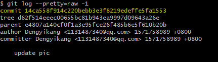
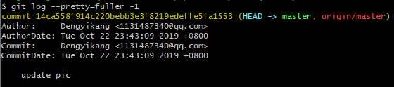
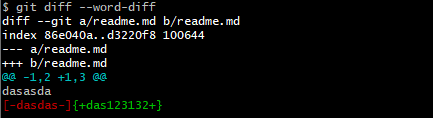
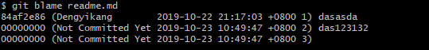

# 版本与历史

## 版本表示法：git rev-parse

可以显示Git版本库的位置（**-git-dir**），当前工作区目录深度（**--show-cdup**），甚至可以用于被Git无关应用用于解析命令行参数（**--parseopt**）。

```bash
#显示分支
git rev-parse --symbolic --branches
#显示tag
git rev-parse --symbolic --tags
#显示定义的所有引用
#其中refs/remotes/目录下的引用成为远程分支（或远程引用）。
git rev-parse --symbolic --glob=refs/*
#将一个或多个Git对象表达式表示为对应的SHA1值
git rev-parse <Object> ...
#git describe的输出也可以显示为SHA1值,输出当前版本号
git describe
#可用哈希值的前几位获取整个哈希值
git rev-parse <part_of_hash>
#显示tag A对应的目录树，以下两种写法均可
git rev-parse A^{tree} A:
#显示树里面的文件，以下两种写法均可
git rev-parse A^{tree}:src/Makefile A:src/Makefile
#显示暂存区的文件和HEAD中的文件
git rev-parse :gitg.png HEAD:gitg.png
#通过在提交日志中查找串的方式显示提交
git rev-parse :/"Commit A"
```

## 版本范围表示法：git rev-list

```bash
#一个ID实际上就可以代表一个版本列表。以下显示该版本开始的所有历史提交
git rev-list --oneline <ID>
#两个或多个版本，相当于每个版本单独使用时指代的列表的并集
git rev-list --oneline <ID1> <ID2>
#在一个版本前面加上^表示取反，即排除这个版本及其历史版本
git rev-list --oneline ^<ID1> <ID2>
#和上面等价
git rev-list --oneline <ID1>..<ID2>
#三点表示法的含义是两个版本共同能够访问到的除外
git rev-list --oneline <ID1>...<ID2>
#某提交的历史提交，自身除外：
git rev-list --oneline <ID>^@
#提交本身不包括其历史提交：
git rev-list --oneline <ID>^!
```

## 浏览日志：git log

### 参数代表版本范围

当不适用任何参数调用，相当于使用了缺省的参数**HEAD**，即显示当前**HEAD**能够访问到的所有历史提交，还可以使用上面介绍的版本范围表示法，如：

```bash
#同 git rev-list --oneline F^! D
git log --oneline F^! D
```

### 分支图显示

通过**--graph**参数可以显示字符界面的提交关系图。

### 显示最近的几条日志

-<n>

### 显示每次提交的具体改动

```bash
#缺省不显示二进制文件的改动内容
git log -p
```

### 显示每次提交的变更摘要

使用-p参数会让日志输出显得非常冗余，当不需要知道具体的改动而只想知道改动在哪些文件上，可以使用--stat参数。

```bash
git log --stat --oneline <ID>
```

### 定制输出

+ 参数**--pretty=raw**显示提交的原始数据。可以显示提交对应的树的ID:



+ 参数**--pretty=fuller**会同时显示作者和提交者：

  

+ 参数**--pretty=oneline**，会提供最精简的日志输出。也可以使用**--oneline**参数。

+ 使用**git show**显示**tag** 及其提交：

  ```bash
  git show D --stat
  ```

+ 使用**git cat-file**显示**tag**及其提交

  ```bash
  #参数-p表示美观的输出
  git cat-file -p <ID>
  ```

## 差异比较：git diff

```bash
#比较tag A 和 tag B
git diff A B
#比较工作区和tag A
git diff A
#比较暂存区和tag A
git diff --cached A
#比较工作区和暂存区
git diff
#比较暂存区和HEAD
git diff --cached
#比较工作区和HEAD
git diff HEAD
```

#### Git中文件在版本间的差异比较

差异比较还可以使用路径参数，只显示不同版本间该路径下文件的差异。

```bash
git diff <commit1> <commit2> -- <paths>
```

#### 非Git目录/文件的差异比较

**git diff**还可以在Git版本库之外执行，对非Git目录进行比较。

```bash
git diff <path1> <path2>
```

#### 扩展的差异语法

Git扩展了GNU的差异比较语法，提供了对重命名、二进制文件、文件权限变更的支持。

#### 逐词比较，而非缺省的逐行比较

Git的差异比较缺省是逐行比较，分别显示改动前的行和改动后的行。

而**--word-diff**参数可以显示逐词比较。



## 文件追溯：git blame

在开发过程中当发现BUG并定位到具体代码时，Git的文件追溯命令可指出是谁在什么时候、什么版本引入的此BUG。



只想查看某几行，使用**-L n,m**参数，如下：


## 二分查找

git bisect命令是基于版本库的，自动化的问题查找和定位工作流程。

流程：

1、工作区切换到已知的“好版本”和“坏版本”的中间一个版本。

2、执行测试，问题重现，将当前版本库标记为“坏版本”，否则标记为“好版本”。

3、重复1-2，直至最终找到第一个导致问题出现的版本。

```bash
#开始查找
git bisect start
#标记
git bisect [good|bad] [<commit>]
#成功定位后，切换到该版本：
git checkout bisect/bad
#当对bug定位和修复后，撤销二分查找在版本库中遗留的临时文件和引用。
#撤销二分查找后，版本库切换回执行二分查找之前所在分支。
git bisect reset
```

### 错误标记后的处理

Git的二分查找提供了一个回复查找进度的办法。

```bash
#保存日志
git bisect log > logfile
#编辑日志，删除错误标记的行
vi logfile
#结束上一次出错的二分查找
git bisect reset
#通过日志文件回复进度
git bisect replay logfile
```

### 二分查找使用自动化测试

```bash
#.sh脚本
git bisect run sh <.sh>
#定位最后结果
git describe refs/bisect/bad
```


