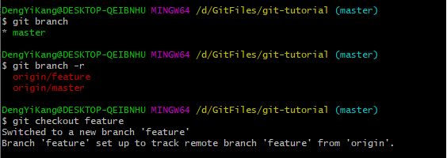

# 远程版本库

当多人协作时，会出现一些问题：

+ 如何避免因为把所有的本地分支都推送到共享版本库而造成的分支的混乱？
+ 如何避免不同用户对不同的特性开发创建了相同名字的分支而造成的冲突？
+ 如何避免用户随意在共享版本库中创建tag而导致tag混乱和冲突？
+ 等等

## 远程分支

Git允许一个版本库和任意多个版本库进行交互。

```bash
#查看远程分支
git branch -r
```

```bash
#查看config
git config -e
```

配置文件如下：


该小节以origin为名注册了一个远程版本库：

+ fetch引用表达式以（+）号开头，含义是强制进行引用的替换，即使即将进行替换的是非快进式。
+ 引用表达式中使用了通配符，冒号前面的含有通配符的引用指的是远程版本库的所有分支，冒号后面的引用含义是复制到本地的远程分支目录中。

当执行git fetch origin操作时，就相当于执行下面命令，将远程版本库的所有分支复制为本地的远程分支。

```bash
git fetch origin +refs/heads/*:refs/remotes/origin/*
```

## 分支追踪

基于远程分支创建本地分支：

```bash
git checkout <brname>
```



如果Git版本比较旧，或注册了多个远程版本库，因此存在多个名为<brname>的远程分支，因此就只能：

```bash
git checkout -b <brname> <remote_name>/<brname>
```


和远程分支建立跟踪后，本地分支就具有以下特征：

+ 检查工作区状态时，会显示本地分支和被跟踪远程分支提交之间的关系。
+ 执行git pull时，会和被跟踪的远程分支进行合并（或变基），如果两者出现版本偏离的话。
+ 当执行git push命令时，会推送到远程版本库的同名分支中。

跟踪关系在配置文件中:


## 远程版本库

注册新的远程版本库：

```bash
git remote add <remote_name> <remote_url>
```

显示已经注册的远程版本库：

```bash
git remote -v
```

### 更改远程版本库的地址

如果远程版本库的URL地址改变，需要更换，如何处理？

+ 手工修改.git/config文件

+ git config命令

+ git remote命令

  ```bash
  git remote set-url <remote_name> <new_url>
  ```

### 为push设置单独地址

```bash
git remote set-url --push <remote_name> <new_url>
```

发现配置文件会多一个pushurl：


### 更改远程版本库的名称

```bash
git remote rename <oldname> <newname>
```

### 远程版本库更新

当注册了多个远程版本库并希望获取所有远程版本库的更新时，可以执行如下命令：

```bash
git remote update
```

如果某个远程版本库不想在执行git remote update时获得更新，可以通过参数关闭自动更新：

```bash
git config remote.<remote_name>.skipDefaultUpdate true
```

### 删除远程版本库

```bash
git remote rm <remote_name>
```

### pull操作与远程版本库

在执行git pull操作时可以通过参数--rebase设置使用变基而非合并操作，将本地分支的改动变基到跟踪分支上。为了避免因为忘记使用--rebase参数导致分支的合并，可以如下设置：

```bash
git config branch.<brname>.rebase true
```

有了这个设置后，如果在<brname>工作分支中执行：git pull命令，在遇到冲突的情况下会采用变基操作，而不是默认的合并操作。

如果为本地版本库设置参数branch.autosetuprebase，值为true，则在基于远程分支建立本地追踪分支时，会自动配置branch.<brname>.rebase参数。

## tag和远程版本库

远程版本库中的tag同步到本地版本库，会使用同样的名称，而不会像分支那样移动到另外的命名空间中（/remote/...），这可能会给本地版本库带来混乱。

当删除注册的远程版本库时，远程分支会被删除，但是该远程版本库引入的tag不会被删除。

可以在执行git fetch命令时，设置不获取tag只获取分支以及提交。通过提供-n或--no-tags参数：

```bash
git fetch --no-tags <url> refs/heads/*:refs/remotes/
```

在注册远程版本库时，也可以使用--no-tags参数，避免将远程版本库的tag引入本地版本库：


## 分支和tag的安全性

+ 用reflog记录对分支的操作历史

  默认创建的带工作区的版本都会包含core.logallrefupdates为true的配置，这样在版本库中建立的每个分支都会创建对应的reflog。但是创建的裸版本库默认不包含这个设置，也就不会为每个分支设置reflog。

+ 关闭非快进式提交

  如果将配置receive.denyNonFastForwards设置为true，则禁止一切非快进式推送。

+ 关闭分支删除功能

  如果将配置receive.denyDeletes设置为true，则禁止删除分支。