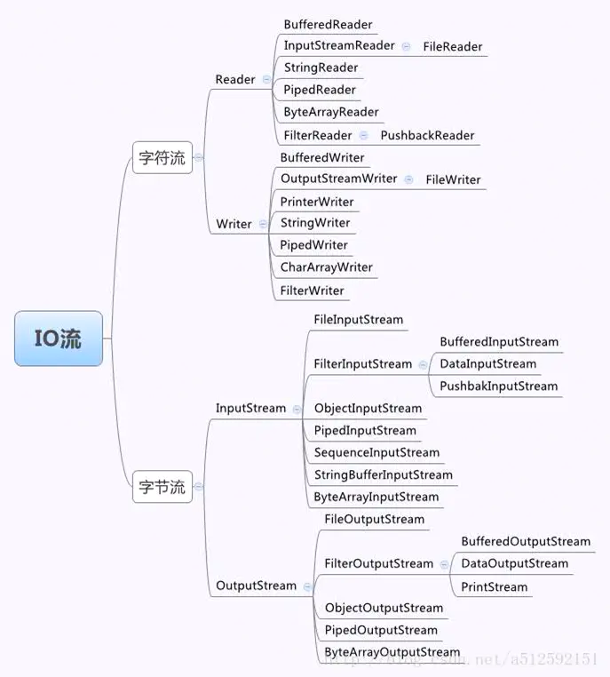

# java IO

## 四点明确

+ 明确要操作的数据是数据源还是数据目的(也就是要读还是要写)
	+ 源
		+ InputStream、Reader
	+ 目的
		+ OutputStream、Writer
+ 明确要操作的设备上的数据是字节还是文本
	+ 源
		+ 字节：InputStream
		+ 文本：Reader
	+ 目的
		+ 字节：OutputStream
		+ 文本：Writer
+ 明确数据所在的具体设备
	+ 源
		+ 硬盘：文件File开头
		+ 内存：数组，字符串
		+ 键盘：System.in
		+ 网络：socket
	+ 目的
		+ 硬盘：文件File开头
		+ 内存：数组，字符串
		+ 屏幕：System.out
		+ 网络：socket
+ 明确是否需要额外功能（比如是否需要转换流、高效流等）
	+ 需要转换：转换流InputStreamReader、OutputStreamReader
	+ 需要高效：缓冲流BufferedXXX
	+ 多个源：序列流SequenceInputStream
	+ 对象序列化：ObjectInputStream、ObjectOutputStream
	+ 操作基本数据、保证字节原样性：DataInputStream、DataOutputStream

## File类

`java.io.File` 类是专门对文件进行操作的类，只能对文件本身进行操作，不能对文件内容进行操作，主要用于文件和目录的创建、查找和删除等操作。

### 绝对路径与相对路径

+ 绝对路径：一个完整的路径，以盘符开头，例如`F://aaa.txt`。
+ 相对路径：一个简化的路径，不以盘符开头,例如`//aaa.txt//b.txt`。

> 1、**路径是不区分大小写**
> 2、路径中的文件名称分隔符windows使用反斜杠,反斜杠是转义字符,两个反斜杠代表一个普通的反斜杠

### 构造方法

```java
public File(File parent, String child);
public File(String parent, String child);
public File(String pathname);
public File(URI uri);
```

> 1. 一个File对象代表硬盘中实际存在的一个文件或者目录。
> 2. File类构造方法不会给你检验这个文件或文件夹是否真实存在，因此无论该路径下是否存在文件或者目录，都不影响File对象的创建。

### 获取功能的方法

```java
返回由此File表示的文件或目录的名称。//返回此File的绝对路径名字符串。
public String getAbsolutePath();
//将此File转换为路径名字符串。
public String getPath() ;
//返回由此File表示的文件或目录的名称。
public String getName();
//返回由此File表示的文件的长度。
public long length();
```

### 判断功能的方法

```java
//此File表示的文件或目录是否实际存在。
public boolean exists();
//此File表示的是否为目录。
public boolean isDirectory();
//此File表示的是否为文件。
public boolean isFile();
```

### 创建删除功能的方法

```java
//文件不存在，创建一个新的空文件并返回true，文件存在，不创建文件并返回false。
public boolean createNewFile();
// 删除由此File表示的文件或目录。
public boolean delete();
//创建由此File表示的目录。
public boolean mkdir();
//创建由此File表示的目录，包括任何必需但不存在的父目录。
public boolean mkdirs();
```

其中，`mkdirs()`和`mkdir()`方法类似，但`mkdir()`，只能创建一级目录，`mkdirs()`可以创建多级目录比如`//a//b//c`，所以**开发中一般用**`mkdirs()`;

> 注意：`delete`方法，如果此`File`表示目录，则目录必须为空才能删除。

### 目录的遍历

- `public String[] list()` ：返回一个String数组，表示该File目录中的所有子文件或目录。
- `public File[] listFiles()` ：返回一个File数组，表示该File目录中的所有的子文件或目录。

### 递归遍历文件夹下所有文件以及子文件

```java
package File;
 
import java.io.File;
 
//递归遍历文件夹下所有的文件
public class RecursionDirectory {
    public static void main(String[] args) {
      File file=new File("D:\\java专属IO测试");
        Recursion(file);
    }
    public static void Recursion(File file){
        //1、判断传入的是否是目录
        if(!file.isDirectory()){
            //不是目录直接退出
            return;
        }
        //已经确保了传入的file是目录
        File[] files = file.listFiles();
        //遍历files
        for (File f: files) {
            //如果该目录下文件还是个文件夹就再进行递归遍历其子目录
            if(f.isDirectory()){
                //递归
                Recursion(f);
            }else {
                //如果该目录下文件是个文件，则打印对应的名字
                System.out.println(f.getName());
            }
 
        }
    }
}
```

## IO流

### 简介

Java中I/O操作主要是指使用`java.io`包下的内容，进行输入、输出操作。输入也叫做读取数据，输出也叫做作写出数据。

### IO的分类

+ 根据数据的流向分为：输入流 和 输出流。
	+ 输入流 ：把数据从`其他设备`上读取到`内存`中的流。
	+ 输出流 ：把数据从`内存` 中写出到`其他设备`上的流。
+ 根据数据的类型分为：字节流 和 字符流。
	- 字节流 ：以字节为单位，读写数据的流。
	- 字符流 ：以字符为单位，读写数据的流。



### 字节流

#### 字节输出流（OutputStream）

`java.io.OutputStream`抽象类是表示**字节输出流**的所有类的**超类**（父类），将指定的字节信息写出到目的地。

+ `public void close()` ：关闭此输出流并释放与此流相关联的任何系统资源。
+ `public void flush() `：刷新此输出流并强制任何缓冲的输出字节被写出。
+ `public void write(byte[] b)`：将 b.length个字节从指定的字节数组写入此输出流。
+ `public void write(byte[] b, int off, int len)` ：从指定的字节数组写入 len字节，从偏移量 off开始输出到此输出流。 也就是说从off个字节数开始读取一直到len个字节结束
+ `public abstract void write(int b)` ：将指定的字节输出流。

##### FileOutputStream

```java
public FileOutputStream(File file);//根据File对象为参数创建对象。
public FileOutputStream(String name);//根据名称字符串为参数创建对象。
    
public void write(int b);
public void write(byte[] b);
public void write(byte[] b,int off,int len);  //从`off`索引开始，`len`个字节

//append参数，默认是覆盖的，如果为true，那么为追加模式
public FileOutputStream(File file, boolean append);
public FileOutputStream(String name, boolean append);
```

> 系统中的换行：
>
> - Windows系统里，每行结尾是 `回车+换行` ，即`\r\n`；
> - Unix系统里，每行结尾只有 `换行` ，即`\n`；
> - Mac系统里，每行结尾是 `回车` ，即`\r`。从 Mac OS X开始与Linux统一。

#### 字节输入流（InputStream）

`java.io.InputStream`抽象类是表示**字节输入流**的所有类的**超类**（父类），可以读取字节信息到内存中。

```java
public void close();//关闭此输入流并释放与此流相关联的任何系统资源。
public abstract int read();//从输入流读取数据的下一个字节。
public int read(byte[] b);//该方法返回的int值代表的是读取了多少个字节，读到几个返回几个，读取不到返回-1
```

##### FileInputStream

```java
//通过打开与实际文件的连接来创建一个 FileInputStream ，该文件由文件系统中的 File对象 file命名。
public FileInputStream(File file);
//通过打开与实际文件的连接来创建一个 FileInputStream ，该文件由文件系统中的路径名name命名。
public FileInputStream(String name);
```

```java
public class FISRead {
    public static void main(String[] args) throws IOException{
        // 使用文件名称创建流对象.
        FileInputStream fis = new FileInputStream("read.txt"); // 文件中为abcde
        // 定义变量，作为有效个数
        int len ；
        // 定义字节数组，作为装字节数据的容器   
        byte[] b = new byte[2];
        // 循环读取
        while (( len= fis.read(b))!=-1) {
            // 每次读取后,把数组的有效字节部分，变成字符串打印，打印ab\ncd\ne
            System.out.println(new String(b，0，len));//  len 每次读取的有效字节个数
            //下面这个语句是不对的，会打印出ab\ncd\ned
            //System.out.println(new String(b));
        }
        // 关闭资源
        fis.close();
    }
}
```

```java
//拷贝文件
public class Copy {
    public static void main(String[] args) throws IOException {
        // 1.创建流对象
        // 1.1 指定数据源
        FileInputStream fis = new FileInputStream("D:\\test.jpg");
        // 1.2 指定目的地
        FileOutputStream fos = new FileOutputStream("test_copy.jpg");
 
        // 2.读写数据
        // 2.1 定义数组
        byte[] b = new byte[1024];
        // 2.2 定义长度
        int len;
        // 2.3 循环读取
        while ((len = fis.read(b))!=-1) {
            // 2.4 写出数据
            fos.write(b, 0 , len);
        }
 
        // 3.关闭资源
        fos.close();
        fis.close();
    }
}
```

### 字符流

因为数据编码的不同，因而有了对字符进行高效操作的流对象，字符流本质其实就是基于字节流读取时，去查了指定的码表，而字节流直接读取数据会有乱码的问题（读中文会乱码）。

> 字节流读取中文字符时，可能不会显示完整的字符，那是因为一个中文字符占用多个字节存储。

字节流读取中文的方法：

```java

public class CharaterStream {
    public static void main(String[] args) throws Exception {
 
        FileInputStream inputStream = new FileInputStream("a.txt");
        byte[] bytes = new byte[1024];
        int len;
        while ((len=inputStream.read(bytes))!=-1){
           System.out.print(new String(bytes,0,len));
        }
    }
}
```

`String`有解码的功能，并且默认编码是utf-8。

尽管字节流也能有办法决绝乱码问题，但是还是比较麻烦，于是java就有了字符流，`字符为单位`读写数据，字符流`专门用于处理文本`文件。如果处理纯文本的数据优先考虑字符流，其他情况就只能用字节流了（图片、视频、等等`只文本`例外）。

> 从另一角度来说：**字符流 = 字节流 + 编码表**

#### 字符输入流（Reader）

`java.io.Reader`抽象类是**字符输入流**的所有类的**超类**（父类），可以读取字符信息到内存中。

```java
public void close();//关闭此流并释放与此流相关联的任何系统资源。
public int read();//从输入流读取一个字符。
public int read(char[] cbuf);//从输入流中读取一些字符，并将它们存储到字符数组 cbuf中
```

