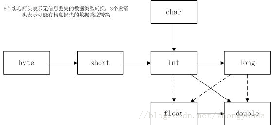

# 基本程序设计结构

## 数据类型

### 整型

| 类型 | 存储需求 | 取值范围 |
| ---- | -------- | -------- |
|int|4B|-2 147 483 648~2 147 483 647(正好超过20亿)|
|short|2B|-32768~32767|
|long|8B|-9 223 372 036 854 775 808~9 223 372 036 854 775 807|
|byte|1B |-128~127 |

在Java中，整型的范围与运行Java代码的机器无关。

长整型数值有一个后缀L或l。十六进制数值有一个前缀0x或0X。八进制有一个前缀0，容易混淆。

从Java7开始，加上前缀0b或0B就可以写二进制数，且可以为数字字面量加下划线，如用1_000_000表示一百万。

Java没有任何无符号（unsigned）形式的int、long、short或byte类型。

### 浮点类型

| 类型 | 存储需求 | 取值范围 |
| ---- | -------- | -------- |
|float|4B|大约±3.402 823 47E+38F（有效位数为6~7位）|
|double|8B|大约±1.797 693 134 862 315 70E+308（有效位数为15位）|

float类型的数值有一个后缀F或f。没有后缀F的浮点数值（如3.14）默认为double类型。当然，也可以在浮点数值后面添加后缀D或d。

==注意==：常量Double.POSITIVE_INFINITY、Double.NEGATIVE_INFINITY和Double.NaN（以及相应的Float类型的常量）。不能这样检测一个特定值是否等于Double.NaN:

```java
if(x==Double.NaN)
```

所有“非数值”的值都认为是不相同的。应该：

```java
if(Double.isNaN(x))	//check whether x is "not a number"
```

==警告==:浮点数值不适用于无法接受舍入误差的金融计算中。如，println（2.0-1.1）将打印0.8999999999..，而不是0.9。因为浮点数值采用二进制系统表示，无法精确表示1/10。如果在数值计算中不允许有任何舍入误差，就应该使用BigDecimal类。

## char类型

有一些Unicode字符可以用一个char值描述，另外一些Unicode字符则需要两个char值。

char类型的值可以表示为十六进制值。

除了转义序列\u之外，还有一些用于表示特殊字符的转义序列：

| 转义序列 | 名称 | Unicode值 |
| -------- | ---- | --------- |
|\b|退格|\u0008|
|\t|制表|\u0009|
|\n|换行|\u000a|
|\r|回车|\u000d|
|\"|双引号|\u0022|
|\'|单引号|\u0027|
|\\|反斜杠|\u005c|

所有这些转义序列都可以出现在加引号的字符字面量或字符串中。如"Hello\n"、'\u2122'。

转义序列\u还可以出现在加引号的字符常量或字符串之外（**而其他所有转义序列不可以**）。如：

```java
public static void main(String\u005B\u005D args)
//\u005B\u005D是[和]的编码
```

==警告==：Unicode转义序列会在解析代码前得到处理。如“\u0022+\u0022”并不是一个由引号（\u0022）包围加号构成的字符串。实际上，\u0022会在解析之前转换为"，进而会得到""+""，也就是一个空串。

更隐蔽地，一定要当心注释中的\u。

```java
//\u00A0 is a newline
/*上行注释会产生一个语法错误，因为读程序时\u00A0会替换为一个换行符。*/
//Look inside c:/users
/*上行也会产生一个语法错误，因为\u后面并未跟着4个十六进制数*/
```

## boolean类型

整型值和布尔值之间不能进行相互转换。

==注意==：在C++中，数值甚至指针可以代替boolean值。在Java中则不是这样。因此有:

```c++
if(x=0)
```

在C++中这个测试可以编译运行，其结果总是false。而在Java中不能通过编译，因为表达式不能转换为布尔值。

## 变量初始化

声明了一个变量后，必须用赋值语句对变量进行显式初始化，不能使用未初始化的变量。

在Java中，不区分变量的声明与定义。

## 常量

利用关键字final指示常量。

final表示该变量只能被赋值一次。习惯上常量名用大写。

在Java中，经常希望某个变量可在一个类中的多个方法中使用，通常将这些常量称为类常量。可以使用static final设置一个类常量。

==注==：const是Java保留的关键字，但目前并没有使用。在Java中，必须使用final定义常量。

## 数值类型之间的转换



上图有六个实心箭头，表示无信息丢失的转换；有三个虚箭头，表示可能有精度损失的转换。

## 枚举类型

```java
enum Size {SMALL,MEDIUM, LARGE, EXTRA_LARGE};
Size s=Size.MEDIUM
```

## 检测字符串是否相等

```java
s.equals(t);
s.equalsIgnoreCase("hello");//不区分大小写
/*s与t可以是字符串变量，也可以是字符串字面量*/
```

## 空串与Null串

空串“”是长度为0的字符串。

```java
if(str.length()==0) or if(str.equals("")) //判断某字符串是否为空串
```

若不确定某字符串变量是否为空，则必须先判断：

```java
if(str!=null&&str.length()!=0)
```

## String API

```java
char charAt(int index);
/*返回给定位置的代码单元*/
int codePointAt(int index);
/*返回从给定位置开始的码点*/
int offsetByCodePoints(int startIndex, int cpCount);
/*返回从startIndex代码点开始，唯一cpCount后的码点索引*/
int compareTo(String other);
/*按字典序，如果字符串位于other之前，返回一个负数，相等返回0，否则正数*/
IntStream codePoints();
/*将这个字符串的码点作为一个流返回。调用toArray将它们放在一个数组中*/
new String(int[] codePoints, int offset, int count);
/*用数组中从offset开始的count个码点构造一个字符串*/
boolean equals(Object other);
/*如果字符串与other相等，返回true*/
boolean equalsIgnoreCase(String other);
/*忽略大小写*/
boolean startsWith(String prefix);
boolean endsWith(String suffix);
/*如果字符串以suffix开头或结尾，则返回true*/
int indexOf(String str);
int indexOf(String str, int fromIndex);
int indexOf(int cp);
int indexOf(int cp, itn fromIndex);
/*返回与字符串str或代码点cp匹配的第一个子串的开始位置。这个位置从索引0或fromIndex开始计算。如果在原始串中不存在str，返回-1*/
int lastIndexOf(String str);
int lastIndexOf(String str, int fromIndex);
int lastIndexOf(int cp);
int lastIndexOf(int cp, int fromIndex);
/*返回与字符串str或代码点cp匹配的最后一个子串的开始位置。这个位置从原始串尾端或fromIndex开始计算*/
int length();
int codePointCount(int startIndex, int endIndex);
/*返回startIndex和endIndex-1之间的代码点数量。没有配成对的代用字符将计入代码点*/
String replace(CharSequence oldString, CharSequence newSring);
/*返回一个新字符串。这个字符串用newString代替原始字符串中的所有的oldString。可以用String或StringBuilder对象作为CharSequence参数*/
String substring(int beginIndex);
String substring(int beginIndex, int endIndex);
/*返回一个新字符串。这个字符串包含原始字符串中从beginIndex到串尾或endIndex-1的所有代码单元*/
String toLowerCase();
String toUpperCase();
String trim();
/*返回一个新字符串。这个字符串将删除了原始字符串头部和尾部的空格*/
String join(CharSequence delimiter, CharSequence... elements);
/*返回一个新字符串，用给定的定界符连接所有元素*/

```


