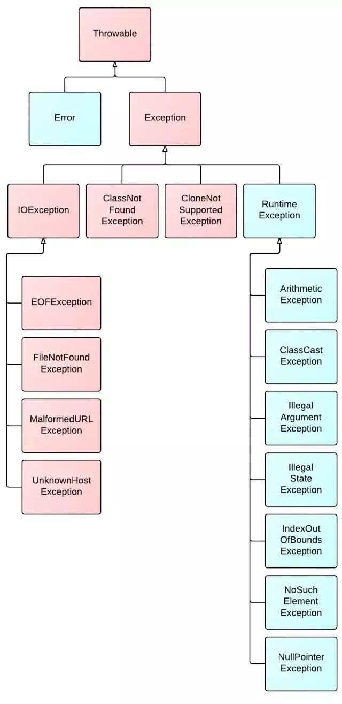

# 异常、断言和日志

## 处理错误

### 异常分类

  

+ Error类层次结构描述了Java运行时系统的内部错误和资源耗尽错误。应用程序不应该抛出这种类型的对象。
+ 由程序错误导致的异常属于RuntimeException。

派生于RuntimeException的异常包含下面几种情况：

+ 错误的类型转换。
+ 数组访问越界。
+ 访问null指针。

不是派生于RuntimeException的异常包含：

+ 试图在文件尾部后面读取数据。
+ 试图打开一个不存在的文件。
+ 试图根据给定的字符串查找Class对象，而这个字符串表示的类并不存在。

派生于Error类或RuntimException类的所有异常称为==非受查异常==，其他异常称为==受查异常==。

### 声明受查异常

下面4种情况应该抛出异常：

+ 调用一个抛出受查异常的方法。
+ 程序运行过程中发现错误，并且利用throw抛出一个受查异常。
+ 程序出现错误。
+ Java虚拟机和运行时库出现的内部错误。

==注意==，不应该声明从RuntimeException继承的那些非受查异常。

==警告==：如果子类中覆盖了超类的一个方法，子类方法中声明的受查异常不能比超类方法中声明的异常更通用。特别的，如果超类方法没有抛出受查异常，子类也不能抛出受查异常。

### 如何抛出异常

未读取指定长度的数据而终止的异常：

```java
String readData(Scanner in) throws EOFException{
    ...;
    while(...){
        if(!in.hasNext()){//EOF encountered
        	if(n<len) throw new EOFException();
        }
    }
}
```

细致地描述情况：

```java
String gripe="...";
throw new EOFException();
```

### 创建异常类

```java
class FileFormatException extends IOException{
    public FileFormatException(){}
    public FileFormatException(String gripe){
        super(gripe);
    }
}
```

## 捕获异常

### 捕获异常

```java
try{
    code;
}catch(ExceptionType e){
    handler;
}
```

如果在try语句块中的任何代码抛出了一个在catch语句中说明的异常类，则

1、程序将跳过try块的其余代码。

2、程序将执行catch字句中的处理器代码。

如果方法中的任何代码抛出了一个在catch子句中没有声明的异常类型，那么这个方法就会立刻退出。

**有两种处理方法：**

+ 捕获：

  ```java
  public void read(String name){
      try{
          code;
      }catch(IOException exception){
          handler;
      }
  }
  ```

+ 传递：

  ```java
  public void read(String name) throws IOException{
      code;
  }
  ```

通常，应该捕获那些知道如何处理的异常，而将那些不知道怎样处理的异常继续进行传递。

==注意==：如果编写一个覆盖超类的方法，而这个方法又没有抛出异常，那么这个方法就必须捕获方法代码中出现的每一个受查异常。因为不允许在子类的throws说明符中出现超过超类方法所列出的异常类范围。

### 捕获多个异常

```java
try{
    ...;
}
catch(...){
    ...;
}
catch(...){
    ...;
}
```

同一个catch子句中可以捕获多个异常类型：

```java
try{
    code;
}
catch(FileNotFoundException | UnknownHostException e){
    ...;
}
catch(IOException){
    ...;
}
```

### 再次抛出异常与异常链

在catch子句中可以抛出一个异常，目的是改变异常的类型。

```java
try{
    ...;
}
catch(SQLException e){
    throw new ServletException("database error: "+e.getMessage());
}
```

更好的处理方法，并将原始异常设置为新异常的原因：

```java
try{
    ...;
}
catch(SQLException e){
    Throwable se=new ServletException("database error");
    se.initCause(e);
    throw se;
}
```

当捕获到异常时，就可以重新得到原始异常：

```java
Throwable e=se.getCause();
```

==提示==：如果在一个方法中发生了一个受查异常，而不允许抛出它，那么包装技术就十分有用。我们可以捕获这个异常，并将它包装成一个运行时异常。

### finally子句

不管是否有异常被捕获，finally子句中的代码都被执行。

try语句可以只有finally子句，而没有catch子句。

==提示==：建议解耦合try/catch和try/finally语句块，提高代码清晰度：

```java
try{
    try{
        code that might throw exceptions;
    }
    finally{
        in.close();
    }
}
catch(IOException e){
    show error message;
}
```

==警告==：如果try和finally都包含return语句，那么在方法返回前，finally的内容将被执行，返回值会覆盖try中的返回值。

### 带资源的try语句

假设资源属于一个实现了AutoCloseable接口的类。

带资源的try语句的最简形式为：

```java
try(Resource res=...){
    work with res;
}
```

try块退出时，会自动调用res.close()。try块可以指定多个资源：

```java
try(Scanner in=new Scanner(new FileInputStream("/usr/share/dict/words"), "UTF-8");
   PrintWriter out=new PrintWriter("out.txt")){
    while(in.hasNext()){
        out.println(in.next().toUpperCase());
    }
}
```

如果try块抛出一个异常，而且close方法也抛出一个异常，那么原异常将丢失。而上述方法可以很好地解决这个问题。

### 分析堆栈轨迹元素

调用Throwable类的printStackTrace方法访问堆栈轨迹的文本描述信息。

```java
Throwable t=new Throwable();
StringWriter out=new StringWriter();
t.printStackTrace(new PrintWriter(out));
String description=out.toString();
```

getStackTrace方法得到StackTraceElement对象的一个数组：

```java
Throwable t=new Throwable();
StackTraceElement[] frames=t.getStackTrace();
for(StackTraceElement frame:frames){
    analyze;
}
```

静态的Thread.getAllStackTrace方法，产生所有线程的堆栈轨迹。

```java
Map<Thread, StackTraceElement[]> map=Thread.getAllStackTraces();
for(Thread t:map.keySet()){
    StackTraceElement[] frames=map.get(t);
    analyze;
}
```

