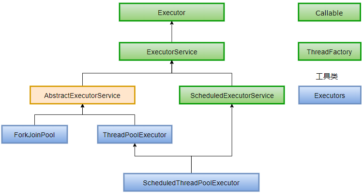
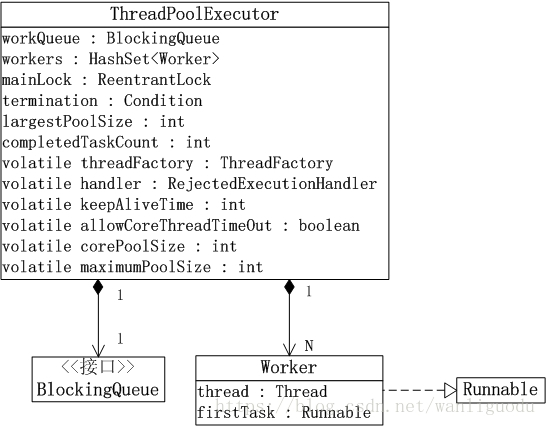
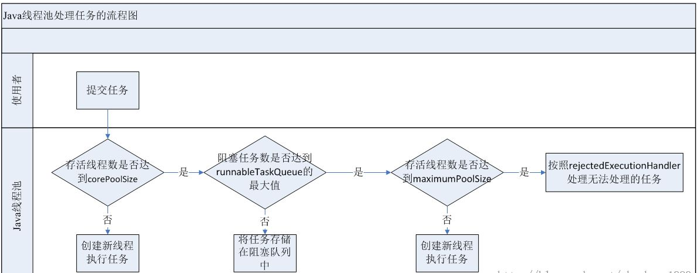

# 多线程基础#2

[TOC]

## 线程池

线程池的优点：

+ 重用线程池中的线程，避免因为线程的创建和销毁所带来的性能开销。
+ 能有效控制线程池的最大并发数，避免大量线程之间因互相抢夺系统资源而导致的阻塞现象。
+ 能够对线程进行简单的管理，并提供定时执行以及指向间隔循环执行等功能。

### 类结构图

Java线程池的类结构图如下：



绿色表示接口，蓝色表示实例类，黄色表示抽象类。Callable是创建线程运行时代码的接口， ThreadFactory用于创建线程的工厂。

### ThreadPoolExecutor

#### 简介

ThreadPoolExecutor是线程池类。对于线程池，可以通俗的将它理解为“存放一定数量的一个线程集合。线程池允许若个线程同时运行，运行同时运行的线程数量就是线程池的容量。当添加到线程池中的线程超过它的容量时，会有一部分线程阻塞等待，线程池会通过相应的调度策略和拒绝策略，对添加到线程池中的线程进行管理。”

#### 数据结构



```java
// 阻塞队列，当线程池中的线程超过它的容量的时候，线程会进入阻塞队列进行阻塞等待
private final BlockingQueue<Runnable> workQueue;
// 互斥锁，实现了对线程池的互斥访问
private final ReentrantLock mainLock = new ReentrantLock();
// 线程集合。一个Worker对应一个线程
private final HashSet<Worker> workers = new HashSet<Worker>();
// “终止条件”，与“mainLock”绑定
private final Condition termination = mainLock.newCondition();
// 线程池中线程数量曾经达到过的最大值
private int largestPoolSize;
// 已完成任务数量
private long completedTaskCount;
// ThreadFactory对象，用于创建线程
private volatile ThreadFactory threadFactory;
// 拒绝策略的处理句柄
private volatile RejectedExecutionHandler handler;
// 保持线程存活时间
private volatile long keepAliveTime;

private volatile boolean allowCoreThreadTimeOut;
// 核心池大小
private volatile int corePoolSize;
// 最大池大小
private volatile int maximumPoolSize;
```

#### 执行Execute()方法的示意图



1、如果当前运行的线程少于corePoolSize，则创建新线程来执行任务（注意，执行这一步骤需要获取全局锁）

2、如果运行的线程等于或多于corePoolSize，则将任务加入BlockingQueue。

3、如果无法将任务加入BlockingQueue（队列已满），则创建新的线程来处理任务（注意，执行这一步骤需要获取全局锁）。

4、如果创建新线程将使当前运行的线程超出maximumPoolSize，任务将被拒绝，并调用RejectedExecutionHandler.rejectedExecution()方法。

> ThreadPoolExecutor采取上述步骤的总体设计思路，是为了在执行execute()方法时，尽可能地避免获取全局锁（那将会是一个严重的可伸缩瓶颈）。在ThreadPoolExecutor完成预热之后（当前运行的线程数大于等于corePoolSize），几乎所有的execute()方法调用都是执行步骤2，步骤2不需要获取全局锁。

#### 线程池的创建

```java
new ThreadPoolExecutor(corePoolSize, maximumPoolSize, keepAliveTime, milliseconds, runnableTaskQueue, threadFactory, handler);
```

- corePoolSize（线程池的基本大小）：当提交一个任务到线程池时，线程池会创建一个线程来执行任务，即使其他空闲的基本线程能够执行新任务也会创建线程，等到需要执行的任务数大于线程池基本大小时就不再创建。如果调用了线程池的prestartAllCoreThreads方法，线程池会提前创建并启动所有基本线程。
- runnableTaskQueue（任务队列）：用于保存等待执行的任务的阻塞队列。可以选择以下几个阻塞队列。
	- ArrayBlockingQueue： 是一个基于数组结构的有界阻塞队列，此队列按 FIFO（先进先出）原则对元素进行排序。
	- LinkedBlockingQueue： 一个基于链表结构的阻塞队列，此队列按FIFO （先进先出） 排序元素，吞吐量通常要高于ArrayBlockingQueue。静态工厂方法Executors.newFixedThreadPool()使用了这个队列。
	- SynchronousQueue： 一个不存储元素的阻塞队列。每个插入操作必须等到另一个线程调用移除操作，否则插入操作一直处于阻塞状态，吞吐量通常要高于LinkedBlockingQueue，静态工厂方法Executors.newCachedThreadPool使用了这个队列。
	- PriorityBlockingQueue： 一个具有优先级的无限阻塞队列。
- maximumPoolSize（线程池最大大小）：线程池允许创建的最大线程数。如果队列满了，并且已创建的线程数小于最大线程数，则线程池会再创建新的线程执行任务。值得注意的是如果使用了无界的任务队列这个参数就没什么效果。
- ThreadFactory：用于设置创建线程的工厂，可以通过线程工厂给每个创建出来的线程设置更有意义的名字，Debug和定位问题时非常又帮助。
- handler：饱和策略。当队列和线程池都满了，说明线程池处于饱和状态，那么必须采取一种策略处理提交的新任务。这个策略默认情况下是AbortPolicy，表示无法处理新任务时抛出异常。除了自定义的策略，jdk1.5内置了以下4种策略：
	- AbortPolicy：直接抛出异常。
	- CallerRunsPolicy：只用调用者所在线程来运行任务。
	- DiscardOldestPolicy：丢弃队列里最近的一个任务，并执行当前任务。
	- DiscardPolicy：不处理，丢弃掉。
- keepAliveTime（线程活动保持时间）：线程池的工作线程空闲后，保持存活的时间。所以如果任务很多，并且每个任务执行的时间比较短，可以调大这个时间，提高线程的利用率。
- TimeUnit：线程活动保持时间的单位

#### 向线程池提交任务

可以使用execute提交任务，但是execute方法没有返回值，无法判断任务是否被执行成功，

```java
threadsPool.execute(new MyRunnable());
```

也可以使用submit提交任务，它会返回一个future，通过future的get方法来获取返回值，get方法会阻塞住直到任务完成。

```java
try {
    Object s = future.get();
} catch (InterruptedException e) {
	// 处理中断异常
} catch (ExecutionException e) {
	// 处理无法执行任务异常
} finally {
	// 关闭线程池
    executor.shutdown();
}
```

#### 线程池的关闭

通过调用线程池的shutdown或shutdownNow方法来关闭线程池，但是它们的实现原理不同，shutdown的原理是只是将线程池的状态设置成SHUTDOWN状态，然后中断所有没有正在执行任务的线程。shutdownNow的原理是遍历线程池中的工作线程，然后逐个调用线程的interrupt方法来中断线程，所以无法响应中断的任务可能永远无法终止。shutdownNow会首先将线程池的状态设置成STOP，然后尝试停止所有的正在执行或暂停任务的线程，并返回等待执行任务的列表。

只要调用了这两个关闭方法的其中一个，isShutdown方法就会返回true。当所有的任务都已关闭后,才表示线程池关闭成功，这时调用isTerminaed方法会返回true。

#### 使用Callable

Runnable是执行工作的独立任务，但是它不返回任何值。如果你希望任务在完成时能够返回一个值，那么可以实现Callable接口而不是Runnable接口。

Callable是一种具有类型参数的泛型接口，它的类型参数表示的是从方法call()中返回的值，并且必须使用`ExecutorService.submit()`方法调用它, `submit`方法返回`Future`类型。

例子：

```java
public static void main(String[] args) {
    class TaskWithResult implements Callable<String> {

        private int id;

        public TaskWithResult(int id) {
            this.id = id;
        }

        @Override
        public String call() throws Exception {
            Thread.sleep(1000);
            return String.valueOf(id);
        }
    }
    ExecutorService executorService = Executors.newCachedThreadPool();
    List<Future<String>> list = new ArrayList<>();
    for (int i = 0; i < 5; i++) {
        list.add(executorService.submit(new TaskWithResult(i)));
    }
    for (Future<String> future : list) {
        try {
            System.out.println(future.get());
        } catch (InterruptedException e) {
            e.printStackTrace();
        } catch (ExecutionException e) {
            e.printStackTrace();
        }finally {
            executorService.shutdown();
        }
    }
}
```

### 线程池的分类

#### FixedThreadPool

它是一种线程数量固定的线程池，当线程池处于空闲状态时，它们并不会被回收，除非线程池被关闭了。当所有的线程都处于活动状态时，新任务都会处于等待状态，直到有线程空闲出来。

> 线程池中的线程处于一定的量，可以很好的控制线程的并发量 。

>次性预先执行代价高昂的线程分配，可以节省时间，因为你不用为每个任务都固定的付出创建线程的开销。

创建方式：

```java
//nThreads为线程的数量 
Executors.newFixedThreadPool(int nThreads);
//nThreads为线程的数量，threadFactory创建线程的工厂方式
Executors.newFixedThreadPool(int nThreads，ThreadFactory threadFactory)；
```

#### SingleThreadExecutor

这类线程池内部只有一个核心线程，它确保所有的任务都在同一个线程中按顺序执行。

> 意义在于统一所有的外界任务到一个线程中，这使得这些任务之间不需要处理线程同步的问题。

创建方式：

```java
Executors.newSingleThreadExecutor();
Executors.newSingleThreadExecutor(ThreadFactory threadFactory);
```

#### ScheduledThreadPool

ScheduledThreadPoolExecutor继承ThreadPoolExecutor，并实现ScheduledExecutorService。

它的核心线程数量时固定的，而非核心线程数是没有限制的，并且当非核心线程闲置是会被立即回收。

这类线程主要用于执行定时任务和具有固定周期的重复任务。

创建方式：

```java
Executors.newScheduledThreadPool(int corePoolSize);
Executors.newScheduledThreadPool(int corePoolSize, ThreadFactory threadFactory);
```

#### CachedThreadPool

它是一种线程数量不定的线程池，它只有非核心线程，并且其最大线程数为Integer.MAX_VALUE。由于Integer.MAX_VALUE是一个很大的数，实际上就相当于最大线程数可以任意大。当线程池中的线程都是处于活动状态时，线程池会创建新的线程来处理新任务，否则就会利用空闲的线程来处理新任务。线程池中的空闲线程都有超时机制，这个超时长为60秒，超过60秒闲置线程就会被回收。

和FixedThreadPool不同的是，CachedThreadPool的任务队列其实相当于一个空集合，这将导致任何任务都会立即被执行。

> 这类线程池比较适合执行大量的耗时较少的任务。

