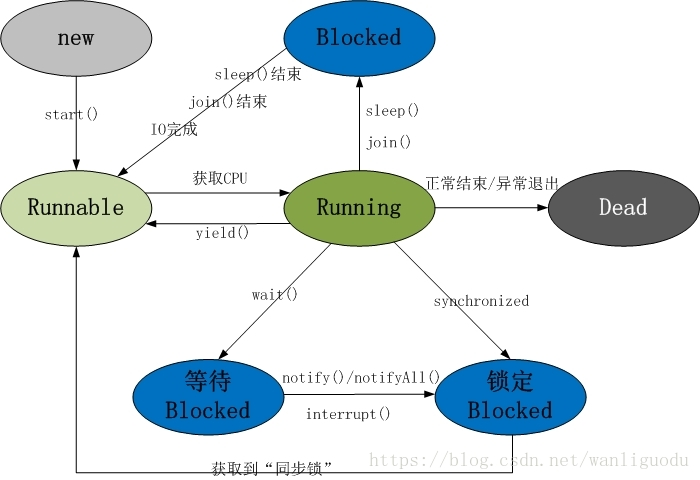
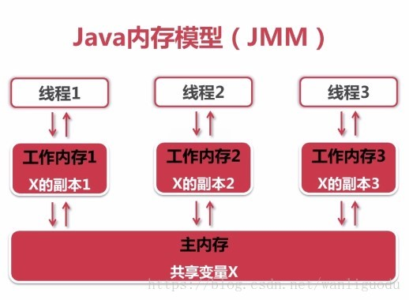

# 多线程基础

[TOC]

## 并行与并发

### 概念

+ 并行：两个或多个事件在同一时刻发生
+ 并发：两个或多个事件在同一时间间隔内发生，即一段时间内宏观上有多个程序同时运行

并发可以解决阻塞问题。

### 进程与线程

进程是程序的一次执行，是进程实体的运行过程，是系统进行资源分配和调度的一个独立单位。

进程关注的是资源，而线程关注的是CPU。

进程是一个资源的容器，为进程里的所有线程提供共享资源。线程是计算机的最小的调度和运行单位。

## 基础概念

### 线程状态图



线程包括5种状态：

+ 新建(New)：线程对象被创建时，将会短暂地处于这种状态。此时它已经分配了必须的资源，并且执行了初始化。例如：`Thread thread=new Thread();`

+ 就绪(Runnable)：线程被创建后，其他线程调用了该对象的start方法，此时处于这种状态。处于这种状态的线程随时可能被CPU调度执行。

+ 运行(Running)：获取CPU执行。注意，线程只能从就绪状态进入运行状态。

+ 阻塞(Blocked)：暂时停止运行，直到线程进入就绪状态，才有机会转到运行状态。
+ 死亡(Dead)：线程执行完了或者因为异常退出了run方法，生命周期结束。

### 关键函数和关键字

在Object类中，定义了wait、notify、notifyAll等函数。

在Thread类中，定义了sleep、interrupt等函数。

以及synchronized关键字和以AQS为基础的各种锁。

## 常用的实现多线程的两种方式

### 概述

常用的实现多线程的两种方式：Thread和Runnable。此外还可以用线程池来实现多线程。

Runnable是一个接口，该接口包含一个run方法。Runnable具有更好的扩展性。Thread实现了Runnable接口。此外，Runnable还可以用于“资源共享”。即，多个线程都是基于某个Runnable对象建立的，它们会共享Runnable对象上的资源。

### 实现多线程实例

#### 定义任务（Runnable）

```java
public class RunnableTest {
    public static void main(String[] args) {
        //定义任务
        class MyRunnable implements Runnable {
            private int ticket = 10;

            @Override
            public void run() {
                for (int i = 0; i < 10; i++) {
                    if (this.ticket > 0) {
                        System.out.println(Thread.currentThread().getName() + "卖票：ticket " + this.ticket--);
                    }
                }
            }
        }
        
        
        MyRunnable myRunnable=new MyRunnable();
        Thread t1=new Thread(myRunnable);
        Thread t2=new Thread(myRunnable);
        Thread t3=new Thread(myRunnable);
        t1.start();
        t2.start();
        t3.start();
    }
}
```

t1、t2、t3基于同一个Runnable对象建立的，因此共享同一个ticket，但是要注意不是线程安全的。

#### 继承Thread

```java
public class ThreadTest {
    public static void main(String[] args){
        class MyThread extends Thread{
            private int ticket=10;

            @Override
            public void run() {
                for(int i=0; i<10; i++){
                    System.out.println(this.getName()+"买票:ticket "+ticket--);
                }
            }
        }
        MyThread t1=new MyThread();
        MyThread t2=new MyThread();
        MyThread t3=new MyThread();
        t1.start();
        t2.start();
        t3.start();
    }
}
```

各个Thread间不共享ticket。

## synchronized关键字

### 概述

所有对象都自动含有单一的锁（也称为监视器）。当在对象上调用其任意synchronized方法的时候，对象都被加锁，这时该对象上的其他synchronized方法只有等到前一个方法调用完毕并释放了锁之后才能被调用。

在Java中，每个对象有且仅有一个同步锁。这也意味着，同步锁是依赖于对象而存在的。当我们调用某个对象的synchronized方法时，就获得了该对象的同步锁，不同线程对同步锁的访问是互斥的。因为锁语句产生了一种互相排斥的效果，所以这种机制常常称为`互斥量（mutex）`。

### 基本原则和实例

#### 基本原则

+ 当一个线程访问某对象的synchronized方法或者synchronized代码块时，其他线程对该对象的该synchronized方法或者synchronized代码块的访问将被阻塞。
+ 当一个线程访问某对象的synchronized方法或者synchronized代码块时，其他线程仍然可以访问该对象的非同步代码块。
+ 当一个线程访问某对象的synchronized方法或者synchronized代码块时，其他线程对该对象的其他的synchronized方法或者synchronized代码块的访问将被阻塞。

#### 实例

```java
public static void main(String[] args) {
    // TODO Auto-generated method stub

    class MyRunnable implements Runnable{

        private int j=5;
        @Override
        public void run() {

            synchronized(this){
                for(int i=0;i<5;i++){
                    try {
                        Thread.sleep(100);
                        System.out.println(Thread.currentThread().getName()+" loop "+i);
                    } catch (InterruptedException e) {
                        // TODO Auto-generated catch block
                        e.printStackTrace();
                    }
                }
            }   
        }   
    }
    Runnable runnable = new MyRunnable();
    Thread t1 = new Thread(runnable,"t1");
    Thread t2 = new Thread(runnable,"t2");

    t1.start();
    t2.start();     
}
```
注意，synchronized作用的是同一对象，t1、t2都引用了同一个Runnable实例，因此它们间互斥。

另一个例子：

```java
/**
 * @param args
 */
public static void main(String[] args) {

    class MyThread extends Thread{
        public MyThread(String name){
            super(name);
        }
        @Override
        public void run() {
            synchronized(this){
                for(int i=0;i<10;i++){
                    try {
                        Thread.sleep(100);
                        System.out.println(Thread.currentThread().getName()+" loop "+i);
                    } catch (InterruptedException e) {
                        // TODO Auto-generated catch block
                        e.printStackTrace();
                    }
                }
            }
        }
    }
    Thread t1 = new MyThread("t1");
    Thread t2 = new MyThread("t2");
    t1.start();
    t2.start();
}
```
注意，这个例子中，有两个不同的MyThread实例对象，因此它们并不是互斥的。

### synchronized方法和synchronized代码块

#### 概述

**synchronized方法**是用synchronized修饰方法，这是一种**粗粒度锁**；这个同步方法（非static方法）无需显式指定同步监视器，同步方法的同步监视器是**this**，也就是调用该方法的对象。

**synchronized代码块**是用synchronized修饰代码块，这是一种**细粒度锁**。通常推荐使用可能被并发访问的共享资源充当同步监视器。

#### 实例

```java
public class SynchronizedTest {
    public static void main(String[] args) {
        class Demo {
            private long iteration = 100000;

            public synchronized void synMethod() {
                for (int i = 0; i < iteration; i++) {
                    for (int j = 0; j < iteration; j++)
                        ;
                }
            }

            public void synBlock() {
                synchronized (this) {
                    for (int i = 0; i < iteration; i++) {
                        for (int j = 0; j < iteration; j++)
                            ;
                    }
                }
            }
        }
        Demo demo = new Demo();
        long start, end;
        start = System.currentTimeMillis();
        demo.synMethod();
        end = System.currentTimeMillis();
        System.out.println("synMethod cost:" + (end - start));
        start = System.currentTimeMillis();
        demo.synBlock();
        end = System.currentTimeMillis();
        System.out.println("synBlock cost:" + (end - start));
    }
}
```

输出结果：

```bash
synMethod cost:4296
synBlock cost:3756
```

可知synchronized代码块可以更精确的控制冲突限制访问区域，有时候表现更高效率。

### 实例锁和全局锁

#### 概念

实例锁：锁在某个实例对象上。如果该类是单例，那么该锁也是具有全局锁的概念。实例锁对应的就是synchronized关键字。

全局锁：该锁针对的是类，无论实例多少个对象，那么线程都共享该锁。全局锁对应的就是static synchronized（或者是锁在该类的class或者classloader对象上）。

## volatile关键字

### Java内存模型



所有的变量都是存储在主内存中，每个线程都是独立的工作内存，里面保存该线程使用到的变量的副本。线程对共享共享变量的所有操作必须在自己的工作内存，不同线程之间无法直接访问其他线程工作内存中的变量，线程间变量值传递需要通过主内存来完成。例如，线程1对共享变量的修改，要想被线程2及时看到，必须经历如下两个过程：
（1）把工作内存1中更新过的变量刷新到主内存中。
（2）将主内存中最新的共享变量的值更新到线程2中。

### 基本概念

#### 可见性

指线程之间的可见性，一个线程修改状态对另一个线程是可见的。volatile修饰的变量就具有可见性。volatile修饰的变量不允许线程内部缓存和重排序，即直接修改内存。所以对其他线程是可见的。但是，volatile修饰的变量不具有原子性。比如 volatile int a = 0；之后有一个操作 a++；这个变量a具有可见性，但是a++ 依然是一个非原子操作，也就是这个操作同样存在线程安全问题。在Java中volatile、synchronized和final具有可见性。

#### 原子性

不可分割的操作。juc包提供的一些原子类AtomicXXX提供了原子操作。除此之外，synchronized和各种lock也能保证原子性。

#### 有序性

volatile、synchronized都可以保证线程之间操作的有序性。

volatile本身禁止指令重排。而synchronized只允许某一个时刻只有一个线程进行操作，自然是有序的。

### volatile原理

禁止缓存被volatile修饰的变量，只能直接修改内存。同时插入内存屏障指令禁止指令重排。

## 线程等待与唤醒

### 常用方法

以下为Object类中定义的方法：

| 方法                         | 说明                                                         |
| ---------------------------- | ------------------------------------------------------------ |
| notify()                     | 唤醒在此对象监视器上等待的单个线程                           |
| notifyAll()                  | 唤醒在此对象监视器上等待的所有线程                           |
| wait()                       | 让当前线程处于“等待（阻塞）状态”，“直到其他线程调用此对象的notify()方法或是notifyAll()方法”，当前线程被唤醒（进入“就绪状态”） |
| wait(long timeout)           | 让当前线程处于“等待（阻塞）状态”，“直到其他线程调用此对象的notify()方法或notifyAll()方法，或者超过指定的时间量”，当前线程被唤醒（进入“就绪状态”） |
| wait(long timeout,int nanos) | 让当前线程处于“等待(阻塞)状态”，“直到其他线程调用此对象的 notify() 方法或 notifyAll() 方法，或者其他某个线程中断当前线程，或者已超过某个实际时间量”，当前线程被唤醒(进入“就绪状态”) |

### wait与notify示例

```java
    public static void main(String[] args){
        WaitTest waitTest=new WaitTest();
        waitTest.test();
    }
    public void test() {

        class ThreadA extends Thread {

            public ThreadA(String name) {
                super(name);
            }

            @Override
            public void run() {
                synchronized (this) {
                    System.out.println(Thread.currentThread().getName() + " 正在执行");
                    System.out.println(Thread.currentThread().getName() + " 现在要执行， call notify()");
                    notify();
                    System.out.println(Thread.currentThread().getName() + " 正在执行后续处理工作...");
                    try {
                        Thread.sleep(1000);
                    } catch (InterruptedException e) {
                        e.printStackTrace();
                    }
                }

            }
        }

        ThreadA t1 = new ThreadA("t1");
        synchronized (t1) {
            //启动线程t1
            System.out.println(Thread.currentThread().getName() + " start t1");
            t1.start();
            try {
                //主线程等待t1通过 notify（）唤醒。
                System.out.println(Thread.currentThread().getName() + " wait()");
                //这里并不是指阻塞t1，而是阻塞当前线程，t1为wait的调用对象表示释放t1对象的监视器锁
                t1.wait();
                //如果调用this.wait()将会报错，因为并没有this对应的监视器锁，只有t1这个对象存在监视器锁
                //this.wait();
            } catch (InterruptedException e) {
                e.printStackTrace();
            }
            System.out.println(Thread.currentThread().getName() + " continue");
        }
    }
```

结果：

```shell
main start t1
main wait()
t1 正在执行
t1 现在要执行， call notify()
t1 正在执行后续处理工作...
main continue
```

首先，main获取t1的监视器锁，然后调用t1.start使其进入就绪状态，但此时t1是无法执行的，因为锁已经被main占有。当main调用wait函数时，释放了监视器锁，t1获取锁成功，开始执行，调用notify，将main线程唤醒（推测，唤醒后取竞争锁，失败，后进入类似AQS的竞争队列），然后t1执行完后释放锁，main竞争成功，继续执行。

> 注意，test函数中执行的t1.wait()，具体见代码解释

> 注意，带有超时机制的wait超时会被唤醒，但需要重新竞争锁！

## 线程让步与休眠

### 线程让步

yield()方法使当前线程让步，它能让当前线程由“运行状态”进入到“就绪状态”，从而让其他具有相同优先级的等待线程获取执行权；但是，并不能保证在当前线程调用yield()之后，其他具有相同优先级的线程就一定能获得执行权；也有可能是当前线程又进入到“运行状态”继续运行。

### yield()和wait()的比较

+ wait()是让线程由“运行状态”进入到“等待（阻塞）状态”，而yield()是让线程由“运行状态”进入到“就绪状态”。
+ wait()是会让线程释放它所持有的对象的同步锁，而yield()方法不会释放对象的同步锁。

### 线程休眠

sleep()方法定义在Thread类中，sleep()的作用是让当前线程休眠，即当前线程会从“运行状态”进入到“休眠（阻塞）状态”。sleep()会指定休眠时间，线程休眠的时间会大于/等于该休眠时间；在线程重新被唤醒时，它会由“阻塞状态”变成“就绪状态”，从而等待CPU的调度执行。

### sleep()和wait()的比较

wait()的作用是让当前的线程由“运行状态”进入到“等待（阻塞）状态”的同时，也会释放同步锁。

sleep()的作用是让当前线程由“运行状态”进入到“休眠（阻塞）”状态。

wait()会释放对象的同步锁，而sleep()则不会释放锁。

## join()方法和interrupted()方法

### join()

线程A调用线程B的方法join，A将挂起，直到线程B结束才被唤醒。

join实现是一个while循环判断对应线程是否存活，注意join方法被synchronized修饰。

对jion()方法的调用可以被中断，做法是在调用线程上调用interrupt()方法，这时需要用到try_catch子句。

除此之外还有超时机制的join。

### interrupted()方法

作用是中断线程。

- 本线程中断自身是被允许的，且"中断标记"设置为true
- 其它线程调用本线程的interrupt()方法时，会通过checkAccess()检查权限。这有可能抛出SecurityException异常。
	- 若线程在阻塞状态时，调用了它的interrupt()方法，那么它的“中断状态”会被清除并且会收到一个InterruptedException异常。
		- 例如，线程通过wait()进入阻塞状态，此时通过interrupt()中断该线程；调用interrupt()会立即将线程的中断标记设为“true”，但是由于线程处于阻塞状态，所以该“中断标记”会立即被清除为“false”，同时，会产生一个InterruptedException的异常。
	- 如果线程被阻塞在一个Selector选择器中，那么通过interrupt()中断它时；线程的中断标记会被设置为true，并且它会立即从选择操作中返回。
	- 如果不属于前面所说的情况，那么通过interrupt()中断线程时，它的中断标记会被设置为“true”。

> 注意，AQS中的await方法可以被中断，而Object的wait方法被中断时会抛出异常。

### interrupted()方法

判断的是当前线程是否处于中断状态。是类的静态方法，同时会清除线程的中断状态。

### isInterrupted()方法

判断调用线程是否处于中断状态 。

## 线程终止的方式

Thread中的stop()和suspend()方法，由于固有的不安全性，已经不建议使用。下面，通过讨论线程在“阻塞状态”和“运行状态”的终止方式，然后在总结一个通用的方式。

### 终止处于“阻塞状态”的线程

通常，我们通过“中断”方式终止处于“阻塞状态”的线程。当线程由于被调用了sleep()，wait()，join()等方法而进入阻塞状态；若此时调用线程的interrupt()将线程的中断标记设为true。由于处于阻塞状态，中断标记会被清除，同时产生InterruptedException异常。将InterruptedException放在适当的位置就能终止线程，形如：

```java
@Override
public void run() {
    try {
        while (true) {
            // 执行任务...
        }
    } catch (InterruptedException ie) {  
        // 由于产生InterruptedException异常，退出while(true)循环，线程终止！
    }
}
```

如果不把catch放在while外面，放在里面需要额外的退出操作：

```java
@Override
public void run() {
    while (true) {
        try {
            // 执行任务...
        } catch (InterruptedException ie) {  
            // InterruptedException在while(true)循环体内。
            // 当线程产生了InterruptedException异常时，while(true)仍能继续运行！需要手动退出
            break;
        }
    }
}
```

### 终止处于“运行状态”的线程

通常，我们通过“标记”方式终止处于“运行状态”的线程。其中包括“中断标记”和“额外添加标记”。

#### 通过“中断标记”终止

```java
@Override
public void run() {
    while (!isInterrupted()) {
        // 执行任务...
    }
}
```

> 注意：interrupt()并不会终止处于“运行状态”的线程，它会将线程的中断标记设为true。

#### 通过“额外添加标记”终止

```java
private volatile boolean flag= true;
protected void stopTask() {
    flag = false;
}

@Override
public void run() {
    while (flag) {
        // 执行任务...
    }
}
```

综合线程处于“阻塞状态”和“运行状态”的终止方式，比较通用的终止线程的形式如下：

```java
@Override
public void run() {
    try {
        // 1. isInterrupted()保证，只要中断标记为true就终止线程。
        while (!isInterrupted()) {
            // 执行任务...
        }
    } catch (InterruptedException ie) {  
        // 2. InterruptedException异常保证，当InterruptedException异常产生时，线程被终止。
    }
}
```

## 线程优先级和守护线程

​		Java中线程的优先级的范围是1~10，默认的优先级为5。“高优先级线程”会优先于“低优先级线程”执行。而且Java中有两种线程：用户线程和守护线程。可以通过isDeamon()方法来区别它们：如果返回false，则说明该线程是“用户线程”；否则就是“守护线程”。用户线程一般用户执行用户级任务，而守护线程也就是“后台线程”，一般用来执行后台任务。需要注意的是：JVM在“用户线程”都结束后会退出。
​		每个线程都有一个优先级。“高优先级线程”会优先于“低优先级线程”执行。每个线程都可以被标记为一个守护进程或非守护进程。在一些运行的主线程中创建新的子线程时，子线程的优先级被设置为等于“创建它的主线程的优先级”，当且仅当“创建它的主线程是守护线程”时“子线程才会是守护线程”。

当Java虚拟机启动时，通常有一个单一的非守护线程（该线程通过是通过main()方法启动）。JVM会一直运行直到下面的任意一个条件发生，JVM就会终止运行：
(1) 调用了exit()方法，并且exit()有权限被正常执行。
(2) 所有的“非守护线程”都死了(即JVM中仅仅只有“守护线程”)。