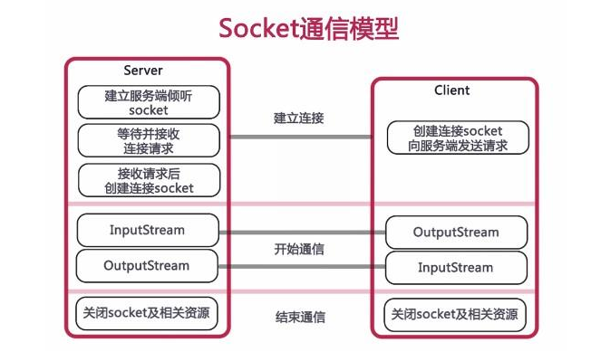

# 知识点

[TOC]

## 概述

网络编程就是编写程序使互联网的两个（或多个）设备（如计算机）之间进行数据传输。

## 网络分层

### 网络体系结构

网络通信的不同方面被分解为多个层，层与层之间用接口连接。通信的双方具有相同的层次，层次实现的功能由协议数据单元（PDU）来描述。不同系统中的同一层构成对等层，对等层之间通过对等层协议进行通信。

计算机网络体系结构是计算机网络层次和协议的集合，网络体系结构对计算机网络实现的功能，以及网络协议、层次、接口和服务进行了描述，但并不涉及具体的实现。接口是同一节点内相邻层之间交换信息的连接处，也叫服务访问点（SAP）。

国际标准化组织ISO在现有网络的基础上，提出了不基于具体机型、操作系统或公司的网络体系结构，称为开放系统互连参考模型，即OSI/RM。

美国国防部提出了TCP/IP协议栈参考模型，简化了OSI参考模型，由于TCP/IP协议栈的简单，获得了广泛的应用，并成为后续因特网使用的参考模型。

#### OSI模型

OSI模型把网络通信的工作分为7层，分别是物理层、数据链路层、网络层、传输层、会话层、表示层和应用层。

+ 物理层

	物理层涉及通信信道上传输的原始比特流（bits）。

+ 数据链路层

	将网络层下交的ip数据报组装成帧，在两个相邻的结点上传输帧。接受数据时，需要提取数据部分，上交给网络层。

	这层主要的功能为：链路管理、组装成帧、差错控制、流量控制。（成帧就是定义规则界定边界）

+ 网络层

	负责分组交换网上的不同主机提供通信服务。发送数据时将报文段或数据报封装成分组或包进行传送。在TCP/IP体系中，网络层使用的是IP协议，因此分组也叫IP数据报。

	网络层涉及源主机节点到目的主机节点之间可靠的网络传输。

	主要功能：路由选择、网络寻址、流量控制、拥塞控制、网络互连等。

+ 传输层

	负责向两台主机中进程之间的通信提供通用的数据传输服务。“通用”指多种应用可以使用同一个传输层服务。

	传输层需要解决跨越网络连接的建立和释放，对底层不可靠的网络，建立连接时需要三次握手，释放连接时需要四次挥手。

	主要有两种协议：

	+ 传输控制协议TCP(Transmission Control Protocol)
	+ 用户数据报协议UDP（User Datagram Protocol）

+ 会话层和表示层

	会话层的主要功能是负责应用程序之间建立、维持和中断会话，提供单工、半双工、全双工3种不同的通信方式。

	表示层关心信息格式定义，提供字符代码、数据格式、控制信息格式、加密等的统一表示。

+ 应用层

	通过应用进程间的交互完成特定的网络应用。如DNS、HTTP、SMTP（电子邮件）等等。

#### TCP/IP模型

四层：网络接口层、网络层（IP层）、传输层（TCP层）、应用层。

+ 网络接口层
+ 网络层（IP层），协议栈的核心：
	+ IPv4：ARP（解析IP地址得到MAC地址）、IGMP（IP组播成员管理）、ICMP（检测IP包的运输是否出错如丢弃什么的）
	+ IPv6：ND（邻居发现协议，发现其他结点和地址，确定可达性）、MLD（组播侦听发现协议）、ICMPv6
+ 传输层（TCP层）：TCP、UDP
+ 应用层：HTTP、FTP、SMTP（电子邮件）、DNS、RIP（路由选择，基于UDP）、SNMP（管理网络节点）

## 网络协议

网络协议之间的关系如下：

### IP协议（Internet protocol）

IP协议的作用在于把各种数据包准备无误的传递给对方，其中两个重要的条件是IP地址和MAC地址。由于IP地址是稀有资源，不可能每个人都拥有一个IP地址，所以我们通常的IP地址是路由器给我们生成的IP地址，路由器里面会记录我们的MAC地址。而MAC地址是全球唯一的。IP地址采用的IPv4格式，目前正在向IPv6过渡。

### TCP协议（Transmission Control Protocol）

面向连接的传输层协议，采用字节流传输数据。

#### TCP的报文格式

TCP报文段包括协议首部和数据两部分，协议首部的固定部分是20个字节，首部的固定部分后面是选项部分。

#### 三次握手

TCP是面向连接的协议，因此每个TCP连接都有3个阶段：连接建立、数据传送和连接释放。连接建立经历三个步骤，通常称为“三次握手”。

1、第一次握手（客户端发送请求）

​	客户机发送连接请求报文段到服务器，并进入SYN_SENT状态，等待服务器确认。发送连接请求报文段内容：SYN=1，seq=x；SYN=1意思是一个TCP的SYN标志位置为1的包，指明客户端打算连接的服务器的端口；seq=x表示客户端初始序号x，保存在包头的序列号（Sequence Number）字段里。

2、第二次握手（服务器回传确认）

 	服务器收到客户端连接请求报文，如果同意建立连接，向客户机发回确认报文段（ACK）应答，并为该TCP连接分配TCP缓存和变量。服务器发回确认报文段内容：SYN=1，ACK=1，seq=y，ack=x+1；SYN标志位和ACK标志位均为1，同时将确认序号（Acknowledgement Number）设置为客户的ISN加1，即x+1；seq=y为服务端初始序号y。

3、第三次握手（客户端回传确认）

​	客户机收到服务器的确认报文段后，向服务器给出确认报文段（ACK），并且也要给该连接分配缓存和变量。此包发送完毕，客户端和服务器进入ESTABLISHED（TCP连接成功）状态，完成三次握手。客户端发回确认报文段内容：ACK=1，seq=x+1，ack=y+1；ACK=1为确认报文段；seq=x+1为客户端序号加1；ack=y+1,为服务器发来的ACK的初始序号字段+1。

> 注意：握手过程中传送的包里不包含数据，三次握手完毕后，客户端与服务器才正式开始传送数据！

#### 四次挥手

 由于TCP连接是全双工的，因此每个方向都必须单独进行关闭。这原则是当一方完成它的数据发送任务后就能发送一个FIN来终止这个方向的连接。收到一个FIN只意味着这一方向上没有数据流动，一个TCP连接在收到一个FIN后仍能发送数据。首先进行关闭的一方将执行主动关闭，而另一方执行被动关闭。

1、TCP客户端发送一个FIN，用来关闭客户端到服务端的数据传送，客户端进入FIN_WAIT_1状态。发送报文段内容：FIN=1，seq=u；FIN=1表示请求切断连接；seq=u为客户端请求初始序号。

2、服务端收到这个FIN，它发回一个ACK给客户端，确认序号为收到的序号加1。和SYN一样，一个FIN将占用一个序号；服务端进入CLOSE_WAIT状态。发送报文段内容：ACK=1，seq=v，ack=u+1；ACK=1为确认报文；seq=v为服务器确认初始序号；ack=u+1为客户端初始序号加1。

3、 服务器关闭客户端的连接后，发送一个FIN给客户端，服务端进入LAST_ACK状态。发送报文段内容：FIN=1，ACK=1，seq=w，ack=u+1；FIN=1为请求切断连接，ACK=1为确认报文，seq=w为服务端请求切断初始序号。

4、 客户端收到FIN后，客户端进入TIME_WAIT状态，接着发回一个ACK报文给服务端确认，并将确认序号设置为收到序号加1，服务端进入CLOSED状态，完成四次挥手。发送报文内容：ACK=1，seq=u+1，ack=w+1；ACK=1为确认报文，seq=u+1为客户端初始序号加1，ack=w+1为服务器初始序号加1。

> 为什么连接的时候是三次握手，关闭的时候却是四次挥手？
>
> 因为当服务端收到客户端的SYN连接请求报文后，可以直接发送SYN+ACK报文。其中ACK报文是用来应答的，SYN报文是用来同步的。但是关闭连接时，当服务端收到FIN报文时，很可能并不会立即关闭socket，所以只能先回复一个ACK报文，告诉客户端，“你发的FIN报文，我收到了”。只有等到服务端所有的报文都发送完了，我才能发送FIN报文，因此不能一起发送，故需要四步挥手。

### UDP协议（User Datagram Protocol）

+ UDP是一个非连接的协议，传输数据之前源端和终端不建立连接，当它想传送时就简单地去抓取来自应用程序的数据，并尽可能快地把它扔到网络上。在发送端，UDP传送数据的速度仅仅是受应用程序生成数据的速度、计算机的能力和传输带宽的限制；在接收端，UDP把每个消息段放在队列中，应用程序每次从队列中读一个消息段。
+ 由于传输数据不建立连接，因此也就不需要维护连接状态，包括收发状态等，因此一台服务器可同时向多个客户端传输相同的消息。
+ UDP信息包的首部很短，只有8个字节，相对于TCP的20个字节信息包的额外开销很小。
+ 吞吐量不受拥挤控制算法的调节，只受应用软件生成数据的速率、传输带宽、源端和终端主机性能的限制。
+ UDP使用尽量最大努力交付，即不保证可靠交付，因此主机不需要维持复杂的链接状态表。
+ UDP是面向报文的。发送方的UDP对应用程序交下来的报文，在添加首部后就向下交付给IP层。既不拆分，也不合并，而是保留这些报文的边界，因此，应用程序需要选择合适的报文大小。

#### TCP和UDP的区别

+ TCP基于连接，UDP是无连接的；
+ 对系统资源的要求，TCP较多，UDP较少；
+ UDP程序结构较简单；
+ TCP是流模式，而UDP是数据报模式；
+ TCP保证数据正确性，而UDP可能丢包；TCP保证数据顺序，而UDP不保证；

### HTTP协议（Hypertext Transfer Protocol）

超文本传输协议，一种应用层协议，它是基于TCP协议之上的请求/响应式的协议。HTTP协议是Web浏览器和Web服务器之间通信的标准协议。

对于从客户端到服务器的每一个请求，都有4个步骤：

1、默认情况下，客户端在端口80打开与服务器的一个TCP连接，URL中还可以指定其他端口。

2、客户端向服务器发送消息，请求指定路径上的资源。这个资源包括一个首部，可选地（取决于请求的性质）还可以有一个空行，后面是这个请求的数据。

3、服务器向客户端发送响应。响应以响应码开头，后面是包含数据的首部、一个空行以及所请求的文档或错误消息。

4、服务器关闭连接。

现在使用的HTTP协议是HTTP/1.1版本，1997年之前采用的是HTTP1.0版本。HTTP连接在1.0版本中采用非持续连接工作方式，1.1版本采用的是持续连接工作方式，持续连接是指服务器在发送响应后仍然在一段时间内保持这条由TCP运输层协议建立起来的连接，使客户端和服务器可以继续在这条连接上传输HTTP报文。

是否采用持续连接工作方式，1.0中默认是关闭的，需要在HTTP头加入“Connection:Keep-Alive”，才能启用Keep-Alive。HTTP1.1中默认启用Keep-Alive，如果加入“Connection:close”，才关闭。目前大部分浏览器都是用HTTP1.1协议，也就是说默认都会发起Keep-Alive的连接请求了，所以是否能完成一个完整的Keep-Alive连接就看服务器设置情况。

#### HTTP请求报文

HTTP请求报文由请求行、首部行和实体主体组成，由浏览器发送给服务器。上面这张图中SP表示空格，cr lf表示回车和换行。下图是谷歌浏览器内访问服务器查看的HTTP请求例子：

#### HTTP响应报文

上面这张图是HTTP响应报文，它由**状态行、首部行和实体主体**组成。下图为HTTP响应报文例子：

#### HTTP请求方法和响应状态码

| 方法    | 含义                            |
| ------- | ------------------------------- |
| OPTION  | 请求一些选项的信息              |
| GET     | 请求读取由URL所标志的信息       |
| HEAD    | 请求读取由URL所标志的信息的首部 |
| POST    | 给服务器添加信息                |
| PUT     | 在指明的URL下存储一个文档       |
| DELETE  | 删除URL指明的资源               |
| TRACE   | 进行环回测试的请求报文          |
| CONNECT | 用于代理服务器                  |

下表是状态码，总共5大类，33种。

| 状态码 | 含义       | 例子                                 |
| ------ | ---------- | ------------------------------------ |
| 1xx    | 通知信息   | 请求收到了，正在处理                 |
| 2xx    | 成功       | 接受或知道了                         |
| 3xx    | 重定向     | 表示要完成的请求还要采取进一步的动作 |
| 4xx    | 客户端错误 | 请求中有语法错误或不能完成           |
| 5xx    | 服务器错误 | 服务器失效，无法响应完成请求         |

具体的状态码可以前往[HTTP 响应代码](https://developer.mozilla.org/zh-CN/docs/Web/HTTP/Status)查看。下面列出一些常用的状态码：

| 状态码                    | 含义                                                         |
| ------------------------- | ------------------------------------------------------------ |
| 200 OK                    | 请求成功。成功的含义取决与HTTP方法： GET：资源已被提取并在消息正文中传输 HEAD：实体标头位于消息正文中 POST：描述动作结果的资源在消息体中传输 TRACE：消息正文包含服务器收到的请求消息 |
| 201 Created               | 请求成功，并因此创建了一个新的资源。这通常是POST或某些PUT请求之后返回的响应。 |
| 204 No Content            | 服务器成功处理了请求，但不需要返回任何实体内容。             |
| 206 Partial Content       | 客户端请求一部分资源，服务端成功响应，返回一范围资源。       |
| 300 Multiple Choice       | 用户或浏览器能够自行选择一个首选的地址进行重定向。           |
| 301 Multiple Choice       | 被请求的资源已永久移动到新位置，并且将来任何对此资源的引用都应该使用本响应返回的若干个 URI 之一。 |
| 302 Found                 | 请求的资源现在临时从不同的 URI 响应请求。                    |
| 303 See Other             | 对应当前请求的响应可以在另一个 URI 上被找到，而且客户端应当采用 GET 的方式访问那个资源。 |
| 304 Not Modified          | 如果客户端发送了一个带条件的 GET 请求且该请求已被允许，而文档的内容（自上次访问以来或者根据请求的条件）并没有改变，则服务器应当返回这个状态码。用于告诉客户端使用本地缓存。 |
| 307 Temporary Redirect    | 与302一个意思                                                |
| 400 Bad Request           | 1、语义有误，当前请求无法被服务器理解。除非进行修改，否则客户端不应该重复提交这个请求。 2、请求参数有误。 |
| 401 Unauthorized          | 当前请求需要用户验证。                                       |
| 403 Forbidden             | 服务器拒绝执行。                                             |
| 404 Not Found             | 请求失败，请求所希望得到的资源未被在服务器上发现。           |
| 500 Internal Server Error | 服务端执行请求时发生了错误。                                 |
| 503 Service Unavailable   | 服务器没有准备好处理请求。 常见原因是服务器因维护或重载而停机。 |

#### HTTP和HTTPS的区别

HTTPS，是以安全为目标的HTTP通道，简单来说就是HTTP的安全版。即HTTP下加入SSL层，HTTPS的安全基础是SSL，因此加密的详细内容就需要SSL。它是一个URL scheme（抽象标识符体系），句法类同http:体系，用于安全的HTTP数据传输。https:URL表明它使用了HTTPS，但HTTPS存在不同于HTTP的默认端口及一个加密/身份验证层（在HTTP与TCP之间）。

HTTP协议以明文方式发送内容，不提供任何方式的数据加密，如果攻击者截取了Web浏览器和网站服务器之间的传输报文，就可以直接读懂其中的信息，因此HTTP协议不适合传输一些敏感信息，比如信用开号、密码等。

为了解决HTTP协议的这一缺陷，需要使用另一种协议：安全套接字层超文本传输协议HTTPS。为了数据传输的安全，HTTPS在HTTP的基础上加入了SSL协议，SSL依靠证书来验证服务器的身份，并为浏览器和服务器之间的通信加密。

HTTPS和HTTP的区别主要为以下四点：

- https协议需要到ca申请证书，一般免费证书很少，需要缴费。
- http是超文本传输协议，信息是明文传输，https则是具有安全性的ssl加密传输协议。
- http和https使用的是完全不同的连接方式，用的端口也不一样，前者是80，后者是443。
- http的连接很简单，是无状态的；https协议是有ssl+http协议构建的可进行加密传输、身份认证的网络协议，比http协议安全。

## Java Socket网络编程

### Socket概述

Socket是支持TCP/IP协议的网络通信的基本操作单元。它是网络通信过程中端点的抽象表示，包含进行网络通信必须的五种信息：连接使用的协议、本地主机的IP地址、本地进程的协议端口、远程主机的IP地址、远程进程的协议端口。

Socket，实际上是对TCP/IP协议的封装，Socket本身并不是协议，而是一个调用接口（API），通过Socket，我们才能使用TCP/IP协议。实际上，Socket跟TCP/IP协议没有必然的关系，Socket编程接口在设计的时候，就希望也能适应其他的网络协议。所以说，Socket的出现，只是使得程序员更方便地使用TCP/IP协议栈而已，是对TCP/IP协议的抽象，从而形成了我们知道的一些最基本的函数接口，比如create、listen、accept、send、read和write等等。网络有一段关于socket和TCP/IP协议关系的说法比较容易理解：

### Socket整体流程

Socket编程主要涉及到客户端和服务端两个方面，首先是在服务器端创建一个服务器套接字（ServerSocket），并把它附加到一个端口上，服务器从这个端口监听连接。端口号的范围是0到65536，但是0到1024是为特权服务保留的端口号，我们可以选择任意一个当前没有被其他进程使用的端口。

客户端请求与服务器进行连接的时候，根据服务器的域名或者IP地址，加上端口号，打开一个套接字。当服务器接受连接后，服务器和客户端之间的通信就像输入输出流一样进行操作。

