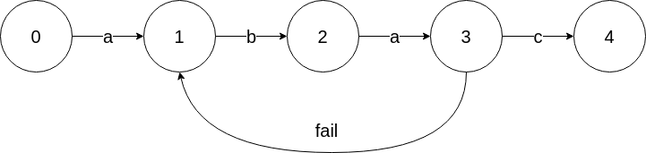

# KMP自动机

假设pat表示模式串，txt表示文本串。

下图为模式串abac的示意图。




```java
状态从0开始编号，字符串从0开始编号;
dp[i][c]=j表示状态i接受字符c后转移至状态j;
fail[i]=j表示状态i匹配失败后回溯至j;
当到达末状态时，表示匹配成功;
在状态i上需接受txt[i]才能转移至状态i+1;
那么在失败的情况下有以下关系：
    fail[i+1]=dp[fail[i]][pat[i]];
	dp[i+1][c]=dp[fail[i+1]][c];
注意到:
fail[x]<=fail[y], x>y;
dp[x]<=dp[y], x>y;
fail[x]<=dp[y], x>y;
dp[x]<=fail[y], x=y;
其中，<=表示赋值;
因此fail和dp数组可以求出;
```

```java
int[] fail = new int[100];
int[][] dp = new int[100][256];

String txt = "ababedfaabcedfabcab";
String pat = "abcedfabc";

void getFailAndDp() {
    fail[1] = 0;
    for (int c = 0; c < 256; c++) {
		if (pat.charAt(0) == c) dp[0][c] = 1;
		else dp[0][c] = 0;
	}
	for (int i = 1; i < pat.length(); i++) {
		for (int c = 0; c < 256; c++) {
			if (pat.charAt(i) == c) dp[i][c] = i + 1;
			else dp[i][c] = dp[fail[i]][c];
		}
		fail[i + 1] = dp[fail[i]][pat.charAt(i)];
	}
}

int search() {
	int status = 0;
	for (int i = 0; i < txt.length(); i++) {
		status = dp[status][txt.charAt(i)];
		if (status == pat.length()) return i - pat.length() + 1;
	}
	return -1;
}
```

