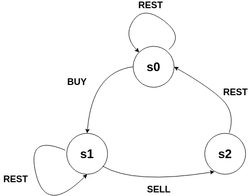

# Best Time to Buy and Sell Stock with Cooldown

### 问题

输入一个数组`prices[1...n]`，表示第`i`天股票的价格。你最多拥有一股，买进后只有卖出才能继续买进。卖出有冷却时间，卖出的第二天无法买进。求最大的利润。

### 解决方案：dp，时间复杂度$O(n)$，空间复杂度$O(n)$



由上图可得：

`s0[i]=max(s0[i-1], s2[i-1])`

`s1[i]=max(s0[i-1]-prices[i], s1[i-1])`

`s2[i]=s1[i-1]+prices[i]`

`s0[i]`表示第i次操作在`s0`上的状态

初始化`s0[0]=0; s1[0]=-prices[0], s2[0]=Integer.MIN_VALUE`

```java
class Solution {
    public int maxProfit(int[] prices) {
        if(prices==null||prices.length==0) return 0;
        int[] s0=new int[prices.length];
        int[] s1=new int[prices.length];
        int[] s2=new int[prices.length];
        s0[0]=0;
        s1[0]=-prices[0];
        s2[0]=Integer.MIN_VALUE;
        for(int i=1; i<prices.length; i++){
            s0[i]=Math.max(s0[i-1], s2[i-1]);
            s1[i]=Math.max(s0[i-1]-prices[i], s1[i-1]);
            s2[i]=s1[i-1]+prices[i];
        }
        return Math.max(s0[prices.length-1], s2[prices.length-1]);
    }
}
```

