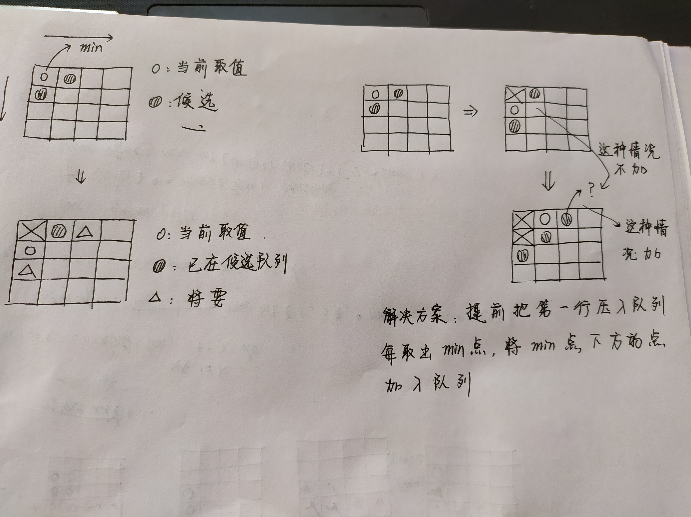

# Find K Pairs with Smallest Sums

### 问题

现有两组升序的数组`nums1`，`nums2`，定义一对数`(u,v)`，其中`u`属于`nums1`，`v`属于`nums2`。找到最小和的`k`对数。

### 解决方案：优先队列



```java
class Solution {
    public List<List<Integer>> kSmallestPairs(int[] nums1, int[] nums2, int k) {
        List<List<Integer>> ans=new ArrayList<>();
        if(nums1==null||nums2==null||nums1.length==0||nums2.length==0) return ans;
        PriorityQueue<int[]> queue=new PriorityQueue<>(
            (a,b)->nums1[a[0]]+nums2[a[1]]-nums1[b[0]]-nums2[b[1]]
        );
        for(int i=0; i<nums1.length&&i<k; i++){
            queue.offer(new int[]{i, 0});
        }
        while(k-->0&&!queue.isEmpty()){
            int[] cur=queue.poll();
            List<Integer> list=new ArrayList<>();
            list.add(nums1[cur[0]]);
            list.add(nums2[cur[1]]);
            ans.add(list);
            if(cur[1]==nums2.length-1) continue;
            queue.offer(new int[]{cur[0], cur[1]+1});
        }
        return ans;
    }
}
```

