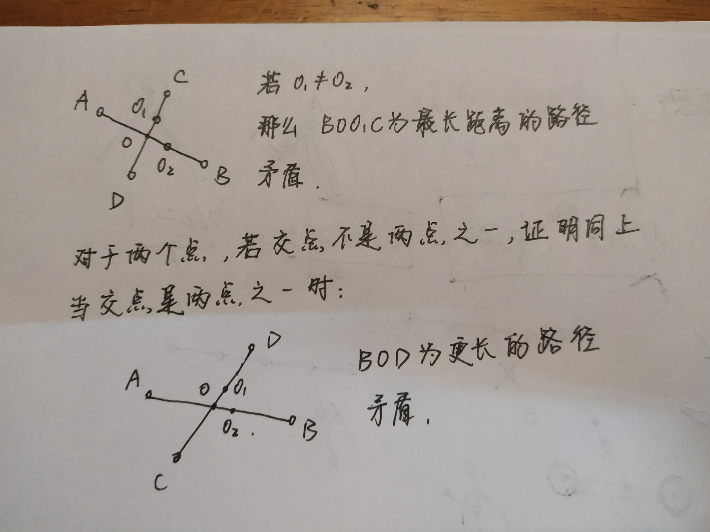

# Minimum Height Trees

### 问题

输入一个树，要求出结点索引，使得以它们为根的树的高度最小

### 解决方案一：bfs,时间复杂度$O(n)$，空间复杂度$O(n)$ 

只要找到图中最长的一条路径，返回路径的中间值（1个或两个）即可。

注意，只需要找到其中一条即可，任意两条的最长路径的中间值都相等，证明如下图所示。

至于如何找最长路径，首先从任一点进行bfs，搜索到最远的断点x。之后对点x进行bfs，找到最远的点y。那么x与y是最远路径的两端点。



```java
class Solution {
    public List<Integer> findMinHeightTrees(int n, int[][] e) {
        if(e==null||e.length==0) return new ArrayList<>(){{add(0);}};
        List<Integer>[] edges=new List[n];
        for(int i=0; i<n; i++)
            edges[i]=new ArrayList<>();
        for(int i=0; i<e.length; i++){
            int u=e[i][0], v=e[i][1];
            edges[u].add(v);
            edges[v].add(u);
        }
        int[] d1=new int[n];
        int[] d2=new int[n];
        int[] pre=new int[n];
        Arrays.fill(d1, -1);
        Arrays.fill(d2, -1);
        Arrays.fill(pre, -1);
        bfs(0, edges, d1, pre);
        int x=0;
        for(int i=0; i<n; i++){
            if(d1[i]>d1[x]) x=i;
        }
        Arrays.fill(pre, -1);
        bfs(x, edges, d2, pre);
        int y=0;
        for(int i=0; i<n; i++){
            if(d2[i]>d2[y]) y=i;
        }
        List<Integer> list=new ArrayList<>();
        List<Integer> ans=new ArrayList<>();
        while(y!=-1){
            list.add(y);
            y=pre[y];
        }
        if(list.size()%2==0){
            ans.add(list.get(list.size()/2-1));
        }
        ans.add(list.get(list.size()/2));
        return ans;
    }
    void bfs(int start, List<Integer>[] e, int[] d, int[] pre){
        Queue<Integer> q=new LinkedList<>();
        q.offer(start);
        d[start]=0;
        pre[start]=-1;
        while(!q.isEmpty()){
            int cur=q.poll();
            for(int next:e[cur]){
                if(d[next]!=-1) continue;
                d[next]=d[cur]+1;
                pre[next]=cur;
                q.offer(next);
            }
        }
    }
}
```

### 解决方案二：缩点，时间复杂度$O(n)$，空间复杂度$O(n)$ 

考虑图中只有一条路径时，我们可以先确定两个叶结点，再同时将两个叶结点以一样的速度向里移动，当它们重合或相邻时，它们就是解。

当图变得复杂时，我们把思路扩展一下，维护一个集合，该集合全是叶子节点，因为叶子结点的度为1，我们把所有叶子结点消去，得到新的图，不断地迭代，最后剩一个结点或两个结点时就得到解了。

```java
public List<Integer> findMinHeightTrees(int n, int[][] edges) {
    if (n == 1) return Collections.singletonList(0);

    List<Set<Integer>> adj = new ArrayList<>(n);
    for (int i = 0; i < n; ++i) adj.add(new HashSet<>());
    for (int[] edge : edges) {
        adj.get(edge[0]).add(edge[1]);
        adj.get(edge[1]).add(edge[0]);
    }

    List<Integer> leaves = new ArrayList<>();
    for (int i = 0; i < n; ++i)
        if (adj.get(i).size() == 1) leaves.add(i);

    while (n > 2) {
        n -= leaves.size();
        List<Integer> newLeaves = new ArrayList<>();
        for (int i : leaves) {
            int j = adj.get(i).iterator().next();
            adj.get(j).remove(i);
            if (adj.get(j).size() == 1) newLeaves.add(j);
        }
        leaves = newLeaves;
    }
    return leaves;
}
```

