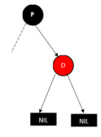
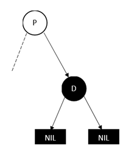
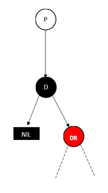
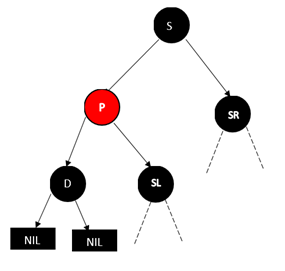
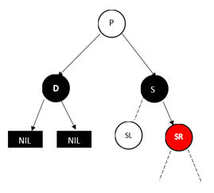
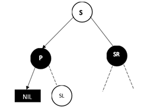
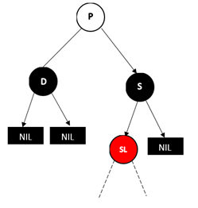
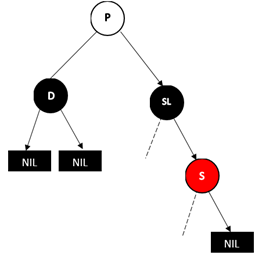
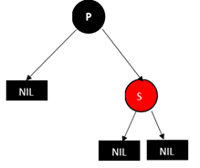
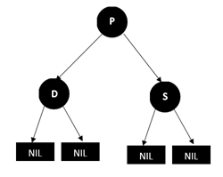

# 红黑树

[TOC]

## 定义

+ 每个节点或者是黑色，或者是红色
+ 根节点是黑色的
+ 每个叶子节点（NIL）是黑色的
+ 如果一个节点是红色的，那么其子节点是黑色的
+ 从一个节点到该节点的子孙节点的所有路径上包含相同数目的黑节点（确保没有一条路径会比其他路径长出两倍，确保相对平衡）

## 插入

需要注意，插入的结点初始颜色为红色。

如果插入的是根节点，那么将其染为黑色。

如果它的父节点是黑色，那么此时仍是红黑树。

### 其他情况：

情况一：如果当前节点的父节点是红色，叔叔节点是红色

情况二：如果当前节点的父节点是红色，叔叔节点是黑色，当前节点是右子

情况三：如果当前节点的父节点是红色，叔叔结点是黑色，当前节点是左子

在这些情况里，当前结点就是连续两个红色节点的靠下层的红色节点

#### 情况一

当前节点的父节点是红色，叔叔节点是红色：

N表示新插入的节点，P表示父节点，U表示叔叔结点，G表示祖父节点。

在这种情况，将P和U染成黑色，将G染成红色，当前结点变为G。情况转成第二种。

#### 情况二

当前节点的父节点是红色，叔叔节点是黑色，当前节点是右子。

这种情况，对当前结点的父节点进行左旋。

#### 情况三

当前节点的父节点是红色，叔叔结点是黑色，当前节点是左子。

这种情况，将父节点染黑，将祖父结点染红。对祖父结点进行右旋，最终恢复平衡：

## 删除

删除节点的情况从大的方面有二种：

+ 叶子节点（不是null节点，是在二叉排序树里的定义）
+ 只有右子树或左子树的节点

对于删除有左右子树的节点，可以将该节点的左子树的最大值A替换该节点（值替换，颜色不动），后删除A节点，递归删除，最终能转化成第二种情况。

考虑以下情况，除去一些非法情况（不符合红黑树的定义），图中D为需要删除的节点，P为父节点：

### 删除红色节点

#### 叶子节点

这种情况直接删除就好了。

#### 只有左子树或者右子树

这种情况不合法。因为红色节点的非null子节点必然是黑色的，那么左右两个路径上的黑色节点数必然不相同。

### 删除黑色节点

#### 叶子节点

这种情况非常复杂，后续再分类讨论。

#### 只有左子树或右子树

将DR染成黑色替换D即可。

### 删除黑色叶子节点

#### D的兄弟节点为红色

这种情况将P左旋，S染为黑色，P染为红色。这时，将转到“D的兄弟节点是黑色”这一种情况来处理。

#### 兄弟节点为黑色，远侄子节点为红色

白色表示任意颜色。

删除D后，将P左旋，将S染成P的颜色，将P染黑色，将SR染黑（因为黑色节点S代替了P，即除了值，位置、颜色都跟P一样，因此过S的路径少了一个黑色节点，因此需要将SR染黑）

#### 兄弟节点为黑色，远侄子节点为黑色，近侄子节点为红色

将S右旋，然后呼唤SL和S的颜色，就变成了“兄弟节点为黑色，远侄子节点为红色”这一情况了。

#### 父节点为红色，兄弟节点为黑色

这种情况下，兄弟节点的子节点必然是null节点。

此时将D删除，把P染黑，把S染红即可。

#### 父节点为黑色，兄弟节点为黑色

这种情况下，兄弟节点的子节点必然是null节点。

把D删除后，将S染红。虽然P的左右路径的黑色节点数相等，但是过P的路径上少了一个黑色节点。因此需要将P作为当前节点（只是不要删除P），向上进行调整，一直向上，直到新的当前节点为根节点。

## 与AVL树进行对比

（1）删除：对于平衡二叉树来说，在最坏情况下，需要维护从被删节点到根节点这条路径上所有节点的平衡性，旋转的量级是$O(logN)$。但是红黑树就不一样了，最多只需3次旋转就会重新平衡，旋转的量级是$O(1)$。

（2）保持平衡：平衡二叉树高度平衡，这也就意味着在大量插入和删除节点的场景下，平衡二叉树为了保持平衡需要调整的频率会更高。

> 注意：在大量查找的情况下，平衡二叉树的效率更高，也是首要选择。在大量增删的情况下，红黑树是首选。