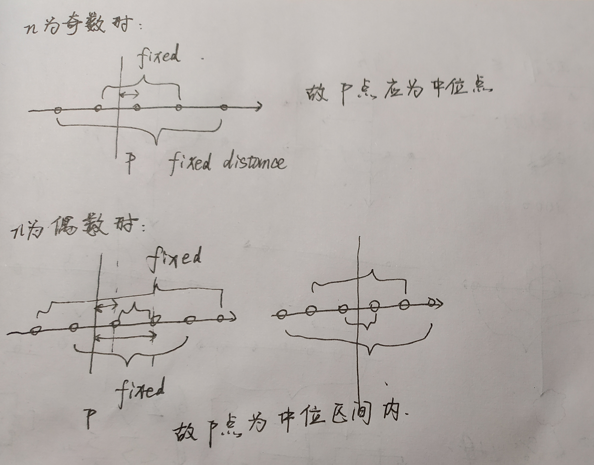

# Minimum Moves to Equal Array Elements II

### 问题

在数轴上有`n`个点，在数轴上找一点`p`，使得这n个点到`p`点的距离和最小，求该最小距离和。

### 解决方案：时间复杂度$O(nlogn)$，空间复杂度$O(1)$



```java
class Solution {
    public int minMoves2(int[] nums) {
        if(nums==null||nums.length==0) return 0;
        int n=nums.length;
        int ans=0;
        Arrays.sort(nums);
        for(int i=0; i<n/2; i++){
            ans+=nums[n-i-1]-nums[i];
        }
        return ans;
    }
}
```

