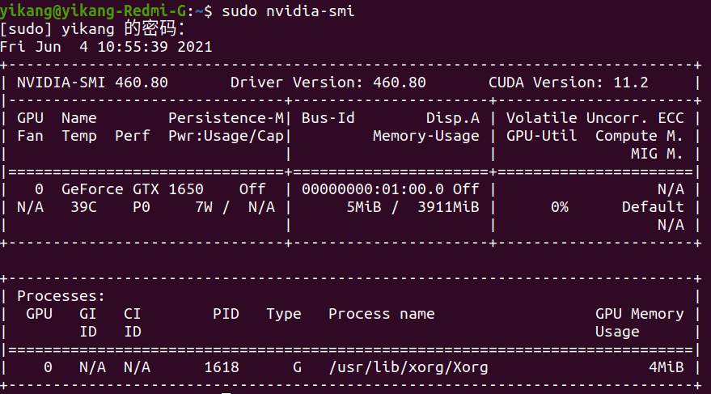
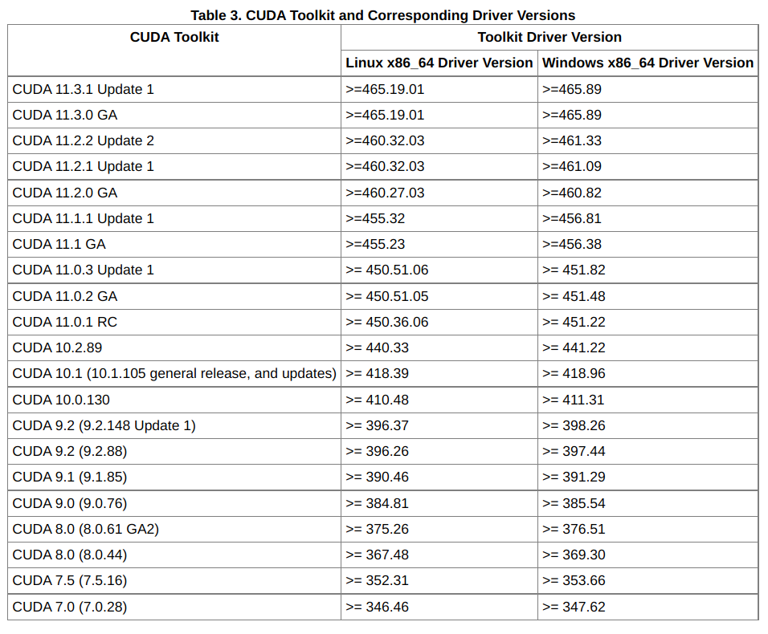
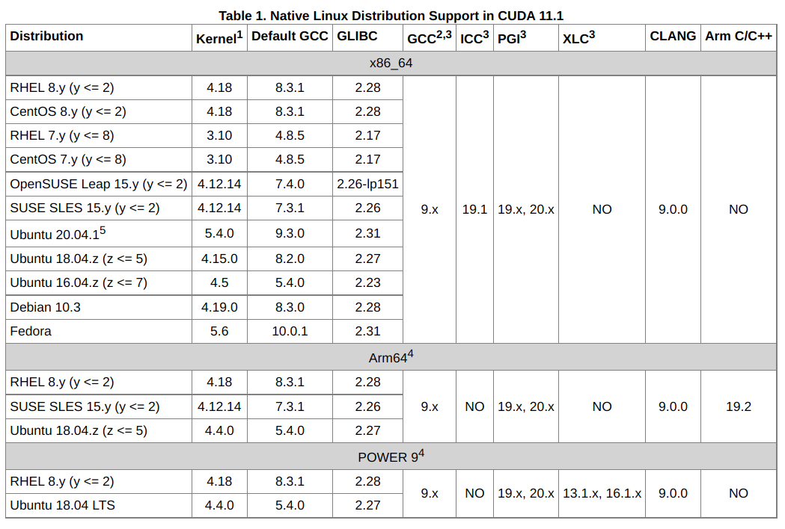
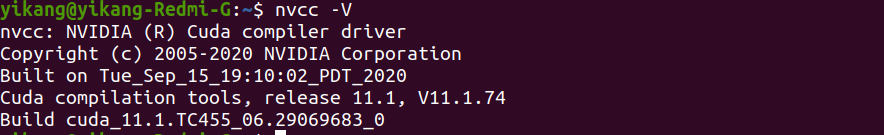
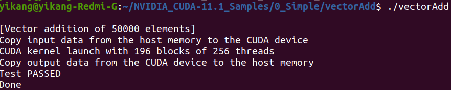

# pytorch

## conda安装

### 安装

去清华源下载x86_64的sh文件，在命令行中执行，进入安装流程。

conda默认安装在`/home/$USER/`下，注意在安装过程中会询问是否初始化（添加环境变量），选择no。安装成功后添加环境变量，将conda目录下的bin目录添加到环境变量中。

对于镜像，清华源的镜像不太管用，因此使用了默认源，如果已经添加了乱七八糟的源，可以使用以下命令重置：

```shell
conda config --remove-key channels
```

可以使用以下命令查看添加的源：

```shell
conda config --show channels
```

也可以查看`~/.condarc`文件。

conda环境管理命令：

```shell
conda env list
```

创建环境：

```shell
conda create -n 3.8.5 python=3.8.5
```

选择环境：

```shell
source activate 3.8.5
```

查看环境已有的安装包：

```shell
conda list
```

回到默认环境：

```shell
conda deactivate
```

删除虚拟环境：

```shell
conda remove -n nlp --all
```

## 驱动安装

首先检查显卡是否支持GPU运算：

```shell
ubuntu-drivers devices
```


部分系统可能识别不出model（即显卡型号），比如我这里并没有显示model的信息。

我们需要安装recommended字样的driver，在这里是nvidia-driver-460。

运行以下命令安装驱动：

```
sudo ubuntu-drivers autoinstall
```

也可以单独安装nvidia-driver-460：

```
sudo apt install nvidia-driver-460
```

> install的时候遇到了依赖问题，我是一个一个手动的安装所有的依赖。安装完所有的依赖之后，安装驱动的时候apt卸载了很多包，比如python、fcitx、chrome等等，一定要将他们装回来，因为不能保证卸了这些包系统不会崩溃。

可以使用以下命令判断驱动是否安装成功：

```
sudo nvidia-smi
```



## Cuda、Ubuntu、Driver间的版本对应关系

可以查看官网的release note：



cuda、ubuntu、gcc之间的关系可以在特定版本的cuda的cuda-installation-guide-linux文档中查看：



## 安装cuda

下载对应版本cuda的funfile，执行以下命令：

```shell
sudo sh cuda_<version>_linux.run
```

注意因为之前我们已经安装好了驱动，因此不需要安装驱动了。

安装成功后，更新环境变量：

```shell
export CUDA_HOME=/usr/local/cuda-11.1
export PATH=${CUDA_HOME}/bin:${CONDA_HOME}/bin:${SUBLIME_HOME}:${MAVEN_HOME}/bin:${JAVA_HOME}/bin:$PATH
export LD_LIBRARY_PATH=${CUDA_HOME}/lib64:${LD_LIBRARY_PATH}
```

```shell
source /etc/profile
# 测试cuda是否安装成功
nvcc -V
```



接下来是运行自带的sample，在运行sample之前，可能需要下载第三方库，可以到cuda-installation-guide-linux#Post-installation Action#Optional Actions#Install Third-party Libraries下查看：

```bash
sudo apt-get install g++ freeglut3-dev build-essential libx11-dev libxmu-dev libxi-dev libglu1-mesa libglu1-mesa-dev
```

编译运行sample：

```shell
cd ~/NVIDIA_CUDA-11.1_Samples/0_Simple/vectorAdd
make
./vectorAdd
```



## 安装cudnn

在官网找到对应的cuda版本。

执行以下命令：

```shell
tar -xvf cudnn-<version>.tgz
cd cuda
sudo cp lib64/* /usr/local/cuda/lib64/
sudo cp include/* /usr/local/cuda/include/
sudo chmod a+r /usr/local/cuda/include/cudnn.h /usr/local/cuda/lib64/libcudnn*
```

## 安装pytorch

到官网复制conda命令即可。

> conda顺便也把cuda安装了，系统一个cuda，虚拟环境一个cuda，之前装cuda的功夫白费了？
>
> conda源使用清华源和上交源，同时将协议由https改成http，conda命令中的-c ...注意去掉，不然不会经过国内的源。

## 安装jupyter notebook

```shell
conda install -c conda-forge notebook
```

