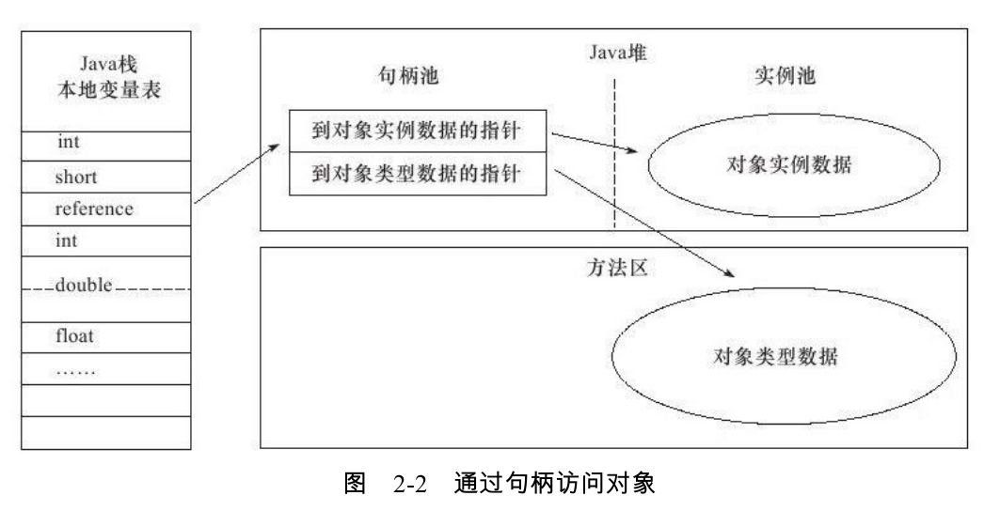

# Java内存区域与内存溢出异常

## 运行时数据区域

.png)

### 程序计数器

Java多线程是通过线程轮流切换并分配处理器执行时间的方式来实现的，在任何一个确定的时刻，一个处理器（对于多核处理器来说是一个内核）都只会执行一条线程中的指令。每条线程都有一个独立的程序计数器。这类内存区域被称为“线程私有”的内存。

如果线程正执行的是一个Java方法，这个计数器记录的是正在执行的虚拟机字节码指令地址；如果执行的是Native方法，这个计数器值则为空。此内存区域是唯一一个在Java虚拟机规范中没有规定任何`OutOfMemoryError`情况的区域。

### Java虚拟机栈

Java虚拟机栈也是线程私有的。每个方法在执行时都会创建一个栈帧用于存储局部变量表、操作数栈、动态链接、方法出口等信息。

局部变量表存放了编译器可知的各种基本数据类型、对象引用（ref类型，不等同于对象本身，可能是指针、句柄等）和returnAddress类型（指向了一条字节码指令的地址）。其中64位长度的long和double类型的数据会占用2个局部变量空间（slot），其余类型只占用1个。局部变量表所需的内存空间在编译期间完成分配，当进入一个方法时，这个方法需要在帧中分配多大的局部变量空间是完全确定的，在方法运行期间不会改变局部变量表的大小。

在该区域，定义有两种异常状况：

+ 如果线程请求的栈深度大于虚拟机所允许的深度，将抛出`StackOverflowError`
+ 如果虚拟机栈可以动态扩展（大部分可以），如果扩展时无法申请到足够的内存，就会抛出`OutOfMemoryError`

### 本地方法栈

虚拟机栈为虚拟机执行Java方法服务，而本地方法栈为虚拟机使用的Native方法服务。与虚拟机栈一样，也会抛出`StackOverflowError`和`OutOfMemoryError`异常。

### Java堆

Java堆是被所有线程共享的一块内存区域，所有的对象示例以及数组都要在堆上分配，但随着技术的发展，这也并不是那么“绝对”了。

Java堆是垃圾收集器管理的主要区域，因此被称为“GC堆”。从内存回收的角度看，由于现在都采用分代收集算法，所以Java堆中还可以细分为：新生代和老年代。从内存分配的角度看，线程共享的Java堆中可能划分出多个线程私有的分配缓冲区（Thread Local Allocation Buffer TLAB）。

Java堆可以选择固定大小，可扩展，可以处于物理上不连续的内存空间中，只要逻辑上是连续的即可。

如果在堆中没有内存完成实例分配，并且堆也无法再扩展时，将会抛出`OutOfMemoryError`异常。

### 方法区

方法区是各个线程共享的内存区域，用于存储已被虚拟机加载的类信息、常量、静态变量、即时编译器编译后的代码等数据。

方法区不需要连续的内存和可以选择固定大小或者可扩展，还可以选择不实现垃圾收集。这个区域的内存回收目标主要是针对常量池的回收和对类型的卸载。

当方法区无法满足内存分配需求时，将抛出`OutOfMemoryError`异常。

#### 运行时常量池

是方法区的一部分。`Class`文件中除了有类的版本、字段、方法、接口等描述信息外，还有一项信息是常量池，用于存放编译器生成的各种字面量和符号引用，这部分内容将在类加载后进入方法区的运行时常量池中存放。

运行时常量池对于`Class`文件常量池的另外一个重要特征是具备动态性，Java语言并不要求常量一定只有编译期才能产生，运行期间也可能把新的常量放入池中，例如这种特性被用于`String`类的`intern()`方法。

常量池无法再申请到内存时会抛出`OutOfMemoryError`。

## HopSpot例子

### 对象的创建

虚拟机遇到new指令时，首先将去检查这个指令的参数是否能在常量池中定位到一个类的引用，并且检查这个符号引用代表的类是否已被加载、解析和初始化过。如果没有，那必须先执行相应的类加载过程。

在类加载器检查通过后，接下来为对象分配内存。对象所需内存的大小在类加载器完成后便可完全确定。如果Java堆中的已用内存和可用内存分布两端，中间有指针作为分界点，这种分配方式为“指针碰撞”。如果内存不规整，那么需要维护一个列表，这种分配方式为“空闲列表”。Java堆是否规整由所采用的垃圾收集器是否带有压缩整理的功能决定。

当非常频繁地创建对象，在并发情况下可能不是线程安全的。有两种解决方法：

+ 对分配内存空间的动作进行同步处理——采用CAS配上失败重试的方式保证更新操作的原子性
+ 把内存分配的动作按照线程划分在不同的空间之中进行，即每个线程在Java堆中预先分配一小块内存，称为本地线程分配缓存（TLAB）。先在TLAB上分配内存，当TLAB用完并分配新的TLAB时，才需要同步锁定。虚拟机是否使用TLAB，可以通过`-XX:+/-UseTLAB`参数设定

内存分配完成后，虚拟机需要将分配到的内存空间都初始化为零值。

接下来，虚拟机要对对象进行必要的设置，例如这个对象是哪个类的实例、如何才能找到类的元数据信息、对象的哈希码、对象的GC分代年龄等信息。这些信息存放在对象的对象头（Object Header）中。

### 对象的内存布局

在HotSpot虚拟机中，对象在内存中存储的布局可以分为3块区域：对象头（Header）、实例数据（Instance Data）和对齐填充（Padding）。

HotSpot虚拟机的对象头包括两部分信息。第一部分用于存储对象自身的运行时数据，如哈希码、GC分代年龄、锁状态标志、线程持有的锁、偏向线程ID、偏向时间戳等；第二部分是类型指指针即对象指向它的类元数据的指针，虚拟机通过这个指针确定该对象是哪个类的实例。

接下来的实例数据部分是对象真正存储的有效信息，也是程序代码中所定义的各种类型的字段内容，如论是继承的还是自定义的。

最后的对齐填充仅仅起着占位符的作用。

### 对象的访问定位

Java程序需要通过栈上的reference数据来操作堆上的具体对象。对象访问方式取决于虚拟机实现而定的。目前主流的访问方式有使用句柄和直接指针两种：

+ 若使用句柄，那么Java堆中将会划分出一块内存来作为句柄池，ref中存储的就是对象的句柄地址，而句柄中包含了对象实例数据与类型数据各自的具体地址信息。

  

+ 若使用指针，那么Java堆对象的布局中就必须考虑如何放置访问类型数据的相关信息，而ref中存储的直接就是对象地址。

  

## 异常示例

以下示例均在HotSpot虚拟机的环境下进行。

### Java堆溢出

```java
/**
*-Xms堆的最小值， -Xmx堆的最大值， 两者值相等可以避免堆自动扩展
*-XX:+HeapDumpOnOutOfMemoryError使虚拟机在出现内存溢出异常时Dump出当前的内存堆转储快照以便事后进行分
*析
*VM Args: -Xms20m -Xmx20m -XX:+HeapDumpOnOutOfMemoryError
*/
public class HeapOOM{
    static class OOMObject{}
    public static void main(String[] args){
        List<OOMObject> list=new ArrayList<OOMObject>();
        while(true){
            list.add(new OOMObject());
        }
    }
}
```

```bash
java.lang.OutOfMemoryError: Java heap space
Dumping heap to java_pid3404.hprof ...
Heap dump file created [22045981 bytes in 0.663 secs]
```

### 虚拟机栈和本地方法栈溢出

对于HotSpot虚拟机，栈容量只由`-Xss`参数设定。关于虚拟机栈和本地方法栈，有两种异常描述：

+ 若线程请求的栈深度大于虚拟机所允许的最大深度，将抛出`StackOverflowError`异常
+ 若虚拟机在扩展栈时无法申请到足够的内存空间，则抛出`OutOfMemoryError`异常

上面两种情况有重叠部分，当栈空间无法继续分配时，是内存太小还是已使用的栈空间太大？

可做如下两实验：

+ 使用`-Xss`参数减少栈内存容量，结果抛出`StackOverflowError`异常
+ 定义大量本地变量，增大此方法帧中本地变量表的长度，结果抛出`StackOverflowError`异常

事实上，在单个线程下，无论是由于栈帧太大还是虚拟机栈容量太小，当内存无法分配时，虚拟机抛出的都是

都是`StackOverflowError`异常。

```java
/**
*第一点的测试程序
*VM Args: -Xss128k
*/
public class JavaVMStackSOF{
    private int stackLength=-1;
    public void stackLeak(){
        stackLength++;
        stackLeak();
    }
}
public static void main(String[] args) throws Throwable{
    JavaVMStackSOF oom=new JavaVMStackSOF();
    try{
        oom.stackLeak();
    }catch(Throwable e){
        System.out.println("Stack length:"+oom.stackLength);
        throw e;
    }
}
```

> 每个线程分配的栈容量越大，可以建立的线程数量自然就越少，建立线程时就越容易把剩下的内存耗尽。
>
> 但是如果是建立过多线程导致的内存溢出，在不能减少线程数或者更换64位虚拟机的情况下，就只能通过减少最大堆和减少栈容量来换取更多的线程。

### 方法区和运行时常量池溢出

`String.intern()`是一个`Native`方法，作用是：若字符串常量池中已经包含一个等于此String对象的字符串，则返回池中的该字符串String对象，否则将此String对象包含的字符串添加到常量池中，并返回该对象的引用。

```java
/**
*VM Args: -XX:PermSize=10M -XX:MaxPermSize=10M
*/
public class RuntimeConstantPoolOOM{
    public static void main(String[] args){
        //保持引用，避免GC回收
        List<String> list=new ArrayList<>();
        int i=0;
        while(true){
            list.add(String.valueOf(i++).intern());
        }
    }
}
```

```java
public class RuntimeConstantPoolOOM{
    public static void main(String[] args){
        String str1=new StringBuilder("计算机").append("软件").toString();
        //jdk1.6中输出false,1.7输出true
        System.out.println(str1.intern()==str1);
        String str2=new StringBuilder("ja").append("va").toString();
        //jdk1.6与1.7均输出false
        System.out.println(str2.intern()==str2);
    }
}
```

上段代码在`jdk1.6与1.7`的输出不同是因为`String.intern()`的实现不同。

`jdk1.6`中，`intern()`会把首次遇到的字符串示例复制到永久代中，返回的也是永久代上的引用，而`StringBuilder`创建的字符串示例在Java堆上，显然不是一个引用。而`jdk1.7`中的`intern()`不会再复制实例，只是在常量池记录首次出现的实例引用，因此返回的是同一个，但是对于`“java”`字符串，常量池在之前已经有了，因此输出false。