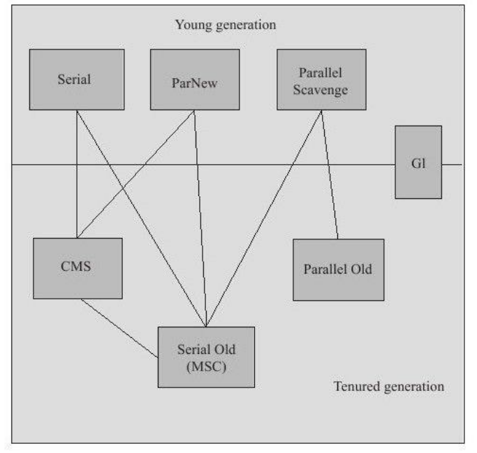
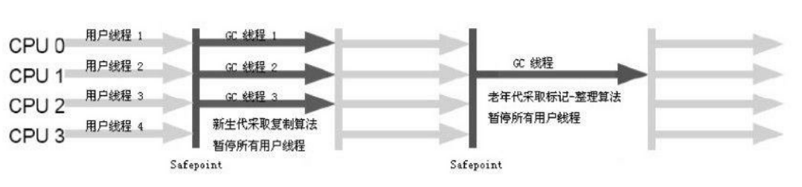
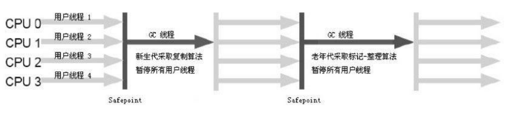

# 垃圾收集器与内存分配策略

[TOC]

## 对象是否存活

### 引用计数算法

给对象中添加一个引用计数器，每当有一个地方引用它时，计数器值就加1；当引用失效时，计数器值就减1；任何时刻计数器为0的对象就是不可能再被使用的。

但是，主流的Java虚拟机里面没有选用引用计数算法来管理内存,其中最主要的原因是它很难解决对象之间相互循环引用的问题。

```java
/**
*testGC()方法执行后,objA和objB会不会被GC呢?
*/
public class ReferenceCountingGC{
	public Object instance=null;
	private static final int_1MB=1024*1024;
	/**
	*这个成员属性的唯一意义就是占点内存,以便能在GC日志中看清楚是否被回收过
	*/
	private byte[]bigSize=new byte[2*_1MB];
	public static void testGC(){
		ReferenceCountingGC objA=new ReferenceCountingGC();
		ReferenceCountingGC objB=new ReferenceCountingGC();
		objA.instance=objB;
		objB.instance=objA;
		objA=null;
		objB=null;
		//假设在这行发生GC,objA和objB是否能被回收?
    	System.gc();
	}
}
```

```bash
[FullGC(System)[Tenured:0K->210K(10240K),0.01491422999K(21248K)],0.0150007 secs][Times:user=0.01 sys=0.00,real=0.02 secs]
Heap
	def new generation total 9216K,used 82K[0x00000000055e0000,0x0000000005fe0000,0x0000000005fe0000)
	Eden space 8192K,1%used[0x00000000055e0000,0x00000000055f4850,0x0000000005de0000)
	from space 1024K,0%used[0x0000000005de0000,0x0000000005de0000,0x0000000005ee0000)
to space 1024K,0%used[0x0000000005ee0000,0x0000000005ee0000,0x0000000005fe0000)
	tenured generation total 10240K,used 210K[0x0000000005fe0000,0x00000000069e0000,0x00000000069e0000)
	the space 10240K,2%used[0x0000000005fe0000,0x0000000006014a18,0x0000000006014c00,0x00000000069e0000)
	compacting perm gen total 21248K,used 3016K[0x00000000069e0000,0x0000000007ea0000,0x000000000bde0000)
	the space 21248K,14%used[0x00000000069e0000,0x0000000006cd2398,0x0000000006cd2400,0x0000000007ea0000)
	No shared spaces configured.
```

实验结果表明，虚拟机并没有因为这两个对象互相引用就不回收它们，这也从侧面说明虚拟机并不是通过引用计数算法来判断对象是否存活的。

### 可达性分析算法

这个算法的基本思路就是通过一系列的称为“GC Roots”的对象作为起始点，从这些节点开始向下搜索，搜索所走过的路径称为引用链(Reference Chain)，当一个对象到GC Roots没有任何引用链相连(用图论的话来说，就是从GC Roots到这个对象不可达)时，则证明此对象是不可用的。


在Java语言中，可作为GC Roots的对象包括下面几种:

+ 虚拟机栈(栈帧中的本地变量表)中引用的对象
+ 方法区中类静态属性引用的对象
+ 方法区中常量引用的对象
+ 本地方法栈中JNI(即一般说的Native方法)引用的对象

### 再谈引用

我们希望能描述这样一类对象：当内存空间还足够时，则能保留在内存之中；如果内存空间在进行垃圾收集后还是非常紧张，则可以抛弃这些对象。很多系统的缓存功能都符合这样的应用场景。

在JDK1.2之后，Java对引用的概念进行了扩充，将引用分为强引用(Strong Reference)、软引用(Soft Reference)、弱引用(Weak Reference)、虚引用(Phantom Reference)4种，这4种引用强度依次逐渐减弱。

+ 强引用就是指在程序代码之中普遍存在的，类似“Object obj=new Object()”这类的引用，只要强引用还存在，垃圾收集器永远不会回收掉被引用的对象。

+ 软引用是用来描述一些还有用但并非必需的对象。对于软引用关联着的对象，在系统将要发生内存溢出异常之前,将会把这些对象列进回收范围之中进行第二次回收。如果这次回收还没有足够的内存，才会抛出内存溢出异常。在JDK 1.2之后,提供了SoftReference类来实现软引用。

+ 弱引用也是用来描述非必需对象的，但是它的强度比软引用更弱一些，被弱引用关联的对象只能生存到下一次垃圾收集发生之前。当垃圾收集器工作时,无论当前内存是否足够，都会回收掉只被弱引用关联的对象。在JDK
  1.2之后，提供了WeakReference类来实现弱引用。

+ 虚引用也称为幽灵引用或者幻影引用，它是最弱的一种引用关系。一个对象是否有虚引用的存在，完全不会对其生存时间构成影响,也无法通过虚引用来取得一个对象实例。为一个对象设置虚引用关联的唯一目的就是能在这个对象被收集器回收时收到一个系统通知。在JDK 1.2之后，提供了PhantomReference类来实现虚引用。

### 生存还是死亡

如果对象在进行可达性分析后发现没有与GC Roots相连接的引用链，那它将会被第一次标记并且进行一次筛选，
筛选的条件是此对象是否有必要执行finalize()方法。当对象没有覆盖finalize()方法，或者finalize()方法已经被虚拟机调用过，虚拟机将这两种情况都视为“没有必要执行”。

如果这个对象被判定为有必要执行finalize()方法，那么这个对象将会放置在一个叫做F-Queue的队列之中，并在稍后由一个由虚拟机自动建立的、低优先级的Finalizer线程去执行它。这里所谓的“执行”是指虚拟机会触发这个方法，但并不承诺会等待它运行结束。finalize()方法是对象逃脱死亡命运的最后一次机会，如果对象要在finalize()中成功拯救自己——只要重新与引用链上的任何一个对象建立关联即可，譬如把自己(this关键字)赋值给某个类变量或者对象的成员变量。

```java
/**
*此代码演示了两点:
*1.对象可以在被GC时自我拯救。
*2.这种自救的机会只有一次,因为一个对象的finalize()方法最多只会被系统自动调用一次
*@author zzm
*/
public class FinalizeEscapeGC{
    public static FinalizeEscapeGC SAVE_HOOK=null;
    public void isAlive(){
    	System.out.println("yes,i am still alive:)");
    }
    @Override
    protected void finalize()throws Throwable{
        super.finalize();
        System.out.println("finalize mehtod executed!");
        FinalizeEscapeGC.SAVE_HOOK=this;
    }
    public static void main(String[]args)throws Throwable{
        SAVE_HOOK=new FinalizeEscapeGC();
        //对象第一次成功拯救自己
        SAVE_HOOK=null;
        System.gc();
        //因为finalize方法优先级很低,所以暂停0.5秒以等待它
        Thread.sleep(500);
        if(SAVE_HOOK!=null){
       		SAVE_HOOK.isAlive();
        }else{
        	System.out.println("no,i am dead:(");
        }
        //下面这段代码与上面的完全相同,但是这次自救却失败了
        SAVE_HOOK=null;
        System.gc();
        //因为finalize方法优先级很低,所以暂停0.5秒以等待它
        Thread.sleep(500);
        if(SAVE_HOOK!=null){
        	SAVE_HOOK.isAlive();
        }else{
        	System.out.println("no,i am dead:(");
        }
    }
}
```

```bash
finalize mehtod executed!
yes,i am still alive:)
no,i am dead:(
```

代码中有两段完全一样的代码片段，执行结果却是一次逃脱成功，一次失败，这是因为任何一个对象的finalize()方法都只会被系统自动调用一次，如果对象面临下一次回收，它的finalize()方法不会被再次执行,因此第二段代码的自救行动失败了。

> 不鼓励使用这种方法来拯救对象，它的运行代价高昂,不确定性大,无法保证各个对象的调用顺序。

### 回收方法区

方法区(或者HotSpot虚拟机中的永久代)的垃圾收集主要回收两部分内容：废弃常量和无用的类。

假如一个字符串“abc”已经进入了常量池中，但是当前系统没有任何一个String对象是叫做“abc”的，换句话说，就是没有任何String对象引用常量池中的“abc”常量，也没有其他地方引用了这个字面量，如果这时发生内
存回收，而且必要的话，这个“abc”常量就会被系统清理出常量池。常量池中的其他类(接口)、方法、字段的符号引用也与此类似。

判定一个类是否是“无用的类”的条件则相对苛刻许多。类需要同时满足下面3个条件才能算是“无用的类”:

+ 该类所有的实例都已经被回收，也就是Java堆中不存在该类的任何实例。
+ 加载该类的ClassLoader已经被回收。
+ 该类对应的`java.lang.Class`对象没有在任何地方被引用，无法在任何地方通过反射访问该类的方法。

在大量使用反射、动态代理、CGLib等ByteCode框架、动态生成JSP以及OSGi这类频繁自定义ClassLoader的场景都需要虚拟机具备类卸载的功能，以保证永久代不会溢出。

## 垃圾收集算法

### 标记-清除算法

算法分为“标记”和“清除”两个阶段：首先标记出所有需要回收的对象，在标记完成后统一回收所有被标记的对象。


它的主要不足有两个：一个是效率问题，标记和清除两个过程的效率都不高；另一个是空间问题，标记清除之后会产生大量不连续的内存碎片，空间碎片太多可能会导致以后在程序运行过程中需要分配较大对象时，无法找到足够的连续内存而不得不提前触发另一次垃圾收集动作。

### 复制算法

它将可用内存按容量划分为大小相等的两块，每次只使用其中的一块。当这一块的内存用完了，就将还存活着的对象复制到另外一块上面,然后再把已使用过的内存空间一次清理掉。这样使得每次都是对整个半区进行内存回收，内存分配时也就不用考虑内存碎片等复杂情况，只要移动堆顶指针，按顺序分配内存即可，实现简单，运行高效。只是这种算法的代价是将内存缩小为了原来的一半。


### 标记-整理算法

复制收集算法在对象存活率较高时就要进行较多的复制操作，所以在老年代一般不能直接选用这种算法。

根据老年代的特点，有人提出了另外一种“标记-整理”(Mark-Compact)算法，标记过程仍然与“标记-清除”算法一样，但后续步骤不是直接对可回收对象进行清理，而是让所有存活的对象都向一端移动，然后直接清理掉端边界以外的内存。


### 分代收集算法

根据对象存活周期的不同将内存划分为几块。一般是把Java堆分为新生代和老年代。在新生代中，每次垃圾收集时都发现有大批对象死去，只有少量存活，那就选用复制算法，只需要付出少量存活对象的复制成本就可以完成收集。而老年代中因为对象存活率高、没有额外空间对它进行分配担保，就必须使用“标记—清理”或者“标记—整理”算法来进行回收。

## HotSpot的算法实现

### 枚举根节点

可达性分析工作必须在一个能确保一致性的快照中进行——这里“一致性”的意思是指在整个分析期间整个执行系统看起来就像被冻结在某个时间点上，不可以出现分析过程中对象引用关系还在不断变化的情况，该点不满足的话分析结果准确性就无法得到保证。

由于目前的主流Java虚拟机使用的都是准确式GC(这个概念在第1章介绍Exact VM对Classic VM的改进时讲过)，所以当执行系统停顿下来后，并不需要一个不漏地检查完所有执行上下文和全局的引用位置，虚拟机应当是有办法直接得知哪些地方存放着对象引用。在HotSpot的实现中,是使用一组称为OopMap的数据结构来达到这个目的的。

### 安全点

在OopMap的协助下，HotSpot可以快速且准确地完成GC Roots枚举，但一个很现实的问题随之而来：可能导致引用关系变化，或者说OopMap内容变化的指令非常多，如果为每一条指令都生成对应的OopMap，那将会需要大量的额外空间，这样GC的空间成本将会变得很高。

实际上，HotSpot也的确没有为每条指令都生成OopMap，前面已经提到，只是在“特定的位置”记录了这些信息，这些位置称为安全点(Safepoint),即程序执行时并非在所有地方都能停顿下来开始GC，只有在到达安全点时才能暂停。

Safepoint的选定既不能太少以致于让GC等待时间太长，也不能过于频繁以致于过分增大运行时的负荷。所以，安全点的选定基本上是以程序“**是否具有让程序长时间执行的特征**”为标准进行选定的——因为每条指令执行的时间都非常短暂，程序不太可能因为指令流长度太长这个原因而过长时间运行，“长时间执行”的最明显特征就是指令序列复用，例如方法调用、循环跳转、异常跳转等，所以具有这些功能的指令才会产生Safepoint。

对于Safepoint，另一个需要考虑的问题是如何在GC发生时让所有线程(这里不包括执行JNI调用的线程)都“跑”到最近的安全点上再停顿下来。这里有两种方案可供选择：**抢先式中断**(Preemptive Suspension)和**主动式中断**(Voluntary Suspension)，其中抢先式中断不需要线程的执行代码主动去配合，在GC发生时，首先把所有线程全部中断，如果发现有线程中断的地方不在安全点上，就恢复线程，让它“跑”到安全点上。现在几乎没有虚拟机实现采用抢先式中断来暂停线程从而响应GC事件。

而主动式中断的思想是当GC需要中断线程的时候，不直接对线程操作，仅仅简单地设置一个标志，各个线程执行时主动去轮询这个标志，发现中断标志为真时就自己中断挂起。轮询标志的地方和安全点是重合的。

### 安全区域

Safepoint机制保证了程序执行时，在不太长的时间内就会遇到可进入GC的Safepoint。但是，程序“不执行”的时候呢？所谓的程序不执行就是没有分配CPU时间，典型的例子就是线程处于Sleep状态或者Blocked状态，这时候线程无法响应JVM的中断请求，“走”到安全的地方去中断挂起，JVM也显然不太可能等待线程重新被分配CPU时间。对于这种情况，就需要安全区域(Safe Region)来解决。

安全区域是指在一段代码片段之中，引用关系不会发生变化。在这个区域中的任意地方开始GC都是安全的。在线程要离开Safe Region时，它要检查系统是否已经完成了根节点枚举(或者是整个GC过程)，如果完成了，那线程就继续执行，否则它就必须等待直到收到可以安全离开SafeRegion的信号为止。

## 垃圾收集器



上图展示了7种作用于不同分代的收集器，如果两个收集器之间存在连线，就说明它们可以搭配使用。虚拟机所处的区域，则表示它是属于新生代收集器还是老年代收集器。

### Serial收集器

这个收集器是一个单线程的收集器，它只会使用一个cpu或一条收集线程去完成垃圾收集工作，并且在它进行垃圾收集时，必须暂停其他所有的工作线程，直到收集结束。

优点：简单高效（相对于其他收集器的单线程），对于限定单个cpu的环境来说，Serial收集器由于没有线程交互的开销，专心做垃圾收集自然可以获得最高的单线程收集效率。

### ParNew收集器

ParNew收集器其实就是Serial收集器的多线程版本。



它默认开启的收集线程数与CPU的数量相同，在CPU非常多的环境下，可以使用`-XX:ParallelGCThreads`参数来限制垃圾收集的线程数。

> 在论垃圾收集器的上下文语境中，并行与并发可以解释如下：
>
> + 并行：指多条垃圾收集线程并行工作，但此时用户线程仍然处于等待状态
> + 并发：指用户线程与垃圾收集线程同时执行（不一定并行，可能交替执行），垃圾收集程序运行在另一个cpu上

### Parallel Scavenge收集器

Parallel Scavenge收集器是一个新生代收集器，它也是使用复制算法的收集器，又是并行的多线程收集器。

Parallel Scavenge收集器的目标则是达到一个可控制的吞吐量(Throughput)。所谓吞吐量就是CPU用于运行用户代码的时间与CPU总消耗时间的比值，即吞吐量=运行用户代码时间/(运行用户代码时间+垃圾收集时间)，虚拟机总共运行了100分钟，其中垃圾收集花掉1分钟，那吞吐量就是99%。

停顿时间越短就越适合需要与用户交互的程序，良好的响应速度能提升用户体验，而高吞吐量则可以高效率地利用CPU时间，尽快完成程序的运算任务，主要适合在后台运算而不需要太多交互的任务。

Parallel Scavenge收集器提供了两个参数用于精确控制吞吐量，分别是控制最大垃圾收集停顿时间的`-XX:MaxGCPauseMillis`参数以及直接设置吞吐量大小的`-XX:GCTimeRatio`参数。

> 注意，GC停顿时间缩短是以牺牲吞吐量和新生代空间来换取的

Parallel Scavenge收集器还有一个参数-XX:+UseAdaptiveSizePolicy值得关注，虚拟机会根据当前系统的运行情况收集性能监控信息，动态调整这些参数以提供最合适的停顿时间或者最大的吞吐量，这种调节方式称为GC
自适应的调节策略(GC Ergonomics)。

### Serial Old收集器



Serial Old是Serial收集器的老年代版本，它同样是一个单线程收集器，使用“标记-整理”算法。

### Parallel Old收集器

Parallel Old是Parallel Scavenge收集器的老年代版本，使用多线程和“标记-整理”算法。


### CMS收集器

CMS(Concurrent Mark Sweep)收集器是一种以获取最短回收停顿时间为目标的收集器。目前很大一部分的Java应用集中在互联网站或者B/S系统的服务端上，这类应用尤其重视服务的响应速度，希望系统停顿时间最短，以给用户带来较好的体验。CMS收集器就非常符合这类应用的需求。

它的运作过程相对于前面几种收集器来说更复杂一些，整个过程分为4个步骤，包括:

+ 初始标记(CMS initial mark)
+ 并发标记(CMS concurrent mark)
+ 重新标记(CMS remark)
+ 并发清除(CMS concurrent sweep)

其中，初始标记、重新标记这两个步骤仍然需要暂停用户线程。初始标记仅仅只是标记一下GC Roots能直接关联到的对象，并发标记阶段就是进行GC RootsTracing的过程，而重新标记阶段则是为了修正并发标记期间因用户程序继续运作而导致标记产生变动的那一部分对象的标记记录，这个阶段的停顿时间一般会比初始标记阶段稍长一些，但远比并发标记的时间短。

由于整个过程中耗时最长的并发标记和并发清除过程收集器线程都可以与用户线程一起工作，所以，从总体上来说，CMS收集器的内存回收过程是与用户线程一起并发执行的。


CMS有以下3个缺点：

+ CMS收集器对CPU资源敏感，并发阶段，它虽然不会导致用户线程停顿，但是会因为占用了一部分线程(或者说CPU资源)而导致应用程序变慢,总吞吐量会降低。
+ CMS收集器无法处理浮动垃圾(Floating Garbage)，可能出现Concurrent Mode Failure失败而导致另一次Full GC的产生。由于CMS并发清理阶段用户线程还在运行着，伴随程序运行自然就还会有新的垃圾不断产生，这一部分垃圾出现在标记过程之后，CMS无法在当次收集中处理掉它们，只好留待下一次GC时再清理掉。这一部分垃圾就称为“浮动垃圾”。也是由于在垃圾收集阶段用户线程还需要运行，那也就还需要预留有足够的内存空间给用户线程使用，因此CMS收集器不能像其他收集器那样等到老年代几乎完全被填满了再进行收集，需要预留一部分空间提供并发收集时的程序运作使用。如果在应用中老年代增长不是太快，可以适当调高参数`-XX:CMSInitiatingOccupancyFraction`的值来提高触发百分比，以便降低内存回收次数从而获取更好的性能。然而参数`-XX:CMSInitiatingOccupancyFraction`设置得太高很容易导致大量“Concurrent Mode Failure”失败，性能反而降低。因为要是CMS运行期间预留的内存无法满足程序需要，就会出现一次Concurrent Mode Failure，这时虚拟机将启动后备预案：临时启用Serial Old收集器来重新进行老年代的垃圾收集,这样停顿时间就很长了。
+ CMS是一款基于“标记—清除”算法实现的收集器，这意味着收集结束时会有大量空间碎片产生。空间碎片过多时，将会给大对象分配带来很大麻烦,往往会出现老年代还有很大空间剩余，但是无法找到足够大的连续空间来分配当前对象，不得不提前触发一次Full GC。CMS收集器提供了一个`-XX:+UseCMSCompactAtFullCollection`开关参数(默认就是开启的)，用于在CMS收集器顶不住要进行FullGC时开启内存碎片的合并整理过程，内存整理的过程是无法并发的，空间碎片问题没有了，但停顿时间不得不变长。虚拟机设计者还提供了另外一个参数`-XX:CMSFullGCsBeforeCompaction`，这个参数是用于设置执行多少次不压缩的Full GC后，跟着来一次带压缩的(默认值为0，表示每次进入Full GC时都进行碎片整理)。

### G1收集器

G1是一款面向服务端应用的垃圾收集器。HotSpot开发团队赋予它的使命是(在比较长期的)未来可以替换掉JDK 1.5中发布的CMS收集器。与其他GC收集器相比，G1具备如下特点。

与其他GC垃圾收集器相比，G1具备如下特点：

+ 并行与并发：充分利用多CPU、多核环境下的硬件优势，使用多个CPU(CPU或者CPU核心)来缩短STW停顿的时间，部分其他收集器原本需要停顿Java线程执行的GC动作，G1收集器仍然可以通过并发的方式让Java程序继续执行。
+ 分代收集：分代概念在G1中依然得以保留，虽然G1可以不需要其他收集器配合就能独立管理整个GC堆，但它能够采用不同的方式去处理新创建的对象和已经存活了一段时间、熬过多次GC的旧对象以获取更好的收集效果。
+ 空间整合：G1从整体来看是基于“标记—整理”算法实现的收集器，从局部(两个Region之间)上来看是基于“复制”算法实现的，但无论如何，这两种算法都意味着G1运作期间不会产生内存空间碎片，收集后能提供规整的可用内存。这种特性有利于程序长时间运行，分配大对象时不会因为无法找到连续内存空间而提前触发下一
  次GC。
+ 可预测的停顿：这是G1相对于CMS的另一大优势，降低停顿时间是G1和CMS共同的关注点，但G1除了追求低停顿外，还能建立可预测的停顿时间模型，能让使用者明确指定在一个长度为M毫秒的时间片段内，消耗在垃圾收集上的时间不得超过N毫秒，这几乎已经是实时Java(RTSJ)的垃圾收集器的特征了。

