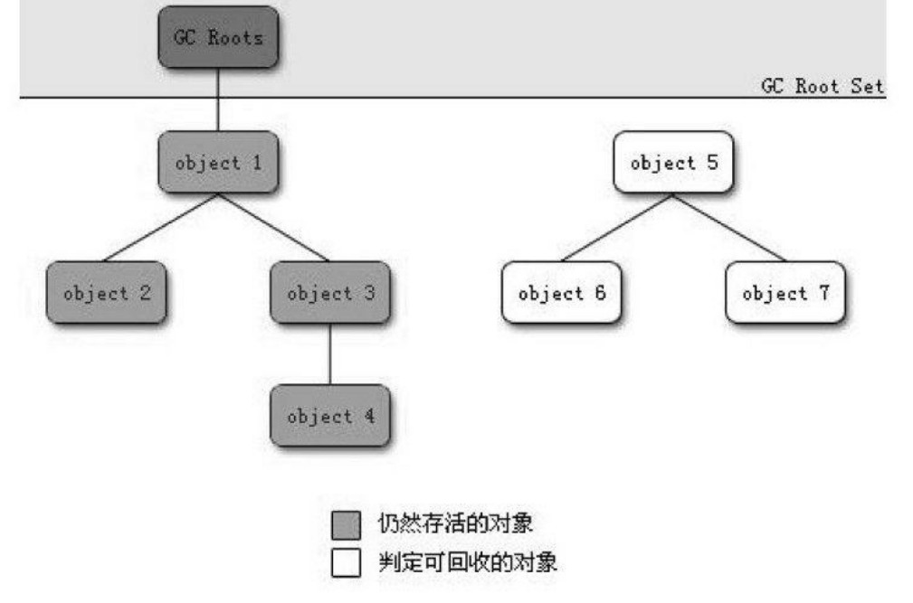
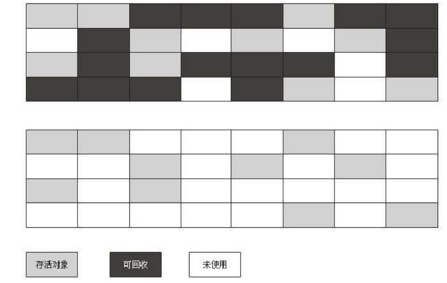
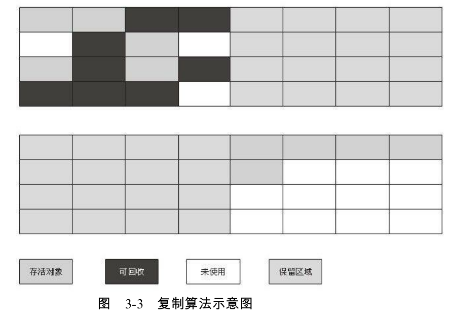
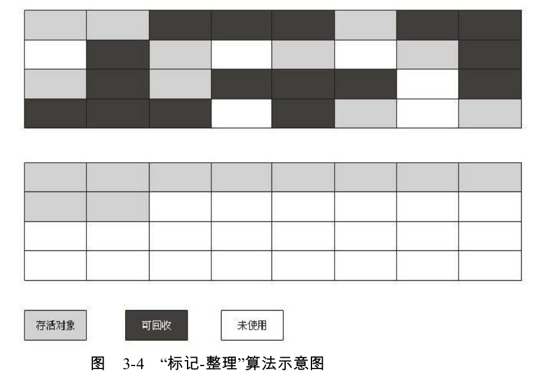

# 垃圾收集器与内存分配策略

## 对象是否存活

### 引用计数算法

给对象中添加一个引用计数器，每当有一个地方引用它时，计数器值就加1；当引用失效时，计数器值就减1；任何时刻计数器为0的对象就是不可能再被使用的。

但是，主流的Java虚拟机里面没有选用引用计数算法来管理内存,其中最主要的原因是它很难解决对象之间相互循环引用的问题。

```java
/**
*testGC()方法执行后,objA和objB会不会被GC呢?
*/
public class ReferenceCountingGC{
	public Object instance=null;
	private static final int_1MB=1024*1024;
	/**
	*这个成员属性的唯一意义就是占点内存,以便能在GC日志中看清楚是否被回收过
	*/
	private byte[]bigSize=new byte[2*_1MB];
	public static void testGC(){
		ReferenceCountingGC objA=new ReferenceCountingGC();
		ReferenceCountingGC objB=new ReferenceCountingGC();
		objA.instance=objB;
		objB.instance=objA;
		objA=null;
		objB=null;
		//假设在这行发生GC,objA和objB是否能被回收?
    	System.gc();
	}
}
```

```bash
[FullGC(System)[Tenured:0K->210K(10240K),0.01491422999K(21248K)],0.0150007 secs][Times:user=0.01 sys=0.00,real=0.02 secs]
Heap
	def new generation total 9216K,used 82K[0x00000000055e0000,0x0000000005fe0000,0x0000000005fe0000)
	Eden space 8192K,1%used[0x00000000055e0000,0x00000000055f4850,0x0000000005de0000)
	from space 1024K,0%used[0x0000000005de0000,0x0000000005de0000,0x0000000005ee0000)
to space 1024K,0%used[0x0000000005ee0000,0x0000000005ee0000,0x0000000005fe0000)
	tenured generation total 10240K,used 210K[0x0000000005fe0000,0x00000000069e0000,0x00000000069e0000)
	the space 10240K,2%used[0x0000000005fe0000,0x0000000006014a18,0x0000000006014c00,0x00000000069e0000)
	compacting perm gen total 21248K,used 3016K[0x00000000069e0000,0x0000000007ea0000,0x000000000bde0000)
	the space 21248K,14%used[0x00000000069e0000,0x0000000006cd2398,0x0000000006cd2400,0x0000000007ea0000)
	No shared spaces configured.
```

实验结果表明，虚拟机并没有因为这两个对象互相引用就不回收它们，这也从侧面说明虚拟机并不是通过引用计数算法来判断对象是否存活的。

### 可达性分析算法

这个算法的基本思路就是通过一系列的称为“GC Roots”的对象作为起始点，从这些节点开始向下搜索，搜索所走过的路径称为引用链(Reference Chain)，当一个对象到GC Roots没有任何引用链相连(用图论的话来说，就是从GC Roots到这个对象不可达)时，则证明此对象是不可用的。



在Java语言中，可作为GC Roots的对象包括下面几种:

+ 虚拟机栈(栈帧中的本地变量表)中引用的对象
+ 方法区中类静态属性引用的对象
+ 方法区中常量引用的对象
+ 本地方法栈中JNI(即一般说的Native方法)引用的对象

### 再谈引用

我们希望能描述这样一类对象：当内存空间还足够时，则能保留在内存之中；如果内存空间在进行垃圾收集后还是非常紧张，则可以抛弃这些对象。很多系统的缓存功能都符合这样的应用场景。

在JDK1.2之后，Java对引用的概念进行了扩充，将引用分为强引用(Strong Reference)、软引用(Soft Reference)、弱引用(Weak Reference)、虚引用(Phantom Reference)4种，这4种引用强度依次逐渐减弱。

+ 强引用就是指在程序代码之中普遍存在的，类似“Object obj=new Object()”这类的引用，只要强引用还存在，垃圾收集器永远不会回收掉被引用的对象。

+ 软引用是用来描述一些还有用但并非必需的对象。对于软引用关联着的对象，在系统将要发生内存溢出异常之前,将会把这些对象列进回收范围之中进行第二次回收。如果这次回收还没有足够的内存，才会抛出内存溢出异常。在JDK 1.2之后,提供了SoftReference类来实现软引用。

+ 弱引用也是用来描述非必需对象的，但是它的强度比软引用更弱一些，被弱引用关联的对象只能生存到下一次垃圾收集发生之前。当垃圾收集器工作时,无论当前内存是否足够，都会回收掉只被弱引用关联的对象。在JDK
  1.2之后，提供了WeakReference类来实现弱引用。

+ 虚引用也称为幽灵引用或者幻影引用，它是最弱的一种引用关系。一个对象是否有虚引用的存在，完全不会对其生存时间构成影响,也无法通过虚引用来取得一个对象实例。为一个对象设置虚引用关联的唯一目的就是能在这个对象被收集器回收时收到一个系统通知。在JDK 1.2之后，提供了PhantomReference类来实现虚引用。

### 生存还是死亡

如果对象在进行可达性分析后发现没有与GC Roots相连接的引用链，那它将会被第一次标记并且进行一次筛选，
筛选的条件是此对象是否有必要执行finalize()方法。当对象没有覆盖finalize()方法，或者finalize()方法已经被虚拟机调用过，虚拟机将这两种情况都视为“没有必要执行”。

如果这个对象被判定为有必要执行finalize()方法，那么这个对象将会放置在一个叫做F-Queue的队列之中，并在稍后由一个由虚拟机自动建立的、低优先级的Finalizer线程去执行它。这里所谓的“执行”是指虚拟机会触发这个方法，但并不承诺会等待它运行结束。finalize()方法是对象逃脱死亡命运的最后一次机会，如果对象要在finalize()中成功拯救自己——只要重新与引用链上的任何一个对象建立关联即可，譬如把自己(this关键字)赋值给某个类变量或者对象的成员变量。

```java
/**
*此代码演示了两点:
*1.对象可以在被GC时自我拯救。
*2.这种自救的机会只有一次,因为一个对象的finalize()方法最多只会被系统自动调用一次
*@author zzm
*/
public class FinalizeEscapeGC{
    public static FinalizeEscapeGC SAVE_HOOK=null;
    public void isAlive(){
    	System.out.println("yes,i am still alive:)");
    }
    @Override
    protected void finalize()throws Throwable{
        super.finalize();
        System.out.println("finalize mehtod executed!");
        FinalizeEscapeGC.SAVE_HOOK=this;
    }
    public static void main(String[]args)throws Throwable{
        SAVE_HOOK=new FinalizeEscapeGC();
        //对象第一次成功拯救自己
        SAVE_HOOK=null;
        System.gc();
        //因为finalize方法优先级很低,所以暂停0.5秒以等待它
        Thread.sleep(500);
        if(SAVE_HOOK!=null){
       		SAVE_HOOK.isAlive();
        }else{
        	System.out.println("no,i am dead:(");
        }
        //下面这段代码与上面的完全相同,但是这次自救却失败了
        SAVE_HOOK=null;
        System.gc();
        //因为finalize方法优先级很低,所以暂停0.5秒以等待它
        Thread.sleep(500);
        if(SAVE_HOOK!=null){
        	SAVE_HOOK.isAlive();
        }else{
        	System.out.println("no,i am dead:(");
        }
    }
}
```

```bash
finalize mehtod executed!
yes,i am still alive:)
no,i am dead:(
```

代码中有两段完全一样的代码片段，执行结果却是一次逃脱成功，一次失败，这是因为任何一个对象的finalize()方法都只会被系统自动调用一次，如果对象面临下一次回收，它的finalize()方法不会被再次执行,因此第二段代码的自救行动失败了。

> 不鼓励使用这种方法来拯救对象，它的运行代价高昂,不确定性大,无法保证各个对象的调用顺序。

### 回收方法区

方法区(或者HotSpot虚拟机中的永久代)的垃圾收集主要回收两部分内容：废弃常量和无用的类。

假如一个字符串“abc”已经进入了常量池中，但是当前系统没有任何一个String对象是叫做“abc”的，换句话说，就是没有任何String对象引用常量池中的“abc”常量，也没有其他地方引用了这个字面量，如果这时发生内
存回收，而且必要的话，这个“abc”常量就会被系统清理出常量池。常量池中的其他类(接口)、方法、字段的符号引用也与此类似。

判定一个类是否是“无用的类”的条件则相对苛刻许多。类需要同时满足下面3个条件才能算是“无用的类”:

+ 该类所有的实例都已经被回收，也就是Java堆中不存在该类的任何实例。
+ 加载该类的ClassLoader已经被回收。
+ 该类对应的`java.lang.Class`对象没有在任何地方被引用，无法在任何地方通过反射访问该类的方法。

在大量使用反射、动态代理、CGLib等ByteCode框架、动态生成JSP以及OSGi这类频繁自定义ClassLoader的场景都需要虚拟机具备类卸载的功能，以保证永久代不会溢出。

## 垃圾收集算法

### 标记-清除算法

算法分为“标记”和“清除”两个阶段：首先标记出所有需要回收的对象，在标记完成后统一回收所有被标记的对象。



它的主要不足有两个：一个是效率问题，标记和清除两个过程的效率都不高；另一个是空间问题，标记清除之后会产生大量不连续的内存碎片，空间碎片太多可能会导致以后在程序运行过程中需要分配较大对象时，无法找到足够的连续内存而不得不提前触发另一次垃圾收集动作。

### 复制算法

它将可用内存按容量划分为大小相等的两块，每次只使用其中的一块。当这一块的内存用完了，就将还存活着的对象复制到另外一块上面,然后再把已使用过的内存空间一次清理掉。这样使得每次都是对整个半区进行内存回收，内存分配时也就不用考虑内存碎片等复杂情况，只要移动堆顶指针，按顺序分配内存即可，实现简单，运行高效。只是这种算法的代价是将内存缩小为了原来的一半。



### 标记-整理算法

复制收集算法在对象存活率较高时就要进行较多的复制操作，所以在老年代一般不能直接选用这种算法。

根据老年代的特点，有人提出了另外一种“标记-整理”(Mark-Compact)算法，标记过程仍然与“标记-清除”算法一样，但后续步骤不是直接对可回收对象进行清理，而是让所有存活的对象都向一端移动，然后直接清理掉端边界以外的内存。



### 分代收集算法

根据对象存活周期的不同将内存划分为几块。一般是把Java堆分为新生代和老年代。在新生代中，每次垃圾收集时都发现有大批对象死去，只有少量存活，那就选用复制算法，只需要付出少量存活对象的复制成本就可以完成收集。而老年代中因为对象存活率高、没有额外空间对它进行分配担保，就必须使用“标记—清理”或者“标记—整理”算法来进行回收。