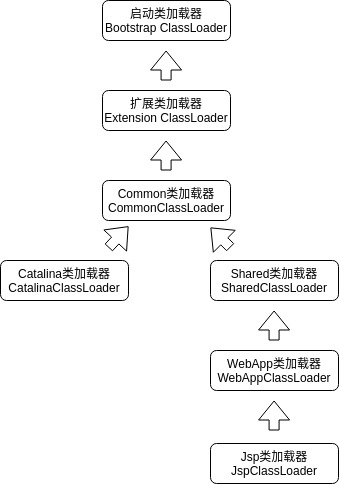

# 类加载及执行子系统的案例与实战

[TOC]

## 案例分析

### Tomcat:正统的类加载器架构

主流的Java Web服务器，都实现了自己定义的类加载器(一般都不止一个)。因为一个功能健全的Web服务器，要解决如下几个问题：

+ 部署在同一个服务器上的两个Web应用程序所使用的Java类库可以实现相互隔离。这是最基本的需求，两个不同的应用程序可能会依赖同一个第三方类库的不同版本，不能要求一个类库在一个服务器中只有一份，服务器应当保证两个应用程序的类库可以互相独立使用。
+ 部署在同一个服务器上的两个Web应用程序所使用的Java类库可以互相共享。这个需求也很常见，例如，用户可能有10个使用Spring组织的应用程序部署在同一台服务器上，如果把10份Spring分别存放在各个应用程序的隔离目录中，将会是很大的资源浪费——这主要倒不是浪费磁盘空间的问题，而是指类库在使用时都要被加载到服务器内存，如果类库不能共享，虚拟机的方法区就会很容易出现过度膨胀的风险。
+ 服务器需要尽可能地保证自身的安全不受部署的Web应用程序影响。目前，有许多主流的Java Web服务器自身也是使用Java语言来实现的。因此，服务器本身也有类库依赖的问题，一般来说，基于安全考虑，服务器所使用的类库应该与应用程序的类库互相独立。
+ 支持JSP应用的Web服务器，大多数都需要支持HotSwap功能。JSP文件最终要编译成Java Class才能由虚拟机执行，但JSP文件由于其纯文本存储的特性，运行时修改的概率远远大于第三方类库或程序自身的Class文件。而且ASP、PHP和JSP这些网页应用也把修改后无须重启作为一个很大的“优势”来看待，因此“主流”的Web服务器都会支持JSP生成类的热替换，当然也有“非主流”的，如运行在生产模式(Production Mode)下的WebLogic服务器默认就不会处理JSP文件的变化。

由于存在上述问题，在部署Web应用时，单独的一个ClassPath就无法满足需求了，所以各种Web服务器都“不约而同”地提供了好几个ClassPath路径供用户存放第三方类库，这些路径一般都以“lib”或“classes”命名。被放置到不同路径中的类库，具备不同的访问范围和服务对象，通常，每一个目录都会有一个相应的自定义类加载器去加载放置在里面的Java类库。
下面以Tomcat服务器为例，看一看Tomcat具体是如何规划用户类库结构和类加载器的。

在Tomcat目录结构中，有3组目录(“/common/\*”、“/server/\*”和“/shared/\*”)可以存放Java类库，另外还可以加上Web应用程序自身的目录“/WEB-INF/\*”，一共4组，把Java类库放置在这些目录中的含义分别如下：

+ 放置在/common目录中：类库可被Tomcat和所有的Web应用程序共同使用。
+ 放置在/server目录中：类库可被Tomcat使用，对所有的Web应用程序都不可见。
+ 放置在/shared目录中：类库可被所有的Web应用程序共同使用，但对Tomcat自己不可见。
+ 放置在/WebApp/WEB-INF目录中：类库仅仅可以被此Web应用程序使用，对Tomcat和其他Web应用程序都不可见。

为了支持这套目录结构，并对目录里面的类库进行加载和隔离，Tomcat自定义了多个类加载器，这些类加载器按照经典的双亲委派模型来实现，如图所示：

最顶层的3个类加载器是JDK默认提供的类加载器，其余的是Tomcat自己定义的类加载器，它们分别加载/common/\*、/server/\*、/shared/\*和/WebApp/WEB-INF/\*中的Java类库。其中WebApp类加载器和Jsp类加载器通常会存在多个实例，每一个Web应用程序对应一个WebApp类加载器，每一个JSP文件对应一个Jsp类加载器。

可以看出，CommonClassLoader能加载的类都可以被Catalina ClassLoader和SharedClassLoader使用，而CatalinaClassLoader和SharedClassLoader自己能加载的类则与对方相互隔离。WebAppClassLoader可以使用SharedClassLoader加载到的类，但各个WebAppClassLoader实例之间相互隔离。而JasperLoader的加载范围仅仅是这个JSP文件所编译出来的那一个Class，它出现的目的就是为了被丢弃：当服务器检测到JSP文件被修改时，会替换掉目前的JasperLoader的实例，并通过再建立一个新的Jsp类加载器来实现JSP文件的HotSwap功能。