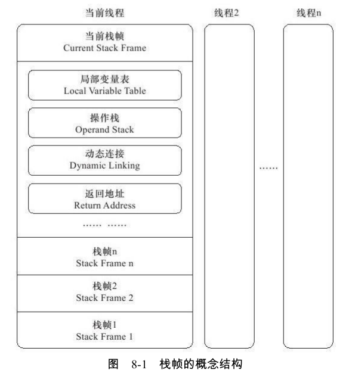
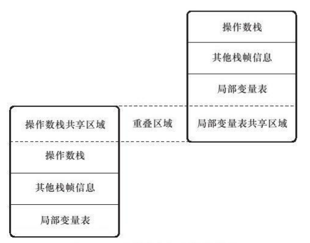
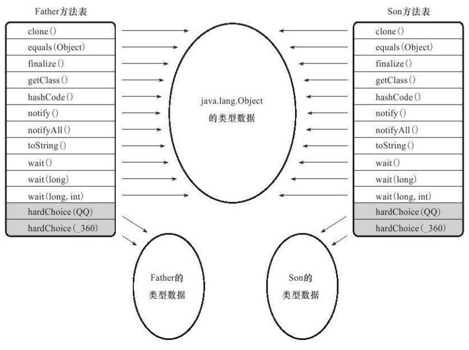

# 虚拟机字节码执行引擎

[TOC]

## 运行时栈帧结构

栈帧(Stack Frame)是用于支持虚拟机进行方法调用和方法执行的数据结构，它是虚拟机运行时数据区中的虚拟机栈(Virtual Machine Stack) 的栈元素。栈帧存储了方法的局部变量表、操作数栈、动态连接和方法返回地址等信息。每一个方法从调用开始至执行完成的过程，都对应着一个栈帧在虚拟机栈里面从入栈到出栈的过程。

每一个栈帧都包括了局部变量表、操作数栈、动态连接、方法返回地址和一些额外的附加信息。在编译程序代码的时候，栈帧中需要多大的局部变量表，多深的操作数栈都已经完全确定了，并且写入到方法表的Code属性之中 ，因此一个栈帧需要分配多少内存，不会受到程序运行期变量数据的影响，而仅仅取决于具体的虚拟机实现。



### 局部变量表

局部变量表(Local Variable Table)是一组变量值存储空间，用于存放方法参数和方法内部定义的局部变量。在Java程序编译为Class文件时，就在方法的Code属性的max_locals数据项中确定了该方法所需要分配的局部变量表的最大容量。

局部变量表的容量以变量槽(Variable Slot)为最小单位，一个Slot可以存放一个32位以内的数据类型，Java中占用32位以内的数据类型有boolean、byte、char、short、int、float、reference和returnAddress 8种类型。对于64位的数据类型,虚拟机会以高位对齐的方式为其分配两个连续的Slot空间。Java语言中明确的(reference类型则可能是32位也可能是64位)64位的数据类型只有long和double两种。由于局部变量表建立在线程的堆栈上，是线程私有的数据，无论读写两个连续的Slot是否为原子操作，都不会引起数据安全问题。

在方法执行时，虚拟机是使用局部变量表完成参数值到参数变量列表的传递过程的，如果执行的是实例方法(非static的方法)，那局部变量表中第0位索引的Slot默认是用于传递方法所属对象实例的引用,在方法中可以通过关键字“this”来访问到这个隐含的参数。其余参数则按照参数表顺序排列，占用从1开始的局部变量Slot，参数表分配完毕后，再根据方法体内部定义的变量顺序和作用域分配其余的Slot。

为了尽可能节省栈帧空间，局部变量表中的Slot是可以重用的，方法体中定义的变量，其作用域并不一定会覆盖整个方法体，如果当前字节码PC计数器的值已经超出了某个变量的作用域，那这个变量对应的Slot就可以交给其他变量使用。

>注意，Slot的复用会直接影响到系统的垃圾收集行为。

### 操作数栈

在概念模型中，两个栈帧作为虚拟机栈的元素，是完全相互独立的。但在大多虚拟机的实现里都会做一些优化处理，令两个栈帧出现一部分重叠。让下面栈帧的部分操作数栈与上面栈帧的部分局部变量表重叠在一起，这样在进行方法调用时就可以共用一部分数据，无须进行额外的参数复制传递，重叠的过程如下图所示。



### 动态连接

每个栈帧都包含一个指向运行时常量池中该栈帧所属方法的引用，持有这个引用是为了支持方法调用过程中的动态连接(Dynamic Linking)。我们知道Class文件的常量池中存有大量的符号引用，字节码中的方法调用指令就以常量池中指向方法的符号引用作为参数。这些符号引用一部分会在类加载阶段或者第一次使用的时候就转化为直接引用，这种转化称为静态解析。另外一部分将在每一次运行期间转化为直接引用，这部分称为动态连接。

### 方法返回地址

一般来说，方法正常退出时，调用者的PC计数器的值可以作为返回地址，栈帧中很可能会保存这个计数器值。而方法异常退出时，返回地址是要通过异常处理器表来确定的，栈帧中一般不会保存这部分信息。

## 方法调用

### 解析

在类加载的解析阶段，会将其中的一部分符号引用转化为直接引用，这种解析能成立的前提是：方法在程序真正运行之前就有一个可确定的调用版本，并且这个方法的调用版本在运行期是不可改变的。换句话说，调用目标在程序代码写好、编译器进行编译时就必须确定下来。这类方法的调用称为解析(Resolution)。

在Java语言中符合“编译期可知，运行期不可变”这个要求的方法，主要包括静态方法和私有方法两大类，前者与类型直接关联，后者在外部不可被访问，这两种方法各自的特点决定了它们都不可能通过继承或别的方式重写其他版本，因此它们都适合在类加载阶段进行解析。

解析调用一定是个静态的过程，在编译期间就完全确定，在类装载的解析阶段就会把涉及的符号引用全部转变为可确定的直接引用，不会延迟到运行期再去完成。

### 分派

#### 静态分派

```java
package org.fenixsoft.polymorphic;
/**
*方法静态分派演示
*@author zzm
*/
public class StaticDispatch{
    static abstract class Human{
    }
    static class Man extends Human{
    }
    static class Woman extends Human{
    }
    public void sayHello(Human guy){
    	System.out.println("hello,guy!");
    }
    public void sayHello(Man guy){
    	System.out.println("hello,gentleman!");
    }
    public void sayHello(Woman guy){
    	System.out.println("hello,lady!");
    }
    public static void main(String[]args){
        Human man=new Man();
        Human woman=new Woman();
        StaticDispatch sr=new StaticDispatch();
        sr.sayHello(man);
        sr.sayHello(woman);
    }
}
```

```java
hello,guy!
hello,guy!
```

在下述代码中

```java
Human man=new Man();
```

我们把上面代码中的“Human”称为变量的静态类型(Static Type)，或者叫做的外观类型(Apparent Type)，后面的“Man”则称为变量的实际类型(Actual Type)，静态类型和实际类型在程序中都可以发生一些变化，区别是静态类型的变化仅仅在使用时发生，变量本身的静态类型不会被改变，并且最终的静态类型是在编译期可知的；而实际类型变化的结果在运行期才可确定，编译器在编译程序的时候并不知道一个对象的实际类型是什么。

所有依赖静态类型来定位方法执行版本的分派动作称为静态分派。静态分派的典型应用是方法重载。静态分派发生在编译阶段，因此确定静态分派的动作实际上不是由虚拟机来执行的，选择重载版本的过程也是通过静态分派完成的。

#### 动态分派

动态分派多态性的重写(Override)有着很密切的关联。

```java
package org.fenixsoft.polymorphic;
/**
*方法动态分派演示
*@author zzm
*/
public class DynamicDispatch{
    static abstract class Human{
    	protected abstract void sayHello();
    }
    static class Man extends Human{
        @Override
        protected void sayHello(){
            System.out.println("man say hello");
        }
    }
    static class Woman extends Human{
        @Override
        protected void sayHello(){
        	System.out.println("woman say hello");
        }
    }
    public static void main(String[]args){
        Human man=new Man();
        Human woman=new Woman();
        man.sayHello();
        woman.sayHello();
        man=new Woman();
        man.sayHello();
    }
}
```

```java
man say hello
woman say hello
woman say hello
```

#### 单分派与多分派

方法的接收者与方法的参数统称为方法的宗量，单分派是根据一个宗量对目标方法进行选择，多分派则是根据多于一个宗量对目标方法进行选择。

```java
/**
*单分派、多分派演示
*@author zzm
*/
public class Dispatch{
    static class QQ{}
    static class_360{}
    public static class Father{
        public void hardChoice(QQ arg){
        	System.out.println("father choose qq");
        }
        public void hardChoice(_360 arg){
        	System.out.println("father choose 360");
        }
    }
    public static class Son extends Father{
        public void hardChoice(QQ arg){
        	System.out.println("son choose qq");
        }
        public void hardChoice(_360 arg){
        	System.out.println("son choose 360");
        }
    }
    public static void main(String[]args){
        Father father=new Father();
        Father son=new Son();
        father.hardChoice(new_360());
        son.hardChoice(new QQ());
    }
}
```

```java
father choose 360
son choose qq
```

我们来看看编译阶段编译器的选择过程，也就是静态分派的过程。这时选择目标方法的依据有两点：一是静态类型是Father还是Son，二是方法参数是QQ还是360。这次选择结果的最终产物是产生了两条invokevirtual指令，两条指令的参数分别为常量池中指向Father.hardChoice(360)及Father.hardChoice(QQ)方法的符号引用。因为是根据两个宗量进行选择，所以Java语言的静态分派属于多分派类型。

再看看运行阶段虚拟机的选择,也就是动态分派的过程。在执行“son.hardChoice(new QQ())”这句代码时，更准确地说,是在执行这句代码所对应的invokevirtual指令时，由于
编译期已经决定目标方法的签名必须为hardChoice(QQ)，虚拟机此时不会关心传递过来的参数“QQ”到底是“腾讯QQ”还是“奇瑞QQ”，因为这时参数的静态类型、实际类型都对方法的选择不会构成任何影响，唯一可以影响虚拟机选择的因素只有此方法的接受者的实际类型是Father还是Son。因为只有一个宗量作为选择依据，所以Java语言的动态分派属于单分派类型。

#### 虚拟机动态分派的实现

由于动态分派是非常频繁的动作，最常用的“稳定优化”手段就是为类在方法区中建立一个虚方法表(Vritual Method
Table，也称为vtable，与此对应的，在nvokeinterface执行时也会用到接口方法表——Inteface Method Table，简称itable)，使用虚方法表索引来代替元数据查找以提高性能。



虚方法表中存放着各个方法的实际入口地址。如果某个方法在子类中没有被重写，那子类的虚方法表里面的地址入口和父类相同方法的地址入口是一致的，都指向父类的实现入口。如果子类中重写了这个方法，子类方法表中的地址将会替换为指向子类实现版本的入口地址。