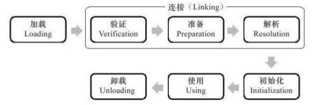
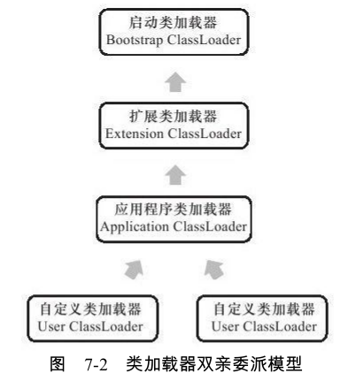

# 虚拟机类加载机制

[TOC]

## 概述

虚拟机把描述类的数据从Class文件加载到内存，并对数据进行校验、转换解析和初始化，最终形成可以被虚拟机直接使用的Java类型，这就是虚拟机的类加载机制。

与那些在编译时需要进行连接工作的语言不同，在Java语言里面，类型的加载、连接和初始化过程都是在程序运行期间完成的，这种策略虽然会令类加载时稍微增加一些性能开销，但是会为Java应用程序提供高度的灵活性，Java里天生可以动态扩展的语言特性就是依赖运行期动态加载和动态连接这个特点实现的。例如，如果编写一个面向接口的应用程序，可以等到运行时再指定其实际的实现类：用户可以通过Java预定义的和自定义类加载器，让一个本地的应用程序可以在运行时从网络或其他地方加载一个二进制流作为程序代码的一部分。

## 类加载的时机

类从被加载到虚拟机内存中开始，到卸载出内存为止，它的整个生命周期包括：加载(Loading)、验证(Verification)、准备(Preparation)、解析(Resolution)、初始化(Initialization)、使用(Using)和卸载(Unloading)7个阶段。其中验证、准备、解析3个部分统称为连接(Linking)。



加载、验证、准备、初始化和卸载这5个阶段的顺序是确定的（只是**开始的顺序**，这些阶段通常都是互相交叉地混合式进行的,通常会在一个阶段执行的过程中调用、激活另外一个阶段），而解析阶段则不一定：它在某些情况下可以在初始化阶段之后再开始，这是为了支持Java语言的运行时绑定(也称为动态绑定或晚期绑定)。

对于初始化阶段，虚拟机规范则是严格规定了**有且只有**5种情况必须立即对类进行“初始化”(而加载、验证、准备自然需要在此之前开始):

+ 遇到new、getstatic、putstatic或invokestatic这4条字节码指令时，如果类没有进行过初始化，则需要先触发其初始化。生成这4条指令的最常见的Java代码场景是：使用new关键字实例化对象的时候、读取或设置一个类的静态字段(被final修饰、已在编译期把结果放入常量池的静态字段除外)的时候，以及调用一个类的静态方法的时候。
+ 使用java.lang.reflect包的方法对类进行反射调用的时候，如果类没有进行过初始化，则需要先触发其初始化。
+ 当初始化一个类的时候，如果发现其父类还没有进行过初始化，则需要先触发其父类的初始化。
+ 当虚拟机启动时，用户需要指定一个要执行的主类(包含main()方法的那个类)，虚拟机会先初始化这个主类。
+ 当使用JDK1.7的动态语言支持时，如果一个java.lang.invoke.MethodHandle实例最后的解析结果REF_getStatic、REF_putStatic、REF_invokeStatic的方法句柄，并且这个方法句柄所对应的类没有进行过初始化,则需要先触发其初始化。

这5种场景中的行为称为对一个类进行主动引用。除此之外，所有引用类的方式都不会触发初始化,称为被动引用。下面举3个例子来说明何为被动引用：

```java
package org.fenixsoft.classloading;
/**
*被动使用类字段演示一:
*通过子类引用父类的静态字段,不会导致子类初始化
**/
public class SuperClass{
    static{
	    System.out.println("SuperClass init!");
    }
    public static int value=123;
}
public class SubClass extends SuperClass{
    static{
	    System.out.println("SubClass init!");
    }
}
/**
*非主动使用类字段演示
**/
public class NotInitialization{
    public static void main(String[]args){
    	System.out.println(SubClass.value);
    }
}
```

上述代码运行之后，只会输出“SuperClass init!”，而不会输出“SubClass init!”。对于静态字段，只有直接定义这个字段的类才会被初始化，因此通过其子类来引用父类中定义的静态字段，只会触发父类的初始化而不会触发子类的初始化。

```java
package org.fenixsoft.classloading;
/**
*被动使用类字段演示二:
*通过数组定义来引用类,不会触发此类的初始化
**/
public class NotInitialization{
    public static void main(String[]args){
   		SuperClass[]sca=new SuperClass[10];
    }
}
```

运行之后发现没有输出“SuperClass init!”，说明并没有触发类`org.fenixsoft.classloading.SuperClass`的初始化阶段。但是这段代码里面触发了另外一个名为`[Lorg.fenixsoft.classloading.SuperClass`的类的初始化
阶段。Java语言中对数组的访问比C/C++相对安全是因为这个类封装了数组元素的访问方法 ，而C/C++直接翻译为对数组指针的移动。在Java语言中，当检查到发生数组越界时会抛出`java.lang.ArrayIndexOutOfBoundsException`异常。

```java
package org.fenixsoft.classloading;
/**
*被动使用类字段演示三:
*常量在编译阶段会存入调用类的常量池中,本质上并没有直接引用到定义常量的类,因此不会触发定义常量的类的初始化。
**/
public class ConstClass{
    static{
    	System.out.println("ConstClass init!");
    }
	public static final String HELLOWORLD="hello world";
}
/**
*非主动使用类字段演示
**/
public class NotInitialization{
    public static void main(String[]args){
    	System.out.println(ConstClass.HELLOWORLD);
    }
}
```

上述代码运行之后，也没有输出“ConstClass init!”，这是因为虽然在Java源码中引用了ConstClass类中的常量HELLOWORLD，但其实在编译阶段通过常量传播优化，已经将此常量的值“hello world”存储到了NotInitialization类的常量池中，以后NotInitialization对常量ConstClass.HELLOWORLD的引用实际都被转化为NotInitialization类对自身常量池的引用了。也就是说，实际上NotInitialization的Class文件之中并没有ConstClass类的符号引用入口。

接口的加载过程与类加载过程稍有不同，接口与类真正有所区别的是前面讲述的5种“有且仅有”需要开始初始化场景中的第3种：当一个类在初始化时，要求其父类全部都已经初始化过了，但是一个接口在初始化时，并不要求其父接口全部都完成了初始化，只有在真正使用到父接口的时候(如引用接口中定义的常量)才会初始化。

## 类加载过程

### 加载

“加载”是“类加载”(Class Loading)过程的一个阶段，在加载阶段，虚拟机需要完成以下3件事情：

+ 通过一个类的全限定名来获取定义此类的二进制字节流。
+ 将这个字节流所代表的静态存储结构转化为方法区的运行时数据结构。
+ 在内存中生成一个代表这个类的java.lang.Class对象，作为方法区这个类的各种数据的访问入口。

“通过一个类的全限定名来获取定义此类的二进制字节流”这条，它没有指明二进制字节流要从一个Class文件中获取,准确地说是根本没有指明要从哪里获取、怎样获取。许多Java技术都建立在这一基础之上，例如:

+ 从ZIP包中读取,这很常见,最终成为日后JAR、EAR、WAR格式的基础。
+ 从网络中获取,这种场景最典型的应用就是Applet。
+ 运行时计算生成，这种场景使用得最多的就是动态代理技术，在java.lang.reflect.Proxy中，就是用了ProxyGenerator.generateProxyClass来为特定接口生成形式为“*$Proxy”的代理类的二进制字节流。
+ 由其他文件生成，典型场景是JSP应用，即由JSP文件生成对应的Class类。
+ 从数据库中读取，这种场景相对少见些，例如有些中间件服务器(如SAP Netweaver)可以选择把程序安装到数据库中来完成程序代码在集群间的分发。

一个非数组类的加载阶段(准确地说，是加载阶段中获取类的二进制字节流的动作)是开发人员可控性最强的，因为加载阶段既可以使用系统提供的引导类加载器来完成，也可以由用户自定义的类加载器去完成，开发人员可以通过定义自己的类加载器去控制字节流的获取方式(即重写一个类加载器的loadClass()方法)。

对于数组类而言，数组类本身不通过类加载器创建，它是由Java虚拟机直接创建的。但数组类的元素类型(ElementType，指的是数组去掉所有维度的类型)最终是要靠类加载器去创建，一个数组类(下面简称为C)创建过程就遵循以下规则：

+ 如果数组的组件类型(Component Type，指的是数组去掉一个维度的类型)是引用类型，那就递归采用本节中定义的加载过程去加载这个组件类型，数组C将在加载该组件类型的类加载器的类名称空间上被标识(一个类必须与类加载器一起确定唯一性)。
+ 如果数组的组件类型不是引用类型(例如int[]数组)，Java虚拟机将会把数组C标记为与引导类加载器关联。
+ 数组类的可见性与它的组件类型的可见性一致，如果组件类型不是引用类型，那数组类的可见性将默认为public。

加载阶段完成后，虚拟机外部的二进制字节流就按照虚拟机所需的格式存储在方法区之中，虚拟机规范未规定此区域的具体数据结构。然后在内存中实例化一个java.lang.Class类的对象(并没有明确规定是在Java堆中，对于HotSpot虚拟机而言，Class对象比较特殊，它虽然是对象，但是存放在方法区里面)，这个对象将作为程序访问方法区中的这些类型数据的外部接口。

加载阶段与连接阶段的部分内容(如一部分字节码文件格式验证动作)是交叉进行的，加载阶段尚未完成，连接阶段可能已经开始，但这些夹在加载阶段之中进行的动作，仍然属于连接阶段的内容，这两个阶段的开始时间仍然保持着固定的先后顺序。

### 验证

验证是连接阶段的第一步，这一阶段的目的是为了确保Class文件的字节流中包含的信息符合当前虚拟机的要求，并且不会危害虚拟机自身的安全。如果验证到输入的字节流不符合Class文件格式的约束，虚拟机就应抛出一个java.lang.VerifyError异常或其子类异常。

验证阶段大致上会完成下面4个阶段的检验动作：文件格式验证、元数据验证、字节码验证、符号引用验证。

#### 文件格式验证

第一阶段要验证字节流是否符合Class文件格式的规范，并且能被当前版本的虚拟机处理。这一阶段可能包括下面这些验证点：

+ 是否以魔数0xCAFEBABE开头。
+ 主、次版本号是否在当前虚拟机处理范围之内。
+ 常量池的常量中是否有不被支持的常量类型(检查常量tag标志)。
+ 指向常量的各种索引值中是否有指向不存在的常量或不符合类型的常量。
+ CONSTANT_Utf8_info型的常量中是否有不符合UTF8编码的数据。
+ Class文件中各个部分及文件本身是否有被删除的或附加的其他信息。
+ ......

该验证阶段的主要目的是保证输入的字节流能正确地解析并存储于方法区之内，格式上符合描述一个Java类型信息的要求。只有通过了这个阶段的验证后，字节流才会进入内存的方法区中进行存储，所以后面的3个验证阶段全部是基于方法区的存储结构进行的，不会再直接操作字节流。

#### 元数据验证

第二阶段是对字节码描述的信息进行语义分析，这个阶段可能包括的验证点如下：

+ 这个类是否有父类(除了java.lang.Object之外,所有的类都应当有父类)。
+ 这个类的父类是否继承了不允许被继承的类(被final修饰的类)。
+ 如果这个类不是抽象类,是否实现了其父类或接口之中要求实现的所有方法。
+ ......

第二阶段的主要目的是对类的元数据信息进行语义校验，保证不存在不符合Java语言规范的元数据信息。

#### 字节码验证

这个阶段将对类的方法体进行校验分析，保证被校验类的方法在运行时不会做出危害虚拟机安全的事件，例如：

+ 保证任意时刻操作数栈的数据类型与指令代码序列都能配合工作，例如不会出现类似这样的情况：在操作栈放置了一个int类型的数据，使用时却按long类型来加载入本地变量表中。
+ 保证跳转指令不会跳转到方法体以外的字节码指令上。
+ 保证方法体中的类型转换是有效的，例如可以把一个子类对象赋值给父类数据类型，这是安全的，但是把父类对象赋值给子类数据类型，甚至把对象赋值给与它毫无继承关系、完全不相干的一个数据类型，则是危险和不合法的。
+ ......

> 注意，如果一个方法体通过了字节码验证，也不能说明其一定就是安全的。

#### 符号引用验证

最后一个阶段的校验发生在虚拟机将符号引用转化为直接引用的时候，这个转化动作将在连接的第三阶段——解析阶段中发生。符号引用验证可以看做是对类自身以外(常量池中的各种符号引用)的信息进行匹配性校验，通常需要校验下列内容：

+ 符号引用中通过字符串描述的全限定名是否能找到对应的类。
+ 在指定类中是否存在符合方法的字段描述符以及简单名称所描述的方法和字段。
+ 符号引用中的类、字段、方法的访问性(private、protected、public、default)是否可被当前类访问。
+ ......

如果无法通过符号引用验证，那么将会抛出一个java.lang.IncompatibleClassChangeError异常的子类，如
java.lang.IllegalAccessError、java.lang.NoSuchFieldError、java.lang.NoSuchMethodError等。

> 对于虚拟机的类加载机制来说，验证阶段是一个非常重要的、但不是一定必要(因为对
> 程序运行期没有影响)的阶段。如果所运行的全部代码(包括自己编写的及第三方包中的代
> 码)都已经被反复使用和验证过，那么在实施阶段就可以考虑使用-Xverify:none参数来关
> 闭大部分的类验证措施，以缩短虚拟机类加载的时间。

### 准备

准备阶段是正式为类变量分配内存并设置类变量初始值的阶段，这些变量所使用的内存都将在方法区中进行分配。

> 注意，这时候进行内存分配的仅包括类变量(被static修饰的变量)，而不包括实例变量，实例变量将会在对象实例化时随着对象一起分配在Java堆中。

这里所说的初始值“通常情况”下是数据类型的零值，假设一个类变量的定义为：

```java
public static int value=123;
```

那变量value在准备阶段过后的初始值为0而不是123，因为这时候尚未开始执行任何Java方法，而把value赋值为123的putstatic指令是程序被编译后，存放于类构造器`<clinit>()`方法之中，所以把value赋值为123的动作将在初始化阶段才会执行。

上面提到，在“通常情况”下初始值是零值，那相对的会有一些“特殊情况”：如果类字段的字段属性表中存在ConstantValue属性，那在准备阶段变量value就会被初始化为ConstantValue属性所指定的值，假设上面类变量value的定义变为：

```java
public static final int value=123;
```

编译时Javac将会为value生成ConstantValue属性，在准备阶段虚拟机就会根据ConstantValue的设置将value赋值为123。

### 解析

解析阶段是虚拟机将常量池内的符号引用替换为直接引用的过程。

符号引用(Symbolic References)：符号引用以一组符号来描述所引用的目标，符号可以是任何形式的字面量，只要使用时能无歧义地定位到目标即可。符号引用与虚拟机实现的内存布局无关，引用的目标并不一定已经加载到内存中。各种虚拟机实现的内存布局可以各不相同，但是它们能接受的符号引用必须都是一致的，因为符号引用的字面量形式明确定义在Java虚拟机规范的Class文件格式中。

> 符号引用类似逻辑引用

直接引用(Direct References)：直接引用可以是直接指向目标的指针、相对偏移量或是一个能间接定位到目标的句柄。直接引用是和虚拟机实现的内存布局相关的，同一个符号引用在不同虚拟机实例上翻译出来的直接引用一般不会相同。如果有了直接引用，那引用的目标必定已经在内存中存在。

虚拟机规范之中并未规定解析阶段发生的具体时间，只要求了在执行anewarray、checkcast、getfield、getstatic、instanceof、invokedynamic、invokeinterface、invokespecial、invokestatic、invokevirtual、ldc、ldc_w、multianewarray、new、putfield和putstatic这16个用于操作符号引用的字节码指令之前，先对它们所使用的符号引用进行解析。所以虚拟机实现可以根据需要来判断到底是在类被加载器加载时就对常量池中的符号引用进行解析，还是等到一个符号引用将要被使用前才去解析它。

对同一个符号引用进行多次解析请求是很常见的事情，除invokedynamic指令以外，虚拟机实现可以对第一次解析的结果进行缓存(在运行时常量池中记录直接引用，并把常量标识为已解析状态)从而避免解析动作重复进行。

对于invokedynamic指令，上面规则则不成立。因为invokedynamic指令的目的本来就是用于动态语言支持(目前仅使用Java语言不会生成这条字节码指令)，它所对应的引用称为“动态调用点限定符”(Dynamic Call Site Specifier)，这里“动态”的含义就是必须等到程序实际运行到这条指令的时候，解析动作才能进行。

解析动作主要针对类或接口、字段、类方法、接口方法、方法类型、方法句柄和调用点限定符7类符号引用进行，分别对应于常量池的CONSTANT_Class_info、CONSTANT_Fieldref_info、CONSTANT_Methodref_info、
CONSTANT_InterfaceMethodref_info、CONSTANT_MethodType_info、CONSTANT_MethodHandle_info和CONSTANT_InvokeDynamic_info 7种常量类型。

### 初始化

类初始化阶段是类加载过程的最后一步，前面的类加载过程中，除了在加载阶段用户应用程序可以通过自定义类加载器参与之外，其余动作完全由虚拟机主导和控制。到了初始化阶段，才真正开始执行类中定义的Java程序代码(或者说是字节码)。

+ `<clinit>()`方法是由编译器自动收集类中的所有类变量的赋值动作和静态语句块(static{}块)中的语句合并产生的，编译器收集的顺序是由语句在源文件中出现的顺序所决定的，静态语句块中只能访问到定义在静态语句块之前的变量，定义在它之后的变量，在前面的静态语句块可以赋值，但是不能访问，例如下面代码：

  ```java
  public class Test{
      static{
          i=0;//给变量赋值可以正常编译通过
          System.out.print(i);//这句编译器会提示"非法向前引用"
      }
      static int i=1;
  }
  ```

+ `<clinit>()`方法与类的构造函数(或者说实例构造器`<init>()`方法)不同，它不需要显式地调用父类构造器，虚拟机会保证在子类的`<clinit>()`方法执行之前，父类的`<clinit>()`方法已经执行完毕。因此在虚拟机中第一个被执行的`<clinit>()`方法的类肯定是java.lang.Object。

+ 由于父类的`<clinit>()`方法先执行，也就意味着父类中定义的静态语句块要优先于子类的变量赋值操作。

+ `<clinit>()`方法对于类或接口来说并不是必需的，如果一个类中没有静态语句块，也没有对变量的赋值操作，那么编译器可以不为这个类生成`<clinit>()`方法。

+ 接口中不能使用静态语句块，但仍然有变量初始化的赋值操作，因此接口与类一样都会生成`<clinit>()`方法。但接口与类不同的是，执行接口的`<clinit>()`方法不需要先执行父接口的`<clinit>()`方法。只有当父接口中定义的变量使用时，父接口才会初始化。另外，接口的实现类在初始化时也一样不会执行接口的`<clinit>()`方法。

+ 虚拟机会保证一个类的`<clinit>()`方法在多线程环境中被正确地加锁、同步，如果多个线程同时去初始化一个类，那么只会有一个线程去执行这个类的<clinit>()方法，其他线程都需要阻塞等待。

>需要注意的是，其他线程虽然会被阻塞，但如果执行`<clinit>()`方法的那条线程退出`<clinit>()`方法后，其他线程唤醒之后不会再次进入`<clinit>()`方法。同一个类加载器下，一个类型只会初始化一次。

## 类加载器

### 类与类加载器

对于任意一个类，都需要由加载它的类加载器和这个类本身一同确立其在Java虚拟机中的唯一性，每一个类加载器，都拥有一个独立的类名称空间。这句话可以表达得更通俗一些：比较两个类是否“相等”，只有在这两个类是由同一个类加载器加载的前提下才有意义，否则，即使这两个类来源于同一个Class文件，被同一个虚拟机加载，只要加载它们的类加载器不同，那这两个类就必定不相等。

这里所指的“相等”，包括代表类的Class对象的equals()方法、isAssignableFrom()方法、isInstance()方法的返回结果，也包括使用instanceof关键字做对象所属关系判定等情况。

### 双亲委派模型

从Java虚拟机的角度来讲，只存在两种不同的类加载器：一种是启动类加载器(Bootstrap ClassLoader)，这个类加载器使用C++语言实现，是虚拟机自身的一部分；另一种就是所有其他的类加载器,这些类加载器都由Java语言实现，独立于虚拟机外部，并且全都继承自抽象类java.lang.ClassLoader。

也可以划分的更精细：

+ 启动类加载器(Bootstrap ClassLoader)：前面已经介绍过，这个类将器负责将存放在`<JAVA_HOME>\lib`目录中的，或者被`-Xbootclasspath`参数所指定的路径中的，并且是虚拟机识别的(仅按照文件名识别，如rt.jar，名字不符合的类库即使放在lib目录中也不会被加载)类库加载到虚拟机内存中。启动类加载器无法被Java程序直接引用，用户在编写自定义类加载器时，如果需要把加载请求委派给引导类加载器，那直接使用null代替即可，如下面代码，所示为java.lang.ClassLoader.getClassLoader()方法的代码片段。

  ```java
  /**
  Returns the class loader for the class.Some implementations may use null to represent the bootstrap class loader.This method will return null in such
  implementations if this class was loaded by the bootstrap class loader.
  */
  public ClassLoader getClassLoader(){
      ClassLoader cl=getClassLoader0();
      if(cl==null)
      	return null;
      SecurityManager sm=System.getSecurityManager();
      if(sm!=null){
          ClassLoader ccl=ClassLoader.getCallerClassLoader();
          if(ccl!=null&&ccl!=cl&&!cl.isAncestor(ccl)){
          	sm.checkPermission(SecurityConstants.GET_CLASSLOADER_PERMISSION);
          }
      }
      return cl;
  }
  ```

+ 扩展类加载器(Extension ClassLoader)：这个加载器由sun.misc.Launcher$ExtClassLoader实现，它负责加载<JAVA_HOME>\lib\ext目录中的，或者被java.ext.dirs系统变量所指定的路径中的所有类库，开发者可以直接使用扩展类加载器。

+ 应用程序类加载器(Application ClassLoader)：这个类加载器由sun.misc.Launcher$AppClassLoader实现。由于这个类加载器是ClassLoader中的`getSystemClassLoader()`方法的返回值，所以一般也称它为系统类加载器。它负责加载用户类路径(ClassPath)上所指定的类库，开发者可以直接使用这个类加载器，如果应用程序中没有自定义过自己的类加载器，一般情况下这个就是程序中默认的类加载器。

我们的应用程序都是由这3种类加载器互相配合进行加载的，如果有必要，还可以加入自己定义的类加载器。这些类加载器之间的关系一般如下图所示。



双亲委派模型的工作过程是：如果一个类加载器收到了类加载的请求，它首先不会自己去尝试加载这个类，而是把这个请求委派给父类加载器去完成，每一个层次的类加载器都是如此，因此所有的加载请求最终都应该传送到顶层的启动类加载器中，只有当父加载器反馈自己无法完成这个加载请求(它的搜索范围中没有找到所需的类)时，子加载器才会尝试自己去加载。

> 注意，如果没有使用双亲委派模型，由各个类加载器自行去加载的话，如果用户自己编写了一个称为java.lang.Object的类，并放在程序的ClassPath中，那系统中将会出现多个不同的Object类，Java类型体系中最基础的行为也就无法保证，应用程序也将会变得一片混乱。

实现双亲委派的代码都集中在java.lang.ClassLoader的`loadClass()`方法之中：

```java
protected synchronized Class<?>loadClass(String name,boolean resolve)throws ClassNotFoundException
{
    //首先,检查请求的类是否已经被加载过了
    Class c=findLoadedClass(name);
    if(c==null){
        try{
            if(parent!=null){
            	c=parent.loadClass(name,false);
            }else{
            	c=findBootstrapClassOrNull(name);
            }
        }catch(ClassNotFoundException e){
            //如果父类加载器抛出ClassNotFoundException
            //说明父类加载器无法完成加载请求
        }
        if(c==null){
            //在父类加载器无法加载的时候
            //再调用本身的findClass方法来进行类加载
            c=findClass(name);
        }
    }
    if(resolve){
    	resolveClass(c);
    }
    return c;
}
```

### 破坏双亲委派模型

双亲委派模型的第二次“被破坏”是由这个模型自身的缺陷所导致的，双亲委派很好地解决了各个类加载器的基础类的统一问题(越基础的类由越上层的加载器进行加载)，基础类之所以称为“基础”，是因为它们总是作为被用户代码调用的API，但世事往往没有绝对的完美，如果基础类又要调用回用户的代码，那该怎么办?

为了解决这个问题，Java设计团队只好引入了一个不太优雅的设计：线程上下文类加载器(Thread Context
ClassLoader)。这个类加载器可以通过java.lang.Thread类的`setContextClassLoaser()`方法进行设置，如果创建线程时还未设置，它将会从父线程中继承一个，如果在应用程序的全局范围内都没有设置过的话，那这个类加载器默认就是应用程序类加载器。这个线程上下文类加载器能加载所需要的用户代码，也就是父类加载器请求子类加载器去完成类加载的动作，这种行为实际上就是打通了双亲委派模型的层次结构来逆向使用类加载器。

双亲委派模型的第三次“被破坏”是由于用户对程序动态性的追求而导致的，这里所说的“动态性”指的是当前一些非常“热门”的名词：代码热替换(HotSwap)、模块热部署(Hot Deployment)等，说白了就是希望应用程序能像我们的计算机外设那样，接上鼠标、U盘，不用重启机器就能立即使用，鼠标有问题或要升级就换个鼠标，不用停机也不用重启。对于个人计算机来说，重启一次其实没有什么大不了的，但对于一些生产系统来说，关机重启一次可能就要被列为生产事故，这种情况下热部署就对软件开发者，尤其是企业级软件开发者具有很大的吸引力。