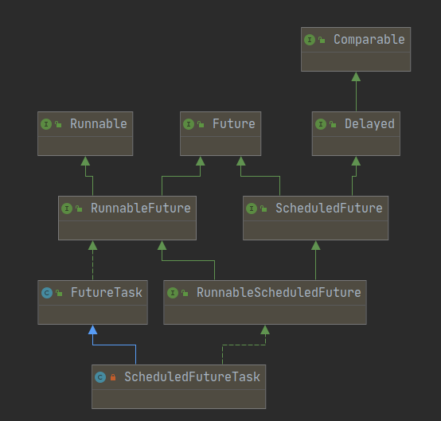

# ScheduledThreadPoolExecutor

### 前言

`ThreadPoolExecutor`的功能已经很强大了，但却没有延时任务的功能。对于`ScheduledThreadPoolExecutor`，它的父类`ThreadPoolExecutor`所做的提交任务都是延时时间为0的延时任务。同时，它也提供了执行周期任务的功能。

### 成员和构造器

```java
public class ScheduledThreadPoolExecutor
        extends ThreadPoolExecutor
        implements ScheduledExecutorService {}
```

从类定义可知，`ScheduledThreadPoolExecutor`继承了`ThreadPoolExecutor`，实际上它也是复用了`ThreadPoolExecutor`的大部分逻辑，只是加了自己的特化处理。

#### 成员

```java
//线程池状态变成Shutdown后，是否还需要执行队列中的周期任务
private volatile boolean continueExistingPeriodicTasksAfterShutdown;

//线程池状态变成Shutdown后，是否还需要执行队列中的延迟任务。默认为true
private volatile boolean executeExistingDelayedTasksAfterShutdown = true;

//取消Future后，是否将其从队列中移除
private volatile boolean removeOnCancel = false;

//如果两个任务的到期时间相同，则通过这个比较前后
private static final AtomicLong sequencer = new AtomicLong();
```

重用的父类`ThreadPoolExecutor`成员就不介绍了。

#### 构造器

直接看参数最多的这版。

```java
public ScheduledThreadPoolExecutor(int corePoolSize,
                                   ThreadFactory threadFactory,
                                   RejectedExecutionHandler handler) {
    //直接调用了父类的构造器
    super(corePoolSize, Integer.MAX_VALUE, 0, NANOSECONDS,
          new DelayedWorkQueue(), threadFactory, handler);
}
```

我们知道execute中的执行策略受到这三个成员：`corePoolSize`、`maximumPoolSize`、阻塞队列 的影响。但从这个构造器中可以发现`maximumPoolSize`和阻塞队列都已经被写死了。并且由于重写了execute，现在`ScheduledThreadPoolExecutor`的执行策略是：先让线程数量增加到`corePoolSize`，之后不会再增加。

### 提交任务


我们直接看实现`ScheduledExecutorService`接口的部分，其他从`ThreadPoolExecutor`继承过来的提交任务的方法，到头来也是重写后去调用`ScheduledExecutorService`接口方法。

#### ScheduledExecutorService接口——提交延时任务

异步执行一个延时Runnable。

```java
public ScheduledFuture<?> schedule(Runnable command,
                                   long delay,
                                   TimeUnit unit) {
    if (command == null || unit == null)
        throw new NullPointerException();
    RunnableScheduledFuture<?> t = decorateTask(command,
        new ScheduledFutureTask<Void>(command, null,
                                      triggerTime(delay, unit)));
    delayedExecute(t);
    return t;
}

private long triggerTime(long delay, TimeUnit unit) {
    //括号里算出来ns单位的时间段。延时时间不允许小于0
    return triggerTime(unit.toNanos((delay < 0) ? 0 : delay));
}

//任务可以执行的绝对时间
long triggerTime(long delay) {//参数为 ns单位的时间段
    return now() +//当前ns时间加上参数
        ((delay < (Long.MAX_VALUE >> 1)) ? delay : overflowFree(delay));
}
```

异步执行一个延时Callable。

```java
public <V> ScheduledFuture<V> schedule(Callable<V> callable,
                                       long delay,
                                       TimeUnit unit) {
    if (callable == null || unit == null)
        throw new NullPointerException();
    RunnableScheduledFuture<V> t = decorateTask(callable,
        new ScheduledFutureTask<V>(callable,
                                   triggerTime(delay, unit)));
    delayedExecute(t);
    return t;
}
```

上面两个方法都提供了一个钩子方法`decorateTask`，它的默认实现如下：

```java
protected <V> RunnableScheduledFuture<V> decorateTask(
    Callable<V> callable, RunnableScheduledFuture<V> task) {
    return task;
}
```

`decorateTask`的默认实现是直接返回第二个参数，我们知道第二个实参也是经过第一个实参才构造出来的。所以我们可以自己重写`decorateTask`，忽略掉第二个参数，然后通过第一个参数构造出一个自定义实现的`RunnableScheduledFuture`。

#### 继承部分

以下函数都是继承自`ThreadPoolExecutor`的，但将实现都重写了。

```java
public void execute(Runnable command) {        
    schedule(command, 0, NANOSECONDS);*//忽略返回值*    
}
```

`execute`就相当于执行一个延时0秒的延时任务。

```java
 public Future<?> submit(Runnable task) {        
     return schedule(task, 0, NANOSECONDS);    
 }
```

相比上一个，返回了`schedule`的返回值。

```java
 public <T> Future<T> submit(Runnable task, T result) {
        return schedule(Executors.callable(task, result), 0, NANOSECONDS);
}
```

`Executors.callable(task, result)`适配成一个`Callable`。

```java
public <T> Future<T> submit(Callable<T> task) {
        return schedule(task, 0, NANOSECONDS);
}
```

这些函数对于`ScheduledThreadPoolExecutor`来说，都是提交的0延时的延时任务。

#### 提交周期任务

在一定条件下（之后进行讲解），这个函数的周期任务，当前周期的**开始时刻**与下一个周期的开始时刻总是相差`period`单位时间。

```java
public ScheduledFuture<?> scheduleAtFixedRate(Runnable command,
                                              long initialDelay,
                                              long period,
                                              TimeUnit unit) {
    if (command == null || unit == null)
        throw new NullPointerException();
    if (period <= 0)
        throw new IllegalArgumentException();
    ScheduledFutureTask<Void> sft =
        new ScheduledFutureTask<Void>(command,
                                      null,
                                      triggerTime(initialDelay, unit),
                                      unit.toNanos(period));
    RunnableScheduledFuture<Void> t = decorateTask(command, sft);
    sft.outerTask = t;
    delayedExecute(t);
    return t;
}
```

- 多了一个参数`unit.toNanos(period)`设置周期，为正数代表是`FixedRate`。
- 由于`decorateTask`的实现可能会被修改，所以`delayedExecute(t)`的实参一定要是`decorateTask`的返回值。

这个函数的周期任务，当前周期的**结束时刻**与下一个周期的开始时刻总是相差`period`单位时间。即这个函数是考虑了每个周期的执行时间了的。

```java
public ScheduledFuture<?> scheduleWithFixedDelay(Runnable command,
                                                 long initialDelay,
                                                 long delay,
                                                 TimeUnit unit) {
    if (command == null || unit == null)
        throw new NullPointerException();
    if (delay <= 0)
        throw new IllegalArgumentException();
    ScheduledFutureTask<Void> sft =
        new ScheduledFutureTask<Void>(command,
                                      null,
                                      triggerTime(initialDelay, unit),
                                      unit.toNanos(-delay));
    RunnableScheduledFuture<Void> t = decorateTask(command, sft);
    sft.outerTask = t;
    delayedExecute(t);
    return t;
}
```

- 多了一个参数`unit.toNanos(period)`设置周期，为负数代表是`FixedDelay`。

#### delayedExecute

所有提交任务的函数都调用到了`delayedExecute`，它才是提交任务的关键逻辑。

```java
private void delayedExecute(RunnableScheduledFuture<?> task) {
    if (isShutdown())//如果线程池已经关闭，那么不能提交新任务
        reject(task);//执行拒绝策略
    else {
        super.getQueue().add(task);//先添加到队列
        if (isShutdown() &&//添加后发现线程池关闭
            !canRunInCurrentRunState(task.isPeriodic()) &&//判断该任务在shutdown后，是否还可以执行
            remove(task))//上面判断不能执行，那么remove这个task
            task.cancel(false);//取消这个task
        else
            ensurePrestart();//启动新线程，去获得task来执行
    }
}
```

我们先看正常逻辑，不管线程池关闭的情况，那么加入task队列后，执行`ensurePrestart`。

```java
void ensurePrestart() {
    int wc = workerCountOf(ctl.get());
    if (wc < corePoolSize)//如果线程数量还没达到corePoolSize，那么添加一个线程
        addWorker(null, true);
    //如果wc >= corePoolSize且wc == 0，其实就是特指corePoolSize为0的情况，
	//这种情况，必须至少起一个线程来执行task
    else if (wc == 0)
        addWorker(null, false);
}
```

可以发现`ScheduledThreadPoolExecutor`的提交任务的策略很简单：

1. 先把task入队队列。
2. 增加一个线程，直到线程数量达到`corePoolSize`。

再看看加入队列后发现池关闭的逻辑，先执行`canRunInCurrentRunState(task.isPeriodic())`：

```java
boolean canRunInCurrentRunState(boolean periodic) {
    return isRunningOrShutdown(periodic ?
                               continueExistingPeriodicTasksAfterShutdown :
                               executeExistingDelayedTasksAfterShutdown);
}

final boolean isRunningOrShutdown(boolean shutdownOK) {
    int rs = runStateOf(ctl.get());
    return rs == RUNNING || (rs == SHUTDOWN && shutdownOK);
}
```

+ 如果是RUNNING状态，肯定可以执行。返回true。
+ 如果是SHUTDOWN状态，则根据传入参数决定。返回shutdownOK的值。
+ 如果是SHUTDOWN之后的值（STOP、TIDYING、TERMINATED），那肯定不可以执行。返回false。
+ 总之，`canRunInCurrentRunState`返回false，就代表刚入队的task不能被执行。

既然`canRunInCurrentRunState`返回了false，则需要从队列移除task：

```java
public boolean remove(Runnable task) {
    //如果移除成功，则肯定不会被工作线程执行到。因为工作线程是先出队task后，再去执行task.run()的
    boolean removed = workQueue.remove(task);
    tryTerminate(); // 当前状态可能是SHUTDOWN，且队列为空，可以变更状态为TIDYING了
    return removed;
}
```

既然已经移除成功，那么这个task则肯定不会执行到了，但提交任务函数总会返回这个`ScheduledFuture`对象的，所以我们必须告诉调用者这个信息（线程池已经关闭），通过调用`task.cancel(false)`。

```java
//ScheduledFutureTask内部类
public boolean cancel(boolean mayInterruptIfRunning) {
    boolean cancelled = super.cancel(mayInterruptIfRunning);//直接调用到父类FutureTask的实现
    if (cancelled && removeOnCancel && heapIndex >= 0)
        remove(this);//调用到外部类的方法，也就是上面的方法
    return cancelled;
}
```

+ `super.cancel(mayInterruptIfRunning)`这里是直接调用到`ScheduledFutureTask`的父类`FutureTask`的实现。而出队成功则说明这个task肯定没有被工作线程执行过`task.run()`，所以上面的`super.cancel(mayInterruptIfRunning)`肯定会使得`FutureTask`的状态变成CANCELLED或INTERRUPTED。
+ 即使取消成功，还需要判断`&& removeOnCancel && heapIndex >= 0`，`removeOnCancel`代表取消后是否需要删除，而`heapIndex`则是task在最小堆中的索引，如果它存在于堆中那么索引是`>= 0`的。
+ `remove(this)`看起来有点重复操作，这其实因为`ScheduledFutureTask#cancel`会在`ScheduledFutureTask#run`中调用。考虑本章的执行过程，这里会`heapIndex`不满足而不会执行`remove(this)`。

### ScheduledFutureTask内部类



`ScheduledFutureTask`实例在`delayedExecute`中入队到task队列中，所以工作线程出队task后执行的是`ScheduledFutureTask#run()`。这个类图看起来很吓人，其实我们只需要关注它同时实现了`Runnable` 、`Future `、`Delayed`接口即可，当然，`ScheduledFutureTask`的逻辑大量复用了其父类`FutureTask`的逻辑。

#### 成员和构造器

```java
		 /** 通过原子类获得的独一无二的序号，当两个task的time相同时，用这个属性来决定先后 */
        private final long sequenceNumber;

        /** 一个绝对时间，从这个时间往后，当前task可以被执行 */
        private long time;

        /**
         * 周期值。
         * 1. 正数代表是fixed-rate周期任务。
         * 2. 负数代表是fixed-delay周期任务。
         * 3. 0代表是延时任务。
         */
        private final long period;

        /** 下一个周期将要被执行的task，默认是this */
        RunnableScheduledFuture<V> outerTask = this;
        
		/** task在堆上的索引，标识作用，当被从堆中删除时，索引为-1，正常为非负数。用来判断是否需要remove */
        int heapIndex;
```

```java
ScheduledFutureTask(Runnable r, V result, long ns, long period) {
            super(r, result);
            this.time = ns;//允许执行的绝对时间
            this.period = period;//周期
            this.sequenceNumber = sequencer.getAndIncrement();//获得唯一序号
}
```

#### run方法

重写了父类`FutureTask`的run方法，但也会去调用父类版本的run方法。

```java
public void run() {
            boolean periodic = isPeriodic();
            if (!canRunInCurrentRunState(periodic))//根据当前线程池状态，是否可以运行
                cancel(false);//取消task，并根据removeOnCancel移除task
            //如果可以运行
            else if (!periodic)//如果不是周期任务，那就执行父类run
                ScheduledFutureTask.super.run();
            //如果是周期任务，那就执行父类的runAndReset。
            else if (ScheduledFutureTask.super.runAndReset()) {//返回true才会把下一个重复task放入队列
                setNextRunTime();
                reExecutePeriodic(outerTask);
            }
}
```

如果不是周期任务，那就执行过程就和`FutureTask`一样。我们重点看看周期任务的执行策略，首先是执行`runAndReset`。

```java
//FutureTask.java
protected boolean runAndReset() {
        if (state != NEW ||
            !UNSAFE.compareAndSwapObject(this, runnerOffset,
                                         null, Thread.currentThread()))
            return false;
        boolean ran = false;
        int s = state;
        try {
            Callable<V> c = callable;
            if (c != null && s == NEW) {
                try {
                    c.call(); // don't set result
                    ran = true;
                } catch (Throwable ex) {
                    setException(ex);
                }
            }
        } finally {
            // runner must be non-null until state is settled to
            // prevent concurrent calls to run()
            runner = null;
            // state must be re-read after nulling runner to prevent
            // leaked interrupts
            s = state;
            if (s >= INTERRUPTING)
                handlePossibleCancellationInterrupt(s);
        }
        return ran && s == NEW;
}
```

相同run函数，这个函数有些不同：

+ 正常执行完`c.call()`后，不会去执行`set()`。因为本来`c.call()`就没有返回值。
+ `runAndReset`具有返回值，`ran && s == NEW`前者代表`c.call()`没有抛出异常（如果执行了`setException`，状态也会经历NEW -> COMPLETING -> EXCEPTIONAL的），后者代表没有被执行过`task.cancel()`（可能经历NEW -> CANCELLED或NEW -> INTERRUPTING -> INTERRUPTED）。
+ 总之，没有出现上面的异常情况的话，task状态会一直保持NEW的。

如果`ScheduledFutureTask.super.runAndReset()`没有发现异常情况，并顺利返回true的话，那么就把下一个周期的重复task入队：

```java
private void setNextRunTime() {
    long p = period;
    if (p > 0)  //固定速率执行，scheduleAtFixedRate
        time += p;  //按照上一次周期的开始时刻，再加上周期值
    else       //固定延迟执行，scheduleWithFixedDelay
        time = triggerTime(-p);   //按照现在时刻(即当前周期的结束时刻)，再加上周期值
}
```

从上面实现看起来，`scheduleAtFixedRate`和`scheduleWithFixedDelay`似乎是做到了名副其实。

```java
void reExecutePeriodic(RunnableScheduledFuture<?> task) {
    if (canRunInCurrentRunState(true)) {//判断当前线程池状态，是否可以入队
        super.getQueue().add(task);//任务入列
        //如果入队后发现线程池状态变了，则先移除task，再取消它。这和提交任务的逻辑一样
        if (!canRunInCurrentRunState(true) && remove(task))
            task.cancel(false);
        else
            ensurePrestart();//启动一个新的线程等待任务
    }
}
```

`reExecutePeriodic`将重复task入队，整个过程和`delayedExecute`类似。

#### 分析周期任务执行过程

上面说过，`scheduleAtFixedRate`在一定条件下，当前周期的开始时刻与下一个周期的开始时刻总是相差`period`单位时间。虽然`setNextRunTime`确实能保证，两个周期的开始时刻总是相差`period`，但加入队列的时机是`ScheduledFutureTask.super.runAndReset()`完成后，如果task执行时间需要很久已经超过了`period`，那么下一个周期的实际开始时刻的差距则肯定超过了`period`了，即这种情况下，下一个周期的任务加入队列时，就已经是可以被执行的状态了。

而`scheduleWithFixedDelay`的逻辑，则完全符合`ScheduledFutureTask.super.runAndReset()`的完成时机，`runAndReset`执行完后`setNextRunTime`会以当前时刻（当前周期的结束时刻）再加上`period`作为新任务的time。

而在`reExecutePeriodic`执行后，即使这个task马上就能被执行，如果没有空闲的工作线程，那么这个task也得等到有空闲线程时，才会被执行。

### 关闭线程池

```java
//ScheduledThreadPoolExecutor
public void shutdown() {
        super.shutdown();
}
//ThreadPoolExecutor
 public void shutdown() {
        final ReentrantLock mainLock = this.mainLock;
        mainLock.lock();
        try {
            checkShutdownAccess();
            advanceRunState(SHUTDOWN);
            interruptIdleWorkers();
            onShutdown(); // 这里有一个钩子方法，ScheduledThreadPoolExecutor把它实现了
        } finally {
            mainLock.unlock();
        }
        tryTerminate();
}
```

```java
  @Override
void onShutdown() {
        BlockingQueue<Runnable> q = super.getQueue();
        boolean keepDelayed =
            getExecuteExistingDelayedTasksAfterShutdownPolicy();
        boolean keepPeriodic =
            getContinueExistingPeriodicTasksAfterShutdownPolicy();
        if (!keepDelayed && !keepPeriodic) {//如果延时任务和周期任务都不允许在Shutdown后被执行，那好办，无差别取消每个任务
            for (Object e : q.toArray())
                if (e instanceof RunnableScheduledFuture<?>)
                    ((RunnableScheduledFuture<?>) e).cancel(false);
            q.clear();
        }
        else {
            // 遍历队列的快照，避免迭代器异常
            for (Object e : q.toArray()) {
                if (e instanceof RunnableScheduledFuture) {
                    RunnableScheduledFuture<?> t =
                        (RunnableScheduledFuture<?>)e;
                    if ((t.isPeriodic() ? !keepPeriodic : !keepDelayed) || //根据延时任务还是周期任务
                        t.isCancelled()) { // 即使task已经取消掉了，也要移除它
                        if (q.remove(t))
                            t.cancel(false);
                    }
                }
            }
        }
        tryTerminate();//帮助终止线程池
}
```

这使得ScheduledThreadPoolExecutor的`shutdown`的逻辑完全不一样了，因为线程池shutdown后，剩余任务不再是肯定会执行到的了，而是根据两个`run-after-shutdown`参数（`continueExistingPeriodicTasksAfterShutdown`和`executeExistingDelayedTasksAfterShutdown`）来做决定。

### 优先队列

内部类`DelayedWorkQueue`实现了一个延时优先队列，它完全类似于`DelayQueue`，所以本文不会讲解这部分内容。唯一一点不同是，它会节点所在数组索引记录在`ScheduledFutureTask`节点的`heapIndex`成员上，它会时刻保持节点的数组索引正确。

+ 节点在堆中时，索引为非负数；节点被删除时，索引为-1。
+ 堆中查找节点时，时间复杂度为$O(1)$。

### 总结

+ 有两种周期任务：`FixedRate`和`FixedDelay`。
	+ 下一个周期的重复任务能够进入队列的前提是，当前周期执行重复任务时没有抛出异常。
	+ `FixedRate`是当前周期的结束时刻与下一个周期的开始时刻总是相差`period`单位时间。但如果当前周期执行花费太多时间，会导致下一个周期迟迟无法入队。
	+ `FixedDelay`是当前周期的结束时刻与下一个周期的开始时刻总是相差`period`单位时间。当前周期的执行时间有多久都不影响。
	+ 任务入队后，即将当前时刻已经可以被执行，如果没有空闲的工作线程来取task，那么也不会被执行。因为`ScheduledThreadPoolExecutor`最多只能起`corePoolSize`个线程。
+  关于`shutdown`的逻辑有点不一样，它是根据两个run-after-shutdown参数来判断队列剩余任务在`shutdown`后是否可以继续被执行。