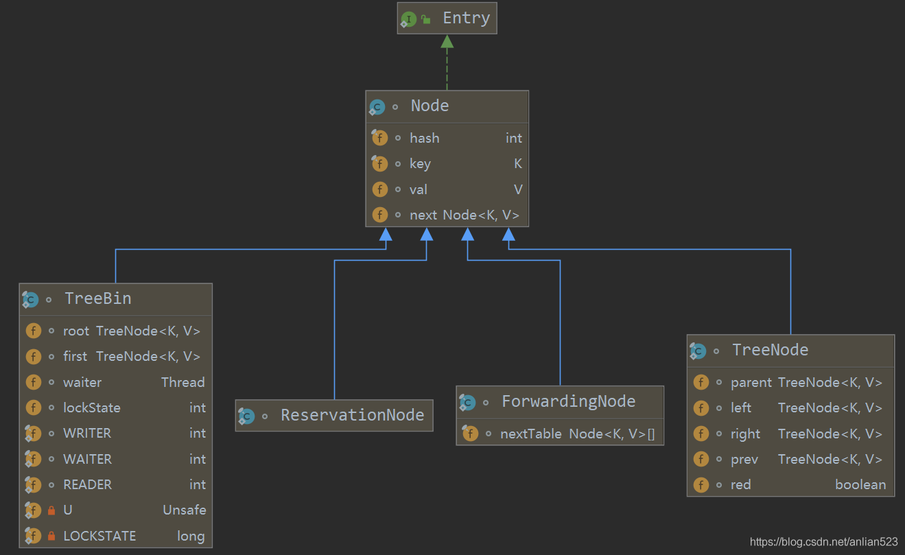
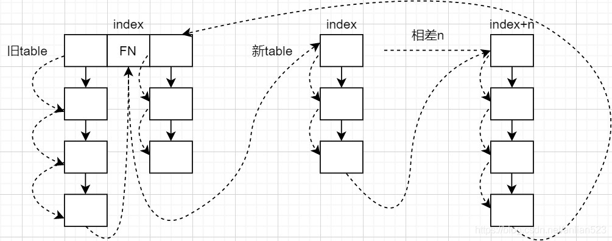
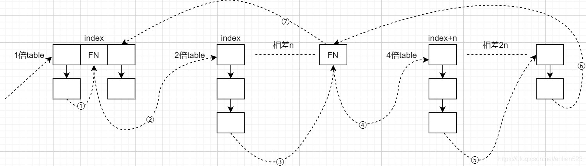

# ConcurrentHashMap

### 前言

ConcurrentHashMap是一种支持并发操作的HashMap，并发控制方面，它使用更小粒度的锁——对每个哈希桶的头节点加锁。虽然这样使得效率更高，能让读写操作最大程序的并发执行，但也造成了读写操作的一致性很弱，比如size()返回的大小可能已经与真实大小不一样，比如clear()调用返回后Map中却拥有着元素。

### 常量

```java
static final int MOVED     = -1; // hash for forwarding nodes
static final int TREEBIN   = -2; // hash for roots of trees
static final int RESERVED  = -3; // hash for transient reservations
```
ConcurrentHashMap中的正常节点的hash值都会是`>=0`的数，但还有三种特殊节点，它们的hash值可能是上面的三个值。

- `MOVED`：代表此节点是扩容期间的转发节点，这个节点持有新table的引用。
- `TREEBIN`：代表此节点是红黑树的节点。
- `RESERVED`：代表此节点是一个占位节点，不包含任何实际数据。

### 成员

```java
//存放Node的数组,正常情况下节点都在这个数组里
transient volatile Node<K,V>[] table;
//一个过渡用的table表,在扩容时节点会暂时跑到这个数组上来
private transient volatile Node<K,V>[] nextTable;
//计数器值 = baseCount + 每个CounterCell[i].value。所以baseCount只是计数器的一部分
private transient volatile long baseCount;
//1. 数组没新建时，暂存容量
//2. 数组正在新建时，为-1
//3. 正常情况时，存放阈值
//4. 扩容时，高16bit存放旧容量唯一对应的一个标签值，低16bit存放进行扩容的线程数量
private transient volatile int sizeCtl;
//扩容时使用，平时为0，扩容刚开始时为容量，代表下一次领取的扩容任务的索引上界
private transient volatile int transferIndex;
//CounterCell相配套一个独占锁
private transient volatile int cellsBusy;
//counterCells也是计数器的一部分
private transient volatile CounterCell[] counterCells;
```

+ table。存放节点的数组，只有第一个插入节点时才初始化，默认容量为16。扩容会让容量变成2倍，即保持为2的幂。
+ nextTable。扩容时需要使用，暂存新table，扩容完毕时，会把新table赋值给table。
+ sizeCtl。如果使用ConcurrentHashMap的无参构造器，那么它默认为0。其他的值，它都有不同的含义：
	+ 数组没新建时，暂存容量。第一个插入节点时，会按照这个容量新建数组。
	+ 数组正在新建时，为−1。
	+ 正常情况时，存放阈值。阈值 = 0.75 * 容量。
	+ 扩容时，高16bit存放旧容量唯一对应的一个标签值，低16bit存放进行扩容的线程数量。
+ transferIndex。扩容时每个线程通过CAS修改该成员，来领取扩容任务。
+ baseCount和counterCells。是计数器的实现依赖，类似于LongAdder，它利用ThreadLocalRandom的探针机制来避免频繁的CAS失败，从而减少了因CAS失败而产生的自旋。

### 结点类



+ 如果哈希桶的结构是单链表，那么每个节点的类型为Node。其中val域是volatile的，因为可以执行替换操作。next也是volatile的，因为可以执行删除操作，导致链表结构发生变化。
+ 如果哈希桶的结构是红黑树，那么存放在数组索引处的节点类型为TreeBin，但它不是真正的红黑树的root节点。它的root成员才是红黑树根节点。也就是说，TreeBin封装了TreeNode，这是有好处的，因为红黑树随着平衡操作，根节点随时可能发生变化，但用TreeBin进行封装，可以让数组成员不会发生变化。
	真正的红黑树节点类型为TreeNode。只有当数组容量>=64且单个链表长度>=8，才会让这个链表转换为红黑树。
+ ForwardingNode是扩容期间的转发节点，这个节点持有新table的引用。
+ ReservationNode是占位节点，不包含任何实际数据。在computeIfAbsent和compute方法中使用。

### 构造器

```java
public ConcurrentHashMap() {
}

public ConcurrentHashMap(int initialCapacity) {
    if (initialCapacity < 0)
        throw new IllegalArgumentException();
    int cap = ((initialCapacity >= (MAXIMUM_CAPACITY >>> 1)) ?
               MAXIMUM_CAPACITY :
               tableSizeFor(initialCapacity + (initialCapacity >>> 1) + 1));
    this.sizeCtl = cap;
}

public ConcurrentHashMap(int initialCapacity,
                         float loadFactor, int concurrencyLevel) {
    if (!(loadFactor > 0.0f) || initialCapacity < 0 || concurrencyLevel <= 0)
        throw new IllegalArgumentException();
    if (initialCapacity < concurrencyLevel)   // Use at least as many bins as estimated threads
        initialCapacity = concurrencyLevel;
    long size = (long)(1.0 + (long)initialCapacity / loadFactor);
    //tableSizeFor的作用是计算比size大的最小2的幂次方
    int cap = (size >= (long)MAXIMUM_CAPACITY) ?
        MAXIMUM_CAPACITY : tableSizeFor((int)size);
    this.sizeCtl = cap;
}
```

### put插入操作

```java
public V put(K key, V value) {
    return putVal(key, value, false);
}

//核心实现
final V putVal(K key, V value, boolean onlyIfAbsent) {
    //不允许null的key或者null的value
    if (key == null || value == null) throw new NullPointerException();
    //根据原始的hash值，获得处理后的hash值
    int hash = spread(key.hashCode());
    //一个hash桶内的节点数
    int binCount = 0;
    //外界是一个循环，如果不成功将不断尝试
    for (Node<K,V>[] tab = table;;) {
        Node<K,V> f; int n, i, fh;
        //如果tab还未初始化，那就先初始化
        if (tab == null || (n = tab.length) == 0)
            tab = initTable();
        //如果索引位置的元素为null，那么直接在该位置上分配新Node
        //注意这是CAS操作
        else if ((f = tabAt(tab, i = (n - 1) & hash)) == null) {
            if (casTabAt(tab, i, null, new Node<K,V>(hash, key, value, null)))
                break;                   // no lock when adding to empty bin
        }
        //执行到这，索引位置的元素不为null
        //节点的hash值为MOVED，则帮忙扩容转移
        else if ((fh = f.hash) == MOVED)
            tab = helpTransfer(tab, f);
        //其他情况
        else {
            V oldVal = null;
            //获取索引位置的元素的监视器锁
            synchronized (f) {
                //检查f是否还在这个索引位置
                if (tabAt(tab, i) == f) {
                    //hash一般>0，除了之前讲的三种特殊状态
                    if (fh >= 0) {
                        //f是链表的头结点，需要把自身考虑进去
                        binCount = 1;
                        for (Node<K,V> e = f;; ++binCount) {
                            K ek;
                            //如果有重复的key，根据onlyIfAbsent决定是否替换
                            if (e.hash == hash &&
                                ((ek = e.key) == key ||
                                 (ek != null && key.equals(ek)))) {
                                oldVal = e.val;
                                if (!onlyIfAbsent)
                                    e.val = value;
                                break;
                            }
                            Node<K,V> pred = e;
                            //如果没有发现对应的key，那么新建一个节点，插入到末尾
                            if ((e = e.next) == null) {
                                pred.next = new Node<K,V>(hash, key,
                                                          value, null);
                                break;
                            }
                        }
                    }
                    //如果f是一个TreeBin
                    else if (f instanceof TreeBin) {
                        Node<K,V> p;
                        //保持为2
                        binCount = 2;
                        if ((p = ((TreeBin<K,V>)f).putTreeVal(hash, key,
                                                       value)) != null) {
                            //如果putTreeVal的返回值不为null，表示之前已经存在对应的key的节点
                            //其返回值p就是已经存在的key节点
                            oldVal = p.val;
                            if (!onlyIfAbsent)
                                p.val = value;
                        }
                    }
                }
            }
            if (binCount != 0) {
                if (binCount >= TREEIFY_THRESHOLD)
                    treeifyBin(tab, i);
                //如果oldVal不为null，表示之前已经存在的对应的key节点
                //因此直接返回而不是break
                //因为后续需要增加size
                if (oldVal != null)
                    return oldVal;
                break;
            }
        }
    }
    addCount(1L, binCount);
    return null;
}
```

#### 加锁情况

`putVal`是写操作，当定位到某个非空的哈希桶，需要对这个哈希桶的头节点`synchronized`加锁。相反，当定位到的是空的哈希桶，则只需要CAS修改就好了。

> 在后面的每种修改的情况，如果需要加锁，那么都是对这个哈希桶的头结点加锁。对于链表的头结点是不会变的，而红黑树结构的哈希桶的头结点是TreeBin节点，不会变（红黑树的root是存在TreeBin里的）。因此额外设计TreeBin而不直接用红黑树节点代替的原因就能够理解了。

#### 红黑树模式下的binCount固定为2

- 已经检测到该哈希桶是红黑树了，就不用再树化（`binCount >= TREEIFY_THRESHOLD`）。
- 传入`addCount(1L, binCount)`的第二个参数为2，保证之后能进行扩容检查。

#### 返回情况

- 返回null，说明`putVal`执行的新建节点的操作。
- 返回非null值，说明`putVal`检测到了重复节点，至于替换与否，根据onlyIfAbsent决定。

#### spread

```java
static final int HASH_BITS = 0x7fffffff; // 后面有31个1，相当于符号位固定为0，

static final int spread(int h) {
	//低16位将受到高16位的扰动，& HASH_BITS后肯定为正数
    return (h ^ (h >>> 16)) & HASH_BITS;
}
```
### initTable

```java
private final Node<K,V>[] initTable() {
    Node<K,V>[] tab; int sc;
    while ((tab = table) == null || tab.length == 0) {
        //如果sizeCtl为-1，表示数组正在初始化，那么让出cpu
        //外面是个循环，可以看做是自旋
        if ((sc = sizeCtl) < 0)
            Thread.yield();
        //如果sizeCtl非负数，那么将它CAS为-1，表示正在初始化
        else if (U.compareAndSwapInt(this, SIZECTL, sc, -1)) {
            try {
                if ((tab = table) == null || tab.length == 0) {
                    //一般地，初始化时如果sizeCtl大于0，那么它暂存着容量
                    int n = (sc > 0) ? sc : DEFAULT_CAPACITY;
                    @SuppressWarnings("unchecked")
                    Node<K,V>[] nt = (Node<K,V>[])new Node<?,?>[n];
                    table = tab = nt;
                    //初始化完，sc就存放这阈值了，阈值为capacity*0.75
                    sc = n - (n >>> 2);
                }
            } finally {
                sizeCtl = sc;
            }
            break;
        }
    }
    return tab;
}
```

+ 根据sizeCtl是否为-1来判断数组是否在初始化中，如果sizeCtl为-1，那么让出CPU，自旋。如果不是-1，那么尝试将它CAS为-1，CAS成功后开始进行初始化。
+ 初始化时，sizeCtl如果>0，那么存着初始化容量。初始化后sizeCtl保存着阈值。

### helpTransfer

```java
//该方法只是获取扩容许可，真正的扩容过程在transfer方法里
//这个f只是用来提供nextTable的ForwardingNode
final Node<K,V>[] helpTransfer(Node<K,V>[] tab, Node<K,V> f) {
    Node<K,V>[] nextTab; int sc;
    //检查f是否是ForwardingNode，并从f的成员里获得nextTab
    if (tab != null && (f instanceof ForwardingNode) &&
        (nextTab = ((ForwardingNode<K,V>)f).nextTable) != null) {
        //一旦进入到此分支，返回的肯定是新的table
        
        //按照当前容量，得到与当前容量唯一对应的一个标签值
        int rs = resizeStamp(tab.length);
        //sizeCtl<0，表示正在扩容或者正在初始化
        //转移肯定在初始化后，因此这里表示正在扩容
        while (nextTab == nextTable && table == tab &&
               (sc = sizeCtl) < 0) {
            //退出循环的条件，在后续会有分析
            if ((sc >>> RESIZE_STAMP_SHIFT) != rs || sc == rs + 1 ||
                sc == rs + MAX_RESIZERS || transferIndex <= 0)
                break;
            //CAS成功时，进行扩容
            if (U.compareAndSwapInt(this, SIZECTL, sc, sc + 1)) {
                transfer(tab, nextTab);
                break;
            }
        }
        return nextTab;
    }
    return table;
}
```

```java
private static int RESIZE_STAMP_BITS = 16;
//按照当前容量n，得到与当前容量n唯一对应的一个标签值
static final int resizeStamp(int n) {
    return Integer.numberOfLeadingZeros(n) | (1 << (RESIZE_STAMP_BITS - 1));
}
```

#### sizeCtl的高16bit

table的最小容量为$2^4$，`numberOfLeadingZeros`为27；table的最大容量为$2^{30}$，`numberOfLeadingZeros`为1。

因此`numberOfLeadingZeros(n)`的取值范围为1~27。而`1 << (RESIZE_STAMP_BITS - 1)`即`1<<15`，第16位为1。两者相或，互不影响。

扩容时，`resizeStamp`的值将作为`sizeCtl`的高16bit，那么`sizeCtl`的符号位为1，因此必为负数。又因为`numberOfLeadingZeros`的上限为27，因此`sizeCtl`不会等于-1，不会发生语义冲突（`sizeCtl=-1`表示正在初始化）。

#### sizeCtl的低16bit

sizeCtl的低16bit用作线程扩容的许可（即记录已经发放的许可数量），在范围内对`sizeCtl`进行较小数的加减操作可以认为是相应线程扩容的许可的发放与收回。

每一个线程来扩容时都需要获得许可：

- 第一个开始扩容的线程，进入`transfer`前需要获得2个许可。实际动作为：sizeCtl + 2。
- 之后开始扩容的线程，进入`transfer`前需要获得1个许可。实际动作为：izeCtl + 1。

所有的线程执行为`transfer`任务，归还许可时，`sizeCtl`的低16bit为1。这个数值可以用作扩容结束前的中间状态。当最后一个线程归回许可，检测到`sizeCtl`的低16bit为1时，将会从头到尾检查一遍每个哈希桶是否都完成了转移。

#### 退出循环的条件

```java
if ((sc >>> RESIZE_STAMP_SHIFT) != rs || sc == rs + 1 ||
    sc == rs + MAX_RESIZERS || transferIndex <= 0)
    break;
```

这里有个[bug](https://bugs.java.com/bugdatabase/view_bug.do?bug_id=JDK-8214427)，`sc==rs+1`将永远为false。因为sc的最高位为1，必为负数，而rs本身是正数。因此这里应该是`sc==(rs<<RESIZE_STAMP_SHIFT)+1`。后面的`sc==rs+MAX_RESIZERS`也应该改为`sc==(rs<<RESIZE_STAMP_SHITF)+MAX_RESIZERS`。

+ `sc >>> RESIZE_STAMP_SHIFT) != rs`：标签变动了，说明table已经因为扩容发生了变化。
+ `sc==(rs<<RESIZE_STAMP_SHIFT)+1`：低16bit为1，说明现在处于扩容结束前的中间状态。
+ `sc==(rs<<RESIZE_STAMP_SHITF)+MAX_RESIZERS`：许可已经发放完。
+ ` transferIndex <= 0`：transfer任务已经发放完。

### treeifyBin

该函数首先判断操作应该是扩容，还是树化，真正的树化操作交给了`TreeBin`的构造器。

```java
private final void treeifyBin(Node<K,V>[] tab, int index) {
    Node<K,V> b; int n, sc;
    if (tab != null) {
        //如果容量没达到MIN_TREEIFY_CAPACITY，那么就扩容
        if ((n = tab.length) < MIN_TREEIFY_CAPACITY)
            tryPresize(n << 1);
        //如果该位置上的slot不为null，且hash值为正常值，那么进行树化
        else if ((b = tabAt(tab, index)) != null && b.hash >= 0) {
            //获取头节点的对象锁
            synchronized (b) {
                //再次确定b是头节点
                if (tabAt(tab, index) == b) {
                    //head, tail
                    TreeNode<K,V> hd = null, tl = null;
                    for (Node<K,V> e = b; e != null; e = e.next) {
                        TreeNode<K,V> p =
                            new TreeNode<K,V>(e.hash, e.key, e.val,
                                              null, null);
                        //尾插法
                        if ((p.prev = tl) == null)
                            hd = p;
                        else
                            tl.next = p;
                        tl = p;
                    }
                    //前面只是将所有的TreeNode用prev与next串在一起
                    //真正的树化操作在TreeBin的构造器里
                    setTabAt(tab, index, new TreeBin<K,V>(hd));
                }
            }
        }
    }
}
```

### tryPresize

该函数判断需要扩容后，将开始扩容。扩容逻辑类似`addCount`的扩容逻辑。

```java
private final void tryPresize(int size) {
    int c = (size >= (MAXIMUM_CAPACITY >>> 1)) ? MAXIMUM_CAPACITY :
        tableSizeFor(size + (size >>> 1) + 1);
    int sc;
    //size<0有两种情况，一种是正在初始化，一种是正在扩容
    while ((sc = sizeCtl) >= 0) {
        Node<K,V>[] tab = table; int n;
        //表示还未初始化
        if (tab == null || (n = tab.length) == 0) {
            //未初始化时，sizeCtl可能暂存容量值，取两容量的最大值
            n = (sc > c) ? sc : c;
            //将sizeCtl CAS为-1，表示正在初始化
            if (U.compareAndSwapInt(this, SIZECTL, sc, -1)) {
                try {
                    //再次检查
                    if (table == tab) {
                        @SuppressWarnings("unchecked")
                        Node<K,V>[] nt = (Node<K,V>[])new Node<?,?>[n];
                        table = nt;
                        //阈值
                        sc = n - (n >>> 2);
                    }
                } finally {
                    sizeCtl = sc;
                }
            }
        }
        //如果目标容量小于阈值，或者现有容量大于最高容量，则不扩容
        else if (c <= sc || n >= MAXIMUM_CAPACITY)
            break;
        //检查table是否发生变化，如果没有，则扩容
        else if (tab == table) {
            int rs = resizeStamp(n);
            //sc<0表示扩容已经开始
            if (sc < 0) {
                Node<K,V>[] nt;
                //(nt = nextTable) == null说明扩容接受
                //其他的判断条件之前已经分析过了
                if ((sc >>> RESIZE_STAMP_SHIFT) != rs || sc == rs + 1 ||
                    sc == rs + MAX_RESIZERS || (nt = nextTable) == null ||
                    transferIndex <= 0)
                    break;
                //sizeCtl的低16bit+1,一个许可已经发放
                if (U.compareAndSwapInt(this, SIZECTL, sc, sc + 1))
                    transfer(tab, nt);
            }
            //sc>=0，表示当前线程是第一个请求扩容的线程
            //那么将rs设置为sizeCtl的高16bit，低16bit为2（第一个线程）
            else if (U.compareAndSwapInt(this, SIZECTL, sc,
                                         (rs << RESIZE_STAMP_SHIFT) + 2))
                transfer(tab, null);
        }
    }
}
```

### addCount

统计ConcurrentHashMap的size的任务，交给了`baseCount`成员和`counterCells`数组成员。

+ 当`counterCells`为null时，`baseCount`的值就是size。
+ 当`counterCells`不为null时，`baseCount`加上每个`counterCells`的数组元素的值，才是size。

之所以引入`counterCells`数组，是因为如果每个线程都在CAS修改`baseCount`这一个int成员的话，必定会造成大量线程因CAS失败而自旋，从而浪费CPU。现在引入一个`counterCells`数组，让每个数组元素也来承担计数的责任，则线程CAS修改失败的概率下降了不少。

所以，当counterCells不为null时，一定要去优先修改counterCells的某个数组成员的值，而且由于利用了ThreadLocalRandom的probe探针机制来获得数组的随机索引，所以很大概率上，不同线程获得的数组成员是不同的。既然不同线程获得的数组成员不同，那么不同线程尝试CAS修改某个数组成员，肯定不会失败了，从而减小了线程的因CAS失败而导致的自旋。

除此之外，根据`check`参数来决定是否要检测扩容。

```java
//参数x是需要增加的数量。 check用来判断是否需要检测，如果检测到需要扩容，就扩容。
private final void addCount(long x, int check) {
    CounterCell[] as; long b, s;
    
    /*计数部分*/
    if ((as = counterCells) != null || //如果counterCells不为null，短路后面
        !U.compareAndSwapLong(this, BASECOUNT, b = baseCount, s = b + x)) {//如果counterCells为null，但CAS修改baseCount失败
        CounterCell a; long v; int m;
        boolean uncontended = true;
        if (as == null || (m = as.length - 1) < 0 ||//如果as==null或者as.length==0，那么fullAddCount，直接加baseCount上
            (a = as[ThreadLocalRandom.getProbe() & m]) == null ||//如果这个线程分到的索引位置上的CounterCells为空，直接加baseCount上
            !(uncontended =
              U.compareAndSwapLong(a, CELLVALUE, v = a.value, v + x))) {//直接加在counterCells上，如果CAS失败，加在baseCount上
            fullAddCount(x, uncontended);
            return;
        }
        //执行到这里，表示加cells上成功
        
        if (check <= 1)
            return;
        //如果check参数大于1，那么算出当前的size
        s = sumCount();
    }
    
    //执行到这里，要么CAS修改baseCount成功，要么CAS修改cells成功，且s是当前的size
    
    /*扩容部分*/
    if (check >= 0) {
        Node<K,V>[] tab, nt; int n, sc;
        while (s >= (long)(sc = sizeCtl) && (tab = table) != null &&
               (n = tab.length) < MAXIMUM_CAPACITY) {//当前size超过阈值，table已经初始化，当前容量小于最大容量
            int rs = resizeStamp(n);
            //下面的代码就是很熟悉的扩容代码了
            if (sc < 0) {
                if ((sc >>> RESIZE_STAMP_SHIFT) != rs || sc == rs + 1 ||
                    sc == rs + MAX_RESIZERS || (nt = nextTable) == null ||
                    transferIndex <= 0)
                    break;
                if (U.compareAndSwapInt(this, SIZECTL, sc, sc + 1))
                    transfer(tab, nt);
            }
            else if (U.compareAndSwapInt(this, SIZECTL, sc,
                                         (rs << RESIZE_STAMP_SHIFT) + 2))
                transfer(tab, null);
            s = sumCount();//重新统计，继续下一次循环，判断是否再次需要扩容
        }
    }
}
```

### fullAddCount

当`addCount`函数里CAS修改`baseCount`失败、或者CAS修改某个cell的值失败了，会调用到`fullAddCount`。该函数保证能够将x加到`baseCount`或某个cell上去。

```java
private final void fullAddCount(long x, boolean wasUncontended) {
    int h;
    //线程第一次调用fullAddCount，肯定会进入以下分支，因为只有localInit后，probe才不可能为0
    //之后调用fullAddCount，就不可能进入这个分支。
    if ((h = ThreadLocalRandom.getProbe()) == 0) {//探针为0，说明localInit从来没有调用过
        ThreadLocalRandom.localInit();       // 先初始化
        h = ThreadLocalRandom.getProbe(); // 这句get到的就肯定不为0了
        wasUncontended = true;
    }
    boolean collide = false;                // True if last slot nonempty
    for (;;) {
        CounterCell[] as; CounterCell a; int n; long v;
        if ((as = counterCells) != null && (n = as.length) > 0) {//如果counterCells不为null且长度不为0
            if ((a = as[(n - 1) & h]) == null) {//如果当前索引位置上的slot还是null，那么先新建
                if (cellsBusy == 0) {           //如果无人持有锁
                    CounterCell r = new CounterCell(x); 
                    if (cellsBusy == 0 &&
                        U.compareAndSwapInt(this, CELLSBUSY, 0, 1)) {//cellsBusy+CAS成乐观锁
                        boolean created = false;
                        try {               // 再次确认当前索引位置上的slot是null
                            CounterCell[] rs; int m, j;
                            if ((rs = counterCells) != null &&
                                (m = rs.length) > 0 &&
                                rs[j = (m - 1) & h] == null) {
                                //索引位置上赋值创建的cell
                                rs[j] = r;
                                created = true;
                            }
                        } finally {
                            //释放锁
                            cellsBusy = 0;
                        }
                        if (created)
                            break;
                        continue;           //执行到这，当前slot不为null了
                    }
                }
                collide = false;
            }
            else if (!wasUncontended)       // 调用该方法前已经有CAS失败了，将后面的短路，将该变量重置为true
                wasUncontended = true;      // 后面将会对探针进行rehash（执行advanceProbe获得下一个探针）
            else if (U.compareAndSwapLong(a, CELLVALUE, v = a.value, v + x))//CAS修改cell成功，直接退出
                break;
            //如果counterCells更新了，或者数组大小大于CPU个数，短路后面所有if分支，优先移动探针
            else if (counterCells != as || n >= NCPU)
                collide = false;
            //短路后面if分支，并消耗掉collide
            else if (!collide)
                collide = true;
            //一般来说第一次循环的wasUncontended肯定是false（因为只有CAS失败了才调用该方法）
            //因此在第二次循环中，且前面的所有的CAS都失败了，且coutnterCells没有更新，且数组大小小于CPU个数
            //那么考虑将counterCells扩容
            else if (cellsBusy == 0 &&
                     U.compareAndSwapInt(this, CELLSBUSY, 0, 1)) {//获取乐观锁
                try {
                    //再次检查cells是否发生了变动
                    if (counterCells == as) {
                        //扩容
                        CounterCell[] rs = new CounterCell[n << 1];
                        for (int i = 0; i < n; ++i)
                             //赋值引用，防止别的线程加到旧的cells上去（addCount方法是没有获取cellsBusy锁的，所以addCount可能会加到旧的cells上去）
                            rs[i] = as[i];
                        counterCells = rs;
                    }
                } finally {
                    cellsBusy = 0;
                }
                collide = false;
                continue;                   //扩容后，再次重新尝试CAS
            }
            h = ThreadLocalRandom.advanceProbe(h);//获取新的探针
        }
        //到这一步，说明cells没有初始化
        else if (cellsBusy == 0 && counterCells == as &&
                 U.compareAndSwapInt(this, CELLSBUSY, 0, 1)) {//获取乐观锁
            boolean init = false;
            try {                           // 初始化cells
                if (counterCells == as) {
                    //初始长度为2，懒初始化
                    CounterCell[] rs = new CounterCell[2];
                    rs[h & 1] = new CounterCell(x);
                    counterCells = rs;
                    init = true;
                }
            } finally {
                cellsBusy = 0;
            }
            if (init)
                break;
        }
        //最后无可奈何地CAS修改baseCount，成功则直接退出
        else if (U.compareAndSwapLong(this, BASECOUNT, v = baseCount, v + x))
            break;
    }
}
```

#### wasUncontended的作用

- wasUncontended为true，代表线程修改某cell无竞争。
- wasUncontended为false，代表线程修改某cell有竞争。

#### collide的作用

collide的作用跟wasUncontended一样，判断是否需要再尝试新的探针。

#### cellsBusy

cellsBusy+CAS作为乐观锁，对counterCells修改时需要获取该锁。

#### 不用担心把x加到旧的数组成员上去

```java
 for (int i = 0; i < n; ++i)
     rs[i] = as[i];
```

这里直接将引用赋值过去了，防止别的线程加到旧的cells上去（addCount方法是没有获取cellsBusy锁的，所以addCount可能会加到旧的cells上去）

### transfer

transfer是真正的扩容实现，从上文已知它有这么几种调用过程：

+ `putVal` ⇒ `helpTransfer` ⇒ `transfer`。这种过程，当前线程肯定不是第一个获得扩容许可的那个线程。
+ `putVal` ⇒ `addCount` ⇒ `transfer`。这种过程，当前线程可能是第一个获得扩容许可的那个线程。
+ `putVal` ⇒ `treeifyBin` ⇒ `tryPresize` ⇒ `transfer`。这种过程，当前线程可能是第一个获得扩容许可的那个线程。
+ 第一个获得扩容许可的线程将执行`U.compareAndSwapInt(this, SIZECTL, sc, (rs << RESIZE_STAMP_SHIFT) + 2)`，将线程数量从0设置为2，且传递给transfer的第二个参数为null，代表nextTable还没初始化。
+ 之后获得扩容许可的线程将会把线程数增加1，且传递给transfer的第二个参数不为null，传递的就是nextTable。

`transfer`可以被多个线程同时调用，一起完成扩容的工作。而多线程一起工作，就意味着任务需要划分，而且各个线程不要相互干扰。

#### 单线程的HashMap的扩容

1. 新建一个2倍容量的新数组。
2. 旧数组的每个哈希桶，会进行哈希桶分离，分离低桶和高桶。低桶放到新数组的`i`槽位上去，高桶放到新数组的`i + n`上去。

因为索引=hash&(capacity-1)，而capacity为2的k次幂，因此索引为hash的低k bit。而扩容是两倍，因此新的索引为hash的低k+1 bit，因此，旧的位置上的低位桶（即第k bit为1）位置不变，高位桶的位置索引比低位桶多了$2^{k+1}$，即n。

> 注意，HashMap的链表分离（即哈希桶分离）后，它们能保持之前的相对位置，但是ConcurrentHashMap不能保证。

既然每个哈希桶的元素在扩容后，要么留在 原table下标，要么留在 原table下标+旧容量 的新下标。那么说明分别处理不同哈希桶的两个线程是不会互相影响的。这样，就说明可以按照哈希桶为单位来划分transfer任务了。

而领取任务依赖的成员则是`transferIndex`，其初始值为旧table的长度。如果CAS修改`transferIndex`从当前值`current`成功改成`current-stride`，那么当前线程领取到的任务就是：`[current-stride, current-1]`。当前线程依次对旧table上的`current-1`~`current-stride`的位置进行rehash，具体的流程与HashMap的相似，也是高低位桶分离的原理。最终执行完所有任务后，如果当前是最后一个线程，那么将`nextTable`设置为null，将阈值重新计算，后退出。已经处理完的旧table上对应的slot被`ForwardingNode`替换，帮助并发的读操作找到最新的table。

#### transfer

```java
private final void transfer(Node<K,V>[] tab, Node<K,V>[] nextTab) {
    int n = tab.length, stride;
    //计算分配任务的步长
    if ((stride = (NCPU > 1) ? (n >>> 3) / NCPU : n) < MIN_TRANSFER_STRIDE)
        stride = MIN_TRANSFER_STRIDE; 
    if (nextTab == null) {// nextTab还没有初始化
        try {
            @SuppressWarnings("unchecked")
            //两倍扩容
            Node<K,V>[] nt = (Node<K,V>[])new Node<?,?>[n << 1];
            nextTab = nt;
        } catch (Throwable ex) {      // try to cope with OOME
            //如果抛出OOME，那么将阈值设为最大值，避免频繁的扩容
            sizeCtl = Integer.MAX_VALUE;
            return;
        }
        nextTable = nextTab;
        transferIndex = n;
    }
    //新容量
    int nextn = nextTab.length;
    ForwardingNode<K,V> fwd = new ForwardingNode<K,V>(nextTab);
    boolean advance = true;
    boolean finishing = false; // to ensure sweep before committing nextTab
    for (int i = 0, bound = 0;;) {//i是一段任务的上界，bound是下界
        Node<K,V> f; int fh;
        while (advance) {//CAS+自旋
            int nextIndex, nextBound;
            if (--i >= bound || finishing)//i已经被处理了，--i，处理i-1。
                advance = false;
            else if ((nextIndex = transferIndex) <= 0) {//如果没有任务了，将i置为-1，结束while循环
                i = -1;
                advance = false;
            }
            else if (U.compareAndSwapInt
                     (this, TRANSFERINDEX, nextIndex,
                      nextBound = (nextIndex > stride ?
                                   nextIndex - stride : 0))) {//CAS修改transferIndex，减去步长，成功后退出while循环，进行后续处理
                bound = nextBound;
                i = nextIndex - 1;
                advance = false;
            }
        }
        if (i < 0 || i >= n || i + n >= nextn) {//检查是否应该退出。i<0表示没有任务了，i>=n和 i + n >= nextn是等价的，一般地，i在[0,n)这个范围内，当发现自己是最后一个线程时，会将i置为n，进入这个循环，执行收尾工作
            int sc;
            if (finishing) {//sweep检查的收尾工作
                nextTable = null;
                table = nextTab;
                sizeCtl = (n << 1) - (n >>> 1);
                return;
            }
            if (U.compareAndSwapInt(this, SIZECTL, sc = sizeCtl, sc - 1)) {//退出，CAS sizeCtl减一，表示归还线程许可
                if ((sc - 2) != resizeStamp(n) << RESIZE_STAMP_SHIFT)//如果不是最后一个线程，那么直接退出
                    return;
                finishing = advance = true;//如果是最后一个线程，设置finishing和advance为true
                i = n; //把i置为n，下次循环再次进入这个分支
            }
        }
        else if ((f = tabAt(tab, i)) == null)//如果第i块slot为null，那么用ForwardingNode填充
            advance = casTabAt(tab, i, null, fwd);
        else if ((fh = f.hash) == MOVED)//已经被处理了，advance为true，处理i-1
            advance = true; 
        else {
            synchronized (f) {//获取f的对象锁
                if (tabAt(tab, i) == f) {//检查有无发生变化
                    //下面就是高低位桶分离的流畅，与HashMap的流程的原理相同
                    Node<K,V> ln, hn;
                    if (fh >= 0) {
                        int runBit = fh & n;
                        Node<K,V> lastRun = f;
                        for (Node<K,V> p = f.next; p != null; p = p.next) {
                            int b = p.hash & n;
                            if (b != runBit) {
                                runBit = b;
                                lastRun = p;
                            }
                        }
                        if (runBit == 0) {
                            ln = lastRun;
                            hn = null;
                        }
                        else {
                            hn = lastRun;
                            ln = null;
                        }
                        for (Node<K,V> p = f; p != lastRun; p = p.next) {
                            int ph = p.hash; K pk = p.key; V pv = p.val;
                            if ((ph & n) == 0)
                                ln = new Node<K,V>(ph, pk, pv, ln);
                            else
                                hn = new Node<K,V>(ph, pk, pv, hn);
                        }
                        setTabAt(nextTab, i, ln);
                        setTabAt(nextTab, i + n, hn);
                        setTabAt(tab, i, fwd);//将旧table的第i位填充ForwardingNode
                        advance = true;//处理i-1
                    }
                    else if (f instanceof TreeBin) {
                        TreeBin<K,V> t = (TreeBin<K,V>)f;
                        TreeNode<K,V> lo = null, loTail = null;
                        TreeNode<K,V> hi = null, hiTail = null;
                        int lc = 0, hc = 0;
                        //树结构的节点也是先进行高低位桶分离，分离在两个链表上
                        for (Node<K,V> e = t.first; e != null; e = e.next) {
                            int h = e.hash;
                            TreeNode<K,V> p = new TreeNode<K,V>
                                (h, e.key, e.val, null, null);
                            if ((h & n) == 0) {
                                if ((p.prev = loTail) == null)
                                    lo = p;
                                else
                                    loTail.next = p;
                                loTail = p;
                                ++lc;
                            }
                            else {
                                if ((p.prev = hiTail) == null)
                                    hi = p;
                                else
                                    hiTail.next = p;
                                hiTail = p;
                                ++hc;
                            }
                        }
                        //根据阈值判断是转链表还是树
                        ln = (lc <= UNTREEIFY_THRESHOLD) ? untreeify(lo) :
                            (hc != 0) ? new TreeBin<K,V>(lo) : t;
                        hn = (hc <= UNTREEIFY_THRESHOLD) ? untreeify(hi) :
                            (lc != 0) ? new TreeBin<K,V>(hi) : t;
                        setTabAt(nextTab, i, ln);
                        setTabAt(nextTab, i + n, hn);
                        setTabAt(tab, i, fwd);//设置转发节点
                        advance = true;//处理下一个
                    }
                }
            }
        }
    }
}
```

#### 扩容不影响并发的读操作

从上面两种数据结构的分离操作来看，旧哈希桶的结构从来没有发生过变化。而对于读操作来说，有一个重要的时间节点，那就是处理哈希桶完毕时执行的`setTabAt(tab, i, fwd)`。

+ 如果读操作在`setTabAt(tab, i, fwd)`之前，就获得i索引数组成员的引用，那么读操作就在原哈希桶里进行读操作。
+ 如果读操作在`setTabAt(tab, i, fwd)`之后，此时已经执行过了`setTabAt(nextTab, i, ln)`和`setTabAt(nextTab, i + n, hn)`，说明低桶和高桶已经放到了新table上去了。所以，读操作可以通过`ForwardingNode`得到新table，从而在新table里继续读操作。

#### 扩容期间，成员的变化

+ `nextTable`从null更新为二倍大小数组，`transferIndex`从0更新为n。
+ `transferIndex`不断减小，随着任务的领取。
+ `nextTable`成员不断更新，随着每个旧哈希桶分离出来的高桶低桶的赋值。
+ `sizeCtl`不断减小，随着线程归还许可。
+ 随着最后一次任务的领取，`transferIndex`变成0。
+ 随着最后一个完成任务的线程归还许可，`sizeCtl`的线程数变成1。
+ `table = nextTab`，table成员置为新数组。
+ `nextTable = null`，`nextTable`成员置null。此时table数组的每个非null成员都是`ForwardingNode`。
+ `sizeCtl = (n << 1) - (n >>> 1)`，此时`sizeCtl`才置为阈值。之前的步骤中，`sizeCtl`都还为负数。

#### 最后的sweep检查是没有必要的

见[Doug Lea的回答](http://cs.oswego.edu/pipermail/concurrency-interest/2020-July/017171.html)。

删除掉没有任何影响，因为当最后一个线程来归还许可时，这意味着其他线程已经归还了许可。且只有在当前线程 完成了领取的任务后，才会归还许可，所以当最后一个线程来归还许可时，每个哈希桶都已经完成了转移，所以说最后的sweep检查是没有必要的。

### get查找操作

```java
public V get(Object key) {
    Node<K,V>[] tab; Node<K,V> e, p; int n, eh; K ek;
    int h = spread(key.hashCode());
    if ((tab = table) != null && (n = tab.length) > 0 &&
        (e = tabAt(tab, (n - 1) & h)) != null) {
        if ((eh = e.hash) == h) {
            if ((ek = e.key) == key || (ek != null && key.equals(ek)))
                return e.val;
        }
        //小于0说明是一个特殊节点
        //1. 为ForwardingNode节点，说明当前在扩容中，需要转发到nextTable上寻找
        //2. 为TreeBin节点，说明哈希桶是红黑树结构，需要二叉查找
        //3. 为ReservationNode节点，说明当前槽位之前是null，这里只是占位，所以直接返回null
        else if (eh < 0)
            return (p = e.find(h, key)) != null ? p.val : null;
        //搜寻链表
        while ((e = e.next) != null) {
            if (e.hash == h &&
                ((ek = e.key) == key || (ek != null && key.equals(ek))))
                return e.val;
        }
    }
    return null;
}
```

### ForwardingNode

```java
static final class ForwardingNode<K,V> extends Node<K,V> {
    final Node<K,V>[] nextTable;
    //hash值为MOVED
    ForwardingNode(Node<K,V>[] tab) {
        super(MOVED, null, null, null);
        this.nextTable = tab;
    }

    Node<K,V> find(int h, Object k) {
        //可能出现nextTable的节点又是ForwardingNode，出现这种情况直接跳到outer
        //避免递归层数过高
        outer: for (Node<K,V>[] tab = nextTable;;) {
            Node<K,V> e; int n;
            if (k == null || tab == null || (n = tab.length) == 0 ||
                (e = tabAt(tab, (n - 1) & h)) == null)
                return null;
            for (;;) {
                int eh; K ek;
                if ((eh = e.hash) == h &&
                    ((ek = e.key) == k || (ek != null && k.equals(ek))))
                    return e;
                if (eh < 0) {
                    if (e instanceof ForwardingNode) {
                        tab = ((ForwardingNode<K,V>)e).nextTable;
                        continue outer;
                    }
                    else//哈希值小于0，为特殊节点
                        return e.find(h, k);
                }
                //遍历链表
                if ((e = e.next) == null)
                    return null;
            }
        }
    }
}
```

`ForwardingNode`的`find`方法比较简单。

用双层循环，在检测到`nextTable`的节点又是`ForwardingNode`节点时，continue外层循环，以避免递归层数太高。

### remove操作

```java
public V remove(Object key) {
    return replaceNode(key, null, null);
}
```

```java
//cv为null代表对这个映射的value没有要求
//cv不为null，则需要比较cv与旧值是否相等
final V replaceNode(Object key, V value, Object cv) {
    int hash = spread(key.hashCode());
    for (Node<K,V>[] tab = table;;) {
        Node<K,V> f; int n, i, fh;
        if (tab == null || (n = tab.length) == 0 ||
            (f = tabAt(tab, i = (n - 1) & hash)) == null)
            break;
        else if ((fh = f.hash) == MOVED)//如果扩容中，帮忙扩容
            tab = helpTransfer(tab, f);
        else {
            V oldVal = null;
            boolean validated = false;
            synchronized (f) {
                if (tabAt(tab, i) == f) {
                    if (fh >= 0) {//如果是链表节点
                        validated = true;
                        for (Node<K,V> e = f, pred = null;;) {
                            K ek;
                            if (e.hash == hash &&
                                ((ek = e.key) == key ||
                                 (ek != null && key.equals(ek)))) {
                                V ev = e.val;
                                //cv为null代表对这个映射的value没有要求
                                //cv不为null，则需要比较cv与旧值是否相等
                                if (cv == null || cv == ev ||
                                    (ev != null && cv.equals(ev))) {
                                    oldVal = ev;
                                    if (value != null)
                                        e.val = value;
                                    else if (pred != null)
                                        pred.next = e.next;
                                    else
                                        setTabAt(tab, i, e.next);
                                }
                                break;
                            }
                            pred = e;
                            if ((e = e.next) == null)
                                break;
                        }
                    }
                    else if (f instanceof TreeBin) {//如果是红黑树节点
                        validated = true;
                        TreeBin<K,V> t = (TreeBin<K,V>)f;
                        TreeNode<K,V> r, p;
                        if ((r = t.root) != null &&
                            (p = r.findTreeNode(hash, key, null)) != null) {
                            V pv = p.val;
                            if (cv == null || cv == pv ||
                                (pv != null && cv.equals(pv))) {
                                oldVal = pv;
                                if (value != null)
                                    p.val = value;
                                else if (t.removeTreeNode(p))
                                    setTabAt(tab, i, untreeify(t.first));
                            }
                        }
                    }
                }
            }
            if (validated) {
                if (oldVal != null) {
                    if (value == null)
                        addCount(-1L, -1);//第一个参数代表计数减一，第二个-1代表不用检查扩容
                    return oldVal;
                }
                break;
            }
        }
    }
    return null;
}
```

### size获得大小

```java
public int size() {
    long n = sumCount();
    return ((n < 0L) ? 0 :
            (n > (long)Integer.MAX_VALUE) ? Integer.MAX_VALUE :
            (int)n);
}
```

```java
final long sumCount() {
    CounterCell[] as = counterCells; CounterCell a;
    long sum = baseCount;
    if (as != null) {
        for (int i = 0; i < as.length; ++i) {
            if ((a = as[i]) != null)
                sum += a.value;
        }
    }
    return sum;
}
```

当发现大小已经超过int最大值，只能返回int最大值。这是一个历史遗留问题，因为这个函数的返回值被定为int了。

```java
public long mappingCount() {
    long n = sumCount();
    return (n < 0L) ? 0L : n; // ignore transient negative values
}
```

应该尽量使用返回值为long类型的`mappingCount()`，而不是`size()`。

### clear操作

```java
public void clear() {
    //记录被清理的个数，为负数
    long delta = 0L; 
    int i = 0;
    Node<K,V>[] tab = table;
    //按顺序遍历，只对正在处理的slot加锁，因此可能无法清理干净
    while (tab != null && i < tab.length) {
        int fh;
        Node<K,V> f = tabAt(tab, i);
        if (f == null)
            ++i;
        else if ((fh = f.hash) == MOVED) {//先帮助扩容，再重新开始清理
            tab = helpTransfer(tab, f);
            i = 0;
        }
        else {
            synchronized (f) {
                if (tabAt(tab, i) == f) {
                    Node<K,V> p = (fh >= 0 ? f :
                                   (f instanceof TreeBin) ?
                                   ((TreeBin<K,V>)f).first : null);
                    while (p != null) {
                        --delta;
                        p = p.next;
                    }
                    setTabAt(tab, i++, null);
                }
            }
        }
    }
    if (delta != 0L)
        addCount(delta, -1);
}
```

由于加锁粒度很细（对每个哈希桶加锁），可能存在并发问题，可能导致无法清理干净。

### 迭代器

ConcurrentHashMap提供了一个Traverser用作只读迭代器。设计这个迭代器的难点在于，需要考虑并发的扩容，所以需要考虑当遍历遇到ForwardingNode时，应该怎么处理。

原理很简单，当遇到ForwardingNode时，保存当前遍历信息放入一个模拟的栈中，然后在ForwardingNode.nextTable上继续遍历。当然，在nextTable上，我们只会遍历两个桶：原哈希桶对应的低桶和高桶。如果在返回原table之前，又遇到了ForwardingNode，则继续深入，重复这样的步骤。返回上一个table之前，需要遍历完当前table的两个桶，才能返回。

因为跳转到新的table上去就像函数调用一样，所以模仿函数调用，作者设计了一个模拟的栈`TableStack`。它是一个链栈，入栈使用头插法，出栈使用头删法。





### 视图

主要讲一下`KeySet`吧，因为JUC框架中并没有一个类叫做ConcurrentHashSet，我们可以通过`Set<Integer> s = ConcurrentHashMap.<Integer> newKeySet()`的方式得到一个线程安全的set。它的实现其实就是依赖于一个`ConcurrentHashMap`，这里只要知道它是继承了Set接口即可。

### ReservationNode

`ReservationNode`用作一个占位节点，在`computeIfAbsent`和`compute`方法被用到，这里只分析`computeIfAbsent`方法，`compute`的使用是一样的。

#### computeIfAbsent

当对应的slot为null时，新建一个ReservationNode，然后获取它的对象锁，之后CAS修改当前slot为新建的占位节点，等新节点的值计算完毕且创建完毕之后再替换它。

```java
public V computeIfAbsent(K key, Function<? super K, ? extends V> mappingFunction) {
    if (key == null || mappingFunction == null)
        throw new NullPointerException();
    int h = spread(key.hashCode());
    V val = null;
    int binCount = 0;
    for (Node<K,V>[] tab = table;;) {
        Node<K,V> f; int n, i, fh;
        if (tab == null || (n = tab.length) == 0)
            tab = initTable();
        else if ((f = tabAt(tab, i = (n - 1) & h)) == null) {
            Node<K,V> r = new ReservationNode<K,V>();
            synchronized (r) {
                //先占个位，该线程已经对这个占位节点获取了锁，是线程安全的
                if (casTabAt(tab, i, null, r)) {
                    binCount = 1;
                    Node<K,V> node = null;
                    try {
                        if ((val = mappingFunction.apply(key)) != null)
                            node = new Node<K,V>(h, key, val, null);
                    } finally {
                        setTabAt(tab, i, node);
                    }
                }
            }
            if (binCount != 0)
                break;
        }
        else if ((fh = f.hash) == MOVED)
            tab = helpTransfer(tab, f);
        else {
            boolean added = false;
            synchronized (f) {
                if (tabAt(tab, i) == f) {
                    if (fh >= 0) {
                        binCount = 1;
                        for (Node<K,V> e = f;; ++binCount) {
                            K ek; V ev;
                            if (e.hash == h &&
                                ((ek = e.key) == key ||
                                 (ek != null && key.equals(ek)))) {
                                val = e.val;
                                break;
                            }
                            Node<K,V> pred = e;
                            if ((e = e.next) == null) {
                                if ((val = mappingFunction.apply(key)) != null) {
                                    added = true;
                                    pred.next = new Node<K,V>(h, key, val, null);
                                }
                                break;
                            }
                        }
                    }
                    else if (f instanceof TreeBin) {
                        binCount = 2;
                        TreeBin<K,V> t = (TreeBin<K,V>)f;
                        TreeNode<K,V> r, p;
                        if ((r = t.root) != null &&
                            (p = r.findTreeNode(h, key, null)) != null)
                            val = p.val;
                        else if ((val = mappingFunction.apply(key)) != null) {
                            added = true;
                            t.putTreeVal(h, key, val);
                        }
                    }
                }
            }
            if (binCount != 0) {
                if (binCount >= TREEIFY_THRESHOLD)
                    treeifyBin(tab, i);
                if (!added)
                    return val;
                break;
            }
        }
    }
    if (val != null)
        addCount(1L, binCount);
    return val;
}
```

#### 占位节点的必要性

先获取占位节点的锁，再CAS修改当前slot为占位节点，这样能保证线程安全。

### 总结

+ ConcurrentHashMap的基础操作还是和HashMap一样的，比如table取下标使用& (n-1)而不是% n，哈希值需要高位扰动，哈希桶分离分为低桶和高桶。
+ 对于数据结构为红黑树的节点，TreeBin封装了真正的红黑色节点TreeNode，TreeBin起到一个dummy node的作用，避免了红黑树平衡造成的table槽位成员发生变化。
+ ConcurrentHashMap不允许key或者value为null。
+ 对于所有的写操作（插入操作、插入后的树化操作、哈希桶分离操作…），在写操作之前，都需要对哈希桶的第一个节点加锁。这是有效的，因为在链表中，节点总是添加到末尾，头节点不会变，直到它被删除或哈希桶分离。红黑树的TreeBin也是总是不变的，除非哈希桶分离。
+ 计数器的任务，交给了baseCount和counterCells，它们的实现类似于LongAdder，这比使用AtomicLong用作计数好多了。因为很大程度减小了因CAS失败而导致的自旋。
+ transfer是扩容的真正实现，这一方法被设计成可以被多个线程并发执行，以加快扩容的完成。使用ForwardingNode来连接旧table的节点和新table。
+ 提供了一个Traverser用作只读迭代器，它在遇到ForwardingNode时进行table跳转，然后在新table上读取相应的低桶和高桶。
+ 写操作的加锁粒度是每个哈希桶。
	+ 好处是读写操作可以最大程序并发执行，这样效率最高。
	+ 坏处是读写操作都是弱一致性，比如size()返回的大小可能已经与真实大小不一样，比如clear()调用返回后Map中却拥有着元素。
		