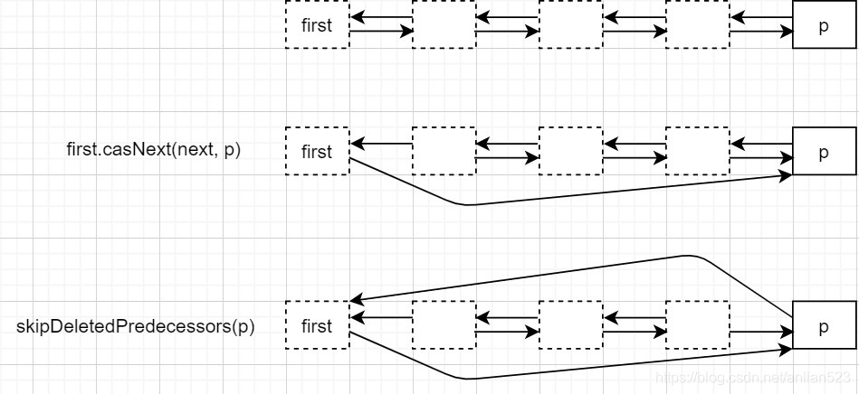
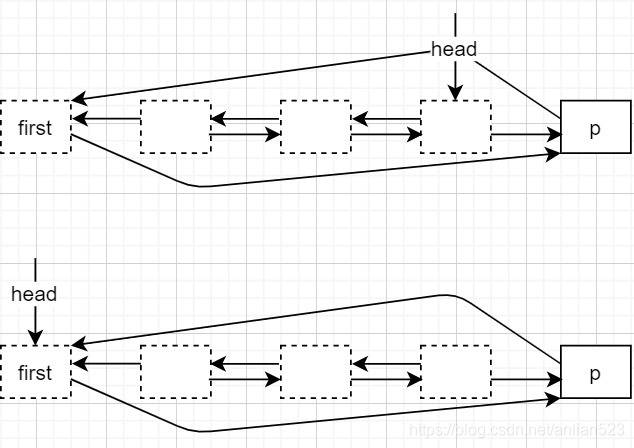
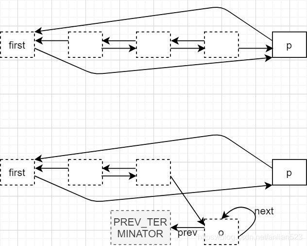

# ConcurrentLinkedDueue

### 前言

`ConcurrentLinkedDueue`是一个无界的双端队列，底层是双向链表，它的并发操作是基于CAS的无锁实现，所以不会产生阻塞。

`ConcurrentLinkedDueue`的思想与概念与`ConcurrentLinekedQueue`很类似。

### 概述

- 一个node的item不为`null`，被认为是live node。因为一个node的`item`为null说明它已经是逻辑上被删除了，不过注意，初始化时队列中只有一个dummy node，它的`item`为null。
- 任何时刻，队列中只有一个first node，因为只有它的`prev`指针为null；只有一个last node，因为只有它的`next`指针为null。
- first node和last node可能不是live的（比如初始化时），它们之间可以通过`prev`和`next`链相互到达。
- 当一个新node被附在first node的`prev`上，或者附在last node的`next`上时，它就成功入队了。
- head或tail并不一定指向first node或last node。但通过head肯定能找到first node，tail同理。
- active node指处于队列上的节点，它们之间通过`prev`和`next`链能相互到达，当然active node的`item`可以是null。所以active node包括live node。
- 对节点的删除有三个步骤：
	- “logical deletion”。将node的item置为null，它在逻辑上已经被认为是删除了的。
	- “unlinking”。使得从active node出发不能到达这些逻辑删除节点（反之，从逻辑删除节点节点出发还是可以到达active node的），这样，GC最终会发现这些逻辑删除节点。
	- “gc-unlinking”。使得从逻辑删除节点也不能到达active node了，这样，会使得GC更快发现它们。当然，第三步只是一种优化，没有第三步节点也会被回收。这只是为了保持GC健壮性。
		- 在这一步中，会使得node self-links（即指针指向自己），另一个指针指向end终止符（end指first端或last端）。
- head和tail可能被unlinking，但不可以被gc-unlinking。
- 通过两种方法最小化volatile写的次数：
	- 允许head或tail偏离first node或last node。
	- 对同一块内存区域使用 volatile写 和 非volatile写 两种方式结合使用。比如`lazySetNext`和`casNext`结合使用、`UNSAFE.putObject(this, itemOffset, item)`和`casItem`的结合使用。
- 一般认为队首在左边，队尾在右边。所以往prev链方向前进称为左移，往next链方向前进称为右移。

### linkFirst 入队

`offer(E)`、`add(E)`、`push(E)`、`addFirst(E)`、`addLast(E)`、`offerFirst(E)`、`offerLast(E)`都是属于入队动作，它们的实现都依赖于linkFirst和linkLast。这些方法如果没有没有标注first或者last，那么默认都是从last端入队（这符合常识，从队尾入队）。但除了push方法（它是在first端操作），因为push和pop属于一对栈的方法，所以把last当作栈底，first当作栈顶，所以push和pop都是在操作first端了。

由于`linkFirst、linkLast`二者的实现完全对称，所以在此只会讲解`linkFirst`的入队。

```java
private void linkFirst(E e) {
    checkNotNull(e);
    final Node<E> newNode = new Node<E>(e);

    restartFromHead:
    for (;;)
        for (Node<E> h = head, p = h, q;;) {
            if ((q = p.prev) != null &&
                (q = (p = q).prev) != null)//最多向前检查两次，检查prev是否为null
                //如果head变动了，那么新head->p
                //如果head没有变动，那么p.prev->p
                p = (h != (h = head)) ? h : q;
            //到达这里，p的prev为null
            else if (p.next == p) //该节点已经被删除，脱离队列了，继续下一次循环，重新读取head
                continue restartFromHead;
            else {
                //到达这里，p就是真head
                newNode.lazySetNext(p); //非volatile语义，毕竟还没有入队，无需立即通知其他线程
                if (p.casPrev(null, newNode)) {//CAS修改真head的prev
                    //CAS成功，newNode已经入队
                    if (p != h) //如果p!=h，表示head已经变动，可能真head与head的距离大于2，那么CAS更新head
                        casHead(h, newNode);  // Failure is OK.
                    return;
                }
                //CAS修改真head的prev失败，继续下一次循环，重新读取head
            }
        }
}
```

### pollFirst 获取并出队

`poll`、`pop`、`remove`、`pollFirst`、`pollLast`、`removeFirst`、`removeLast`都是属于出队并移除的动作，它们的实现都依赖于`pollFirst`、`pollLast`，由于`pollFirst`、`pollLast`二者的实现完全对称，所以在此只会讲解`pollFirst`的出队。

```java
public E pollFirst() {
    for (Node<E> p = first(); p != null; p = succ(p)) {
        E item = p.item;
        if (item != null && p.casItem(item, null)) {//删除的第一步，逻辑删除
            unlink(p);
            return item;
        }
    }
    return null;
}

```

### first()

```java
Node<E> first() {
    restartFromHead:
    for (;;)
        for (Node<E> h = head, p = h, q;;) {
            if ((q = p.prev) != null &&
                (q = (p = q).prev) != null)//最多向前检查两次，检查prev是否为null
                //如果head变动了，那么新head->p
                //如果head没有变动，那么p.prev->p
                p = (h != (h = head)) ? h : q;
            else if (p == h//如果p=h，表示head为真head，短路后面的head更新操作
                     || casHead(h, p))
                return p;
            //到达这里，head变动了（CAS head失败），那么p可能就不是真head了
            else
                continue restartFromHead;
        }
}
```

能保证返回值在返回时是head。

### succ

```java
final Node<E> succ(Node<E> p) {
    Node<E> q = p.next;
    return (p == q) ? first() : q;
}
```

### unlink

```java
void unlink(Node<E> x) {
    // assert x != null;
    // assert x.item == null;
    // assert x != PREV_TERMINATOR;
    // assert x != NEXT_TERMINATOR;

    final Node<E> prev = x.prev;
    final Node<E> next = x.next;
    if (prev == null) {//x是head
        unlinkFirst(x, next);
    } else if (next == null) {//x是tail
        unlinkLast(x, prev);
    } else {
        //被调用的时候，x要么是head要么是tail（因为deque，只能操作两端）
        //但是因为并发，x可能成为了中间节点了
        //先将x的前后继相互连接，如果成功，且x的前后继不是存活的，进行gc-unlink
        Node<E> activePred, activeSucc;//优先寻找live node，或者直到两端节点
        boolean isFirst, isLast;;//代表x原本是左起第一个live node；代表x原本是右起第一个live node
        int hops = 1;

        // Find active predecessor
        for (Node<E> p = prev; ; ++hops) {
            if (p.item != null) {//找到live的前驱
                activePred = p;
                isFirst = false;//x不是第一个live node
                break;
            }
            //到这里，p.item=null
            Node<E> q = p.prev;
            if (q == null) {//如果p为first node
                if (p.next == p)//p已经被删除了
                    return;
                activePred = p;
                isFirst = true;//p为first node，且p的item=null，故x为第一个live node
                break;
            }
            else if (p == q)//如果在prev链上遇到了一个NEXT_TERMINATOR，这其实不可能
                return;
            else//左移p
                p = q;
        }

        // Find active successor
        for (Node<E> p = next; ; ++hops) {
            if (p.item != null) {
                activeSucc = p;
                isLast = false;
                break;
            }
            Node<E> q = p.next;
            if (q == null) {
                if (p.prev == p)
                    return;
                activeSucc = p;
                isLast = true;
                break;
            }
            else if (p == q)
                return;
            else
                p = q;
        }

        if (hops < HOPS
            && (isFirst | isLast))
            return;
        
        // 1、如果x原来既不是第一个也不是最后一个live node，那么总是会执行到这里
		// 2、如果x原来是第一个或最后一个live node，但x与activePred或activeSucc之间的逻辑删除节点太多，
		//   也会执行到这里
		//执行activePred和activeSucc之间的unlinking操作
        skipDeletedSuccessors(activePred);
        skipDeletedPredecessors(activeSucc);

        // 只有当x是第一个或最后一个live node（这说明x与activePred或activeSucc之间的逻辑删除节点太多）
        if ((isFirst | isLast) &&

            // 重新检查前驱和后继之间的关系
            (activePred.next == activeSucc) &&
            (activeSucc.prev == activePred) &&
            (isFirst ? activePred.prev == null : activePred.item != null) &&
            (isLast  ? activeSucc.next == null : activeSucc.item != null)) {

            updateHead(); // Ensure x is not reachable from head
            updateTail(); // Ensure x is not reachable from tail

            // gc-unlink
            x.lazySetPrev(isFirst ? prevTerminator() : x);
            x.lazySetNext(isLast  ? nextTerminator() : x);
        }
    }
}
```

+ `x`参数的原本是live node的，但是调用此函数之前将其`item`设置为了null，所以x原来是live node。`isFirst`变量为true代表x原本是左起第一个live node；为false，则代表x原本不是左起第一个live node。isLast同理。
+ 两个for循环用来找到`activePred`和`activeSucc`，并设置`isFirst`和`isLast`。
+ `if (hops < HOPS && (isFirst | isLast)) return;`则是一种松弛阈值的表现，但如果`x`原本是一个内部的live node节点，则一定不会return，进而去执行unlinking操作。因为内部的逻辑删除节点需要及时被删除掉。

### unlinkFirst

该函数已知`first`是一个逻辑删除的节点了，但`next`的情况不知道，所以需要从`next`开始右移，找到一个没有被删除的节点（live node）或者直到last node。

找到右移遇到的第一个live node后（或者last node）：

1. 如果发现这个节点不是first参数的直接后继，则需要执行删除步骤的unlinking和gc-unlinking。
2. 如果是直接后继，那么不需要后续操作了。

```java
private void unlinkFirst(Node<E> first, Node<E> next) {
    // assert first != null;
    // assert next != null;
    // assert first.item == null;
    for (Node<E> o = null, p = next, q;;) {//这里o是p的pre
        //1.、p的item不为null，是个live node
		//2.、p的item为null，但p的后继没有。说明p是一个last node了(就是那个dummy node)
		//上面两种情况进入分支，说明找到了first参数的新后继了
        //3、p的item为null，且p的后继q不为null。需要继续寻找
        if (p.item != null || (q = p.next) == null) {
            if (o != null && p.prev != p && first.casNext(next, p)) {
                //如果first与第一个live node p之间存在逻辑删除的节点，那么执行unlink操作
                skipDeletedPredecessors(p);
                if (first.prev == null &&//如果first还是first node
                    (p.next == null || p.item != null) &&//如果p还是last node,或者还是个live node
                    p.prev == first) {//如果p的前驱还是first
                    
                    // //进入这个分支，说明first和p都保持着之前的性质，且p和first之间的前驱关系还维持着

                    updateHead(); // 保证从head出发不可能找到 o，或者第二步unlinking跳过的节点
                    updateTail(); // 保证从tail出发不可能找到 o，或者第二步unlinking跳过的节点

                    // 最后，执行删除的第三步gc-unlinking
                    o.lazySetNext(o);
                    o.lazySetPrev(prevTerminator());
                }
            }
            return;
        }
        else if (p == q)
            return;
        else {
            o = p;
            p = q;
        }
    }
}
```

### skipDeletedPredecessors

```java
private void skipDeletedPredecessors(Node<E> x) {
    whileActive:
    do {
        Node<E> prev = x.prev;
        // assert prev != null;
        // assert x != NEXT_TERMINATOR;
        // assert x != PREV_TERMINATOR;
        Node<E> p = prev;
        findActive:
        for (;;) {
            if (p.item != null)
                break findActive;
            Node<E> q = p.prev;
            if (q == null) {
                if (p.next == p)
                    continue whileActive;
                break findActive;
            }
            else if (p == q)
                continue whileActive;
            else
                p = q;
        }

        // found active CAS target
        if (prev == p || x.casPrev(prev, p))
            return;

    } while (x.item != null || x.next == null);
}
```

该函数的内循环负责找到x左移遇到的第一个live node，或者找到item为null的first node，总之找到的是p局部变量。

该函数的目的是为了跳过x与p之间的逻辑删除节点，如果它俩之间有删除节点，那么将x的前驱改为p，从而跳过中间的删除节点；如果没有的话，就不需要动作了。

回到`unlinkFirst`的逻辑，可以发现`first.casNext(next, p)`和`skipDeletedPredecessors(p)`相当于一对操作。



如上图所示，虚线框就代表item为null的逻辑删除节点，执行完上面两步后，从队列上就无法访问到这些中间这些逻辑删除节点了，但这些逻辑删除节点还能通过指针到达队列上来。

注意，图中first也是一个逻辑删除节点（`pollFirst()`里的`p.casItem(item, null)`），但它这里是作为dummy node来使用了，它现在被认为是active node的。

这就是删除步骤的第二步unlinking。

### updateHead

除非head已经指向first node了，否则该函数就会一直尝试直到head变成first node。



执行完此函数后，就不可能再从head出发通过prev链遍历到中间这些删除节点了。

### gc-unlinking

最终`unlinkFirst`里可能执行这两句：

```java
o.lazySetNext(o);
o.lazySetPrev(prevTerminator());
```



考虑到`unlinkLast`的逻辑中，first和p之间可能越过多个逻辑删除节点，所以gc-unlinking后的效果图可能如上图所示。即并不能完全达到这种效果：从中间这些删除节点不能到达队列的active node。

> 注意，unlinkLast是将第一个逻辑删除的节点的prev指向自身，next指向nextTerminator，这与unlinkFirst相反。
>
> 而对中间节点进行unlink，两个域都指向了Terminator。

### peekFirst

`peekFirst`只调用了`first()`方法，再加上对`item`的检查。

### remove

从`first()`开始搜索，搜索到`item`不为null，Object上equal，后CAS修改`item`为null，再调用`unlink`方法。

### size

- 该函数返回的大小可能不准确，只有弱一致性。
- 该函数需要遍历一遍队列，效率低下。

```java
public int size() {
        int count = 0;
        for (Node<E> p = first(); p != null; p = succ(p))
            if (p.item != null)
                // Collection.size() spec says to max out
                if (++count == Integer.MAX_VALUE)
                    break;
        return count;
    }
```

### 迭代器

分为正向迭代器和反向迭代器，毕竟是一个双端队列。

同样，这个迭代器也是弱一致性的，因为放到nextNode的节点，即使之后从队列中被删除（节点的item会变成null），nextItem也会继续维持引用，然后调用`next()`依旧能返回这个item。

### 总结

- 队列的两端都可以进行插入和删除操作，另外ConcurrentLinkedDueue还可以作为栈使用。
- 完全的非阻塞算法（lock free），大量使用了CAS和自旋。
- 通过两种方法最小化volatile写的次数：
	- 允许head或tail偏离first node或last node。
	- 对同一块内存区域使用 volatile写 和 非volatile写 两种方式结合使用。比如`lazySetNext`和`casNext`结合使用、`UNSAFE.putObject(this, itemOffset, item)`和`casItem`的结合使用。
- 对节点的删除有三个步骤：logical deletion、unlinking、gc-unlinking。第三步可以不做，只是为了GC健壮性的保证。