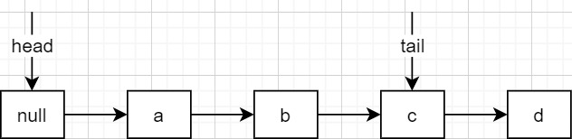

# ConcurrentLinkedQueue

### 前言

`ConcurrentLinkedQueue`是一种FIFO（first-in-first-out 先入先出）的无界队列，底层是单链表，一般来说，队列只支持队尾入队、队头出队，但此类还支持从内部删除某个特定的节点。使用非阻塞算法来处理并发操作，这也意味着实现里充满了CAS和自旋。

### 概述

+ 既然是队列，自然有head和tail分别指向first live node和last node。
	+ live node指的是item不为null的节点，因为item为null代表节点逻辑上被删除。first live node就是指队列中第一个live node。

+ 按照惯性思维，head和tail可能需要时刻保持指向正确，但在`ConcurrentLinkedQueue`却不是这样，它反而允许head和tail偏离first live node和last node。因为常用做法需要两个`volatile`写才能完成（比如入队时，首先需要CAS修改last node的`next`指针，然后需要CAS修改`tail`），但CAS操作都是独立的，没法将两个CAS操作绑定在一起，所以干脆抛弃惯性思维，然后允许head和tail处于不一致的状态。另一个方面，CAS操作是一种很耗资源的操作，应该尽量减少这种操作尤其是在非阻塞算法中，所以`ConcurrentLinkedQueue`的做法是：检测到head和tail偏离了一定程度后，才修正head和tail。
	+ 当偏离程度达到2时（比如tail距离last node为2，形如... tail ⇒ 某节点 ⇒ last node），才会进行修正。但注意，这个修正只是一次CAS尝试，不管结果是成功还是失败。偏离程度在注释中原称为松弛阀值slack threshold。
	+ 如下图，允许head偏离first live node、tail偏离last node。



+ 一个节点被删除，会先后有两种状态：1. `item`域设置为null 2. `next`域指向自身(第二步可能有)。
+ 虽然head和tail可能会偏离它们本该指向的位置，但这不会影响到队列的正确使用。简单的说，只要能保证节点之间的`next`指针依次连接着就行。
+ `ConcurrentLinkedQueue`使用“不变式”和“可变式”来保证队列的正确性，函数实现都将会遵循这些“不变式”和“可变式”。
+ 由于head和tail的修改是完全独立，有时会出现head在tail之后的情况。

### 不变式

#### 基本不变式

+ 队列中只能有一个节点的next为null，当然它就是我们说的last node。一般情况下，我们从tail出发就能以O(1)的复杂度找到last node，不过有时，需要调转到head继续遍历，此时需要O(N)的复杂度。
+ 从head出发能找到所有item域非null的节点。这个可达性即使在head被并发修改的情况下，也一定会保持。一个已出队节点可能会因为迭代器的使用或失去了执行时间片的poll()动作，而保持使用状态。

#### head

head的定义：从head出发可以以$O(1)$的复杂度到达first live node。

head的不变式：

+ 所有活着的节点，都能从head出发然后调用`succ()`被找到。

+ head不能指向null。

+ `(tmp = head).next != tmp || tmp != head`，指head的`next`不会指向自身。

head的可变式：

+ head的`item`域可能为null，或非null值。
+ tail可以早于head，但此时从head就已经不能找到tail了（此时tail已经脱离了队列了）。

#### tail

tail的定义：从tail出发可以以$O(1)$的复杂度到达last node。

tail的不变式：

- last node总是从tail出发通过`succ()`到达。
- tail不能指向null。

tail的可变式：

- tail的`item`域可能为null，或非null值。
- tail可以早于head，但此时从head就已经不能找到tail了（此时tail已经脱离了队列了）。
- tail的`next`指针可能会指向自身。

### 初始化

#### 队列初始化

```java
public ConcurrentLinkedQueue() {
    head = tail = new Node<E>(null);
}
```

默认初始化时，队列的head和tail都指向一个dummy node。可见，队列初始化时，是符合所有不变式的。

#### Node初始化

```java
Node(E item) {
    UNSAFE.putObject(this, itemOffset, item);
}
```

`putObject`是没有`volatile`语义的动作，是因为**没有必要**在此时（刚构造，还没有入队）就让所有线程看到，反正这个node还没有入队，别的线程也不可能通过队列找到这个node。

而等到它入队时，使用的是`casNext`来入队，这个动作是个volatile写动作。

### add/offer入队操作

首先要知道入队操作的目的就是找到last node，然后把新节点接在其后面。

+ 从tail出发来找到last node肯定是最快捷的，但循环中不可能每次现去读取tail域（因为它是易变的），所以都是使用局部变量t作为锚点，在必要的时候使用t = tail更新一把（初始化t也是用的t = tail）。
+ 而局部变量p则是循环变量，它以t为锚点向后移动，由于t都是通过t = tail得到的，所以可以通过p的后继q与t的距离来判断偏离程度，发现偏离程度大于等于2时，则尝试更新tail为最新的last node（当入队成功时），或者执行t = tail更新锚点以便获得最新的tail从而更快地找到last node。
	

```java
public boolean add(E e) {
    return offer(e);
}
```

```java
public boolean offer(E e) {
    checkNotNull(e);
    final Node<E> newNode = new Node<E>(e);

    for (Node<E> t = tail, p = t;;) {
        Node<E> q = p.next;
        if (q == null) {
            //p.next=null，说明p就是tail，那么CAS修改p的next为newNode
            if (p.casNext(null, newNode)) {
                if (p != t) // 如果p与tail不等，那么p与tail间的距离至少为1，即tail与真tail的距离至少为2，那么更新tail
                    casTail(t, newNode);
                return true;
            }
            //执行到这，CAS设置p的next失败了，进下一个循环
        }
        else if (p == q)
            //如果p的next指向自身，那么p是已删除的结点
            //1、如果tail变化过了，那么将p设置为新tail，继续下一轮的循环
            //2、如果tail没有变化过，那么将p设置为head，从头开始搜索
            p = (t != (t = tail)) ? t : head;
        else
            //1、p==t，表示什么都没有发生变动，那么p.next->p
            //2、p!=t且tail没有发生变动，p!=t是因为之前的循环里的设置（比如设置成head），那么p.next->p
            //3、p!=t且tail发生了变动，那么直接将新tail->p，这里也同步更新了t
            //总的来说，就是如果tail没有发生变动，那么p.next->p，否则tail->p
            p = (p != t && t != (t = tail)) ? t : q;
    }
}
```

### 出队操作

#### poll

`poll()`返回first live node，并出队。锚点`h`从`head`取得，循环变量则是`p`它以`h`作为锚点，移动`p`以寻找到first live node，如果找到就将其出队，根据偏离程度来决定是否更新head。

```java
public E poll() {
    restartFromHead:
    for (;;) {
        for (Node<E> h = head, p = h, q;;) {
            E item = p.item;

            if (item != null && p.casItem(item, null)) {//item不为null的head，肯定是真head，CAS修改head的item为null
                if (p != h) // 如果此时head变了，head肯定在真head前，因此poll后，两者的距离至少为2，更新head
                    updateHead(h, ((q = p.next) != null) ? q : p);
                return item;
            }
            //执行到这里，有两种情况
            //1、item为null
            //2、item不为null，但是CAS竞争失败，说明别的线程抢先poll了
            else if ((q = p.next) == null) {//next为null，队列肯定空了，而p为dummy node，更新head为dummy node
                updateHead(h, p);
                return null;
            }
            else if (p == q)//别的线程抢先poll了，该节点已经被删除，继续下一个循环，再次读取head
                continue restartFromHead;
            else//p.next->p
                p = q;
        }
    }
}

final void updateHead(Node<E> h, Node<E> p) {
    if (h != p && casHead(h, p))
        h.lazySetNext(h);
}
```

### peek

```java
public E peek() {
    restartFromHead:
    for (;;) {
        for (Node<E> h = head, p = h, q;;) {
            E item = p.item;
            if (item != null || (q = p.next) == null) {
                //进入这个分支有两种情况
                //1、head的item不为null，那么肯定是真的item，这返回的是真head的item
                //2、p.next=null说明队列为空，p为dummy node，这返回的是null
                updateHead(h, p);
                return item;
            }
            else if (p == q)//p.item==null且p的next指向自身，表示已经被删除，那么重新获取head
                continue restartFromHead;
            else//p.next->p
                p = q;
        }
    }
}
```

### first

```java
//与peek的区别是，peek返回的是item，而first返回的是node，代码逻辑跟peek完全相同
Node<E> first() {
    restartFromHead:
    for (;;) {
        for (Node<E> h = head, p = h, q;;) {
            boolean hasItem = (p.item != null);
            if (hasItem || (q = p.next) == null) {
                //进入这个分支有两种情况
                //1、head的item不为null，那么肯定是真的item，这返回的是真head的item
                //2、p.next=null说明队列为空，p为dummy node，这返回的是null
                updateHead(h, p);
                return hasItem ? p : null;
            }
            else if (p == q)//p已经被删除
                continue restartFromHead;
            else//p.next->p
                p = q;
        }
    }
}
```

注意，不能简单地将`peek()`改成调用`first`，因为在`first`返回的node对应的`item`可能被并发地修改为null。需要这样实现：

```java
public E peek() {
    Node<E> node = first();
    E item;
    while((item = node.item) != null)//防止返回后被并发地删除了（item置为null）
        node = first();
    return item;
}
```

### remove

```java
public boolean remove(Object o) {
    if (o != null) {
        Node<E> next, pred = null;
        for (Node<E> p = first(); p != null; pred = p, p = next) {
            boolean removed = false;
            E item = p.item;
            if (item != null) {//检查有无被并发地修改成null
                if (!o.equals(item)) {
                    //下一个
                    next = succ(p);
                    continue;
                }
                //p就是需要remove的节点
                //CAS可能执行失败，如果失败，其他线程肯定已经置为了null，不影响（对p进行CAS item只可能是删除操作）
                removed = p.casItem(item, null);
            }

            next = succ(p);
            if (pred != null && next != null) // unlink
                //可能执行失败，调用casNext只可能在unlink以及在pred后插入node两种情况
                //因为next不为null，所以肯定不是插入的情况，因此只可能别的线程帮忙unlink，因此不影响
                pred.casNext(p, next);
            if (removed)
                return true;
        }
    }
    return false;
}
```

#### remove的bug

[详情](https://bugs.openjdk.java.net/browse/JDK-8054446)

```java
// Quick OutOfMemory with -Xmx4m
    public void testOutOfMemory(){
        ConcurrentLinkedQueue<String> queue = new ConcurrentLinkedQueue<String>();
        String a="a";
        String b="b";
        queue.offer(a);
        for(int i=0;;i++){
            if(i % 1024 == 0) {
                System.out.println("i = "+i);
            }
            queue.offer(b);
            queue.remove(b);
        }
    }
```

反复地offer入队并删除最后一个结点，会形成`... null ⇒ null ⇒ null ⇒ null`的队列，造成内存泄露。

### size弱一致性的方法

```java
public int size() {
    int count = 0;
    for (Node<E> p = first(); p != null; p = succ(p))
        if (p.item != null)
            if (++count == Integer.MAX_VALUE)
                break;
    return count;
}
```

由于并发，`size()`返回值可能不准确。要注意`ConcurrentLinkedQueue`类中没有保存size的成员变量。

### AddAll

```java
public boolean addAll(Collection<? extends E> c) {
    if (c == this)
        // As historically specified in AbstractQueue#addAll
        throw new IllegalArgumentException();

    // 先将c拷贝到一个链表
    Node<E> beginningOfTheEnd = null, last = null;
    for (E e : c) {
        checkNotNull(e);
        Node<E> newNode = new Node<E>(e);
        if (beginningOfTheEnd == null)
            beginningOfTheEnd = last = newNode;
        else {
            last.lazySetNext(newNode);
            last = newNode;
        }
    }
    //如果c是空的，那么返回
    if (beginningOfTheEnd == null)
        return false;

    // Atomically append the chain at the tail of this collection
    for (Node<E> t = tail, p = t;;) {
        Node<E> q = p.next;
        if (q == null) {//p.next为null，那么p是真tail
            if (p.casNext(null, beginningOfTheEnd)) {
                //CAS成功，那么新链表已经添加到末尾了
                if (!casTail(t, last)) {//CAS更新tail
                    //再试一次CAS更新tail
                    t = tail;
                    if (last.next == null)//如果没有新的数据被并发地添加，那么CAS更新tail
                        casTail(t, last);
                }
                return true;
            }
            //执行到这里，CAS修改p.next失败，下一个循环重新读取next
        }
        else if (p == q)
            //该节点已经被删除
            //如果tail没有被修改过，那么head->p，从头开始搜索真tail
            //如果tail被修改过，那么tail->p，从新tail开始搜索真tail
            p = (t != (t = tail)) ? t : head;
        else
            //跟offer方法里的最后一个三目运算一致
            //1、p==t，表示什么都没有发生变动，那么p.next->p
            //2、p!=t且tail没有发生变动，p!=t是因为之前的循环里的设置（比如设置成head），那么p.next->p
            //3、p!=t且tail发生了变动，那么直接将新tail->p，这里也同步更新了t
            //总的来说，就是如果tail没有发生变动，那么p.next->p，否则tail->p
            p = (p != t && t != (t = tail)) ? t : q;
    }
}
```

### 迭代器

```java
private class Itr implements Iterator<E> {
    
    private Node<E> nextNode;

    private E nextItem;

    private Node<E> lastRet;

    Itr() {
        advance();
    }

    /**
     * Moves to next valid node and returns item to return for
     * next(), or null if no such.
     */
    private E advance() {
        lastRet = nextNode;
        E x = nextItem;

        Node<E> pred, p;
        if (nextNode == null) {//如果nextNode为null，那么重新获取head
            p = first();
            pred = null;
        } else {
            pred = nextNode;
            p = succ(nextNode);
        }

        for (;;) {
            if (p == null) {//队列中只剩一个了，advance之后就无了
                nextNode = null;
                nextItem = null;
                return x;
            }
            E item = p.item;
            if (item != null) {//表示下一个node还没有被删除
                nextNode = p;
                nextItem = item;
                return x;
            } else {
                //下一个node被删除了，再搜索它的next
                Node<E> next = succ(p);
                if (pred != null && next != null)//将中间的被删除的节点unlink，然后继续下一个循环
                    pred.casNext(p, next);
                p = next;
            }
        }
    }

    public boolean hasNext() {
        return nextNode != null;
    }

    public E next() {
        if (nextNode == null) throw new NoSuchElementException();
        return advance();
    }

    public void remove() {
        Node<E> l = lastRet;
        if (l == null) throw new IllegalStateException();
        //这里仅仅将域置为空，等待后续的遍历将它unlink
        l.item = null;
        lastRet = null;
    }
}
```

迭代器的remove是懒删除的，这可能会造成内存泄漏，除非有另一个迭代器遍历、或者出队时head经过了这个逻辑删除节点。

### 总结

+ ConcurrentLinkedQueue队列中总是有一个dummy node，这避免很多不必要的代码。
+ 不变式简单的说就是：任意时刻，队列中的有效节点（item域非null）通过next指针是相连的。
+ 可变式简单的说就是：head和tail可能会偏离它们本该指向的位置，即first live node、last node。
+ 在CAS方面，通过允许head tail偏离，尽量减少了CAS这种开销巨大的动作。Node初始化不使用volatile写item域，也是一种优化。
+ 即使是单线程环境，head/tail也是每隔一次出队/入队操作才会更新head/tail。
+ `ConcurrentLinkedQueue#remove`和`iterator#remove`都有可能造成内存泄漏。