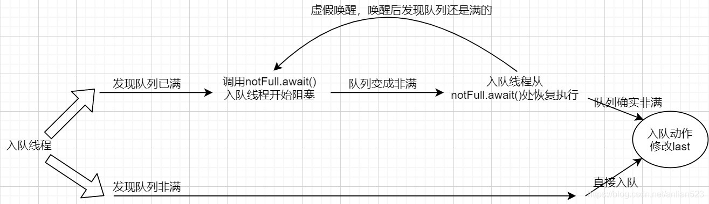

# LinkedBlockingQueue

### 前言

`LinkedBlockingQueue`是一种FIFO（first-in-first-out 先入先出）的有界阻塞队列，底层是单链表，也支持从内部删除元素。并发操作依赖于加锁的控制，支持阻塞式的入队出队操作。

相比`ArrayBlockingQueue`的一个Lock，`LinkedBlockingQueue`使用了两个Lock，分别对应入队动作和出队动作，提高了并发量。

### 成员

LinkedBlockingQueue的底层实现基于单链表：

```java
 static class Node<E> {
        E item;

        Node<E> next;

        Node(E x) { item = x; }
}
```

```java
  /** 容量，毕竟这是一个有界队列 */
    private final int capacity;

    /** 大小，元素的个数 */
    private final AtomicInteger count = new AtomicInteger();

    //队首指针
    transient Node<E> head;

    //队尾指针
    private transient Node<E> last;
```

上面就是些基于单链表的队列的必备成员。之所以需要使用AtomicInteger，是因为有两个线程（入队线程、出队线程）可能同时在修改它，所以用原子类来保持count的正确性。

```java
	/** 出队线程需要竞争这把锁，竞争到了才能出队，也就是说同时只有一个线程能出队 */
    private final ReentrantLock takeLock = new ReentrantLock();

    /** 出队线程可能会暂时阻塞在这个AQS条件队列里，当发现队列已空时 */
    private final Condition notEmpty = takeLock.newCondition();

    /** 入队线程需要竞争这把锁，竞争到了才能入队，也就是说同时只有一个线程能入队 */
    private final ReentrantLock putLock = new ReentrantLock();

    /** 入队线程可能会暂时阻塞在这个AQS条件队列里，当发现队列已满时 */
    private final Condition notFull = putLock.newCondition();
```

为了保证`last`的正确性，只有竞争到`putLock`的入队线程才能执行入队动作。这样就只有一个线程在修改`last`。



上面的流程与`ArrayBlockingQueue`的是一致的。

为了保证`head`的正确性，只有竞争到`takeLock`的出队线程才能执行出队动作。这样就只有一个线程在修改`head`。


当出队线程从`notEmpty.await()`处恢复执行时，已经又重新获得了takeLock，然后出队线程即将执行出队动作，别的线程也不可能和它竞争出队了。跟`ArrayBlockingQueue`的流程也一样。

### 构造器

```java
public LinkedBlockingQueue() {
        this(Integer.MAX_VALUE);//默认大小
}

public LinkedBlockingQueue(int capacity) {
    if (capacity <= 0) throw new IllegalArgumentException();
    this.capacity = capacity;
    last = head = new Node<E>(null);//队列始终有一个dummy node作为head
}
```
默认大小为`Integer.MAX_VALUE`，当然这也是最大大小。队列始终有一个dummy node作为head。

### 入队

#### add

```java
//AbstractQueue.java
    public boolean add(E e) {
        if (offer(e))
            return true;
        else//返回false的处理不一样
            throw new IllegalStateException("Queue full");
    }
    
//Queue.java(接口文件)
	boolean offer(E e);
```

`add`依靠于子类的`offer`实现。所以，`add`就是在调用自己的`offer`方法。

#### offer

```java
//只尝试一次，该方法没有notEmpty.signal?只有notFull.signal?
public boolean offer(E e) {
    if (e == null) throw new NullPointerException();
    final AtomicInteger count = this.count;
    if (count.get() == capacity)
        return false;
    int c = -1;//最后如果还为-1，那么表示尝试失败
    Node<E> node = new Node<E>(e);
    final ReentrantLock putLock = this.putLock;//只获取putLock，count只能减少，不能增加，因此后面的逻辑没有问题
    putLock.lock();
    try {
        if (count.get() < capacity) {
            enqueue(node);
            c = count.getAndIncrement();
            if (c + 1 < capacity)
                notFull.signal();
        }
    } finally {
        putLock.unlock();
    }
    if (c == 0)
        //执行到这里，肯定offer成功了，c存的是旧值，说明之前是空的，那么通知notEmpty
        signalNotEmpty();
    return c >= 0;//如果c>=0，表示入队成功，否则c=-1
}

//注意，与ArrayBlockingQueue不一样的是，enqueue方法里没有notEmpty.signal
private void enqueue(Node<E> node) {
    // assert putLock.isHeldByCurrentThread();
    // assert last.next == null;
    last = last.next = node;
}
```

`offer`只获取了putLock，因此count只能减少（其他线程获取getLock），不能增加。因此后面不管是否有并发，都能成功入队。

#### put

```java
//尝试失败就进入等待，响应中断
public void put(E e) throws InterruptedException {
    if (e == null) throw new NullPointerException();
    int c = -1;
    Node<E> node = new Node<E>(e);
    final ReentrantLock putLock = this.putLock;
    final AtomicInteger count = this.count;
    putLock.lockInterruptibly();//可以被中断
    try {
        while (count.get() == capacity) {//如果满了，其实也可能不满，因为别的线程可能take了，但是安全起见还是等待
            notFull.await();
        }
        enqueue(node);//未满，因为获取了putLock，因此count只可能更少，入队很安全
        c = count.getAndIncrement();
        if (c + 1 < capacity)//如果没满，实际上count只可能更少，通知notFull
            notFull.signal();
    } finally {
        putLock.unlock();
    }
    if (c == 0)
        signalNotEmpty();
}
```

#### 超时offer

```java
////尝试失败就进入等待，响应中断，超时停止等待，返回false
public boolean offer(E e, long timeout, TimeUnit unit)
    throws InterruptedException {

    if (e == null) throw new NullPointerException();
    long nanos = unit.toNanos(timeout);
    int c = -1;
    final ReentrantLock putLock = this.putLock;
    final AtomicInteger count = this.count;
    putLock.lockInterruptibly();
    try {
        while (count.get() == capacity) {
            if (nanos <= 0)
                return false;
            nanos = notFull.awaitNanos(nanos);
        }
        enqueue(new Node<E>(e));//相比与没有超时机制的offer，这里才new出Node是为了减少内存的使用率
        c = count.getAndIncrement();
        if (c + 1 < capacity)
            notFull.signal();
    } finally {
        putLock.unlock();
    }
    if (c == 0)
        signalNotEmpty();
    return true;
}
```

#### 总结

| 入队方法  | 是否等待               | 队列满时的处理                                               | 返回值         | 返回值含义                                    | 抛出中断异常的含义           |
| --------- | ---------------------- | ------------------------------------------------------------ | -------------- | --------------------------------------------- | ---------------------------- |
| add       | 一次入队尝试，从不等待 | 抛出异常                                                     | true           | 入队成功                                      | 队列已满                     |
| offer     | 一次入队尝试，从不等待 | 返回false                                                    | true<br/>false | 入队成功<br/>入队失败                         |                              |
| put       | 入队尝试失败后，会等待 | 进入条件队列继续等待                                         | void           | 只要从`put`调用处正常返回，就代表入队成功     | signal来临前，中断发生       |
| 超时offer | 入队尝试失败后，会等待 | 如果没超时，则进入条件队列继续等待；<br/>如果超时了，返回false | true<br/>false | 规定时间内，入队成功<br/>规定时间内，没有入队 | signal或超时来临前，中断发生 |

### 出队

#### remove(obj)

```java
public boolean remove(Object o) {
    if (o == null) return false;
    fullyLock();//注意，获取了所有的锁
    try {
        for (Node<E> trail = head, p = trail.next;
             p != null;
             trail = p, p = p.next) {
            if (o.equals(p.item)) {
                unlink(p, trail);
                return true;
            }
        }
        return false;
    } finally {
        fullyUnlock();
    }
}

void fullyLock() {
    putLock.lock();
    takeLock.lock();
}

void fullyUnlock() {
    takeLock.unlock();
    putLock.unlock();
}

void unlink(Node<E> p, Node<E> trail) {
    // assert isFullyLocked();
    // p.next is not changed, to allow iterators that are
    // traversing p to maintain their weak-consistency guarantee.
    p.item = null;
    trail.next = p.next;
    if (last == p)
        last = trail;
    if (count.getAndDecrement() == capacity)
        //只在临界时通知，其他的方法执行成功时都有检查是否需要notFull.signal，所以这只需要通知一次
        notFull.signal();
}
```

#### poll

```java
//尝试一次，poll成功可能通知notEmpty
public E poll() {
    final AtomicInteger count = this.count;
    if (count.get() == 0)
        return null;
    E x = null;
    int c = -1;
    final ReentrantLock takeLock = this.takeLock;
    takeLock.lock();
    try {
        if (count.get() > 0) {
            x = dequeue();
            c = count.getAndDecrement();
            if (c > 1)//旧大小>=2
                notEmpty.signal();
        }
    } finally {
        takeLock.unlock();
    }
    if (c == capacity)
        signalNotFull();
    return x;
}

private E dequeue() {
    // assert takeLock.isHeldByCurrentThread();
    // assert head.item == null;
    Node<E> h = head;
    Node<E> first = h.next;
    h.next = h; // help GC
    head = first;
    E x = first.item;
    first.item = null;
    return x;
}
```

#### take

```java
public E take() throws InterruptedException {
    E x;
    int c = -1;
    final AtomicInteger count = this.count;
    final ReentrantLock takeLock = this.takeLock;
    takeLock.lockInterruptibly();
    try {
        while (count.get() == 0) {
            notEmpty.await();
        }
        x = dequeue();
        c = count.getAndDecrement();
        if (c > 1)
            notEmpty.signal();
    } finally {
        takeLock.unlock();
    }
    if (c == capacity)
        signalNotFull();
    return x;
}

//notFull.signal必须要在获得putLock的情况下
private void signalNotFull() {
    final ReentrantLock putLock = this.putLock;
    putLock.lock();
    try {
        notFull.signal();
    } finally {
        putLock.unlock();
    }
}
```

#### 总结

| 出队方法 | 是否等待               | 队列空时的处理                                               | 返回值          | 返回值含义                                    | 抛出中断异常的含义           |
| -------- | ---------------------- | ------------------------------------------------------------ | --------------- | --------------------------------------------- | ---------------------------- |
| remove   | 一次出队尝试，从不等待 | 抛出`NoSuchElementException`                                 | 非null<br/>\-   | 队列非空<br/>\-                               |                              |
| poll     | 一次出队尝试，从不等待 | 返回null                                                     | 非null<br/>null | 队列非空<br/>队列空                           |                              |
| take     | 出队尝试失败后，会等待 | 进入条件队列继续等待                                         | void            | 只要从`take`调用处返回，就代表出队成功        | signal来临前，中断发生       |
| 超时poll | 出队尝试失败后，会等待 | 如果没超时，则进入条件队列继续等待；<br/>如果超时了，返回false | 非null<br/>null | 规定时间内，出队成功<br/>规定时间内，没有出队 | signal或超时来临前，中断发生 |

### 获取操作

#### peek

```java
public E peek() {
    if (count.get() == 0)
        return null;
    final ReentrantLock takeLock = this.takeLock;
    takeLock.lock();
    try {
        Node<E> first = head.next;
        if (first == null)
            return null;
        else
            return first.item;
    } finally {
        takeLock.unlock();
    }
}
```

### 迭代器

此迭代器是弱一致性的。因为即使节点被删除，迭代器也会照样返回被删除节点的item。

弱一致性是因为并发操作。当迭代器遍历到某个位置后，你调用hasNext返回true说明下一个节点存在。但之后有别人删除掉了你的这个节点，然后你再调用next()理论上来说我应该返回这个节点的item给你，但删除操作会使得节点的item为null，所以迭代器中必须使用`E currentElement`提前保存。

> 注意，next()和remove()方法会获取所有的锁。

### 锁与Condition

```java
private final Condition notEmpty = takeLock.newCondition();

private final Condition notFull = putLock.newCondition();
```
注意`notEmpty`是与`takeLock`绑定的，`notFull`是与`putLock`绑定的。

在`ArrayBlockingQueue`中，出队的操作会执行`notFull.signal()`，入队的操作会执行`notEmpty.sigal()`。

而在`LinkedBlockingQueue`中，锁的种类有两把，需要考虑并发情况。如果出队操作执行`notFull.signal()`，同时有入队操作恰好填满了队列，这将导致线程不安全。因此只能由入队操作执行`notFull.signal()`，因为入队操作需要获取`putLock`，其他入队操作将阻塞，因此实际的队列长度不会比获取的长度大，因此`notFull.signal`是线程安全的。

### 总结

+ 和`ConcurrentLinkedQueue`一样，初始化时有一个dummy node。也就是说，真正的数据节点，永远是head的后继。
+ 使用了两个Lock，分别负责修改head和last。之所以可以这样，是因为队列非空非满的时候，同时入队出队是互不影响，而且`count`是一个原子类。
+ 两个Condition的使用，是控制阻塞等待的关键。
+ 两个Lock都是非公平模式的获取锁方式，抢锁更快，提高并发。
+ 出队的节点next指向自身，以区别于队尾节点（next为null）。
	