# spring framework

## 编译源码

进入spring源码的目录，修改build.gradle文件，修改源为aliyun镜像。

```
buildscript {
	repositories{
		maven { url 'http://maven.aliyun.com/nexus/content/groups/public/'}
    	maven { url 'http://maven.aliyun.com/nexus/content/repositories/jcenter'}
	}
	dependencies {
		classpath 'org.asciidoctor:asciidoctorj-pdf:1.5.0-alpha.16'
		classpath 'io.spring.asciidoctor:spring-asciidoctor-extensions:0.1.3.RELEASE'
	}
}
//......
configure(allprojects) { project ->
//......
		repositories {
			maven { url 'http://maven.aliyun.com/nexus/content/groups/public/'}
    		maven { url 'http://maven.aliyun.com/nexus/content/repositories/jcenter'}
			mavenCentral()
			maven { url "https://repo.spring.io/libs-spring-framework-build" }
		}
}
```

## 容器初始化主要做的事情

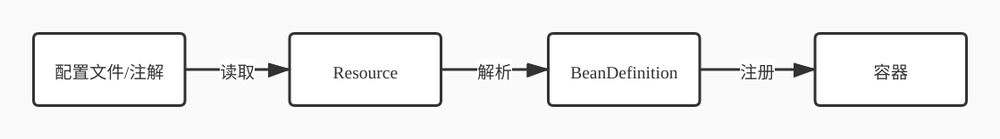

首先将配置文件读取到内存中，这些配置将会被当做Resource对象，然后被解析成BeanDefinition实例，最后注册到spring容器中。

## BeanDefinition

根据配置，生成用来描述Bean的BeanDefinition，常用属性：

+ 作用范围scope（`@Scope`）
  + singleton：单例
  + prototype：每次获取Bean的时候会有一个新的实例
  + request：request表示该针对每一次HTTP请求都会产生一个新的bean，同时该bean仅在当前HTTP request内有效
  + session：session作用域表示该针对每一次HTTP请求都会产生一个新的bean，同时该bean仅在当前HTTP session内有效
  + globalsession：global session作用域类似于标准的HTTP Session作用域，不过它仅仅在基于portlet的web应用中才有意义
+ 懒加载lazy-init（`@Lazy`）：决定Bean实例是否延迟加载
+ 首选primary（`@Primary`）：设置为true的bean会是优先的实现类（在实现类有多个的情况下）
+ factory-bean和factory-method（`@Configuration`和`@Bean`）

这里使用XML配置文件来举例子：

```xml
<bean id="welcomeService" class="com.yikang.service.impl.WelcomeServiceImpl"/>
<!-- 1.使用类的无参构造函数创建 -->
<bean id="user1" class="com.yikang.entity.User" scope="singleton" lazy-init="true" primary="true"/>
<alias name="user1" alias="userAlias1,userAlias2,userAlias3"/>
<!-- 2.使用静态工厂进行创建 -->
<!-- class的值不是写User对象的全路径，而是写静态工厂的全路径 -->
<!-- factory-method的值写要调用的方法 -->
<bean id="user2" class="com.yikang.entity.factory.StaticFactory" factory-method="getUser" scope="singleton"/>
<!-- 3.使用实例工厂进行创建 -->
<!-- 需要先创建factoryBean对象，再通过factoryBean对象进行调用 -->
<bean id="userFactory" class="com.yikang.entity.factory.UserFactory"/>
<bean id="user3" factory-bean="userFactory" factory-method="getUser" scope="prototype"/>
<bean id="userFactoryBean" class="com.yikang.entity.factory.UserFactoryBean"/>
```

user1为`User`实例，单例，懒加载，优先的实现类。

user2是通过静态工厂`StaticFactory`的静态方法`getUser`来创建的，他的类型也是`User`，单例。

user3是通过工厂`UserFactory`的方法`getUser`创建的，注意`UserFactory#getUser`并不是静态的，因此需要先将`UserFactory`实例化，然后在`factory-bean`属性中指定工厂bean。

> 注意，单例是对bean而言的，并非对类类型。

对于userFactoryBean，它是UserFactoryBean类型，实现了`FactoryBean<T>`接口：

```java
public class UserFactoryBean implements FactoryBean<User> {
   @Override
   public User getObject() throws Exception {
      return new User();
   }

   @Override
   public Class<?> getObjectType() {
      return User.class;
   }
}
```

调用`applicationContext.getBean("userFactoryBean")`，返回的是`User`类型的对象；

调用`applicationContext.getBean("&userFactoryBean")`，返回的是`UserFactoryBean`类型的对象。

但是要注意，返回的不管是`User`还是`UserFactoryBean`，都是单例的（如果设置为prototype，那么两者都是prototype的）。

> Spring中存在两个名字很相似的接口：BeanFactory和FactoryBean。
>
> BeanFactory是用于实现Spring IOC容器的接口，而FactoryBean只是一个作为简单工厂的Bean接口，只有getObject、getObjectType、isSington方法。

### more about BeanDefinition

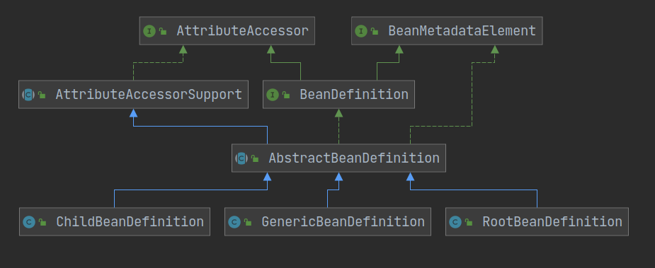

+ RootBeanDefinition可以单独作为一个BeanDefinition，也可以作为其他BeanDefinition的父类。但是他不能作为其他BeanDefinition的子类（在setParentName的时候，会抛出一个异常）
+ ChildBeanDefinition相当于一个子类，不可以单独存在，必须要依赖一个父BeanDetintion。（parentName属性是通过构造方法设置的，而且并没有提供无参构造方法)
+ GenericBeanDefinition是一个通用类，观察他源码跟ChildBeanDefinition很像，可以替代ChildBeanDefinition。
+ RootBeanDefinition的域和方法远多于GenericBeanDefinition，定义root bean时应该尽量使用RootBeanDefinition。
+ BeanDefinition之间的关系不是通过继承来表现的，而是通过parentName属性表现的。

## IOC容器

### BeanFactory

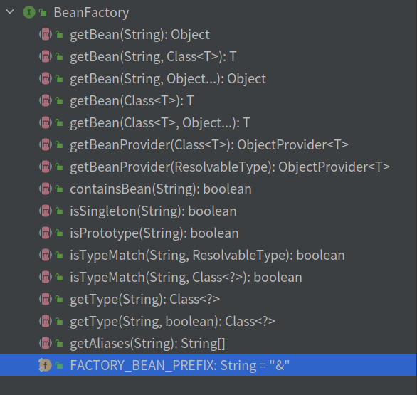

需要注意的是`FACTORY_BEAN_PREFIX`这个域，这个域提供获取FactoryBean的方法，如果使用bean的名字检索FactoryBean得到的对象是工厂生成的对象，如果需要得到工厂本身，那么需要转义，即bean名字前加个前缀"&"。

bean都是由BeanFactory的实现类来管理的。

### 简单容器

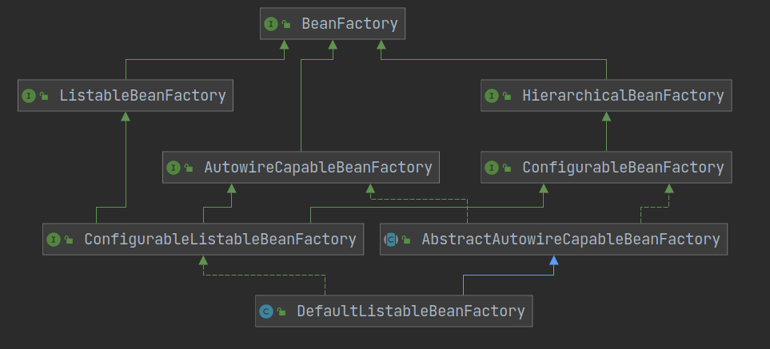

#### ListableBeanFactory

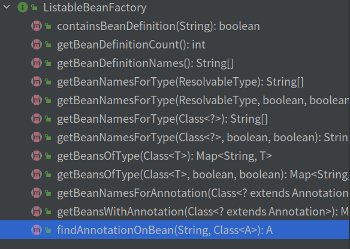

这个接口最大的特点就是可以根据需要列出对应的BeanDefinition、BeanName列表。

#### HierarchicalBeanFactory


这个接口使得BeanFactory之间具备层级关系。

注意`containsLocalBean`只会在本层的容器中查找，不会去父类容器查找。

#### AutowireCapableBeanFactory

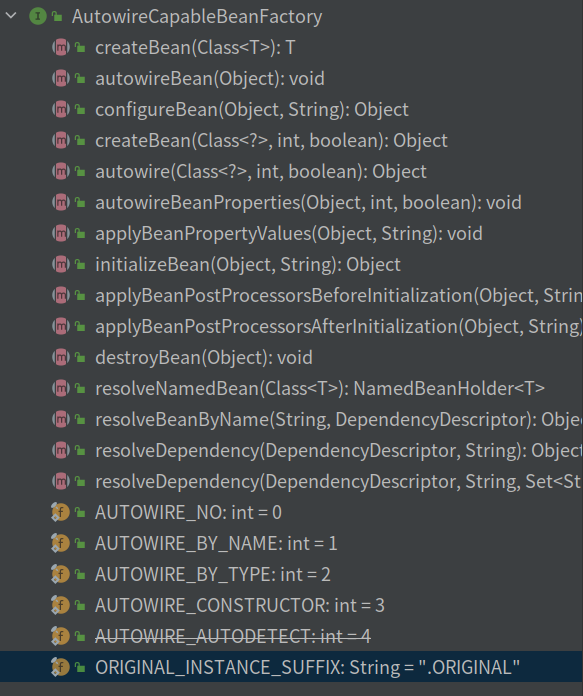

从宏观上看，AutowireCapableBeanFactory提供了如下能力：

 1 为已经实例化的对象装配属性，这些属性对象都是Spring管理的；

 2 实例化一个Bean，并自动装配，这些被装配的属性对象都是Spring管理的，但是实例化的Bean可以不被Spring管理（这点特别重要）。所以这个接口提供功能就是自动装配bean相关的

 (自动装配的原对象可以不在Spring的IOC容器里，但是需要被依赖注入的成员，就必须是Spring容器管辖的Bean)
 此接口主要是针对框架之外，没有向Spring托管Bean的应用。通过暴露此功能，Spring框架之外的程序，也能具有自动装配的能力（此接口赋予它的）。

 可以使用这个接口集成其它框架。捆绑并填充（注入）并不由Spring管理生命周期并已存在的实例.像集成WebWork的Actions和Tapestry Page就很实用。
 一般应用开发者不会使用这个接口,所以像ApplicationContext这样的外观实现类不会实现这个接口。

### 高级容器


```java
public interface ApplicationContext extends EnvironmentCapable, ListableBeanFactory, HierarchicalBeanFactory,
      MessageSource, ApplicationEventPublisher, ResourcePatternResolver {
          ...;
      }
```

#### 传统的基于XML配置的经典容器

+ FileSystemXmlApplicationContext：从文件系统加载配置
+ ClassPathXmlApplicationContex：从classpath加载配置
+ XmlWebApplicationContext：用于Web应用程序的容器

#### 目前比较流行的容器

+ AnnotationConfigServletWebServerApplicationContext
+ AnnotationConfigReactiveWebServerApplicationContext
+ AnnotationConfigApplicationContext

### 容器的共性

refresh()大致功能：

+ 容器初始化、配置解析
+ BeanFactoryPostProcessor和BeanPostProcessor的注册和激活
+ 国际化配置
+ 等等

## 根据资源地址自动选择正确的Resource

### Ant

路径匹配表达式，用来对URI进行匹配：

+ ?匹配任何单字符
+ *匹配0或者任意数量的字符
+ **匹配0或者更多的目录

| 通配符 | 示例          | 说明                                                     |
| ------ | ------------- | -------------------------------------------------------- |
| ?      | /test/p?ocess | 匹配/test/process，但是不匹配/test/pocess                |
| *      | /test/*.jsp   | 匹配项目路径下所有在test路径下的.jsp文件                 |
| *      | /test/*/path  | /test/path、/test/a/path都匹配，但是不匹配/test/a/b/path |
| **     | /test/**/path | /test/path、/test/a/path、/test/a/b/path都匹配           |

### 强大的加载资源方式

+ 自动识别"classpath:"、"file:"等资源地址前缀
+ 支持自动解析Ant风格带通配符的资源地址

### Resource

Resource代表底层外部资源，提供了对底层外部资源的一致性访问接口。

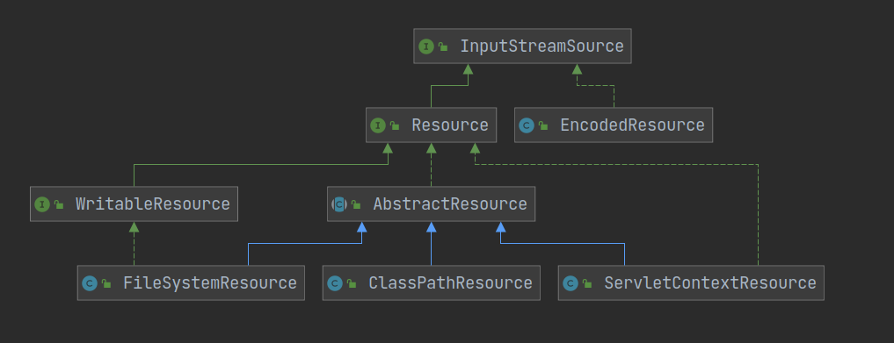

### ResourceLoader

实现不同的ResourceLoader加载策略，按需返回特定类型的Resource，可以看做是一个生产Resource的工厂类，根据传入一个资源路径返回对应类型的Resource。

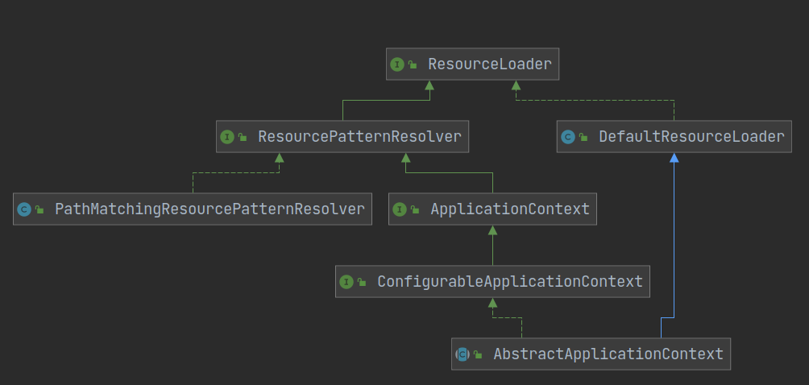

其中，DefaultResourceLoader的getResource方法只支持单次解析，如果需要解析多条location，那么需要重复调用多次。

如果需要一次性解析多个location，采用Ant风格的location，建议使用实现了ResourcePatternResolver接口的PathMatchingResourcePatternResolver。

DefaultResourceLoader的getResource方法：

```java
//获取Resource的具体实现类实例
@Override
public Resource getResource(String location) {
   Assert.notNull(location, "Location must not be null");
   //ProtocolResolver ，用户自定义协议资源解决策略
   for (ProtocolResolver protocolResolver : getProtocolResolvers()) {
      Resource resource = protocolResolver.resolve(location, this);
      if (resource != null) {
         return resource;
      }
   }
   //如果是以/开头，则构造ClassPathContextResource返回
   if (location.startsWith("/")) {
      return getResourceByPath(location);
   }
   //若以classpath:开头，则构造ClassPathResource 类型资源并返回，在构造该资源时，
   //通过 getClassLoader()获取当前的ClassLoader
   else if (location.startsWith(CLASSPATH_URL_PREFIX)) {
      return new ClassPathResource(location.substring(CLASSPATH_URL_PREFIX.length()), getClassLoader());
   }
   else {
      // 构造 URL ，尝试通过它进行资源定位，若没有抛出 MalformedURLException 异常，
      // 则判断是否为 FileURL , 如果是则构造 FileUrlResource 类型资源，否则构造 UrlResource。
      // 若在加载过程中抛出 MalformedURLException 异常，
      // 则委派 getResourceByPath() 实现资源定位加载
      try {
         // Try to parse the location as a URL...
         URL url = new URL(location);
         return (ResourceUtils.isFileURL(url) ? new FileUrlResource(url) : new UrlResource(url));
      }
      catch (MalformedURLException ex) {
         // No URL -> resolve as resource path.
         return getResourceByPath(location);
      }
   }
} 
```
 因为PathMatchingResourcePatternResolver的getResources方法比较复杂，这里只贴ResourcePatternResolver接口，可以看出getResources方法的返回值是Resource数组，接受的location可以是Ant风格的字符串。

```java
public interface ResourcePatternResolver extends ResourceLoader {

   /**
    * Pseudo URL prefix for all matching resources from the class path: "classpath*:"
    * This differs from ResourceLoader's classpath URL prefix in that it
    * retrieves all matching resources for a given name (e.g. "/beans.xml"),
    * for example in the root of all deployed JAR files.
    * @see org.springframework.core.io.ResourceLoader#CLASSPATH_URL_PREFIX
    */
   String CLASSPATH_ALL_URL_PREFIX = "classpath*:";

   /**
    * Resolve the given location pattern into Resource objects.
    * <p>Overlapping resource entries that point to the same physical
    * resource should be avoided, as far as possible. The result should
    * have set semantics.
    * @param locationPattern the location pattern to resolve
    * @return the corresponding Resource objects
    * @throws IOException in case of I/O errors
    */
   Resource[] getResources(String locationPattern) throws IOException;

}
```

## BeanDefinitionReader

BeanDefinitionReader是一个接口，用于从单个或多个配置文件（Resource）中加载BeanDefinition（即读取配置文件，生成对应的BeanDefinition）。

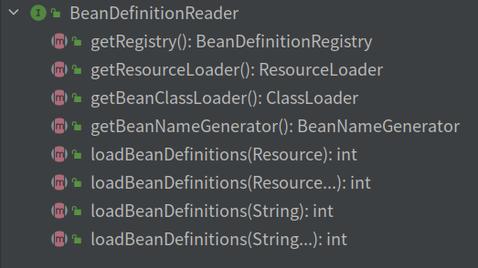

以下是BeanDefinitionReader的继承关系图：

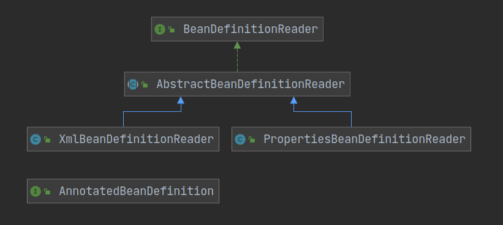

其中，XmlBeanDefinitionReader用于读取xml配置文件，PropertiesBeanDefinitionReader用于读取properties配置文件，AnnotatedBeanDefinition用于读取注解相关的配置。

关键词：

+ location
+ Resource
+ Resourceloader
+ BeanDefinitionReader
+ BeanDefinitionRegistry
+ DefaultListableBeanFactory

## BeanDefinitionRegistry

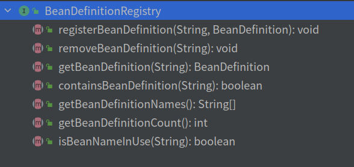

可以查看它的一个实现类DefaultListableBeanFactory，简答来说，最终将注册的bean放入一个ConcurrentHashMap中存储：

```java
/** Map of bean definition objects, keyed by bean name. */
private final Map<String, BeanDefinition> beanDefinitionMap = new ConcurrentHashMap<>(256);
```

## 后置处理器PostProcessor

本身也是一种需要注册到容器里的Bean

+ 其里面的方法会在特定的时机被容器调用
+ 实现不改变容器或者Bean核心逻辑的情况下对Bean进行扩展
+ 对Bean进行包装，影响其行为、修改Bean的内容等

### 种类

大类分为容器级别的后置处理器以及Bean级别的后置处理器

+ BeanDefinitionRegistryPostProcessor
+ BeanFactoryPostProcessor
+ BeanPostProcessor

## Aware

Aware是一个空接口，用于标记。

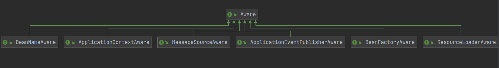

实现了Aware接口的类可以获取不同的容器实例并对其进行操作，例如实现了ApplicationContextAware接口的类可以获得ApplicationContext容器，实现了BeanFactoryAware接口的类可以获得BeanFactory容器。

每个Aware接口都有setter方法，例如ApplicationContextAware接口：


spring容器会自动调用这些setter方法。

## Spring的事件驱动模型

事件驱动模型的三大组成部分

+ 事件：ApplicationEvent抽象类
+ 事件监听器：ApplicationLIstener
+ 事件发布器：Publisher以及Multicaster

### 事件


由名字可以看出他们的作用：

+ ContextStartedEvent：容器启动后触发的事件，使用ConfigurableApplicationContext接口上的start（）方法时发布
+ ContextStoppedEvent：容器停止后触发的事件，使用ConfigurableApplicationContext接口上的stop（）方法时发布
+ ContextClosedEvent：容器关闭后触发的事件，使用ConfigurableApplicationContext接口上的close（）方法时发布
+ ContextRefreshedEvent：容器初始化或刷新后触发的事件

查看ApplicationEvent的构造器：

```java
public ApplicationEvent(Object source) {
   super(source);
   this.timestamp = System.currentTimeMillis();
}
```

传入的source为事件源。

### 监听器

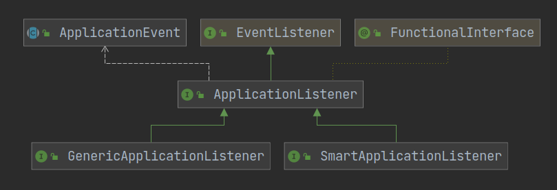

ApplicationListener接口只有一个处理event的方法。

#### SmartApplicationListener

额外实现了Order接口，因此该类监听器具备排序的功能。

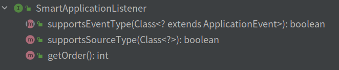

`supportsEventType`和`supportsSourceType`方法支持对事件、源的过滤。

#### GenericApplicationListener

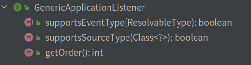

跟SmartApplicationListener非常类似，只不过supportsEventType的接受参数为ResolvableType类型，它可以获取泛型信息。

### 发布器

#### ApplicationEventPublisher


#### ApplicationEventMulticaster

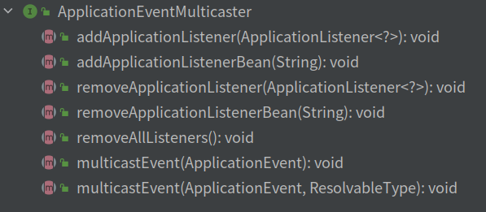

注意，ApplicationContext继承了ApplicationEventPublisher接口。

ApplicationEventPublisher只有发布的功能，而ApplicationEventMulticaster拥有发布、维护监听器等功能。

Spring为什么定义了Multicaster还要定义Publisher呢？设计者只想让ApplicationContext拥有publish的功能，而且Multicaster可以作为Publisher的代理类。

## Spring容器的刷新

以下是刷新的步骤：

+ prepareRefresh：刷新前的工作准备
  + 调用容器准备刷新的方法，获取容器的当前时间，同时给容器设置同步标识（容器的状态设置为激活）
  + 初始化Enviroment的propertySources属性
  + 校验Enviroment的requiredProperties是否都存在
  + 检查是否有监听器，如果有，那么将他们都加入到一个set中
  + 创建事件的集合
  
+ obtainFreshBeanFactory：获取子类刷新后的内部beanFactory实例
  
  + 调用子类实现的refreshBeanFactory()方法，Bean定义资源文件的载入从子类的refreshBeanFactory（）方法启动，里面有抽象方法；针对xml配置，最终创建内部容器，该容器负责Bean的创建与管理，此步会进行BeanDefinition的注册
  
+ prepareBeanFactory：为容器注册必要的系统级别的Bean，例如classloader，beanfactoryPostProcessor等
  + 设置内部bean工厂使用容器的类加载器
  + 设置beanFactory的表达式语言处理器，Spring3开始增加了对语言表达式的支持，默认可以使用#{bean.xxx}的形式来调用相关属性值
  + 为beanFactory增加一个默认的propertyEditor
  + 添加beanPostProcessor：当应用程序定义的Bean实现ApplicationContextAware接口时注入ApplicationContext对象
  + 如果某个bean依赖以下几个接口的实现类，在自动装配的时候忽略它们，Spring会通过其他方式来处理这些依赖：
    + EnviromentAware.class
    + EmbeddedValueResolverAware.class
    + ResourceLoaderAware.class
    + ApplicationEventPublisherAware.class
    + MessageSourceAware.class
    + ApplicationContextAware.class
  + 修正部分依赖
  + 添加beanPostProcessor：用于检测内部bean是否是ApplicationListener，如果是，那么加入到事件监听者队列
  + 注册默认enviroment环境bean
  
+ postProcessBeanFactory：允许容器的子类去注册postProcessor，是一个钩子方法

+ invokeBeanFactoryPostProcessors：调用容器注册的容器级别的后置处理器
  + 实例化并调用所有已注册的BeanFactoryPostProcessor的bean，如果已给出顺序（Order接口），将按照顺序调用。
    + BeanFacotryPostProcessors主要分为两类，一类是BeanDefinitionRegistry的BeanFactoryPostProcessor，另外一类是常规的BeanFactoryPostProcessor。 优先处理前者。
    + BeanDefinitionRegistry将扫描所有的BeanDefinition并注册到容器之中。
  
+ registerBeanPostProcessors：注册拦截bean创建过程的BeanPostProcessor（例如AOP织入）

+ initMessageSource：初始化国际化配置

+ initApplicationEventMulticaster：初始化事件发布者组件

+ onRefresh：在单例Bean初始化之前预留给子类初始化其他特殊bean口子，钩子方法
  + 该方法在所有单例bean初始化之前调用
  + 比如Web容器就会去初始化一些和主题展示相关的bean（ThemeSource）
  
+ registerListeners：向前面的事件发布者组件注册事件监听器

+ finishBeanFactoryInitialization：设置系统级别的服务，实例化所有非懒加载的单例

  + 初始化类型转化器ConversionService（用于处理通过配置给Bean实例成员变量赋值的时候的类型转换工作）

  + 设置自定义AOP相关的类LoadTimeWeaverAware

    > AOP分为三种方式：编译期织入、类加载期织入、运行期织入。
    >
    > LoadTimeWeaving属于第二种，主要通过JVM进行织入。

  + 清除临时的ClassLoader，实例化所有的类（懒加载的类除外）

    > 实例化类的逻辑：遍历BeanName，获取到对应的BeanDefinition实例，根据BeanDefinition的信息了解该bean是否为abstract、singleton、lazyinit等，实例化非abstract、singleton、非lazyinit的bean。

  + 此时bean处理完成，

+ finishRefresh：触发初始化完成的回调方法，并发布容器刷新完成的事件给监听器

  + 清除上下文级别的资源缓存（如扫描的ASM元数据）
  + 为上下文初始化声明周期处理器（LIfecycleProcessor）
  + 将刷新传播到生命周期处理器（调用lifecycleProcessor.refresh()方法）
  + 发布容器刷新完成的事件给监听器

+ resetCommonCaches：重置spring内核中的共用缓存，因为不需要单例bean的元数据了

## 循环依赖与三级缓存

### createBean

+ 根据BeanDefinition对Bean类型进行解析
+ 查看是否配置request-method或者lookup-method属性，检查是否有相关的覆盖方法，并做相应的标记
+ Bean实例化前的后置处理
+ doCreateBean
  + 创建Bean实例（工厂方法、含参构造器注入、无参构造器注入）
  + 记录下被@Autowired或者@Value标记上的方法或成员变量，放入InjectionMetaData的类中，便于后续的依赖注入处理
  + 判断是否允许提前早起暴露，即bean是否是单例且支持循环依赖
  + 填充Bean属性
  + initializeBean
    + 如果实现了Aware接口，则设值
    + 初始化前操作
    + 初始化
    + 初始化后操作
  + 注册相关销毁逻辑
  + 返回创建好的实例

### getSingleton

+ DefaultSingletonRegistry#getSingleton：获取单例实例
  + 如果支持循环依赖则生成三级缓存（singletonFactories），可以提前暴露bean
  + 三级缓存：解决循环依赖
    + 一级缓存singletonObjects，类型为ConcurrentHashMap，用于缓存完备的bean
    + 二级缓存earlySingletonObjects，类型为HashMap，用于缓存实例化之后但属性未赋值的单例对象(正在创建)
    + 三级缓存singletonFactories，类型为HashMap，单例工厂ObjectFactory的缓存
    + 二级、三级缓存使用非线程安全的map，是因为在对这些缓存操作时都会对一级缓存加锁。
  + 尝试从一级缓存获取完备的bean，单例一级缓存在`singletonObjects`中，是一个ConcurrentHashMap
  + 如果完备的bean还没有创建出来，并且处于正在创建状态
    + 对一级缓存上锁，尝试从二级缓存中获取属性为赋值的实例，如果二级缓存中命中，那么返回
    + 如果二级缓存中没有，并且bean允许被循环引用（第二个参数`allowEarlyReference`为true），那么从三级缓存中获取bean的单例工厂实例，使用该工厂实例的getObject获得bean实例，然后将该bean实例放入二级缓存，将该工厂实例从三级缓存中清除，返回。

### populateBean

主要作用：

+ 调用Bean的setter方法实例去给Bean设置上属性值
+ 变量类型的转换，同时还要考虑处理集合类型的情况
+ 处理显式自动装配的逻辑（autowire=byName/byType）

具体流程：

+ postProcessAfterInstantiation：在设置属性前去修改Bean状态，也可以控制是否继续给Bean设置属性值
+ 注入属性到PropertyValues中（按名字装配or按类型装配）
+ postProcessPropertyValues：对解析完但未设置的属性进行再处理
+ 是否进行依赖检查
+ 将PropertyValues中的属性值设置到BeanWrapper中

### 流程

假设A与B相互依赖，当创建A时：

首先new出没有任何属性的A的实例，之后检查A是否支持循环依赖，如果支持，那么addSingletonFactory，添加到三级缓存，随后调用populateBean给属性赋值，因为A依赖于B，那么会调用getBean方法尝试获取B实例，但是B并没有创建出来，且缓存中也没有，因此会调用doCreateBean对B进行创建。

然后new出没有任何属性的B的实例，之后检查B是否支持循环依赖，如果支持，那么addSingletonFactory，添加到三级缓存，此时三级缓存保存了A和B的ObjectFactory。随后调用populateBean给属性赋值，因为B依赖于A，那么会调用getBean方法尝试获取A实例，从三级缓存中获取A的ObjectFactory，调用ObejctFactory的getObject的方法获取A的实例（这个被后置处理器处理过的实例，AOP代理等），获取到之后，将A的实例放入二级缓存，移除三级缓存，然后将A实例返回。那么现在已经将A实例注入到B里面了，那么B已经是完备的了，然后将B实例加入一级缓存，并移除B的二级缓存和三级缓存，将完备的B实例返回到创建A的调用栈popularBean方法中。

回到A的pupularBean中，将B的实例注入到A中，那么A也完备了，然后将A的实例放入到一级缓存，清除其他级别的缓存。

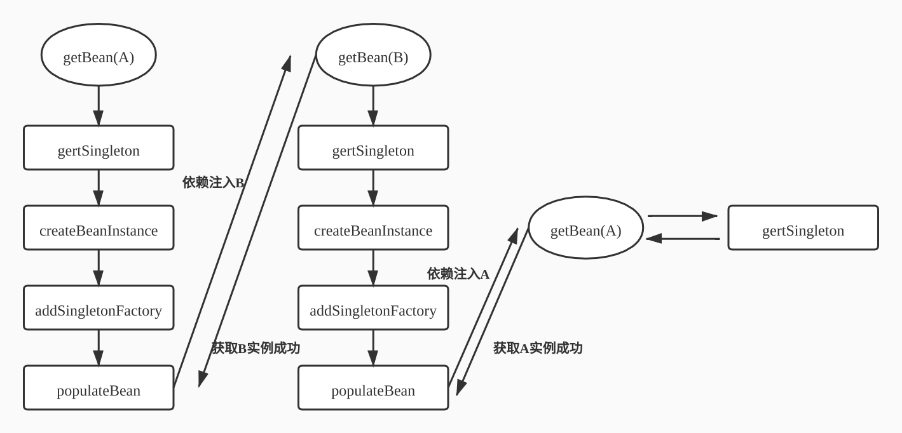

>二级缓存用于解决循环依赖的问题，但是如果需要AOP代理，那么需要三级缓存来处理，三级缓存的工厂可以进行AOP代理，返回代理对象。
>
>A，B循环依赖，先初始化A，暴露一个半成品A，再去初始化依赖的B，初始化B时如果发现B依赖A，也就是循环依赖，就注入半成品A，之后初始化完毕B，再回到A的初始化过程时就解决了循环依赖，在这里只需要一个Map能缓存半成品A就行了，也就是二级缓存就够了，但是这个二级缓存存的是Bean对象，如果这个对象存在代理，那应该注入的是代理，而不是Bean，此时二级缓存无法及缓存Bean，又缓存代理，因此三级缓存做到了缓存工厂 ，也就是生成代理。
>
>```java
>addSingletonFactory(beanName, () -> getEarlyBeanReference(beanName, mbd, bean));
>```
>
>getEarlyBeanReference方法将会遍历所有的bean级别的后置处理器，找到是SmartInstantiationAwareBeanPostProcessor实例的后置处理器，==注意，AbstractAutoProxyCreator继承了这个后置处理器接口，该该方法返回一个proxy，因此addSingletonFactory将proxy放到了三级缓存中！==

## Spring是否支持所有循环依赖的情况

循环依赖的情况如下：

+ 构造器循环依赖（singleton、prototype）
+ Setter注入循环依赖（singleton、prototype）

### Spring不支持prototype的循环依赖

因为没有设置三级缓存进行支持

+ 只能通过将Bean的名字放入缓存里阻断无限循环

### Spring不支持单例构造器的循环依赖

解决循环依赖的核心在于三级缓存，先new出bean实例然后进行依赖注入。如果new出bean实例时立即需要传入构造参数，那肯定是不行的。除非在构造参数前加一个注解`@Lazy`，允许延迟加载。

### Spring支持单例的setter注入循环依赖

## AOP

### 概念

+ 切面Aspect：将横切关注点逻辑进行模块化封装的实体对象，由 pointcount 和 advice 组成。可以简单地认为, 使用 @Aspect 注解的类就是切面。
+ 通知Advice：好比是Class里面的方法，还定义了织入逻辑的时机，切面类的方法就是Advice
  + BeforeAdvice：在JoinPoint前被执行的Advice
  + AfterAdvice：好比try...catch...finally中的finally
  + AfterReturningAdvice：在JoinPoint执行流程正常返回后被执行
  + AfterThrowingAdvice：JoinPoint执行过程中抛出异常才会触发
  + AroundAdvice：在JoinPoint执行前和后都执行，最常用的Advice。（这个方法的入参有JoinPoint，joinPoint.proceed为joinPoint的执行，执行前后都可以自定义逻辑）
  + 单个Aspect执行顺序：
    + 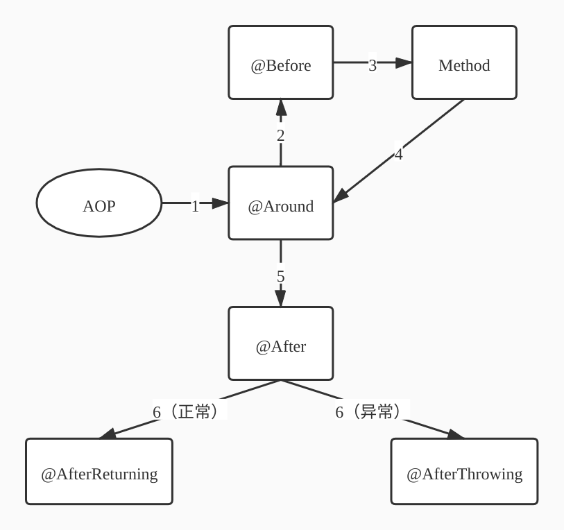
  + 多个Aspect的执行顺序：
    + 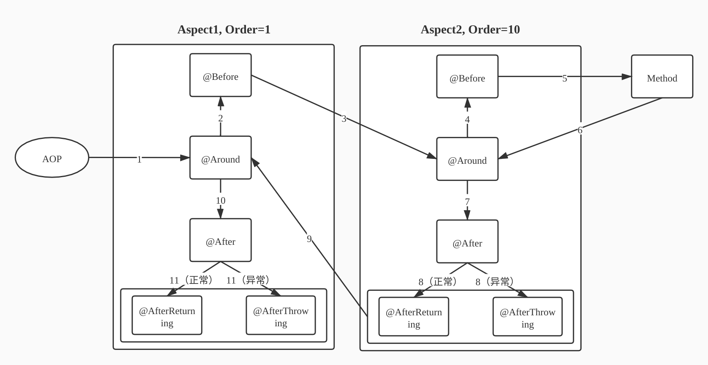
+ 连接点JoinPoint：一个时间点，允许使用Advice的地方
  + SpringAOP默认只支持方法级别的JoinPoint
+ 切入点Pointcut：定义一系列规则对JoinPoint进行筛选。在Spring中，所有的方法可以被认为是JoinPoint，因此需要定义筛选规则，给满足规则的JoinPoint添加Advice
+ 目标对象Target：织入advice的目标对象，也被称为adviced object。
+ AOP proxy：一个类被AOP织入advice，就会产生一个代理类。在SpringAOP中，一个AOP代理是一个JDK动态代理对象或CGLIB代理对象。

### BeanPostProcessor家族

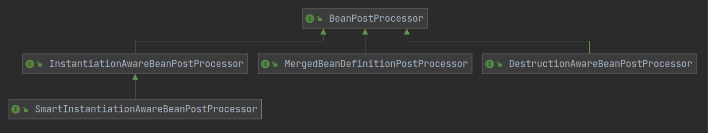

#### BeanPostProcessor

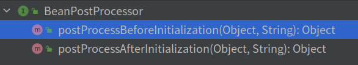

#### InstantiationAwareBeanPostProcessor

这个类作用在bean的实例化时，注意与BeanPostProcessor不同的是，BeanPostProcessor作用在bean的初始化时，而实例化在初始化之前。

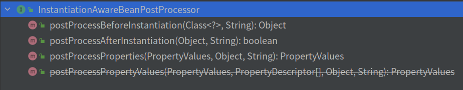

+ `postProcessBeforeInstantiation`：bean实例化之前调用。该方法返回一个Object对象，这个返回值可以替代原本需要实例化的对象，如果返回值不会null，那么bean已经被该方法替换。
+ `postProcessAfterInstantiation`：bean实例化之后，在设置属性之前调用。返回值为boolean，用于判断是否继续去执行对属性赋值的流程。如果不希望spring对某些bean进行依赖注入，而是通过自定义的逻辑来处理，那么可以实现这个方法。
+ `postProcessProperties`：入参为bean、beanName以及PropertyValues，在PropertyValues赋值给bean的域之前调用。Spring的依赖注入功能就是通过这个方法实现的，获取类中@Autowired相关注解的元信息，然后注入到PropertyValue中，后将PropertyValue返回。

#### SmartInstantiationAwareBeanPostProcessor

该类是InstantiationAwareBeanPostProcessor的一个扩展接口。

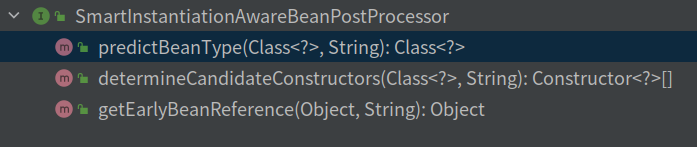

+ `predictBeanType`：执行时机不固定。当BeanDefinition无法判断bean类型时，将调用该方法进行判断。
+ `determineCandidateConstructors`：候选构造器。当未通过bean定义构造器以及参数的情况下，会根据这个回调函数返回构造器。
+ `getEarlyBeanReference`：获取要提前暴露的bean的引用，用来支持单例对象的循环引用。用于循环依赖的处理中的三级缓存的生成：`addSingletonFactory(beanName, ()->getEarlyBeanReference(beanName, mdb, bean))`。==注意，AbstractAutoProxyCreator继承了这个接口，该该方法返回一个proxy，因此addSingletonFactory将proxy放到了三级缓存中！==

#### MergedBeanDefinitionPostProcessor

用来将merged BeanDefinition暴露出来。

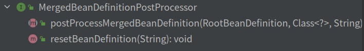

+ `postProcessMergedBeanDefinition`：
  + 实例化之后，addSingletonFactory之前
  + 在bean实例化完毕后调用 可以用来修改merged BeanDefinition的一些properties 或者用来给后续回调中缓存一些meta信息使用
  + 这个算是将merged BeanDefinition暴露出来的一个回调
  + 重点关注AutowiredAnnotationBeanPostProcessor，该类会把@Autowired等标记的需要依赖注入的成员变量或者方法实例给记录下来，方便后续populateBean使用

### @EnableAspectAutoProxy


```java
@Target(ElementType.TYPE)
@Retention(RetentionPolicy.RUNTIME)
@Documented
@Import(AspectJAutoProxyRegistrar.class)
public @interface EnableAspectJAutoProxy {
    boolean proxyTargetClass() default false;
    boolean exposeProxy() default false;
}
```

Import注解能把目标AspectJAutoProxyRegistrar作为bean管理起来。

+ `boolean proxyTargetClass() default false`：表明该类采用CGLIB代理还是使用JDK的动态代理，Spring会尽量使用CGLIB来代理。

+ `boolean exposeProxy() default false`：

  解决内部调用不能使用代理的场景，默认为false表示不处理
  
  * true则表示这个代理对象的副本就可以通过AopContext.currentProxy()获得（ThreadLocal里面），从而我们可以很方便得在Spring框架上下文中拿到当前代理对象（处理事务时很方便）

### AutoProxyCreator家族

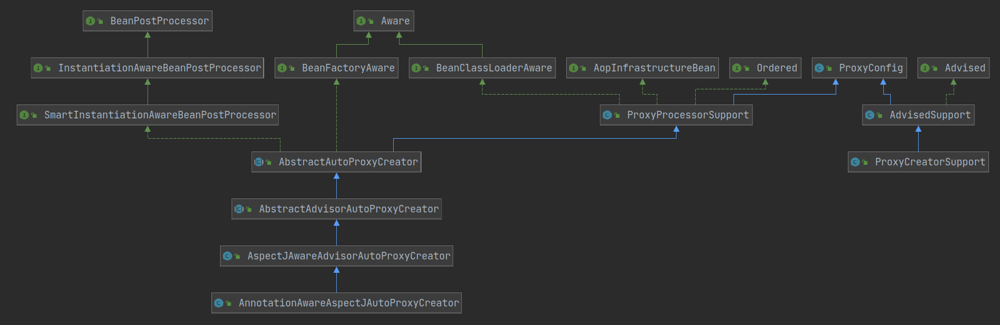

#### AopInfrastructureBean

只做标记使用。如果bean实现了这个接口，表明它是SpringAOP的基础类，那么这个类是不会被AOP给代理的。

### TargetSource

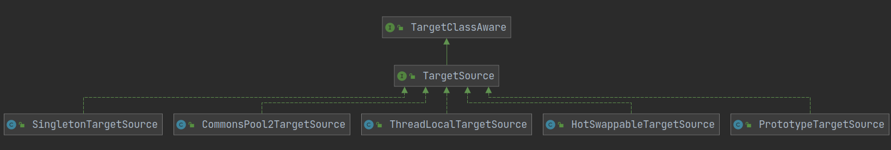

### 代理生成阶段

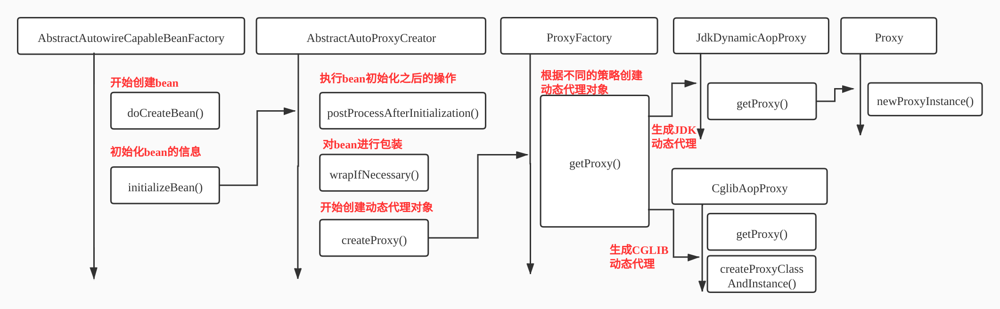

## SpringMVC

### 核心流程

+ 建立请求和Controller方法的映射集合的流程
+ 根据请求查找对应的Controller方法的流程
+ 请求参数绑定到方法形参，执行方法处理请求，渲染视图的流程

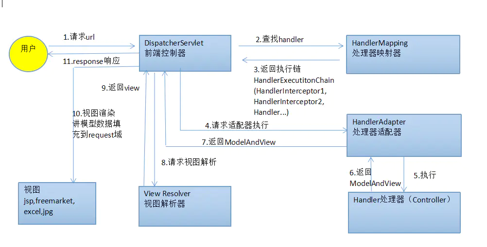

具体流程：

1、用户发送请求至前端控制器DispatcherServlet。

2、DispatcherServlet收到请求调用处理器映射器HandlerMapping。

3、HandlerMapping根据请求url找到具体的处理器，生成处理器执行链HandlerExecutionChain(包括处理器对象和处理器拦截器)一并返回给DispatcherServlet。

4、DispatcherServlet根据处理器Handler获取处理器适配器HandlerAdapter执行HandlerAdapter处理一系列的操作，如：参数封装，数据格式转换，数据验证等操作。

5、执行处理器Handler(Controller，也叫页面控制器)。

6、Handler执行完成返回ModelAndView。

7、HandlerAdapter将Handler执行结果ModelAndView返回到DispatcherServlet。

8、DispatcherServlet将ModelAndView传给ViewReslover视图解析器

9、ViewReslover解析后返回具体View

10、DispatcherServlet对View进行渲染视图（即将模型数据model填充至视图中）。

11、DispatcherServlet响应用户。

### 组件说明

+ DispatcherServlet：前端控制器。用户请求到达前端控制器，它就相当于mvc模式中的c，dispatcherServlet是整个流程控制的中心，由它调用其它组件处理用户的请求，dispatcherServlet的存在降低了组件之间的耦合性,系统扩展性提高。由框架实现。
+ HandlerMapping：处理器映射器。HandlerMapping负责根据用户请求的url找到Handler即处理器，springmvc提供了不同的映射器实现不同的映射方式，根据一定的规则去查找,例如：xml配置方式，实现接口方式，注解方式等。由框架实现。
+ Handler：处理器。Handler 是继DispatcherServlet前端控制器的后端控制器，在DispatcherServlet的控制下Handler对具体的用户请求进行处理。由于Handler涉及到具体的用户业务请求，所以一般情况需要程序员根据业务需求开发Handler。
+ HandlerAdapter：处理器适配器。通过HandlerAdapter对处理器进行执行，这是适配器模式的应用，通过扩展适配器可以对更多类型的处理器进行执行。由框架实现。
+ ModelAndView：是springmvc的封装对象，将model和view封装在一起。
+ ViewResolver：视图解析器。ViewResolver负责将处理结果生成View视图，ViewResolver首先根据逻辑视图名解析成物理视图名即具体的页面地址，再生成View视图对象，最后对View进行渲染将处理结果通过页面展示给用户。
+ View：是springmvc的封装对象，是一个接口, springmvc框架提供了很多的View视图类型，包括：jspview，pdfview,jstlView、freemarkerView、pdfView等。一般情况下需要通过页面标签或页面模版技术将模型数据通过页面展示给用户，需要由程序员根据业务需求开发具体的页面。

## keyword

+ Aware
+ AbstractApplicationContext#refresh：（refresh只加载非延时singleton的bean，对于prototype等类型的bean不会加载，只能通过显式的方式加载，如getBean方法）
+ populateBean
+ SpringAOP的实现原理之CGLIB动态代理
  + 不要求被代理类实现接口
  + 内部主要封装了ASM Java字节码操控框架
  + 动态生成子类以覆盖非final的方法，绑定钩子回调自定义拦截器

## 术语补充

+ 组件扫描：自动发现应用容器中需要创建的Bean（即扫描所有的class查看是否被`@Controller`等修饰，然后初始化）
+ 自动装配：自动满足Bean之间的依赖（即依赖注入，`@Autowired`等）