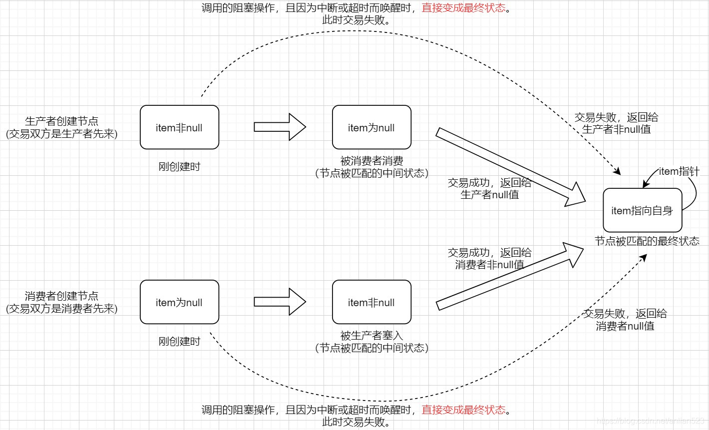
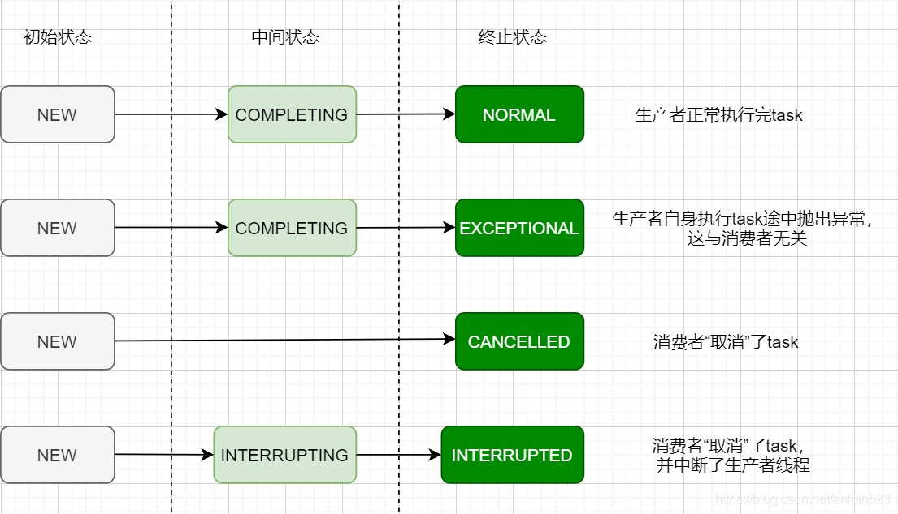
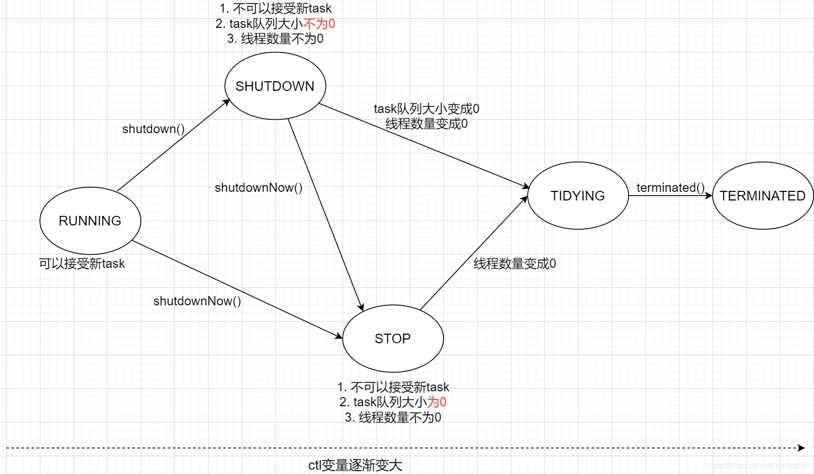

# 源码总结

## JUC

### CAS

+ 存在ABA问题，CAS只能保证两个时刻的某个位置上的值是一致的，而不能保证在这之间的时间段里，该位置的值没有发生变化。

### AtomicIntegerArray

+ array变量用final修饰，但注意没有用volatile修饰！其实是通过调用Unsafe类的getIntVolatile以及putIntVolatile方法来保证的。

### AtomicIntegerFieldUpdater

+ 基于反射，能够提供对指定类的指定的volatile int字段的原子更新操作。
+ FieldUpdater vs AtomicXXX
	+ 使用FieldUpdater可以避免引入Atomic类。
	+ 当需要构造出大量需要保证线程安全的对象时，可以仅仅将对应的域设置为volatile的，用FieldUpdater进行同一操作，而不是将AtomicXXX嵌入其中。

### AtomicMarkableReference

+ AtomicMarkableReference与AtomicStampledReference非常类似。前者维护二元组[reference, boolean]，后者维护二元组[reference, int]。
+ 提供了对二元组的CAS操作。

### Striped64

+ 当大量线程需要访问同一个Atomic类时，虽然能满足原子语义，但是吞吐量会大大下降。
+ 对于更新操作，用“分摊”的思想，将这些操作分摊到多个Cell上，在每个Cell上使用CAS，需要总和时，只需要将它们累加返回。
+ Cell使用了@Contended注解，因为Striped64里维护了Cell数组，需要引入paddings来解决FalseSharing的问题。
+ Cell数组使用懒初始化的方式，长度为$2^n$，用于hash&(len-1)，即取hash值的末n bit。
+ 优先CAS更新base，失败后再去CAS更新相应的cell。
+ 在执行初始化、扩展、竞争等操作时，采用的是自旋锁的机制，即volatile类型的cellBusy变量，对它的CAS操作+自旋。

### AQS

+ 一般地，在入队之前会尝试请求一次锁，即tryAcquire方法，根据tryAcquire的不同实现可以得到很多策略，例如公平锁与非公平锁。比如在tryAcquire中通过判断队列是否非空做相应处理来实现公平锁。
+ 在高并发的情况下，非公平锁的性能大于公平锁。对于非公平锁，一个新来的线程如果tryAcquire成功，那么直接就可以执行。对于公平锁，需要进行若干个操作（如对队列的操作、唤醒等调度）才能开始执行。当公平锁可能会导致饥饿问题。
+ 队列有两种，同步队列与条件队列。
+ 对于一个AQS来说，一个AQS的所有条件队列都对应同一个同步队列。一个AQS只能有一个同步队列，而能有多个条件队列。
+ 同步队列的底层实现是双向链表；条件队列的底层实现是单向链表。
+ Node类的next与pre域用于同步队列，nextwaiter用于条件队列（在同步队列中，nextwaiter最多在共享模式下用来标识是否为共享锁节点）。
+ 当一个节点成功地acquire的时候，它就成为了首节点，因此首节点永远不会是取消状态的节点。
+ Node有四种状态：
	+ CANCELLED：表示该Node已经被取消
	+ SIGNAL：表示后继需要被唤醒。一个Node只有在前驱的状态设置为SIGNAL后才具备挂起的条件
	+ CONDITION：表示是从条件队列出队（被signal，唤醒去竞争锁），入队到同步队列的
	+ PROPAGATE：只用于共享锁模式，用于判断需不需要多唤醒一个线程取竞争锁
+ 同步队列的next域在入队操作时不会被初始化，只有它被用到时才会。因此不能通过next域来判断是否为tail节点。因此如果某个节点的next域为空，我们可以查看tail的prev节点进行二次检查。pre节点是准确的！
+ 独占锁的获取：acquire
	+ 首先会调用tryAcquire，在入队前尝试获取锁。
	+ tryAcquire失败，那么将调用acquireQueued进行自旋，再次尝试获取，失败则入队挂起。
	+ acquireQueued会不断自旋，直到获取锁成功，先判断是否当前节点是否具有挂起条件（前驱为SIGNAL），如果前驱不是SIGNAL，那么将前驱设置为SIGNAL，下次循环再挂起当前节点。
	+ 在acquireQueued中的自旋中，获取锁的方式是公平的。在非公平锁中，当线程A被唤醒重新去竞争锁，而另一个新来的线程B非公平地先获取了锁，线程A获取锁失败，再度被挂起。
+ 独占锁的释放：release
	+ 调用tryRelease，成功后判断是否需要唤醒后继结点，失败直接返回。
	+ tryRelease成功后，检查head如果为SIGNAL，那么唤醒后继。
+ 共享锁的获取：acquireShared
	+ 首先调用tryAcquireShared，成功就返回，失败就调用doAcquireShared，这个整体逻辑跟acquireQueued差不多，直到获取锁成功。
	+ 共享锁在获取成功后的处理与独占锁不同的是，会检查head的后继是否也能获取锁，如果能就unpark它。
+ 共享锁的释放：releaseShared
	+ 首先调用tryReleaseShared。
	+ 如果tryReleaseShared成功，检查head状态，如果为SIGNAL，那么置为0，唤醒后继；如果head为0，那么置为PROPAGATE。
+ PROPAGATE
	+ 用于共享锁
	+ 什么时候head的状态会是PROPAGETE呢？当有多个线程同时进行release操作时，两次release会将head从SIGNAL变为0再变为PROPAGATE。由于并发，在setHeadAndPropagate方法里面的临时变量propagate（表示还剩多少锁资源）可能与实际情况不一致。比如propagete=0，没锁资源了，就唤醒后继了，但是同时有别的线程release了，因此实际可能为1。为了处理这种情况，可以判断旧head的状态是否为PROPAGETE，如果为PROPAGATE，那么意味着在读取propagate之后又有新的线程release了，那么就再唤醒一个后继。
+ Condition
	+ await
		+ 首先将当前线程入队条件队列
		+ 释放所有的锁，将锁的数量保存下来，在被唤醒后重新请求相同数量的锁
		+ 自旋判断是否在同步队列上，如果不在就阻塞自己
		+ 当阻塞中的自己被中断或者被signal唤醒，将调用acquireQueued去竞争锁，失败将进入同步队列
	+ signal
		+ 将条件队列的第一个唤醒并入队同步队列，唤醒与入队的操作可以失败，失败表示中断流程先行发生，后续的acquireQueued也会使节点入队同步队列。

### ReentrantLock

+ 重入锁是一个独占锁，可重入指的是当某个线程持有锁时，它可以acquire多次。即当state=0时，没有线程持有锁，当不等于0时，某个线程持有锁，且这个线程acquire了state次。
+ 只是简单地实现了AQS的tryAcquire和tryRelease方法

### ReentrantReadWriteLock

+ 默认模式是非公平的。

+ 定义了两把锁，读锁与写锁，它们共用一个同步队列，即同一个AQS的子类实现。
+ AQS的state为Integer类型，高16 bit为读锁的拥有数量，低16 bit为写锁的拥有数量。
+ 需要记录各个线程的读锁的拥有数量。用HoldCounter类包装一个整型变量count，再与ThreadLocal相结合作为线程私有的。写锁不需要记录，因为只能有一个线程持有锁，至于重入数量直接查看state即可。
+ 写锁
	+ tryRelease
		+ 如果当前线程未持有锁，那么抛出异常
		+ 释放后如果写锁的state为0，那么将exclusiveOwner置null
		+ 没有用自旋，因为写锁只能由一个线程持有，没有竞争
	+ tryAcquire
		+ 读锁数量必须为0
		+ 写锁可以非0，但必须保证当前线程是独占线程
		+ 如果获取后写锁数量溢出，则抛出异常
+ 读锁
	+ tryReleaseShared
		+ 就是简单的将ThreadLocal存着的count减一。最后对state的CAS有自旋。
	+ tryAcquireShared
		+ 写锁必须为0，或者当前线程持有锁
		+ 同样需要自旋
	+ 可以注意到，独占锁的tryXXX方法不需要自旋，因为持锁的有线程只能有一个；而共享锁的tryXXX方法需要自旋，因为持有锁的线程可能有多个。
+ 总结
	+ 一个线程具备获取写锁的条件
		+ 读锁为0
		+ 写锁获取不超过上限
		+ 写锁为0或者当前线程为写锁的独占线程
		+ 公平模式下为head的后继，非公平无所谓
	+ 一个线程具备获取读锁的条件
		+ 当前写锁为0或者当前线程持有写锁
		+ 读锁获取不超过上限
		+ 如果当前线程持有读锁，那么在公平模式下即使不为head后继也允许获取
		+ 如果当前线程不持有读锁，且在非公平模式下不为head后继，那么只能排队等待

### CountDownLatch

+ 基于共享锁，一次性。
+ state初始化时为n，调用countDown方法->releaseShared->tryReleaseShared，将state减一。
+ 某个线程调用await方法->调用acquireShared(1)进行阻塞式抢锁。而只有当state为0时，tryAcquireShared才会返回true。
+ 当调用最后一次的countDown方法将state变为0时，此前所有请求锁的线程必定已经阻塞在同步队列上的，countDown->releaseShared->唤醒第一个线程抢锁->state为0，tryAcquireShared抢锁成功->setHeadAndPropagate->唤醒第二个线程（因为tryAcquireShared返回的都是1）->......->直到唤醒最后一个线程
+ 应用场景：
	+ n等1：
		+ n个线程调用await，一个线程调用countDown，state初始化为1
	+ 1等n：
		+ n个线程调用countDown，一个线程调用await，state初始化为n

### CyclicBarrier

+ CountDownLatch只使用了同步队列，而CyclicBarrier既使用了同步队列也使用了条件队列。
+ CountDownLatch基于共享锁，而CyclicBarrier基于独占锁，非公平。
+ CountDownLatch一般用于两个场景：n等1与1等n。而CyclicBarrier强化了第二种场景，前n-1个线程到达屏障后等待，直到第n个线程到达屏障，当所有n个线程到达屏障时，可以执行用户传入的某项任务，然后对所有的线程进行signal，依次唤醒，后执行。
+ CountDownLatch只能使用一次；CyclicBarrier可以使用多次，每次为不同的generation。
+ CyclicBarrier遵循`all-or-none breakage model`的原则，同一代线程要么都正常在`CyclicBarrier#await`返回，要么都抛出异常(某个线程超时、中断将设置broken为true，其他线程会抛出broken异常)。
+ 使用了一个独占锁和对应锁的一个条件队列。
+ generation变量代表一个代，用于存储是否broken的标志以及比较generation是否发生改变。
+ count变量表示还需要多少个线程到达屏障。线程调用await，获取独占锁，修改count，如果当前线程不是最后一个到达的线程，那么调用AQS的await阻塞等待；如果当前线程是最后一个到达的，那么无需阻塞，直接执行用户传入的某项任务，完毕后调动nextGeneration->signalAll。
+ 一代线程通过屏障的完整流程
	+ 前n-1个线程到达屏障，将count减一，然后调用Codition的await阻塞。此时前n-1个线程处于条件队列上。
	+ 第n个线程达到屏障，将count减到0，然后执行barrierCommand，如果command执行成功，那么nextGeneration->signalAll；如果失败，将broken设置为true，signalAll，其他n-1个线程一次获取锁，发现broken为true，抛出异常。
	+ 综上，n个线程要么都做要么都不做。
+ 前n-1个线程发生中断或超时的流程
	+ 当某个线程发生中断或超时时，调用breakBarrier，设置broken为true，signalAll，其他所有的线程一次获取锁，检测到broken，都抛出异常。
+ 第n个线程执行nextGeneration之前或之后，前面的线程发生中断或超时
	+ 因为第n个线程全程持有锁，因此之前与之后的情况是一样的。
	+ 第n个线程调用nextGeneration后，对于前面的n-1个线程，当前代肯定不是最新代了，就不会执行breakBarrier，因此正常退出。
	+ 综上，第n个线程到达的那一刻，只要第n个线程没有发生异常，这n个线程都能正常退出。
+ 条件队列上的node的线程，肯定是同一代的吗？
	+ 是的，换代只有nextGeneration能换，且还会调用signalAll，将条件队列上的所有线程入队同步队列。
+ 同步队列上的node线程，肯定是同一代的吗？
	+ 不一定。因为是非公平方式。第n个线程调用了nextGeneration后，前n-1个线程入队同步队列，它们是第一代。现在第二代的n个线程到来，因为非公平的方式，它们可能会先获得锁，最极端的情况就是第二代的线程都抢锁成功，那么同步队列里面存在着两种不同的代。

### Semaphore

+ 默认实现是非公平共享锁。
+ tryXXX等方法使用乐观锁（自旋+CAS）。
+ permit数量就是AQS的state。
+ 提供减少permit总量的方法。
+ 提供清空当前所剩的permit的方法。
+ 其他的方法都是对AQS对应的方法的包装。

### ThreadLocal

+ 这个类提供线程本地变量。各个线程通过该类的get/set方法来访问线程隔离的变量。表面上看好像是ThreadLocal维护了一个变量表，存储着各个线程的同一个变量名的不同版本，事实上该变量是存储在各个线程内的map中的。一个线程得到一个ThreadLocal实例时，将ThreadLocal实例作为map中的key去访问本地的map，得到本地的ThreadLocal实例对应的变量。

+ 例子：

	```java
	//给各个线程标记id，不可改动（可以开放set方法来允许线程改动自身id） 
	public class ThreadId {
	     //提供初始化的数值
	     private static final AtomicInteger nextId = new AtomicInteger(0);
	
	     //ThreadLocal变量
	     private static final ThreadLocal<Integer> threadId =
	         new ThreadLocal<Integer>() {
	         //当某个线程调用thread_local.get()时，如果key没有对应的值，那么将调用initialValue()方法
	             @Override protected Integer initialValue() {
	                 return nextId.getAndIncrement();
	         }
	     };
	
	     //get方法
	     public static int get() {
	         return threadId.get();
	     }
	 }
	```

+ 每一个ThreadLocal类型的实例都保存着不一样的threadLocalHashCode，作为各个线程的threadLocals（ThreadLocalMap类型）的key。因此就算是同一个ThreadLocal类型，如果实例不一样，那么线程私有的map中的对应值也是不一样的。
+ initialValue()
	
	+ 当某个线程调用thread_local.get()时，如果key没有对应的值，那么将调用initialValue()方法
+ get()
	
	+ 在线程A中调用ThreadLocal实例的get方法时，首先会获取当前线程A的ThreadLocalMap，然后将ThreadLocal实例本身的hash&(capacity-1)作为key到ThreadLocalMap中查找，如果没有对应的key，那么设置为initialValue()。
+ set()
	
	+ 就是当前线程的ThreadLocalMap的set方法的包装。
+ ThreadLocalMap
	+ 该类是在ThreadLocal类中定义的。
	+ 底层是个Entry数组table，做环形数组用。
	+ Entry继承了WeakReference，WeakReference的referent类型为ThreadLocal<?>，就是前面提到的ThreadLocal实例的类型，做为key。
	+ table的初始容量为16，为2的幂
	+ hash冲突时进行线性探测。探测函数使得table为一个环形数组。
	+ 探测的同时会整理table。
		+ 在Miss后，线性探测，在探测的途中如果遇到了stale entry会整理table。stale entry指的是非null的slot，但是key为null。
		+ expungeStaleEntry是清理函数。整理对象是都从哪个staleSlot开始的非null连续段，将staleSlot置null。每次遇见不是staleSlot的slot，重新计算hash值，因为前面清理过的slot可能恰好可以作为它们的新位置。清理函数都是类似的逻辑。
		+ 清理机制能保证待搜索的位置一定在以hash值下标为首的连续段中，提高了搜索效率。
	+ get、set都可能进行整理。
	+ 两倍扩容。
	+ 当所用量大于1/2时，将进行扩容。
+ 应用场景：
	+ ThreadLocal用来给各个线程提供线程隔离的局部变量。使用很简单，通过调用同一个ThreadLocal对象的get/set方法来读写这个ThreadLocal对象对应的value。
	+ ThreadLocal对象通常是`static`的，因为它在map里作为key使用，所以在各个线程中需要复用。
+ 为什么Entry继承了WeakReference？
	+ 首先，WeakReference的父类成员referent，如果referent指向的对象没有强引用指着它，那么referent指向的对象就可能被回收，从而使得referent引用为null。
	+ 如果不继承WeakReference，而仅仅将ThreadLocal的实例设为null，那么在各个线程的ThreadLocalMap中，某个entry还持有着该ThreadLocal对象，是强引用，因此除非所有的线程执行remove或者退出，这些entry永远不会被gc。
	+ 如果继承了WeakReference，然后将ThreadLocal的实例设为null，那么该实例只剩下各个线程的map中的entry的弱引用了，随时可能被gc。当被gc时，entry的key变为null，变成了staleSlot，ThreadLocalMap的get、set方法发现它们会自动帮忙清理。
	+ 如果当前线程用不到这个值时，建议显式调用remove。

### CopyOnWriteArrayList

+ 一个ReentrantLock。
+ 线程安全的ArrayList。
+ 底层是数组。
+ 任何非修改性质的方法都不会获取锁，保留了读操作的高性能。因此可能读到旧数据。
+ 任何修改性质的方法都需要获取锁，高内存消耗。都会对内部数据结构`element`赋予新值，因此叫做CopyOnWrite，免了因为并发修改iterator抛出`ConcurrentModificationException`异常。
+ iterator不提供对内部数据的任何修改方法。
+ 任何修改都会对`element`赋予新值，因此即使iterator已经构造出来了，其他地方对内部数据进行修改，iterator所引用的数组不会发生任何改变。因此也不需要维护ModCount变量。
+ sublist提供了add、remove等方法，因此需要检查数组是否被修改。与ModCount原理一样，保存创建SubList时的数组引用`expectedArray`以及COW本体`l`，在被调用修改性质的方法时，检查`l.getArray()==expectedArray`，如果不同则抛出异常。
+ 优点
	+ 保留了读操作的高性能。
	+ 避免了并发修改抛出的ConcurrentModificationException异常。
+ 缺点
	+ 写操作太多时，将产生高内存消耗。因为需要拷贝出新数组。
	+ 读操作不能保证看到最新的数据，即使写操作已经开始执行了。因为直到写操作执行`setArray`之前，读操作都无法看到最新数据。
+ 使用场景
	+ 读操作多，写操作少的场景。
	+ 读操作允许看到非最新数据的场景。

### CopyOnWriteArraySet

+ 内部实现是CopyOnWriteArrayList。
+ 跟容器类Set不一样，不管是get、add、remove等等方法，性能都要低很多（毕竟底层是个List数组）。
+ Iterator的功能也跟CopyOnWriteArrayList相同，不提供修改的方法，并发修改时不会抛出异常。

### ArrayBlockingQueue

+ 一种FIFO（first-in-first-out 先入先出）的有界阻塞队列，底层是循环数组，也支持从内部删除元素。并发操作依赖于加锁的控制，支持阻塞式的入队出队操作。正因为有界，所以才会阻塞。
+ 底层是循环数组，takeIndex、putIndex来指示对应操作的位置。
+ 加锁实现完全依赖于AQS。
+ 一个可重入的独占锁ReentrantLock，和该锁对应的两个Condition：notEmpty和notFull。
+ 各种操作都需要获取锁，包括peek。
+ offer，入队成功将notEmpty.signal。
+ put，入队成功将notEmpty.signal。
+ offer只尝试一次，失败则返回；put将notFull.await阻塞直到可以插入，成功则notEmpty.signal。
+ poll，一次尝试，成功将notFull.signal。
+ take，失败则等待notEmpty.await，成功则notFull.signal。

### LinkedBlockingQueue

+ 一种FIFO（first-in-first-out 先入先出）的有界阻塞队列，底层是单链表，也支持从内部删除元素。并发操作依赖于加锁的控制，支持阻塞式的入队出队操作。
+ 队列中有dummy node。
+ 相比`ArrayBlockingQueue`的一个Lock，`LinkedBlockingQueue`使用了两个Lock，分别对应入队动作和出队动作，提高了并发量。
+ 两个Lock都是非公平锁。
+ 记录元素的个数使用的是AtomicInteger，因为毕竟有两把锁，意味着出队、入队线程能并发。
+ 两把锁，takeLock与putLock；两个Conditon，notEmpty和notFull。
+ notEmpty是与takeLock绑定的，notFull是与putLock绑定的。意味着所有的出队操作成功时需要检查是否需要notEmpty.signal；所有的入队操作成功时需要检查是否需要notFull.signal。这与ArrayBlockingQueue恰好相反。
+ 为什么锁与Condition的绑定与常理不同？因为并发。考虑出队操作执行notFull.signal，同时有入队操作恰好填满了队列，将导致线程不安全。但如果由入队操作执行notFull.signal，此时其他入队操作是不可能获取锁的，因此size必定不会比当前看到的大，保证了线程安全。
+ 与ArrayBlockingQueue一样，offer一次尝试不等待，put失败后等待，poll一次尝试不等待，take失败后等待。
+ 迭代器是弱一致性的，即使节点被删除，迭代器也可能会照样返回被删除节点的item。注意next与remove方法会获取所有的锁。

### LinkedBlockingDeque

+ 一种有界阻塞队列，它的底层是双向链表，所以它是双向的。也就是说，在队首队尾都可以进行插入和删除操作。这样，LinkedBlockingDueue就支持FIFO（队列）、FILO（栈）两种操作方式。
+ 和ArrayBlockingQueue一样，使用一个Lock和两个Condition来控制并发和阻塞。因为两端都可以入队出队，所以用一个锁才能保证正确。
+ 从first端移除的节点，next指针指向自身，以区别于first指向节点（next指针不会指向自身，可能为真实节点或null）。从last端移除的节点同理。
+ 中间的被删除节点，从该节点出发仍能找到链表上的所有节点，即该节点的`pre`与`next`没有改变，但不影响gc，因为没被引用。

### PriorityBlockingQueue

+ 一个无界阻塞队列，它的出队方式不再是FIFO，而是优先级高的先出队。其内部实现是最小堆，即堆顶元素是逻辑上最小的那个元素，也是最先出队的那个元素。
+ 一个锁，一个Condition，notEmpty。
+ 一个自旋锁，volatile 变量+CAS，用于扩容
+ 因为是无界的，所以入队是不可能因为队列满而阻塞的，但有可能因为内存耗尽而抛出`OutOfMemoryError`。
+ 扩容时需要释放独占锁，允许别的线程对旧table进行并发操作，但是需要获取自旋锁，同时只能有一个线程进行扩容操作。
+ 默认数组的容量是11。
+ MAX_ARRAY_SIZE=Integer.MAX_VALUE-8，8是因为有的虚拟机实现里数组的前8个字节用来存别的东西。
+ 新容量的计算方式：
	+ 如果oldCap<64，新容量等于2(oldCap+1)。
	+ 如果oldCap>=64，新容量等于1.5oldCap。
	+ 经过前面的步骤算出的容量如果大于MAX_ARRAY_SIZE，那就oldCap+1，如果还溢出，那就抛出异常。
+ 迭代器的一致性非常弱，在迭代器对象初始化的时候，就复制了一个新数组出来。也就是说，从初始化的时间节点之后，元素被从`PriorityBlockingQueue`中删除了迭代器也不管，新元素加入了`PriorityBlockingQueue`迭代器也不管。
+ 迭代器初始化时会保留一份当前数组的拷贝，所有操作都在拷贝的数组上，但是`remove`还是有效的，它会在原数组上删除。
+ 堆的内部操作只有两种：冒泡上移和冒泡下沉。
+ `PriorityBlockingQueue`不允许存储null元素。

### DelayQueue

+ 无界阻塞队列，它和`PriorityBlockingQueue`一样是一个优先队列，但区别在于队列元素只能放置Delayed对象，而且只有元素到期后才能将其出队。
+ 内部是一个最小堆，堆顶永远是最先“到期”的那个元素。如果堆顶元素没有到期，即使线程发现队列中有元素，也不能将其出队。
+ `DelayQueue`需要依赖于元素对Delayed接口正确实现，即保证到期时间短的Delayed元素`.compareTo`(到期时间长的Delayed元素) < 0，这样可以让到期时间短的Delayed元素排在队列前面。
+ 一把独占锁，一个Condition，available。
+ leader变量保存第一个线程。当队首的元素还没到期，第一个线程明确直到队首元素需要多久，因此调用超时机制的available.await，其他线程需要永久阻塞，当第一个线程出队成功后就会唤醒其他线程。这叫做Leader-Follower模式。
+ 其他线程检测leader变量是否为空来判断调用那种await，是否要将自己设置为leader。
+ Leader在阻塞期间一直是Leader身份的，当被唤醒后马上清空自己的Leader身份，但是在退出take或再次阻塞前是持有锁的，因此不用担心别的线程修改Leader。
+ 和`PriorityBlockingQueue`一样，迭代器初始化时，传入一个当前`DelayQueue`队列的数组快照。所以也是弱一致性的。
+ Leader-Follower模式减小了无意义的线程唤醒，只在Leader退出出队函数时唤醒Follower，以避免Follower线程一直阻塞在AQS条件队列里。

### LinkedTransferQueue

+ 无界阻塞队列，它提供一种Transfer的功能，用以保证生产者把数据传输给消费者,需要保证生产者把数据确实传输给了消费者，才算是一次成功的入队操作，否则算作入队失败。

+ 队列中可能存在data node（生产者创建的节点，开始时item不为null），也可能存在request node（消费者创建的节点，开始时item为null）。

+ 如果发现队列中有request node（而且肯定是发现的队列第一个request node），那这个data node就不用新增，直接把item传递给创建request node的线程（通过这个request node的item域）。

+ 生产者线程成功创建并入队一个data node后，它会一直阻塞直到另一个消费者线程来临。这种实现使得生产者线程可以和消费者线程产生联动，即当生产者从阻塞的入队操作返回时，说明生产者的生产的东西已经被消费者消费掉了。对于消费者先来的情况也是一样的。

+ 没有依靠AQS，而是自己实现了一个类似条件队列的内部链表的结构。每个节点带有Thread成员，交易后来的那一方通过这个成员来唤醒先来的一方，交易双方通过节点的item域来进行交易。

+ 在保持head和tail正确性的套路上，跟ConcurrentLinkedQueue一样，使用松弛阈值来减小CAS次数且能保持head和tail的相对正确性。

+ 

+ 节点被匹配有两种状态：

	+ 中间状态：item值与当初创建时不同，即null与非null的转换。
	+ 最终状态：item指向自身。
	+ 这也解释了为什么item成员的类型不是E而是Object，因为需要指向自身。

+ 一个节点如果从队头出队，next将自链接；如果从内部删除，则只是断开链接（从队列出发找不到这个节点，从这个节点出发可以到达队列）。

### SynchronousQueue

+ `LinkedTransferQueue`的升级版。提供了两种逻辑结构，栈和队列。
+ 对于取消的节点，`LinkedTransferQueue`中的做法是将节点的`item`指向自己，`SynchronousQueue`的做法是将节点的`match`指向自己。
+ 栈模式
	+ 节点有四种状态：
		+ 交易先到的request node
		+ 交易先到的data node
		+ 交易后到的request node
		+ 交易后到的data node
	+ 交易后到的都属于fulfilling node。
	+ 交易后到的node也会被圧栈，目的是保证无锁实现能正确执行。
+ 队列模式
	+ 整体上和`LinkedTransferQueue`很像，交易后到的一方不会真正加入fulfill节点，而是直接修改交易先到的节点的`item`域。但本队列初始时有dummy node。
	+ 有dummy node。
+ SynchronousQueue完全没有容量的概念了，很多常用操作比如`isEmpty()/size()/clear()/remove(Object)/contains(Object)/peek()`都不支持了。可以用的公共方法只有：
	+ 入队：`put(E)/offer(E, long, TimeUnit)/offer(E)`
	+ 出队：`take()/poll(long, TimeUnit)/poll()`

### ConcurrentLinkedQueue

+ 一种FIFO（first-in-first-out 先入先出）的无界队列，底层是单链表。
+ 使用非阻塞算法来处理并发操作，这也意味着实现里充满了CAS和自旋。
+ head和tail分别指向first live node和last node。
+ 因为无法对两个volatile变量的CAS绑定到一起，因此允许head和tail处于不一致的状态，当偏离程度达到2时，才会进行修正。
+ 基本不变式
	+ 任意时刻，队列中的有效节点（item域非null）通过next指针是相连的。
	+ 队列中只能有一个节点的next为null，当然它就是我们说的last node。一般情况下，我们从tail出发就能以O(1)的复杂度找到last node。即从tail出发能找到真tail。
	+ 从head出发能找到所有item域非null的节点。即从head出发能找到真head。
+ size方法是弱一致性的。

### ConcurrentLinkedDueue

+ 一个无界的双端队列，底层是双向链表，它的并发操作是基于CAS的无锁实现，所以不会产生阻塞。
+ 一个node的item不为`null`，被认为是live node。因为一个node的`item`为null说明它已经是逻辑上被删除了，不过注意，初始化时队列中只有一个dummy node，它的`item`为null。
+ head或tail并不一定指向first node或last node。但通过head肯定能找到first node，tail同理。
+ 对节点的删除有三个步骤：
	- “logical deletion”。将node的item置为null，它在逻辑上已经被认为是删除了的。
	- “unlinking”。使得从active node出发不能到达这些逻辑删除节点（反之，从逻辑删除节点节点出发还是可以到达active node的），这样，GC最终会发现这些逻辑删除节点。
	- “gc-unlinking”。使得从逻辑删除节点也不能到达active node了，这样，会使得GC更快发现它们。当然，第三步只是一种优化，没有第三步节点也会被回收。这只是为了保持GC健壮性。
		- 在这一步中，会使得node self-links（即指针指向自己），另一个指针指向end终止符（end指first端或last端）。
+ 迭代器分为正向迭代器和反向迭代器，毕竟是一个双端队列。
+ 迭代器是弱一致性的，因为放到nextNode的节点，即使之后从队列中被删除（节点的item会变成null），nextItem也会继续维持引用

### ConcurrentHashMap

+ 一种支持并发操作的HashMap，并发控制方面，它使用更小粒度的锁——对每个哈希桶的头节点加锁。虽然这样使得效率更高，能让读写操作最大程序的并发执行，但也造成了读写操作的一致性很弱，比如size()返回的大小可能已经与真实大小不一样，比如clear()调用返回后Map中却拥有着元素。
+ ConcurrentHashMap中的正常节点的hash值都会是`>=0`的数，但还有三种特殊节点，它们的hash值可能是下面三个值。

	- `MOVED`：代表此节点是扩容期间的转发节点，这个节点持有新table的引用。该节点的类型为`ForwardingNode`。
	- `TREEBIN`：代表此节点是红黑树的节点。
	- `RESERVED`：代表此节点是一个占位节点，不包含任何实际数据。
+ 成员
	+  Node<K,V>[] table：存放节点的数组，只有第一个插入节点时才初始化，默认容量为16。扩容会让容量变成2倍，即保持为2的幂。
	+ Node<K,V>[] nextTable：扩容时需要使用，暂存新table，扩容完毕时，会把新table赋值给table。
	+ int sizeCtl：
		+ 数组没新建时，暂存容量。第一个插入节点时，会按照这个容量新建数组。
		+ 数组正在扩容或初始化时，为−1。
		+ 正常情况时，存放阈值。阈值 = 0.75 * 容量。
		+ 扩容时，高16bit存放旧容量唯一对应的一个标签值，低16bit存放进行扩容的线程数量。
	+  int transferIndex：扩容时每个线程通过CAS修改该成员，来领取扩容任务。
	+ baseCount和counterCells。是计数器的实现依赖，类似于LongAdder。
	+ 
	+ 节点
		+ 如果哈希桶的结构是单链表，那么每个节点的类型为Node
		+ 如果哈希桶的结构是红黑树，那么存放在数组索引处的节点类型为TreeBin，但它不是真正的红黑树的root节点。它的root成员才是红黑树根节点。也就是说，TreeBin封装了TreeNode，这是有好处的，因为红黑树随着平衡操作，根节点随时可能发生变化，但用TreeBin进行封装，可以让数组成员不会发生变化。
			+ 真正的红黑树节点类型为TreeNode。只有当数组容量>=64且单个链表长度>=8，才会让这个链表转换为红黑树。
		+ ForwardingNode是扩容期间的转发节点，这个节点持有新table的引用。
		+ ReservationNode是占位节点，不包含任何实际数据。在computeIfAbsent和compute方法中使用。
+ `putVal`是写操作，当定位到某个非空的哈希桶，需要对这个哈希桶的头节点`synchronized`加锁。相反，当定位到的是空的哈希桶，则只需要CAS修改就好了。
	+ 每种修改的情况，如果需要加锁，那么都是对这个哈希桶的头结点加锁。对于链表的头结点是不会变的，而红黑树结构的哈希桶的头结点是TreeBin节点，不会变（红黑树的root是存在TreeBin里的）。因此额外设计TreeBin而不直接用红黑树节点代替的原因就能够理解了。
+ sizeCtl的高16 bit是根据当前table的容量计算的到的一个标签值，用于检查table是否发生了变化。
+ sizeCtl的低16 bit用作线程扩容的许可。
+ 每一个线程来帮助扩容时都需要获得许可：
	+ 第一个开始扩容的线程，进入`transfer`前需要获得2个许可。实际动作为：sizeCtl + 2。
	+ 之后开始扩容的线程，进入`transfer`前需要获得1个许可。实际动作为：sizeCtl + 1。
	+ 所有的线程执行为`transfer`任务，归还许可时，`sizeCtl`的低16bit为1。这个数值可以用作扩容结束前的中间状态。当最后一个线程归回许可，检测到`sizeCtl`的低16bit为1时，将会从头到尾检查一遍每个哈希桶是否都完成了转移。
+ 树化操作是由TreeBin的构造器完成的。
+ addCount
	+ 统计size的任务交给baseCount和counterCells来完成，逻辑跟LongAdder差不多。有一点不同的是，LongAdder优先CAS更新base，而addCount优先CAS更新对应的cells。索引根据ThreadLocalRandom的探针机制来计算的。
	+ counterCells的初始长度为2，懒初始化。
	+ cellsBusy为乐观锁。当cells初始化或扩容时需要获取该锁，累加操作直接CAS就行了。
	+ 当多次CAS失败，且cells数组大小小于CPU个数时可以考虑对cells2倍扩容。
	+ 在扩容期间，别的线程还是能够并发访问cells的，扩容转移直接将引用赋值过去，因此不用担心其他线程累加到旧的cells上了。
+ transfer是真正的扩容实现。
		+ 调用过程如下：
			+ `putVal` ⇒ `helpTransfer` ⇒ `transfer`。这种过程，当前线程肯定不是第一个获得扩容许可的那个线程。
			+ `putVal` ⇒ `addCount` ⇒ `transfer`。这种过程，当前线程可能是第一个获得扩容许可的那个线程。
			+ `putVal` ⇒ `treeifyBin` ⇒ `tryPresize` ⇒ `transfer`。这种过程，当前线程可能是第一个获得扩容许可的那个线程。
		+ `transfer`可以被多个线程同时调用，一起完成扩容的工作。而多线程一起工作，就意味着任务需要划分，而且各个线程不要相互干扰。
+ 单线程的HashMap的扩容
   + 新建一个2倍容量的新数组。
   + 旧数组的每个哈希桶，会进行哈希桶分离，分离低桶和高桶。低桶放到新数组的`i`槽位上去，高桶放到新数组的`i + n`上去。
   + 因为索引=hash&(capacity-1)，而capacity为2的k次幂，因此索引为hash的低k bit。而扩容是两倍，因此新的索引为hash的低k+1 bit，因此，旧的位置上的低位桶（即第k bit为1）位置不变，高位桶的位置索引比低位桶多了$2^{k+1}$，即n。
   + 注意，HashMap的链表分离（即哈希桶分离）后，它们能保持之前的相对位置，但是ConcurrentHashMap不能保证。
+ 既然每个哈希桶的元素在扩容后，要么留在 原table下标，要么留在 原table下标+旧容量 的新下标。那么说明分别处理不同哈希桶的两个线程是不会互相影响的。这样，就说明可以按照哈希桶为单位来划分transfer任务了。
+ 而领取任务依赖的成员则是`transferIndex`，其初始值为旧table的长度。如果CAS修改`transferIndex`从当前值`current`成功改成`current-stride`，那么当前线程领取到的任务就是：`[current-stride, current-1]`。当前线程依次对旧table上的`current-1`~`current-stride`的位置进行rehash，具体的流程与HashMap的相似，也是高低位桶分离的原理。最终执行完所有任务后，如果当前是最后一个线程，那么将`nextTable`设置为null，将阈值重新计算，后退出。已经处理完的旧table上对应的slot被`ForwardingNode`替换，帮助并发的读操作找到最新的table。
+ `ForwardingNode`：
   + 扩容期间，旧table上的已经处理完了的slot会被`ForwardingNode`填充，它保存这新table的引用。
   + 当调用put方法的线程发现当前slot为转发节点时，会帮忙转发。
   + 当get方法发现当前slot为转发节点时，可以根据其成员到新table上找。
+ ReservationNode：
   + 作为一个占位节点。
   + 当对应的slot为null时，新建一个占位节点，然后获取它的监视器锁，之后新建节点完毕后再替换它。
+ 迭代器
   + Traverser用作只读迭代器。
   + 当遇到ForwardingNode时，保存当前遍历信息放入一个模拟的栈中，然后在ForwardingNode.nextTable上继续遍历。当然，在nextTable上，我们只会遍历两个桶：原哈希桶对应的低桶和高桶。如果在返回原table之前，又遇到了ForwardingNode，则继续深入，重复这样的步骤。返回上一个table之前，需要遍历完当前table的两个桶，才能返回。
   + 因为跳转到新的table上去就像函数调用一样，所以模仿函数调用，作者设计了一个模拟的栈`TableStack`。它是一个链栈，入栈使用头插法，出栈使用头删法。
   + 
   + 写操作的加锁粒度是每个哈希桶。
      + 好处是读写操作可以最大程序并发执行，这样效率最高。
      + 坏处是读写操作都是弱一致性，比如`size()`返回的大小可能已经与真实大小不一样，比如`clear()`调用返回后Map中却拥有着元素。

### FutureTask

+ `FutureTask`整合了`Callable`对象，使得我们能够异步地获取task执行结果。

+ 和`SynchronousQueue`很像，执行task的线程是生产者，获取执行结果的线程是消费者，消费者阻塞的原因不是生产者还没来，是因为生产者还没有生产出来执行结果。只不过，这里只有一个生产者（`FutureTask`对象），却可以对应到多个消费者（对同一个`FutureTask`对象调用get的不同线程）。

+ task状态：

	+ NEW
	+ COMPLETING
	+ NORMAL
	+ EXCEPTIONAL
	+ CANCELLED
	+ INTERRUPTING
	+ INTERRUPTED

+ task状态的路线：

	+ NEW -> COMPLETING -> NORMAL
	+ NEW -> COMPLETING -> EXCEPTIONAL
	+ NEW -> CANCELLED
	+ NEW -> INTERRUPTING -> INTERRUPTED
	+ 

+ 初始化时`FutureTask`的state是NEW，这是构造器保证的。

+ COMPLEING状态表示正在设置outCome变量，有两种情况：

	+ task已经执行完毕，返回了结果，现在正在将结果保存在outCome变量。

	+ task遇到了异常，现在正在将异常保存在outCome变量。

		> 所以outCome的类型是Object。

+ 只要状态不是NEW的话，就可以认为生产者执行task已经完毕(isDone)。

+ 下面这些方法会使得状态发生转移：

	+ set使得NEW -> COMPLETING -> NORMAL。
	+ setException使得NEW -> COMPLETING -> EXCEPTIONAL。
	+ cancel有两种状态转移：
		+ 当`mayInterruptIfRunning`为false时，使得NEW -> CANCELLED。
		+ 当`mayInterruptIfRunning`为true时，使得NEW -> INTERRUPTING -> INTERRUPTED。

+ 对同一个`FutureTask`对象调用get的不同线程的都属于消费者，当生产者还没有执行完毕task时，调用get会阻塞。而做法是将消费者线程包装成一个链表节点，放到一个链表中，等到task执行完毕，再唤醒链表中的每个节点的线程。这种做法类似于AQS的条件队列和signalAll。

+ 链表是栈的逻辑结构，这样只用保存栈顶head指针。

+ cancel(boolean mayInterruptIfRunning)

	+ 当`mayInterruptIfRunning`为false时，`cancel`方法只是将`state`设置为CANCELLED便返回。
	+ 当`mayInterruptIfRunning`为true时，`cancel`中断了正在执行的线程。
	+ 消费者实际上不可能使得正在执行的生产者线程终止掉。（中断一个正在运行的线程，线程的运行状态不会发生变化，只是会设置以下线程的中断状态。）
	+ 那么cancel有什么用？
		+ 如果参数为true，那么会去中断生产者线程。但生产者线程能否检测到，取决于生产者线程运行的代码（`Callable.call()`）。
		+ 状态肯定会变成CANCELLED或INTERRUPTED，新来的**消费者**线程会直接发现，然后在`get`函数中不去调用`awaitDone`。
		+ 对于**生产者**线程来说，执行task期间不会影响。但最后执行`set`或`setException`，会发现这个state，然后不去设置`outcome`。

### ThreadPoolExecutor

+ `ThreadPoolExecutor`提供了管理线程的功能，它的最大好处在于能够复用线程，而不必在想要异步执行时用原始的`new Thread().start()`起线程。在构造`ThreadPoolExecutor`时通过给定不同的参数，可以得到不同效果的线程池。

+ 线程池的状态

	+ `ctl`变量把int型的bit分为了两部分：

		+ 高3位bit作为线程池的状态。
			+ RUNNING
			+ SHUTDOWN
			+ STOP
			+ TIDYING
			+ TERMINATED
		+ 低29位bit作为线程数量。

	+ 这样做的好处就是，把对两种状态的改变 变成了对同一个变量的CAS操作，毕竟单个CAS操作才是原子的。

	+ 下图体现线程池状态转换的关系，注意，这些转换都是不可逆的。

		

+ 构造器的参数

	+ `corePoolSize`和`maximumPoolSize`作为线程数量的限制。`corePoolSize`最小允许为0，`maximumPoolSize`最小允许为1。且必须 `maximumPoolSize >= corePoolSize`。
		+ 在`corePoolSize`范围内的工作线程可能得以一直不被回收，但工作线程的数量不会超过`maximumPoolSize`的。
	+ `keepAliveTime`作为空闲线程等待超时时间。一般情况下，线程数量超过`corePoolSize`时，空闲线程超时后会被回收；但如果允许`CoreThreadTimeOut`，那么线程数量即使没超过`corePoolSize`（这些都是核心线程），空闲线程超时后也会被回收。
	+ `workQueue`作为task队列，它是一个阻塞队列。我们把线程池的工作线程称为消费者，执行`线程池.execute()`的线程称为生产者。当消费者想取出元素而队列为空时，消费者可能会阻塞；当生产者想放入元素而队列已满时，生产者可能会阻塞。
	+ `threadFactor`作为线程工厂，传入`Runnable`返回一个新`Thread`对象。有默认的`Executors.defaultThreadFactory`。
	+ `handler`作为拒绝策略。当线程池状态为RUNNING时，如果工作线程数量已经达到`maxmumPoolSize`，且task队列已满，生产者会被拒绝；当线程池状态非RUNNING时，生产者肯定被拒绝。

+ execute提交任务

	+ 如果线程数量小于`corePoolSize`，那么不入队，尝试起一个新线程来执行task。
	+ 如果线程数量大于等于了`corePoolSize`，那么只要队列未满，就将task入队。
	+ 如果线程数量大于等于了`corePoolSize`，且"队列已满"（这应该是入队失败，“队列已满”的描述对底层实现是`SynchronousQueue`的情况不正确的）。那么以`maximumPoolSize`作为限制，再起一个新线程。——`addWorker(command, false)`成功。
	+ 如果线程数量大于等于了`maximumPoolSize`，且队列已满。那么将执行拒绝策略。——`addWorker(command, false)`失败。

+ addWorker新起线程

	+ 将`ctl`的线程数量部分加1。
	+ 有个大前提，那就是线程状态必须符合下面两种情况之一，才需要新起线程。
		+ 1.状态为RUNNING。
		+ 2.状态为SHUTDOWN，且task队列非空，这种情况需要新起线程来执行剩余task。
	+ `ctl`的线程数量部分成功加1后，就需要创建新线程，并启动线程。
		+ 利用线程工厂创建Worker，Worker里包含了新线程。
		+ 检测线程池状态没有发生变化后（符合上面两种情况），将Worker加入集合，启动新线程。
		+ 检测线程池状态发生变化后，那新线程不能被启动，则需要把已创建的Worker从集合中移除，并且把ctl的线程数量部分再减1（其实就是addWorkerFailed）。

+ tryTerminate帮助Terminate

	+ shutdown、shutdownNow方法中被调用。

	+ 此函数是用来帮助线程池终止的，将状态更新为TIDYING，最后更新为TERMINATED。

	+ 此函数检测到可以帮忙时，就把当前状态变成TIDYING，执行完`terminated()`后，再把状态变成TERMINATED。

		> terminated()是空实现，用户可以自定义。

	+ 可以帮助的情况为：

		+ 当前SHUTDOWN，且线程数量和任务队列大小都为0。
		+ 当前STOP（隐含了任务队列大小为0），且线程数量为0。

+ interruptIdleWorkers

	+ 此函数尝试中断空闲的Worker线程。Worker线程在执行task的前提是持有自己的Worker锁，相反，空闲的线程是没有持有自己的Worker锁的，所以当前线程执行`w.tryLock()`是能返回true的。参数`onlyOne`为true时，只中断一个空闲的Worker线程。
	+ 该方法的作用是使在等待task的线程中断，使它们退出阻塞并检查状态、各种参数是否发生了变化（它们还是可能继续等待）。

+ Worker类

	+ 代表了一个工作线程。
	+ Worker继承了AQS，使用了同步队列。
	+ 初始state设为-1，用以区别是否执行过任务。
	+ tryAcquire的实现是不可重入的。
	+ 执行任务前需要获得锁，而interruptIdleWorkers也需要获得对应worker的锁，因此只能中断空闲的worker，在执行任务中的worker不会被interruptIdleWorkers中断。
	+ 但可以被interruptWorkers中断，因为这个方法不需要获得锁。

+ Worker.runWorker

	+ 每次循环中从队列中取出一个task来执行，如果队列为空，那么阻塞等待直到队列非空取到task。
	+ 获取任务调用的是getTask，getTask响应中断，被中断后重新检查状态与各种参数，判断要不要退出。

+ 初始化线程池后，如果没有生产者来调用`execute`之类的方法的话，是肯定不会启动任何线程的。因此提供了核心线程预启动的方法。

+ shutdown

	+ 线程池状态变成SHUTDOWN后，就无法再提交新task给线程池了。
	+ 中断所有空闲线程，使它们退出阻塞检查状态，判断是否直接退出。
	+ 有可能此时已经满足了Terminate的条件，所以必须尝试一下`tryTerminate`。

+ shutdownNow

	+ 线程池状态变成STOP后，同样无法再提交新task给线程池了。
	+ 中断不仅中断空闲线程，正在工作的线程也会中断，注意这无视了工作线程已经持有的worker锁。但如果工作线程的执行task不关心中断的话，那么也没有意义。
	+ `tasks = drainQueue()`清空队列。
	+ `tryTerminate`。

+ setCorePoolSize

	+ `corePoolSize`变小，则需要停止掉一些空闲的核心线程。

	- `corePoolSize`变大，则需要补充一些新的核心线程，但如果发现队列为空就不需要再增加了。

+ setKeepAliveTime

	+ 此函数设置新的keepAliveTime。如果新的keepAliveTime更小，那么中断空闲线程，让这些线程使用新的`keepAliveTime`来调用超时`poll`。

+ allowCoreThreadTimeOut
	+ 此函数设置`allowCoreThreadTimeOut`，这个成员为true，代表允许核心线程也会因为超时得不到task而结束自己。当从false变成true，则需要中断那些空闲的核心线程。
+ 阻塞队列的选择
	+ Direct handoffs
		+ 这种队列提供一种生产者直接提交task给消费者的功能，比如`SynchronousQueue`。
		+ 生产者调用会`ThreadPoolExecutor.execute(command) -> workQueue.offer(command)->SynchronousQueue.transfer(command, true, 0)`，最终调用的是超时机制的offer，超时的时间为0，即立即。offer有两种表现：1. 已有消费者在等待，那么返回true，代表直接转交task给消费者 2. 没有消费者在等待，那么直接返回false，代表转交失败，即入队失败。这也说明线程池的`SynchronousQueue`内只可能有request node（`getTask()`的空闲线程）。
		+ 由上一条可知，工作线程数量达到核心线程数时，再提交task就会马上创建新线程，前提是满足`maximumPoolSize`的限制。所以看来，`SynchronousQueue`是根本起不到缓存task的作用的。（因为如果没有空闲线程，队列中没有request node，那么task即data node肯定会入队，因为调用的是超时机制的offer，时间为0，因此会立即返回，入队失败，那么线程池会立即新起一个线程取执行它，所以根本没有缓存的作用，都是立即执行）
	+ Unbounded queues
		+ 无界队列，比如`LinkedBlockingQueue`。此时`maximumPoolSizes`不会起到作用，因为当线程数量已经达到核心线程数时，再调用`workQueue.offer(command)`肯定会入队成功返回true。
		+ 如果消费者处理task太慢，会导致task队列无限增长（无限缓存task），可能导致内存不足。
		+ `LinkedBlockingQueue`也可以设置容量，最好进行设置。
		+ `LinkedBlockingQueue`内部使用两个锁分别控制入队和出队，效率相对更高。
	+ Bounded queues
		+ 有界队列，比如`ArrayBlockingQueue`。此时`ThreadPoolExecutor`的`execute`方法的策略能起到作用。
		+ 入队和出队时竞争的是同一个锁，并发效率比`LinkedBlockingQueue`低。
+ 拒绝策略
	+ 两种情况消费者来提交task会被拒绝：
		+ 工作线程数达到了`maxmumPoolSize`，且task队列已满。
		+ 线程池正在关闭，或已经关闭。
	+ 内置的四种策略
		+ AbortPolicy 抛出异常
		+ CallerRunsPolicy 调用者执行
		+ DiscardOldestPolicy 丢弃最老任务
			+ 如果线程池已经处于非RUNNING状态，直接放弃执行这个task。
		+ DiscardPolicy 丢弃任务
	+ 自定义
		+ 实现`RejectedExecutionHandler`接口即可。
+ 内置线程池
	+ newFixedThreadPool
		+ 无界队列，LinkedBlockingQueue
		+ `corePoolSize=MaxPoolSize`，工作线程不会超过`corePoolSize`。
		+ 线程数量会一直增长到nThreads，数量达到nThreads后不会再增加，直到线程池关闭，这nThreads个线程都会一直保持运行。
		+ 时间参数不会起到作用，因为这只对核心数量以外的线程起作用。
		+ `newFixedThreadPool`返回的线程池可以设置改变其线程池参数。
	+ newSingleThreadExecutor
		+ 无界队列，LinkedBlockingQueue
		+ `corePoolSize=MaxPoolSize=1`，这个线程池只存在一个工作线程。
		+ 返回的线程池无法设置改变其线程池参数。
	+ newCachedThreadPool
		+ SynchronousQueue
		+ 核心线程数为0，最大线程数为MAX_INT。
		+ 提交一个task后的过程：
			+ 生产者执行`execute`，由于核心线程数为0，先入队`workQueue.offer(command)`返回false，然后`addWorker(null, false)`启动一个新的工作线程。
			+ 工作线程开始执行run函数，开始执行第一个task，执行完后限时阻塞在了`task = getTask()`（由于核心线程数为0，每个线程都会检测空闲时间），60秒后`getTask`返回null，当前线程马上结束，执行`processWorkerExit`。
			+ 执行`processWorkerExit`期间，发现线程数量是0，需要补充一个工作线程，执行`addWorker(null, false)`。
			+ 新起的工作线程又会重复上面的步骤。
			+ 总之，`newCachedThreadPool`返回的线程池在没有task时，会始终保持一个活着的工作线程。
		+ 对于所有工作线程来说，只要空闲了60秒，就结束自己。但线程池会始终保持一个活着的工作线程。
			+ 空闲的工作线程如果在60秒内等到了task，那么就能复用这个工作线程。
		+ 对于生产者来说，提交task要么是直接提交给了空闲的工作线程，要么是起一个线程（因为`maximumPoolSize`为`Integer.MAX_VALUE`）。、
+ 阻塞队列的选择会影响到`execute`的逻辑。
	+ 有界队列，使得`execute`的策略可以正常运行。
	+ 无界队列，使得`maximumPoolSize`失去作用。
	+ 直接提交队列，使得队列失去缓存的作用。
+ 线程池关闭后，肯定无法提交新task了。
	+ 如果执行的是`shutdown`，每个工作线程完成当前task后还会去执行队列中的剩余task。
	+ 如果执行的是`shutdownNow`，队列中剩余task会被清空，每个工作线程完成当前task后，线程池就会结束使命。
+ Worker是工作线程的实现，它继承了AQS实现了独占锁部分，目的是为了让工作线程在未开始执行task或正在执行task时，不会被`interruptIdleWorkers`中断。
+ 工作线程执行task期间如果抛出了异常，一定会补充新的工作线程。

