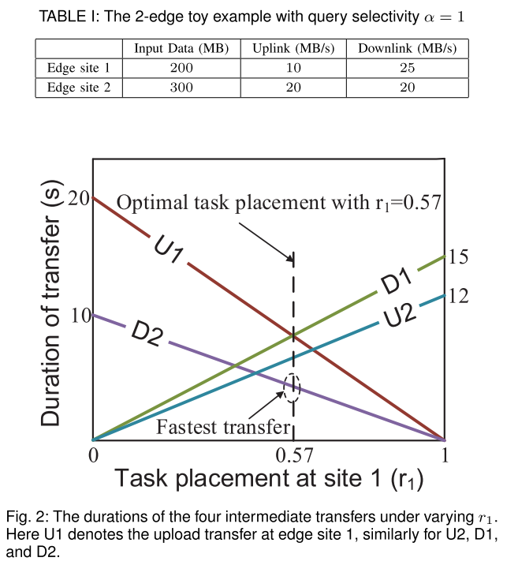

# Boosting Edge Intelligence with Collaborative Cross-Edge Analytics

## 摘要

这篇文章关注的是边缘上的预处理问题。现有的并行框架如mapReduce的处理阶段耗时最大的是shuffle阶段，这篇文章考虑shuffle阶段的耗时以及网络运输的花费，从数据集分布以及预处理任务的权重分配的角度来优化。

## 问题建立

这篇文章对shuffle阶段观察到两个问题：

+ 因为对于边缘来说带宽很宝贵，由于不同地域的IoT带宽不一致，因为需要等待某一阶段的所有任务完成后才能进行下一阶段，因此如何平衡很关键。

+ 中间阶段的耗时跟输入数据与任务位置有关（即地域不同，带宽不同）

这篇文章只考虑存储容量的限制，不考虑算力，因为预处理不像AI算法那样需要算力，反而数据量会大的多。

这篇文章优化目标有两个：耗时和带宽费用。

设有$S$个节点，标记为$\mathcal{S}=\{1,2,3,...,S\}$，第$i$个节点的上传带宽和下载带宽分别为$U_i,D_i$。第$i$个节点的原始数据为$M_i$，每一个query（可以看理解为一个任务）都有一个query selectivity属性$\alpha$，表示中间数据与原始数据的比例，即对于节点$i$，它作为map节点输出的数据量为$\alpha M_i$。

每个节点即可以作为map节点也可以作为reduce节点。$M$的分布来决定map节点的权重，那么现在引入$r$来表示reduce节点的权重，即节点$i$作为reduce节点应该处理$r_i\alpha M$数据量，其中$\alpha M$为shuffle阶段的输入量（即中间数据总量）。

用$c_i^U,\;c_i^D$表示节点$i$上传和下载中间数据所花费的时间，$z$表示shuffle阶段的耗时，那么有：
$$
U_ic_i^U=(1-r_i)\alpha M_i\\
D_ic_i^D=r_i\alpha(M-M_i)\\
z=max_{i\in\mathcal{S}}\;max\{c_i^U,c_i^D\}
$$
要注意的是，就算本地的reduce的权重足够大，本地的中间数据也不会全部交给本地处理，仍会按照比例分配给本地以及其他节点。例如，节点$i$在reduce中的权重为90%，全局的中间数据量为100，本地的中间数据量为10，在reduce阶段本地需要处理90数据量，有一种方案时本地的中间数据量全部给本地处理，缺的量由其他节点发送，但是在这篇文章中并不是这样，而是仍然将本地中间数据量的90%留在本地，10%数据量发送给其他节点。（这样做应该是更好地分析？否则会非常复杂）

除了reduce的权重会影响耗时，还有数据分布这个因素。

例如两个节点的例子：

$r_1=0.57$是最优解。在0.57时可以发现不管是上传还是下载的耗时，节点1都比节点2要更耗时。一个很直观的优化思路是将大部分的数据量从节点1移到节点2。

那么现在考虑数据的分布问题，假设在map之前先做一次数据的移动，$d_i^U,d_i^D$分别表示上传和下载的耗时，那么在map阶段，节点$i$的数据量就为$M_i+D_id_i^D-U_id_i^U$，因此在shuffle阶段上传的数据为$(1-r_i)\alpha (M_i+D_id_i^D-U_id_i^U)$，在shuffle阶段下载的数据为$r_i\alpha(M-(M_i+D_id_i^D-U_id_i^U))$。

除了考虑耗时之外，带宽费用也是一个重要的问题，假设$P_i^U,P_i^D$分别表示节点i上传和下载的单位费用，那么总费用为:
$$
\sum_{i\in\mathcal{S}}\{P_i^UU_i(c_i^U+d_i^U)+P_i^DD_i(c_i^D+d_i^D)\}
$$
那么将$z$（shuffle阶段的耗时）考虑进来，用$\theta_z$表示耗时所带来的损失，那么最终的优化目标为：
$$
min\;\;\theta_z+\sum_{i\in\mathcal{S}}\{P_i^UU_i(c_i^U+d_i^U)+P_i^DD_i(c_i^D+d_i^D)\}
$$

$$
\begin{aligned}
s.t.\;\;\;&\sum_{i\in\mathcal{S}}r_i=1\\
&U_ic_i^U=(1-r_i)\alpha (M_i+D_id_i^D-U_id_i^U)\\
&D_ic_i^U=r_i\alpha(M-(M_i+D_id_i^D-U_id_i^U))\\
&\sum_{i\in\mathcal{S}}U_id_i^U=\sum_{i\in\mathcal{S}}D_id_i^D\\
&M_i+D_id_i^D-U_id_i^U\leq R_i\\
&0\leq d_i^U\leq L\\
&0\leq d_i^D\leq L\\
&0\leq c_i^U\leq z\\
&0\leq c_i^D\leq z\\
&0\leq r_i
\end{aligned}
$$

优化有两阶段，第一阶段解决数据集分布的问题，第二阶段解决任务的权重分配的问题。

## 优化方案

令$t_{ij}$表示shuffle阶段节点$i$发送到节点$j$的数据量，那么有：
$$
\begin{aligned}
&t_{ij}=\alpha(M_i+D_id_i^D-U_id_i^U)r_j\\
&\sum_{j\in\mathcal{S}}t_{ij}=\alpha(M_i+D_id_i^D-U_id_i^U)\\
&U_ic_i^U=\sum_{j\in\mathcal{S}}t_{ij}-t_{ii}\\
&D_ic_i^D=\sum_{j\in\mathcal{S}}t_{ji}-t_{ii}
\end{aligned}
$$
且有：
$$
\frac{t_1i}{\sum_{j\in\mathcal{S}}t_{1j}}=\frac{t_2i}{\sum_{j\in\mathcal{S}}t_{2j}}=...=\frac{t_Mi}{\sum_{j\in\mathcal{S}}t_{Mj}}(=r_i)
$$
作者松弛（忽略）了上面的条件，那么意味着忽略$r$（任务分配的比重），因为本地的$r$必定小于1，那么必然有$(1-r)$的本地数据需要传输给别处，如果无视$r$的限制，本地传输给本地将使得$c$和$d$都为0，目标函数达到最小值。作者给出的解决方案是令$t_{ii}=0$，所有的式子重写得：
$$
min\;\;\theta_z+\sum_{i\in\mathcal{S}}\{P_i^UU_i(c_i^U+d_i^U)+P_i^DD_i(c_i^D+d_i^D)\}\\
$$

$$
\begin{aligned}
s.t.\;\;\;\;\;
&\sum_{j\in\mathcal{S}}t_{ij}=\alpha(M_i+D_id_i^D-U_id_i^U)\\
&U_ic_i^U=\sum_{j\in\mathcal{S}}t_{ij}-t_{ii}\\
&D_ic_i^D=\sum_{j\in\mathcal{S}}t_{ji}-t_{ii}\\
&\sum_{i\in\mathcal{S}}U_id_i^U=\sum_{i\in\mathcal{S}}D_id_i^D\\
&M_i+D_id_i^D-U_id_i^U\leq R_i\\
&0\leq d_i^U\leq M_i/U_i\\
&0\leq d_i^U\leq L\\
&0\leq d_i^D\leq L\\
&0\leq c_i^U\leq z\\
&0\leq c_i^D\leq z\\
&0\neq t_{ij}(j\neq i),\;t_{ii}=0
\end{aligned}
$$

## 算法流程

采用分步优化的策略。分两阶段。

第一阶段使用$\alpha$的预测值进行数据移动（$d$）

第二阶段使用$\alpha$的准确值来对任务进行分配（$r$和$c$）

第一阶段先采用预测的$\alpha$进行计算，求得$d$，$d$是用于初始数据集的移动。虽然$c$也能计算出来，但是这个$c$是不准确的，因为shuffle阶段没有$r$这个约束条件，需要在第二阶段进行修正。

将第一阶段得到的$d$代回式子中，且到第二阶段时$\alpha$的值明确了，解出$c$与$r$。

## 总结

创新点在于考虑了数据集的分布对带宽费用的影响。优化部分讲的非常粗略。

