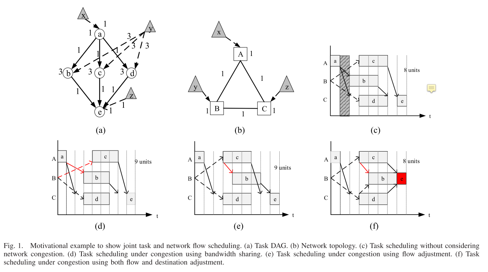
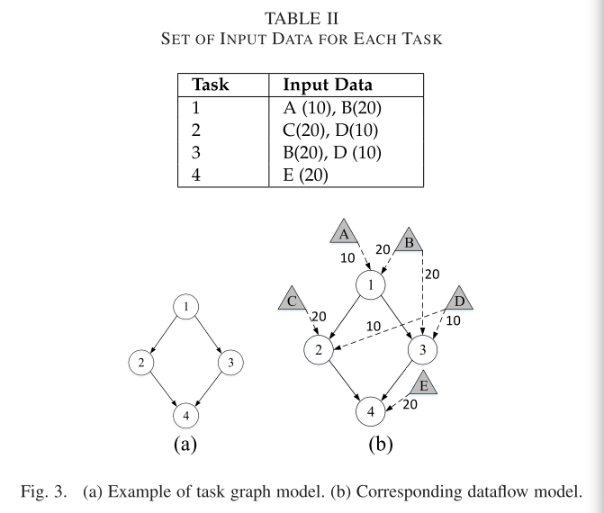
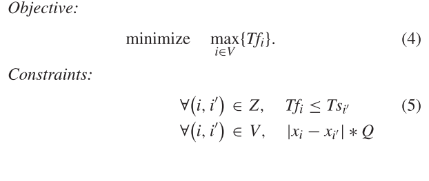
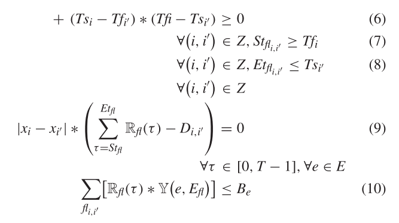
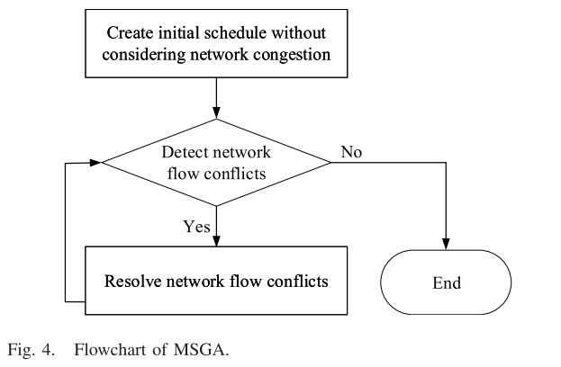
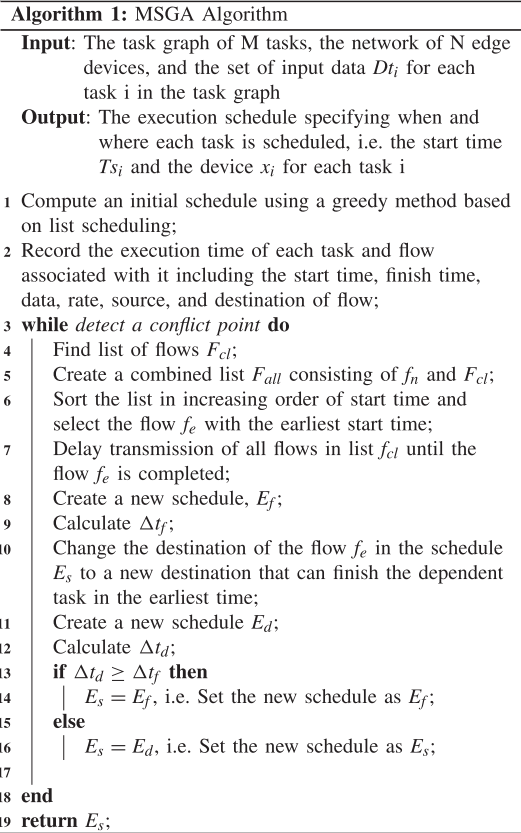

# Data-Aware Task Allocation for Achieving Low Latency in Collaborative Edge Computing

## 摘要

不同的device执行不同的任务，输入数据在不同的device上输入，这些数据有可能被多个任务需要，因此可能需要由当前device传输给其他device，各个任务之间存在依赖关系。这篇文章从网络流的角度考虑在这种情况下如何安排任务的分配以及输入数据的位置，使得在带宽的限制下将总时间最小化。

## 问题建立

如上图所示，这篇文章将数据集的分布考虑了进来。

图(a)表示了task的依赖图，task a依赖数据x，task b，c，d依赖task a的结果，同时也依赖于数据y。task e依赖于task b，c，d的结果，同时也依赖于数据z。边上的权值表示依赖的数据量，用作之后的带宽限制下的分析。

图(b)表示网络拓扑图以及数据的分布，A、B、C节点相互联通，带宽均为1，数据x、y、z分别分布在A、B、C节点上。

图(c)、(d)、(e)、(f)表示不同的任务调度策略。

### Task Graph Model

DAG $G=(T,P)$，$T$表示task集合，$T=\{i|1\leq i\leq M\}$，$P$是任务间的依赖关系。每个task $i$有计算量$c_i$，task $i$和task $j$间的边为$P_{ij}$，表示task $i$完成后需要传输多少数据给task $j$。

### Network Model

$C=(A,E)$，$A$表示device的集合，$E=\{e_{jj'}|j,j'\in A\}$表示device $j$与device $j'$间的网络链路，$B_{e_{jj'}}$表示$e_{jj'}$的带宽。device的总数为N。

### Data Model

$D=\{d_s|s\in1,2,...,S\}$表示数据集，$D_{t_i}$是$D$的子集，表示task $i$需要的数据。$d_s$在device $s$上，$d_s$数据的大小为$size_s$

### Dataflow Model

$H=(V,Z)$，$V=\{u|1\leq i\leq K\}$表示dataflow tasks集合，$Z=\{(u,v)|u,v\in V\}$表示边的集合，$V=T\cup D$，$D_{u,v}$表示task v依赖于task u数据的数量。

Dataflow Model其实就是上面三个的整合。

### Cost Model

task i在device j上的计算耗时为：
$$
Tcomp_{i,j}=\frac{c_i}{p_j}
$$
$T_{s_{i,j}}$和$T_{f_{i,j}}$分别表示task i在device j上的开始时间和终止时间：
$$
\begin{aligned}
&T_{s_{i,j}}=max(avail_j,max_{1\leq r\leq R_i}(T_{f_r}+Ttask_{r,i}))\\
&T_{f_{i,j}}=T_{s_{i,j}}+Tcomp_{i,j}
\end{aligned}
$$
其中$avail_j$表示device j将之前的所有工作完成的时刻，$R_i$表示task i依赖的task集合，$T_{f_r}$表示依赖任务的结束时刻，$Ttask_{r,i}$表示依赖任务传输必要的数据给task i的传输时间。

那么现在的问题是确定每个任务应该在何时何地（在哪个设备上）执行，并调度网络链路上的数据传输流，从而使应用程序的完成时间最小化。

### Data-Aware Task Allocation Problem

（5）表示task只有在前基task完成后才能执行。

（6）表示一个device同时最多只能执行一个task。

（7）表示一个flow只能在release time之后开始（release time为任务开始时刻+任务处理时长）。

（8）表示flow必须在deadline前完成。

（9）表示flow能保证及时将数据传输到所需要的task。

（10）表示带宽的限制。

这个优化问题是NP-hard问题，作者采用贪心的方式来得到近似解。

首先不考虑带宽的限制，用贪心的方法根据任务优先列表构建出调度策略。

其中任务的优先级是根据节点和边的权重来计算的，节点和边的权重分别表示任务的计算和通信负载。到任务图的结束节点的路径最长的任务被赋予最高优先级，从最高优先级的任务开始，将任务分配给最早完成任务的设备。（负载越重的任务需要的资源会越多，放在后面调度可能因为资源不够而无法执行）

在完成初始调度策略后，需要处理网络流冲突，因为上一步没有考虑带宽的限制，因此需要根据这个限制重新处理冲突。

作者给出了两种处理冲突的方法：

1、改变流的开始时间，将优先级低的任务的开始时间后延

2、改变流的目的

在下面的算法中，作者用了上面两种方法，先预调度，比较两种方法，然后选其中最好的结果最为最终的调度。

## 总结

创新点在于考虑了数据的分布以及各个任务之间的依赖关系，与安排工期的模型非常像。