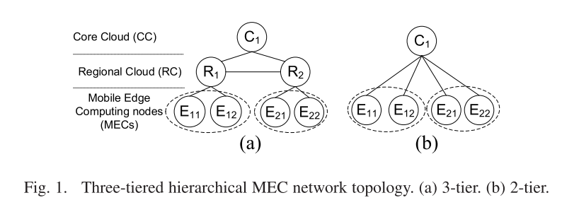
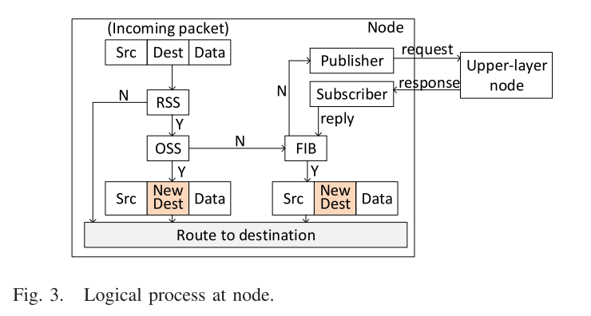
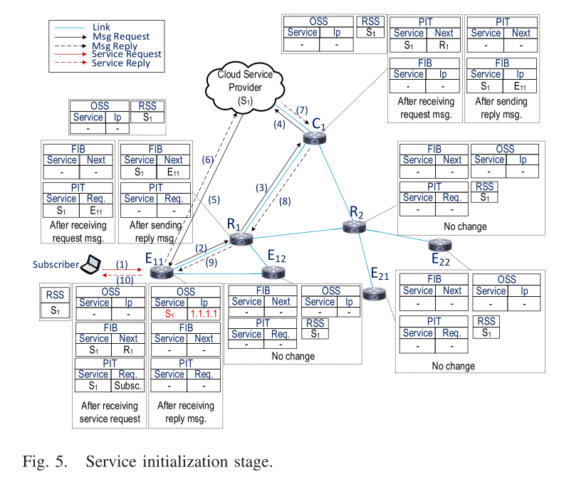
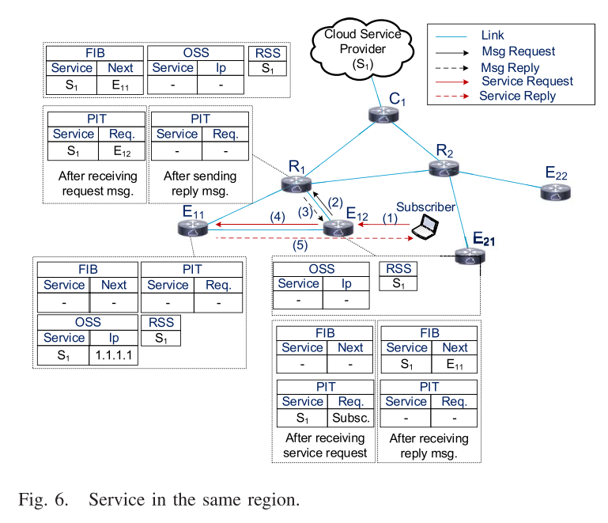
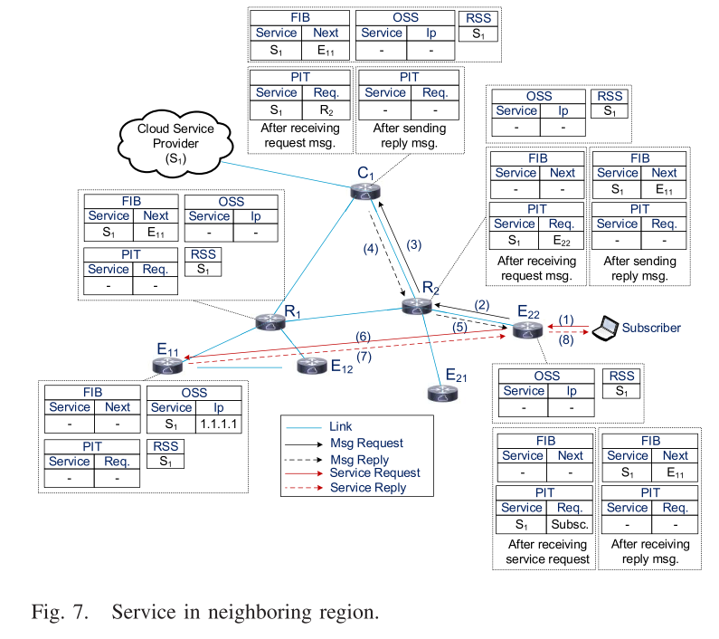
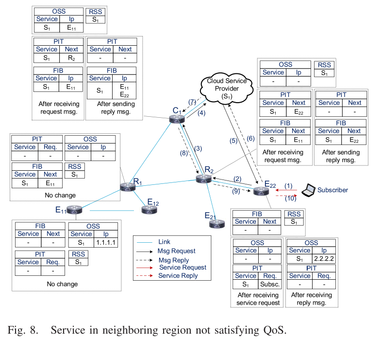
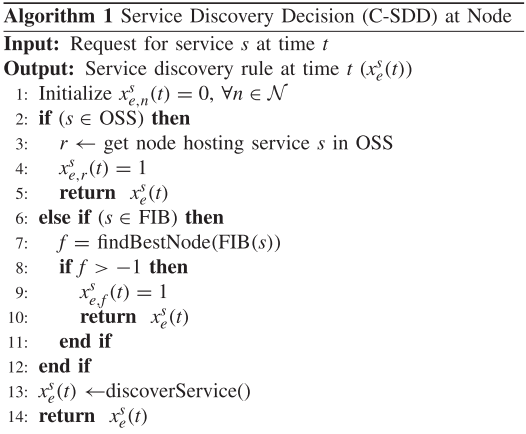
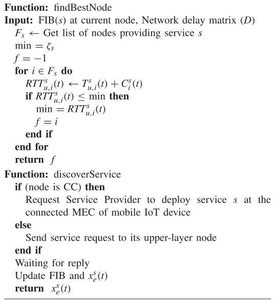

# Decentralized and Revised Content-Centric Networking-Based Service Deployment and Discovery Platform in Mobile Edge Computing for IoT Devices

## 摘要

提出了一个分散和改进的基于内容中心网络（CCN）的MEC服务部署/发现协议和平台。

## 内容

架构如下图所示：

架构是三层，减轻中央controller的负担，同时在小范围的发现与转发的延迟以及消耗更小。

修改了CCN表，存储MEC的ip和端口，提出基于CCN的服务发现协议，用于服务发现，如果有多个可选的服务IP，那么会通过计算延时来选择耗时最低的IP，如果最低耗时大于QoE，那么向上层请求发现。

CCN表中主要有四个关键字段：

+ Registered Service Store (RSS)：记录所有node的服务
+ Forwarding Information Base (FIB)：记录某个服务转发的IP与端口
+ Pending Interest Table (PIT)：记录请求信息，即请求者与服务
+ Online Service Store (OSS)：记录本地服务具体的container id

具体流程如下所示：

如果有多个可选的IP，那么会通过计算延时来选择耗时最低的IP，如果最低耗时大于QoE，那么向上层请求发现。

这篇文章还提出了延时计算标准，主要分为处理延时和运输延时。因为这篇文章核心在于这种服务发现框架的提出，因此这里就不列出计算公式了。

下面是服务发现算法流程：

## 总结

这篇文章的主要贡献是提出一个服务发现的框架，设计了CCN表来达到目的。想法非常简单。