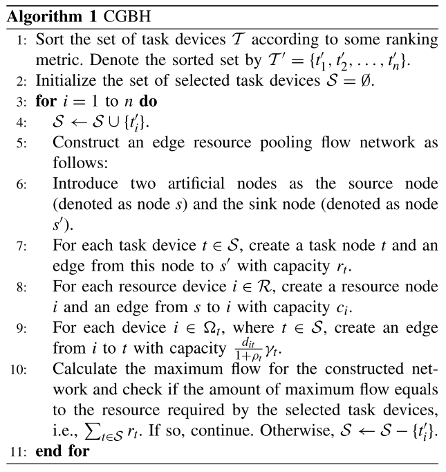
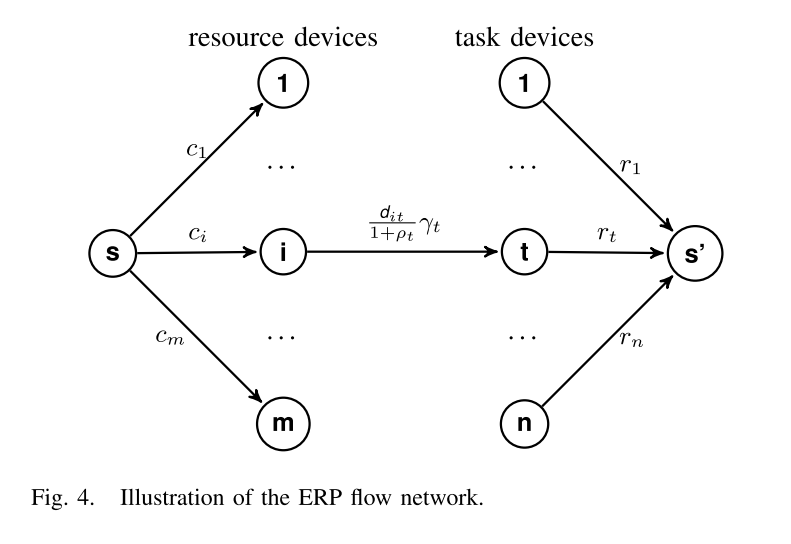

# ERP: Edge Resource Pooling for Data Stream Mobile Computing

## 摘要

提出了一个边缘资源共享框架，目标是最大化地提升整个系统的利用率。

## 问题建立

这篇文章将节点分为两种，一种是专门为其他提供计算资源的资源节点，一种是专门执行任务的任务节点。任务节点由于自身计算资源的限制，需要资源节点的援助。当同时存在多个任务时，如何分配资源节点的供给来使整个系统的利用率最大化？

### Device Model

所有的device的集合表示为$\mathcal{N}$，$\triangle_n$表示与deivce n联通的device集合。

### Task Device

$\mathcal{T}$表示task device的集合，每一个task device都有计算任务，定义$\Omega_t\triangleq\{i:i\in \mathcal{R\cup}\triangle_t\}$为所有潜在的可以向device t提供资源的resource device。

### Resource Device

$\mathcal{R}\triangleq \mathcal{N}\setminus\mathcal{T}$表示资源device的集合，$ϒ_i\triangleq\{t:t\in\mathcal{T}\cup\triangle_i\}$表示与device i相连的所有潜在的task devices。

## Mobile Task Model

对于一个task device t，可以用以下属性来描述：

+ 需要的计算资源$r_t$
+ CPU密度（处理单位输入数据所需要的CPU周期数）$\gamma_t$
+ 输出数据与输入数据的比例$\rho_t$
+ 重要程度$\omega_t$

### Utility Maximization Problem

$x_t$表示task service t是否应该执行，$y_{it}$表示resource device i为task device t提供的计算资源，$c_i$表示resource device i的可提供的计算资源上限，$\gamma_t$表示task device t所需要的CPU密度，$\rho_t$表示task device t执行的任务中输出数据与输入数据的比例，$d_{it}$表示带宽上限。

（2）表示对于一个任务节点t，跟他相连的资源节点为t提供的计算资源要满足t的需求。

（3）表示对于一个资源节点i，向其他任务节点提供的计算资源的总和不能超过自身的计算资源。

（4）带宽限制

（5）（3）是（5）的子集

## 解决方案

使用贪心+最大流的算法来得到近似解。

首先根据权重等指标对task device进行优先级排序，$\mathcal{S}$表示应该执行的task device集合，每次将优先级列表的前面一个task device加入$\mathcal{S}$，然后根据$\mathcal{S}$构建出网络，求最大流，如果最大流等于$\mathcal{S}$所需要的计算资源（即$\mathcal{S}$中的task device都能成功地完成task），那么continue，否则说明存在冲突，因此丢弃最近加入$\mathcal{S}$的task device。

最大流网络如下图所示：

其中$\frac{d_{it}}{1+\rho_t}\gamma_t$是从约束条件（4）求得的：

## 总结

假设非常新颖。将所有的device分成两类，task device和resouce device，分别用于执行任务和提供计算资源。创新点在于使用求最大流的方式来求全局利用率最大的解。