# Adaptive Federated Learning in Resource Constrained Edge Computing Systems

这篇论文主要工作为：

1、理论上分析了基于同步梯度下降的联邦学习的收敛界

2、提出动态的控制算法，动态地调整global aggregation的频率，在有限的资源下将learning loss最小化

这篇论文研究的是联邦学习，需要考虑以下几点：

1、不同特征的数据集（非独立同分布， non-i.i.d）

2、两次全局aggregation之间local update的次数

上面的第一个因素将会在后续引入一个$\delta$来考虑，第二个因素就是这篇论文的主要目的。

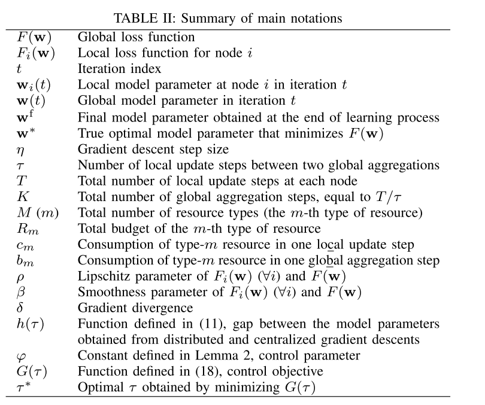

基本框架是分布式梯度下降：

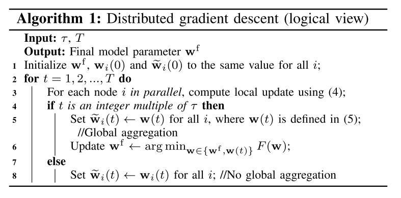

首先所有的节点的w参数初始化为一致的w，然后各个节点内部进行local update，各个节点相互独立地进行梯度下降，当进行了多次local update后，各个节点将w参数传到服务器，服务器将所有的w参数做个平均然后分发到各个节点作为新的w来使用。

如果再引入资源的限制，如内存、时间的限制，那么各个节点所能进行的local update以及global update的次数是受到了限制的，当资源耗尽时必须终止计算，将当前结果作为最终结果并退出。

这里假定每经历k次local update进行一次global update，那么问题在于如何对k进行取值从而在优先的资源下使loss function的值降到最低？

这篇论文首先理论上分析了基于同步梯度下降的联邦学习的收敛界。

将global update的时间点作为单位，将连续的local update的时间点作为一个区间来考虑，$w$为联邦学习下的参数，$v$为集中式的学习（类似于每一次都是globa update），那么就有：

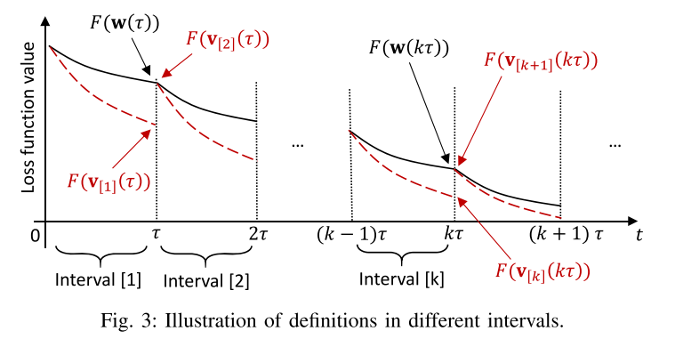

在每个Interval区间里，两种模式下随着迭代的次数增大loss function将逐渐减小，因为集中式的学习是基于全局的数据，而联邦学习是local与global update相间的，因此集中式的性能往往比联邦学习的性能好。为了后续便于对每个区间的分析，在每个Interval的交界，将集中式的学习得参数调整到与联邦学习的参数相同。通过$F(w)$与$F(v)$的差值来分析联邦学习的收敛界。

优化的目标函数以及约束如下：

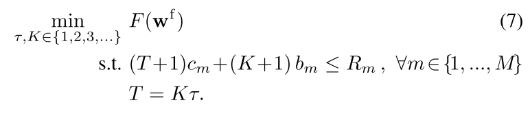

首先有以下假设：

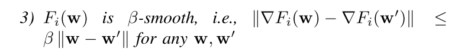

假设loss function是凸函数、Lipschitz以及smooth。

推出：

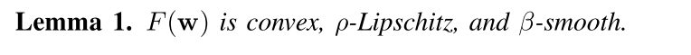

然后定义$\delta$值，来衡量各个数据集的差异性（即考虑non-i.i.d的问题，非独立同分布）

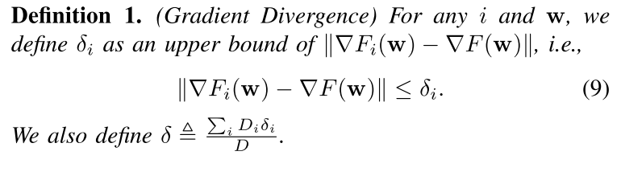

然后推出以下结论：

当τ>1时，$x=t-(k-1)$会特别大，那么$h(x)$也会特别大，那么联邦学习的准确率会远远比集中式的要低。注意到$h(x)$正比于$\delta$，这很好理解，如果局部梯度与全局梯度相差太大，对于该局部来说用全局梯度计算出的准确率会更低。

之后推出：

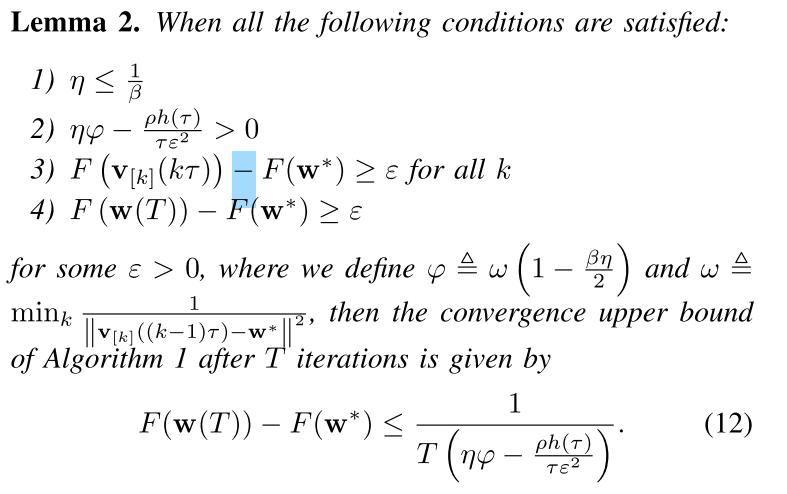

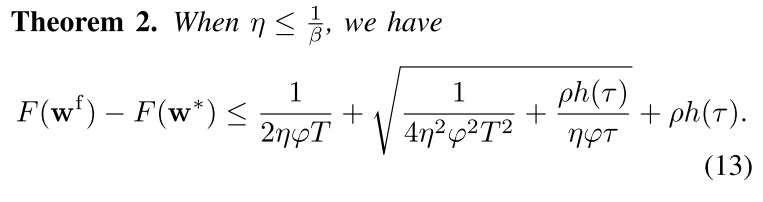

$F(w^*)$是最优的，可以看做一个常数，所以对$F(w^f)$的优化可以看做是对$F(w^f)-F(w^*)$的优化，那么目标函数就变成：

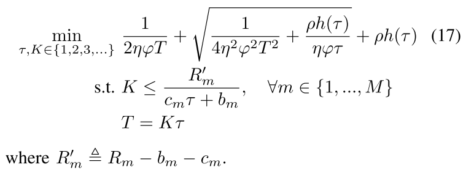

τ没有给出计算方法，是通过搜索来找到的，这篇论文给出了τ的一个上界：

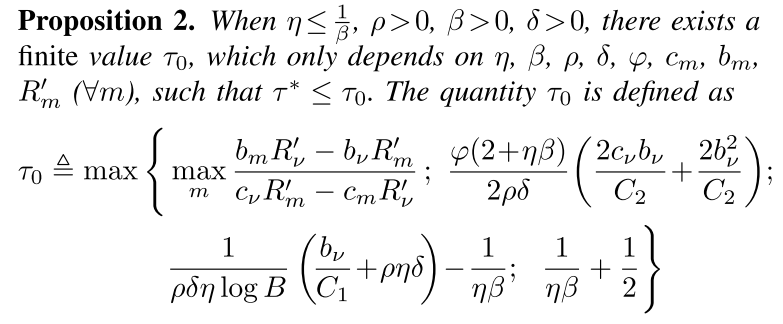

可以在$[1,τ_{max}]$之间线性搜索$τ$的值。

最终算法如下：

aggregator：

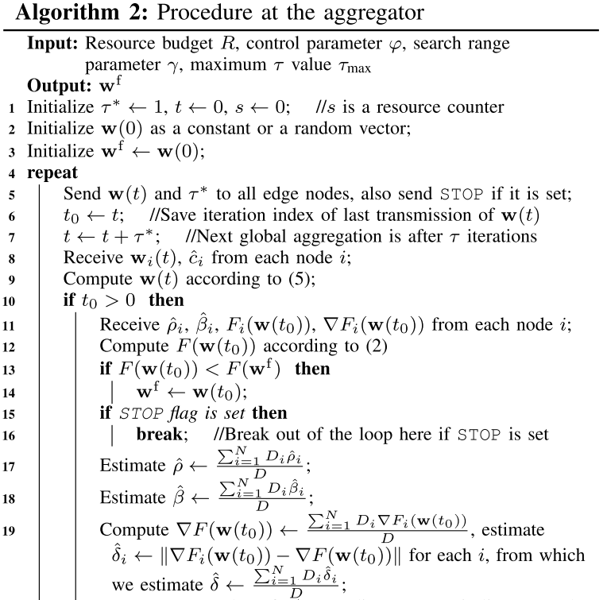

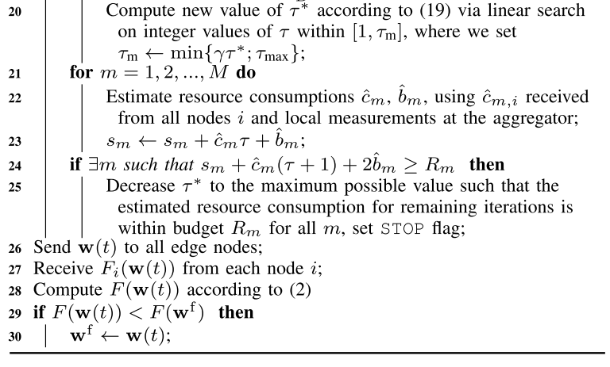

edge node：

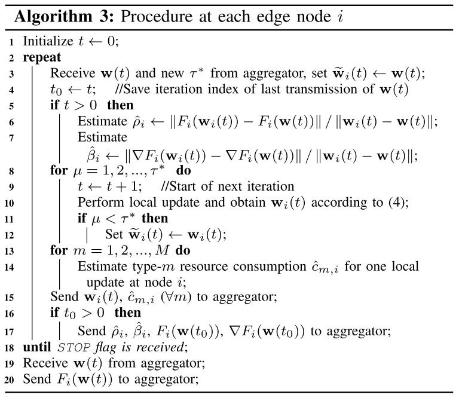

结果：

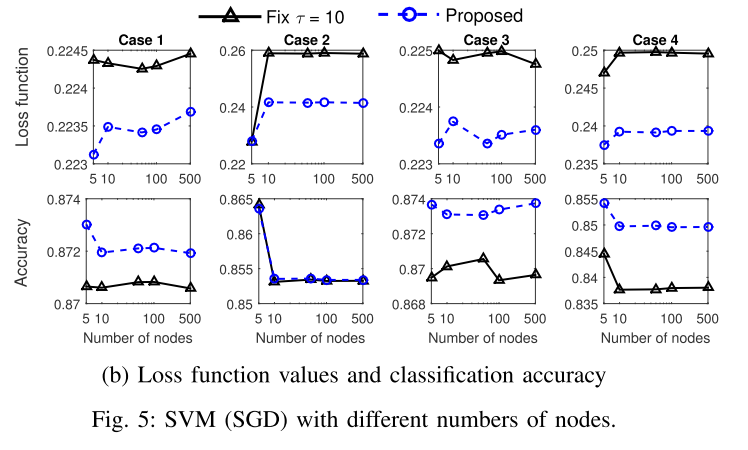

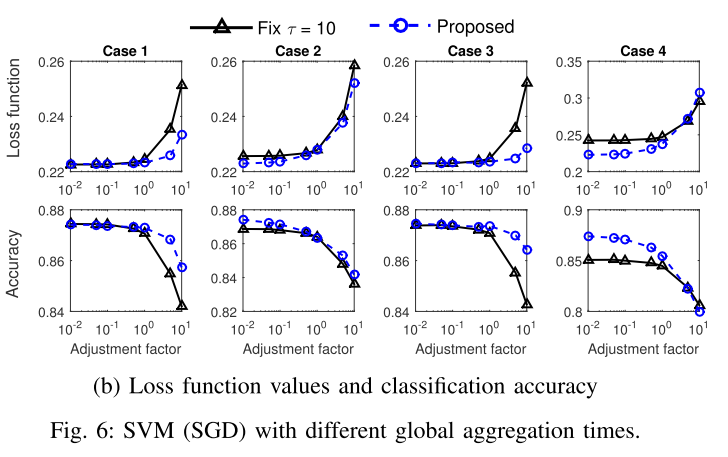

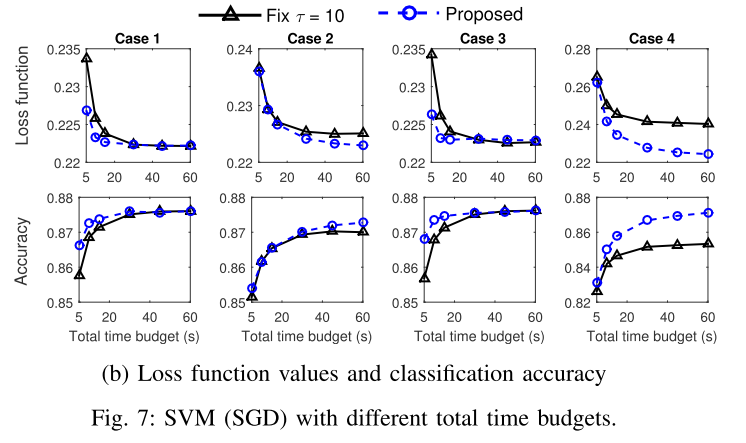

**缺陷：**

因为一开始假设的loss function是凸函数，但是对于深度神经网络不适用，并且实验大部分都是使用的传统的机器学习算法进行比较，如逻辑回归、SVM等，这些算法的激活函数都是凸函数。