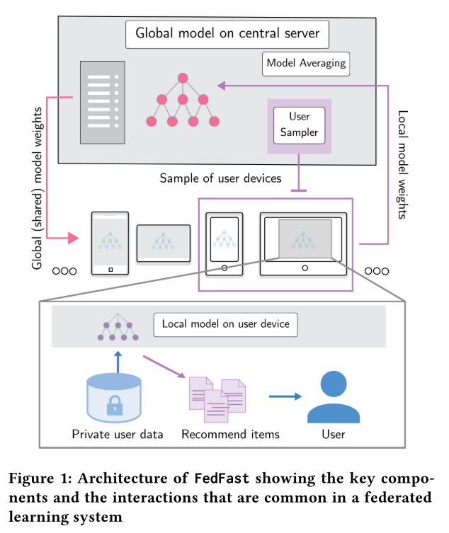
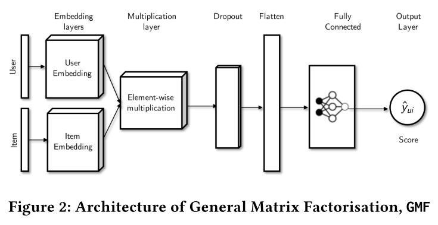
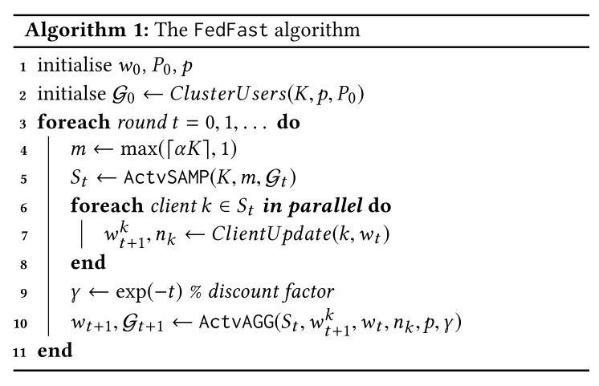
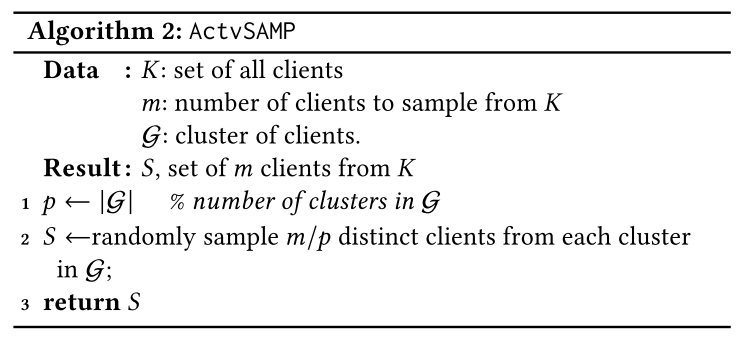
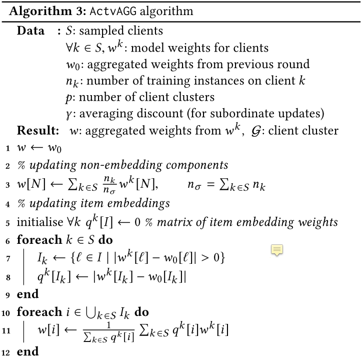
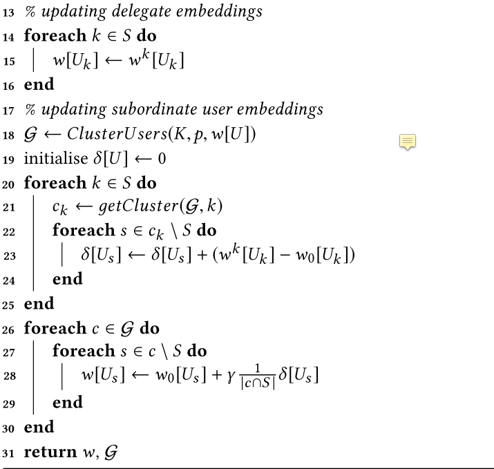

# FedFast: Going beyond Average for Faster Training of Federated Recommender Systems

## 摘要

提出了一个基于FL的RS算法，在避免暴露用户的隐私的情况下进行推荐，同时利用user之间的相似度来加速收敛。

## 模型

算法流程：

这是很标准的FL框架，ClientUpdate()过程即local update。先进行采样，后进行多轮local update后进行一次aggragate。

重点是ActvAGG：

这里先引入delegate与candidate两个概念，delegate是指被sample选中的client，而candidate是未被选中的client。

对于non-embedding components，直接加权平均。

对于item embeddings，各个delegate的contribution正比于w的变化（如果某个delegate变化越剧烈，那么全局收到的影响也越大，突出个性化？）

对于user embeddings，$w[U_k]\gets w^k[U_k]$，这里直接赋值应该是假设各个client的user不重复（item是假定有重复的）。

赋值完之后，更新cluster，保证cluster内部是最新的相似信息。

每一个cluster如果存在delegate，那么这个cluster的所有candidate获得这些delegate的update的均值用于自身的update。这种updating sharing的方式能够加速收敛。在前期这种方式会很有效，但是到后期就不行了，因此在后期为了避免不必要的计算，采用递减的$\gamma$来控制。

## 创新点

+ 将FL与RS系统相结合
+ 各个delegate的contribution正比于w的变化，如果某个delegate变化越剧烈，那么全局受到的影响也越大，突出个性化？
+ 利用cluster内的相似的user共享updating，加速收敛

## 缺陷

因为隐私问题，一般拿不到用户数据，因此clustringUser应该如何进行？

可以考虑拿到item的数据，例如交易记录，但是抹去用户的信息，根据那些受欢迎的item可以间接推测出user之间的相似度。