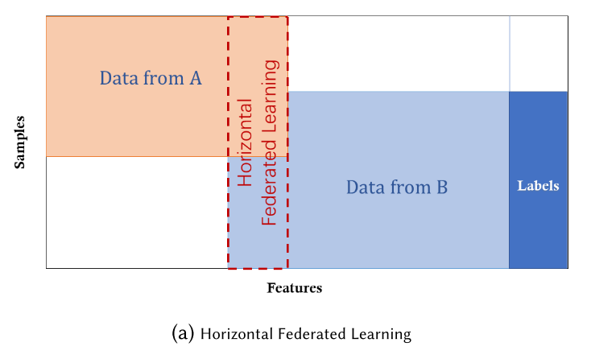
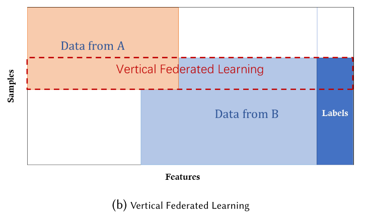
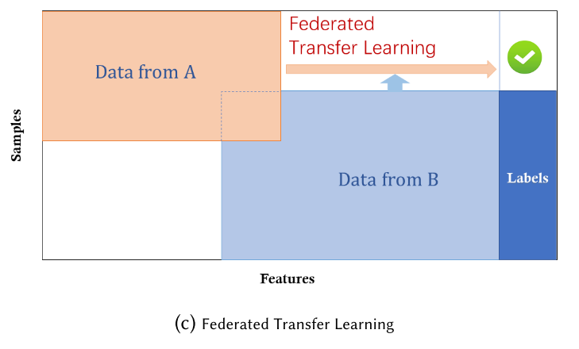
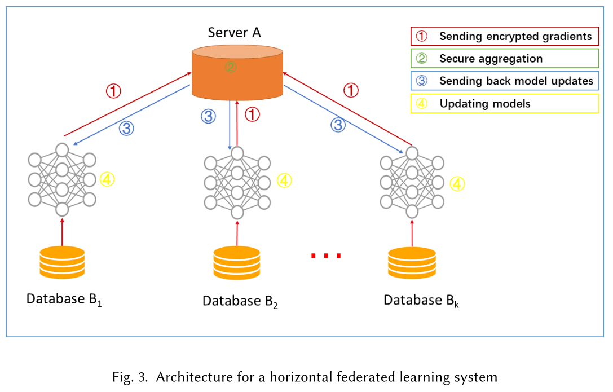
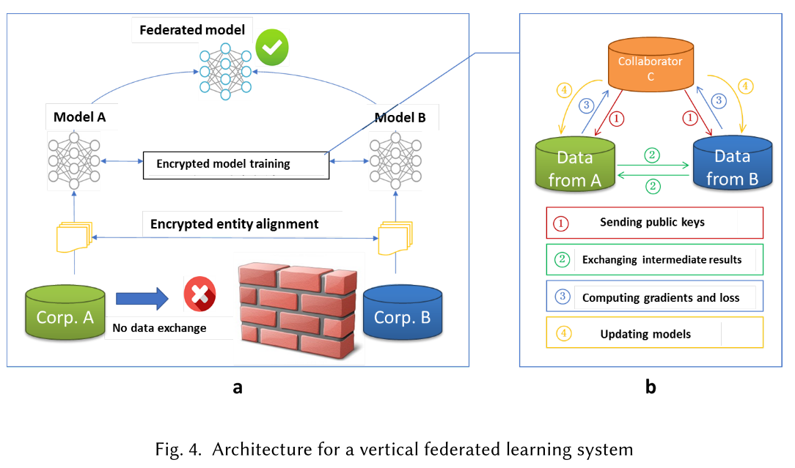

# Federated Machine Learning: Concept and Applications

这是一篇关于FL的一篇综述。介绍了FL的概念、FL的分类等。

## FL的定义

定义N个数据所有者${F_1, ...,F_N}$，这些所有者希望在不泄露自己的数据集的情况下同其他所有者共同训练，设这种训练方式的精度为$V_{FED}$。传统的方法是将所有的数据集合并起来作为一个大的数据集来训练，设这种方式的精度为$V_{SUM}$。$\delta=|V_{FED}-V_{SUM}|$，那么称FL算法有$\delta$-accuracy loss。

## FL中的不同的隐私技术

### Secure Multi-party Computation (SMC)

安全多方计算。

理想情况下，用户除了其输入和输出什么也不知道。在某些情况下，如果提供了安全保证，那么部分知识的披露被认为是可以接受的。

### Differential Privacy

差分隐私。

在数据中添加噪声，或使用泛化方法隐藏某些敏感属性，直到第三方无法区分个人，从而使数据无法恢复以保护用户隐私。

### Homomorphic Encryption

同态加密。

通过加密机制下的参数交换来保护用户数据隐私。

## FL的分类

根据数据的不同分布，FL可以分为水平FL、垂直FL、迁移学习FL。

假设$X$表示特征空间，$Y$表示标签空间，$I$表示ID空间，那么数据集$D$可以由$(I, X, Y)$来表示。

### 水平FL

数据集共享相同的特征空间但样本不同的场景。例如两家不同的银行，他们的业务非常类似，特征空间是相同的，但是由于地区的原因，用户组的交集非常小。

此时有：
$$
X_i=X_j,\;Y_i=Y_j,\;I_i\neq I_j,\;\forall D_i,D_j,\;i\neq j
$$

### 垂直FL

两个数据集共享相同的样本ID空间但在特征空间中不同的情况。例如同一区域的一家银行一家电子商务公司，他们的用户交集将会非常大，但是由于业务的不同，他们的特征空间将不同。

此时有：
$$
X_i\neq X_j,\;Y_i\neq Y_j,\;I_i=I_j,\;\forall D_i,D_j,\;i\neq j
$$

### 迁移学习FL

两个数据集不仅样本不同而且特征空间也不同的场景。

此时有：
$$
X_i\neq X_j,\;Y_i\neq Y_j,\;I_i\neq I_j,\;\forall D_i,D_j,\;i\neq j
$$

## FL系统的体系结构

### 水平FL

一个典型的假设是参与者是诚实的，而服务器是诚实但好奇的，因此不允许任何参与者向服务器泄露信息。

### 垂直FL

为了确保训练过程中数据的机密性，第三方合作者C参与其中。一个典型的假设是合作者C是诚实的，不与A或B串通，但甲方和乙方是诚实的，但彼此好奇。

### 迁移学习FL

与垂直FL的体系结构相同，但是一些细节不同。

## 其他

### Federated Learning vs Distributed Machine Learning

横向的联邦学习与分布式机器学习有些相似。

相比分布式机器学习，横向的联邦学习对本地数据具有完全的自治，可以决定何时、如何加入联邦学习，并且也强调隐私保护。

### 应用

以智能零售为例。其目的是利用机器学习技术为客户提供个性化服务，主要包括产品推荐和销售服务。智能零售业务涉及的数据特征主要包括用户购买力、用户个人偏好和产品特征。在实际应用中，这三种数据特征很可能分散在三个不同的部门或企业中。例如，一个用户的购买力可以从她的银行储蓄中推断出来，她的个人偏好可以从她的社交网络中分析出来，而产品的特性则由电子商店记录下来。在这种情况下，我们面临两个问题。首先，为了保护数据隐私和数据安全，银行、社交网站和电子购物网站之间的数据壁垒很难打破。因此，不能直接聚合数据来训练模型。第二，三方存储的数据通常是异构的，传统的机器学习模型不能直接处理异构数据。

