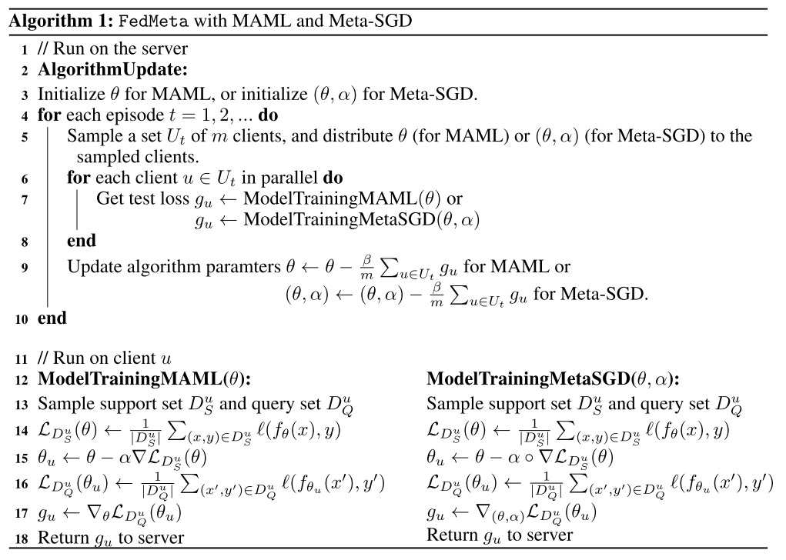

# Federated Meta-Learning with Fast Convergence and Efficient Communication

federated learning具有两个挑战：

+ 统计挑战：分散的数据是非IID，高度个性化和异构的，这会导致模型精度显著降低
+ 系统挑战：设备的数量通常比传统分布式设置中的设备数量大一个数量级。此外，每个设备在存储、计算和通信容量方面可能具有显著的限制。

> 至于为什么能缓解非IID的问题，我是这样思考的：首先FedAvg本身就能有效缓解非IID的问题，而FedMeta类似于精简的FedAvg（如果不考虑support set和query set的话），那么它肯定能多少缓解非IID的问题；且考虑到support set和query set，与MAML的思想（注重$\phi$的潜力而非当前）类似，因此更（？）能缓解非IID的问题，同时采样减少了计算量。

这篇文章将meta learning与federated learning结合起来，用来解决以上两个问题。

可以看出，先在client中采样，然后将每个client视为一个task，进行meta learning。