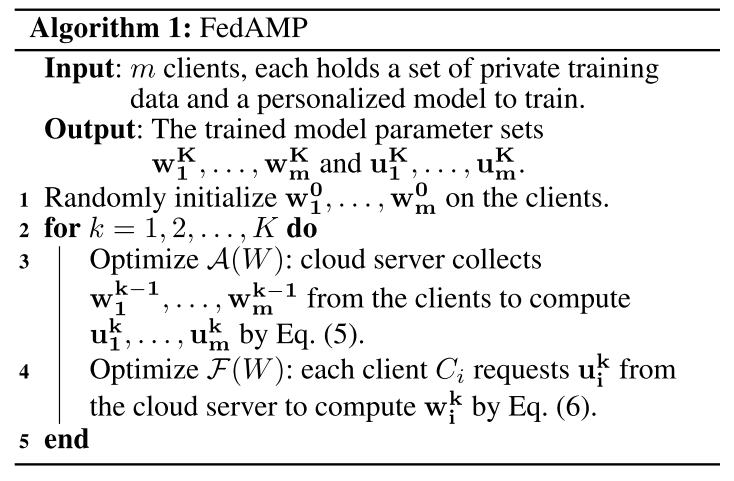

# Personalized Cross-Silo Federated Learning on Non-IID Data(FedAMP)

## 摘要

提出了一种新的方法FedAMP，它利用联邦参与式消息传递来促进相似客户的协作，建立了凸模型和非凸模型的FedAMP的收敛性，并提出了一种启发式方法来进一步提高FedAMP在客户采用深度神经网络作为个性化模型时的性能。

一些联合学习方法试图通过在训练全局模型后执行额外的微调步骤来解决问题，虽然这些方法在某些情况下有效，但它们不能系统地解决问题，作者认为这些方法的根本错误在于使用全局的模型来对所有client进行训练。

因此，这篇文章考虑通过迭代地鼓励相似的客户端进行更多的协作，自适应地促进客户端之间潜在的成对协作，从而解决了具有挑战性的个性化cross-silo学习问题。

## 问题建立

目标函数：
$$
min_W\{\mathcal{G}(W):=\sum_{i=1}^m F_i(w_i)+\lambda\sum_{i<j}^m A(||w_i-w_j||^2)\}
$$
其中，$F_i$为local training objective function，$W=[w_1,...,w_m]$，$\lambda>0$为正则化参数。

$\sum_{i=1}^m F_i(w_i)$是所有client的trainning loss的和，$\lambda\sum_{i<j}^m A(||w_i-w_j||^2)$为attention-inducing函数项来引导client间相互合作。

$A$是一个非线性的函数，满足：

+ $A$在$[0,\infty)$上递增，凹函数，$A(0)=0$
+ $A$连续可微
+ 0+可导

这篇文章中$A$的选择：$A(||w_i-w_j||^2)=1-e^{-||w_i-w_j||^2/\sigma}$

### General Method

令$\mathcal{F}(W):=\sum_{i=1}^m F_i(w_i)$，$\mathcal{A}(W):=\sum_{i<j}^m A(||w_i-w_j||^2)$，那么目标函数可以重写成：
$$
min_W\{\mathcal{G}(W):=\mathcal{F}(W)+\lambda\mathcal{A(W)}\}
$$
使用iteratively optimize（交替优化）的方法来求解：
$$
U^k=W^{k-1}-\alpha_k\nabla\mathcal{A}(W^{k-1})\\
W^k=argmin_W\mathcal{F}(W)+\frac{\lambda}{2\alpha_k}||W-U^k||^2
$$

### FedAMP

令$U^k=[u_1^k,...,u_m^k]$，那么有：
$$
u_i^k=\lgroup1-\alpha_k\sum_{j\neq i}^m A'(||w_i^{k-1}-w_j^{k-1}||^2)\rgroup\cdot w_i^{k-1}\\+\alpha_k\sum_{j\neq i}^mA'(||w_i^{k-1}-w_j^{k-1}||^2)\cdot w_j^{k-1}\\
=\xi_{i,1}w_1^{k-1}+...+\xi_{i,m}w_m^{k-1}
$$

$$
where\;\xi_{i,j}=\alpha_kA'(||w_i^{k-1}-w_j^{k-1}||^2),(i\neq j)
$$

其中$\xi_{i,1}+...,\xi_{i,m}=1$。

对client i训练时，j与i越相似，那么$\xi_{i,j}$就越大，即占比越高。这里可以看出FedAMP能够通过正反馈环迭代的促使相似模型参数有着更强的合作，自适应地、隐式地把相似client聚在一起。

各个client将自己的$w_i^{k-1}$上传到服务器，服务器计算出$u_i^k$后分发给client用来计算$w_i^k$：
$$
w_i^k=argmin_{W\in\mathbb{R}^d}F_i(w)+\frac{\lambda}{2\alpha_k}||w-u_i^k||^2
$$
算法流程如下：

### HeurFedAMP

Heuristic Improvement of FedAMP on Deep Neural Networks.

深度网络中计算欧氏距离$|w_i-w_j|$维数过高，因此提出一个更好的方法代替$A'(||w_i-w_j||^2)$:
$$
\xi_{i,j}=\frac{e^{\sigma cos(w_i^{k-1},w_j^{k-1})}}{\sum_{h\neq i}^m e^{\sigma cos(w_i^{k-1}, w_h^{k-1})}}\cdot(1-\xi_{i,i})
$$

### 源代码

[https://t.ly/nGN9]