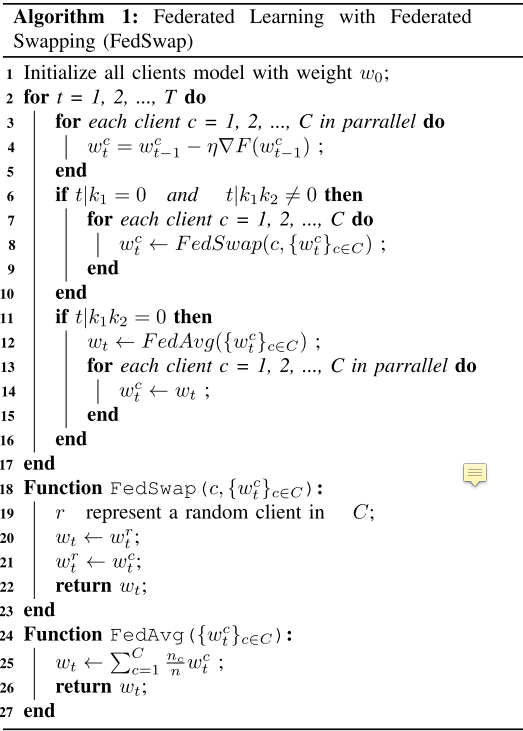

# Semi-Supervised Distributed Learning with Non-IID Data for AIoT Service Platform

## 摘要

边缘没有人工来标注数据->半监督学习。
non-idd的数据集特征，引入FedSwap方法，即经过多个local update后随机跟一个client进行权重w的交换，经过多次FedSwap后进行一次global update。

## 模型

> 半监督学习这块没怎么看懂。

可以通过增加全局模型聚合的频率来缓解非IID问题。但是这会带来额外的通信开销。作者做了一个折中，用随机与一个client交换模型的方式来作为全局模型聚合的替代，即进行数次local update后进行一次FedSwap，进行数次FedSwap后进行一次FedSwap，降低了通信负担。

## 改进

FedSwap是随机交换，能否引入一个交换策略？