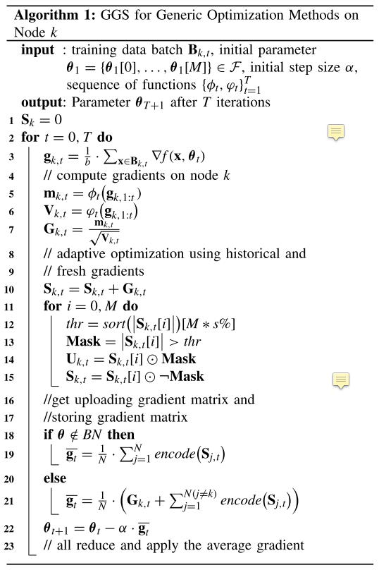

# Toward Communication-Efficient Federated Learning in the Internet of Things With Edge Computing

## 摘要

提出了一个通用的梯度稀疏化（GGS）框架，用于自适应优化器，以纠正稀疏梯度更新过程。它包括两个重要的机制：1）梯度校正和2）局部梯度批量归一化（BN）更新。通过梯度校正，优化器可以很好地处理累积的不重要梯度降低通信负担，使模型收敛得更好。此外，使用局部梯度更新BN层可以在不增加头上通信的情况下减轻延迟梯度的影响。

## 模型

优化采用的是Adam优化算法，先计算出m和v两个中间值，根据这两个中间值进行update。

10-15：进行M次local update，将梯度进行排序，取前s%存到$U$中，$U$在M次local update完之后会上传至aggregater，而没有超出阈值的梯度将继续存留在本地$S$。

18-21：如果上传了梯度，那么将本地梯度更新为全局梯度的平均值。如果没有上传梯度，那么将本地梯度更新为全局梯度的均值+本地保存的梯度。

> 至于梯度矫正这部分目前还看不懂，所以就没写了。

## 总结

创新点在于积累不重要的梯度，减轻了通信负担。

至于梯度矫正这部分目前还看不懂。